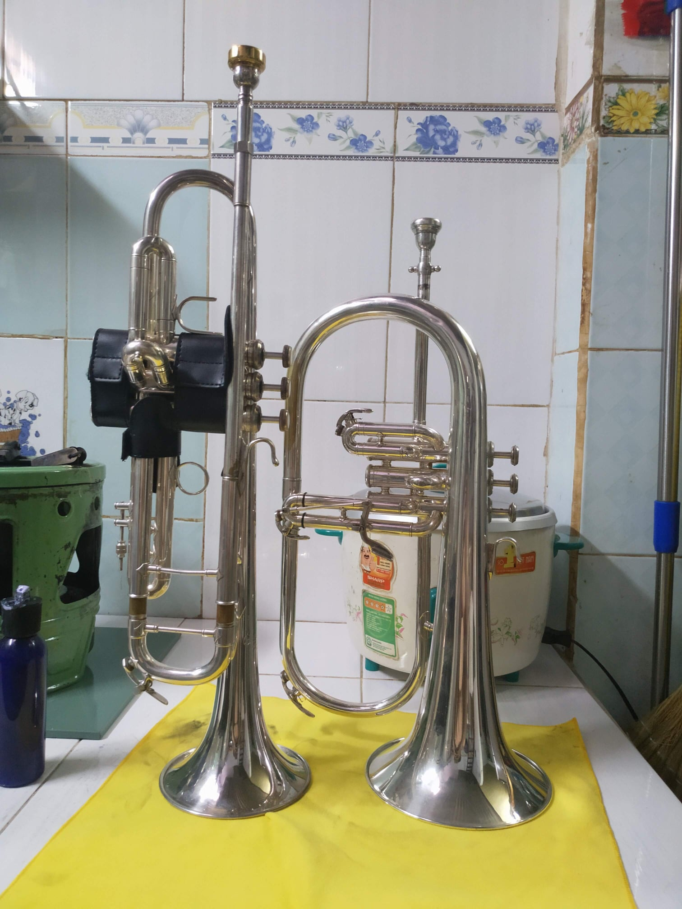
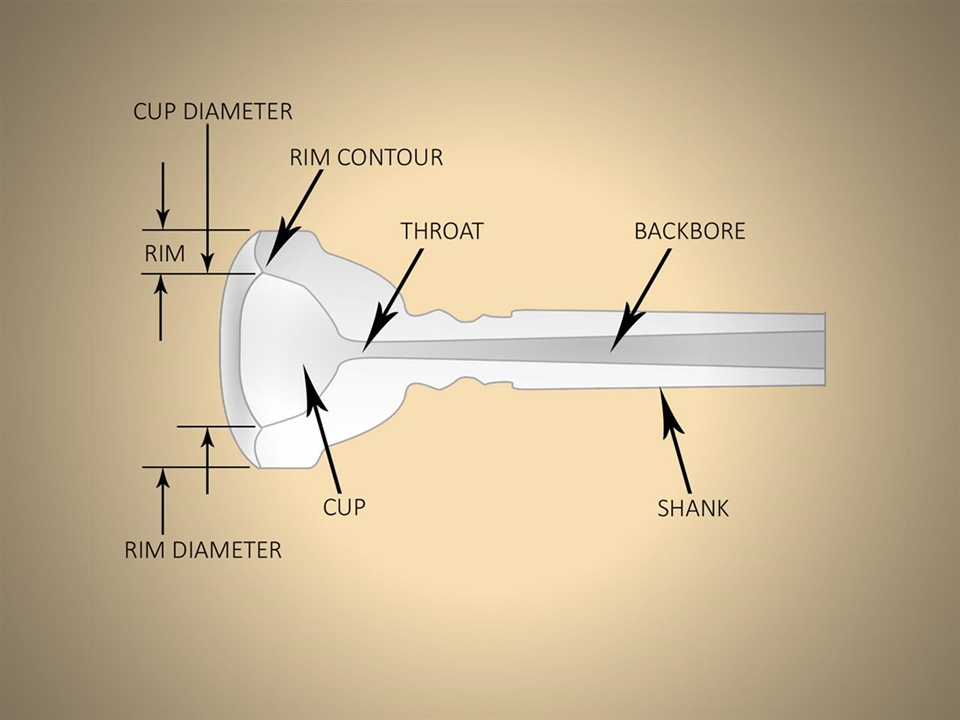
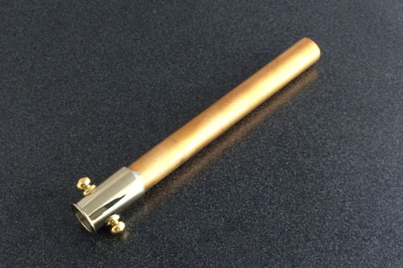
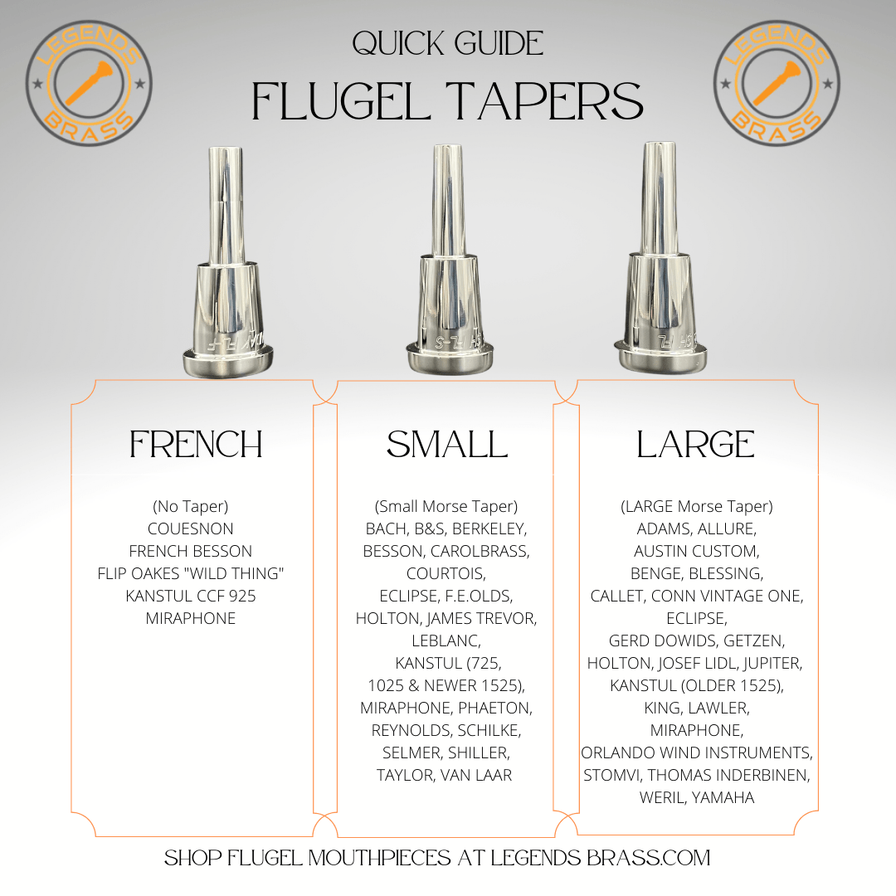

Số là hồi lúc mua flugelhorn Yamaha YFH-635ST thì ông anh tặng kèm búp Cornet 9 của Yamaha. Chơi thì cũng được nhưng mà cảm giác bí bí sao á. Sau này có tìm hiểu thì flugelhorn không có chung 1 mẫu thiết kế như trumpet, nhân dịp có bác đi hỏi mua búp mà không nói là kèn của hãng nào nên mình chia sẻ luôn.

## Cấu tạo của búp kèn Flugelhorn

Về cấu tạo búp kèn Flugelhorn cũng tương tự như búp Trumpet và Cornet. Tuy nhiên, sự khác nhau nằm ở kích thước từng thành phần như là `Throat` (đường kính cuống búp), `Backbore` (đường kính thân búp) và `Shank` (phần cắm búp).

Một điều cần lưu ý, Flugelhorn không có main tuning slide như trumpet/cornet nên nó sẽ dùng leadpipe rời để điều chỉnh. Và ta sẽ cắm mouthpiece vô đây.

Mỗi hãng sẽ có thông số đường kính chỗ cắm leadpipe khác nhau, nên việc đổi leadpipe giữa các hãng sẽ hơi khó. Và nó sẽ liên quan tới đường kính receiver và yêu cầu sử dụng đúng loại taper trên mouthpiece để khi chơi cho hơi ra thoát nhất.

## Các loại tapers

Phần `Taper` này nó giống phần `Shank`. Có 3 loại taper là `Large Taper`, `Small Taper`, và `French Taper`. Trong đó, `Large Taper` được coi là tiêu chuẩn của flugelhorn mouthpiece. 

Về thiết kế, phần `Shank` sẽ có thiết kế khác nhau xíu. Như `French Taper` thì thẳng đuột. `Large Taper` thì đường kính lớn hơn và nhỏ dần về phần đuôi. `Small Taper` thì có đường kính nhỏ nhất, cũng nhỏ dần về phần đuôi. 

Như hình trên, mỗi loại taper sẽ có một số hãng dùng. Do đó dễ nhất, là mua mouthpiece theo hãng kèn.

- `Large Taper`: Yamaha, Getzen, Stomvi, Benge, King, Blessing, Conn Vintage One, Weril, Holton, Schilke, Jupiter, và một số hãng kèn Mỹ (trừ Vincent Bach).
- `Small Taper`: Vincent Bach, Antoine Courtois, CarolBrass, B&S, Taylor, và một số hãng kèn châu Âu.
- `French Taper`: Couesnons, F. Besson.

## Lưu ý

Không nên dùng sai taper vì tiếng kèn sẽ rất bí, cảm giác khi chơi không được thoải mái luồng hơi.

## Tham khảo

- Mouthpiece Express, [Guide to Flugelhorn Tapers](https://mouthpieceexpress.com/catalog/index.php?cPath=197_200)
- Bob Reeves, [The ultimate flugelhorn mouthpiece shank guide](https://bobreeves.com/blog/the-ultimate-flugelhorn-mouthpiece-shank-guide/)
- The Wedge Mouthpiece, [Flugelhorn Mouthpiece Specifications](https://wedgemouthpiece.com/flugelhorn-mouthpiece-specifications/)
- Greg Black Mouthpieces , [Flugelhorn Mouthpiece](https://gregblackmouthpieces.com/products/flugelhorn-mouthpiece)
- Trumpet Biz, [How to choose a flugelhorn mouthpiece
](https://trumpet.biz/trumpet-mouthpieces/how-to-choose-a-flugelhorn-mouthpiece/)
- Mouthpiece Express, [Mouthpiece Anatomy 101](https://mouthpieceexpress.com/specshub/anatomy.html)
- Legend Brass, [Flugel Mouthpieces](https://legendsbrass.com/flugel-mouthpieces/)