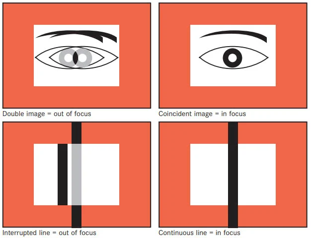
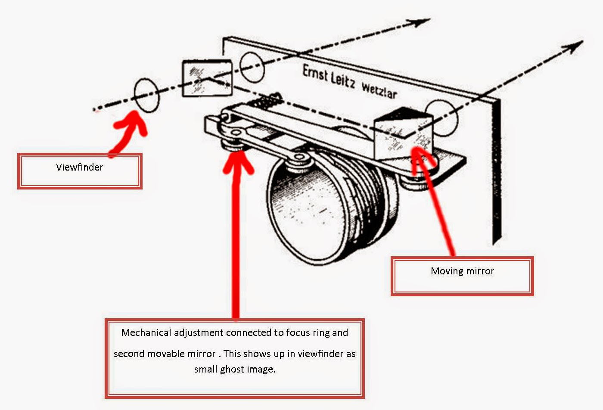
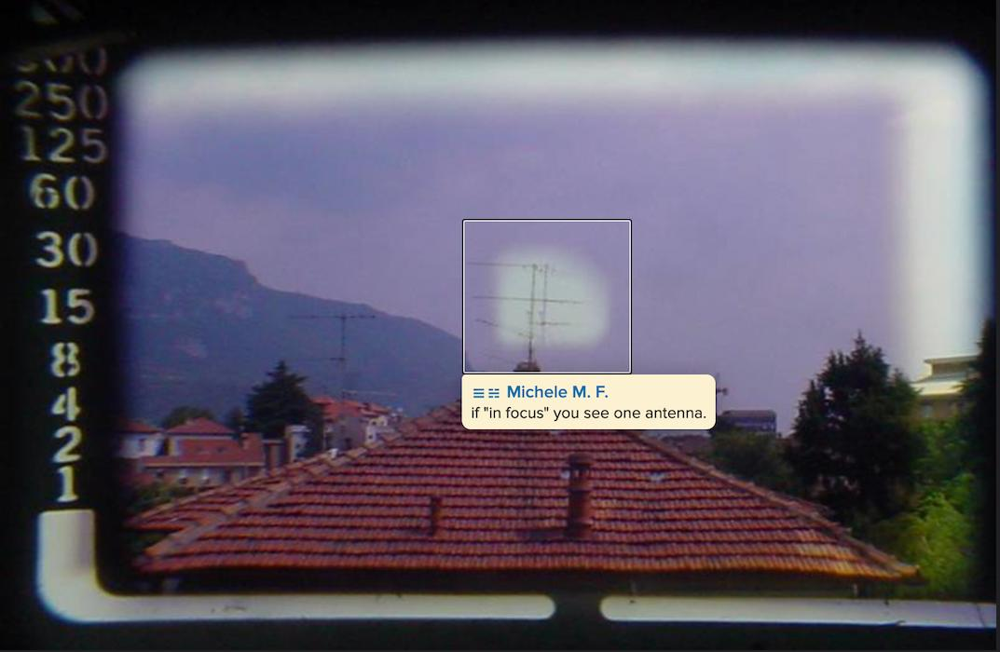
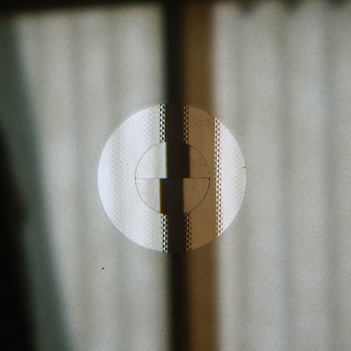
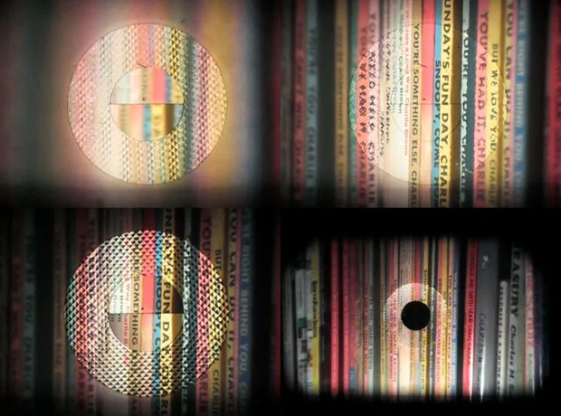
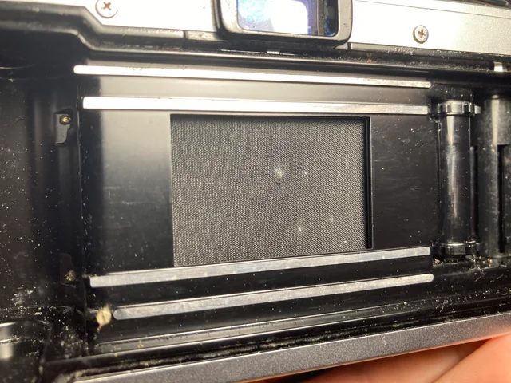
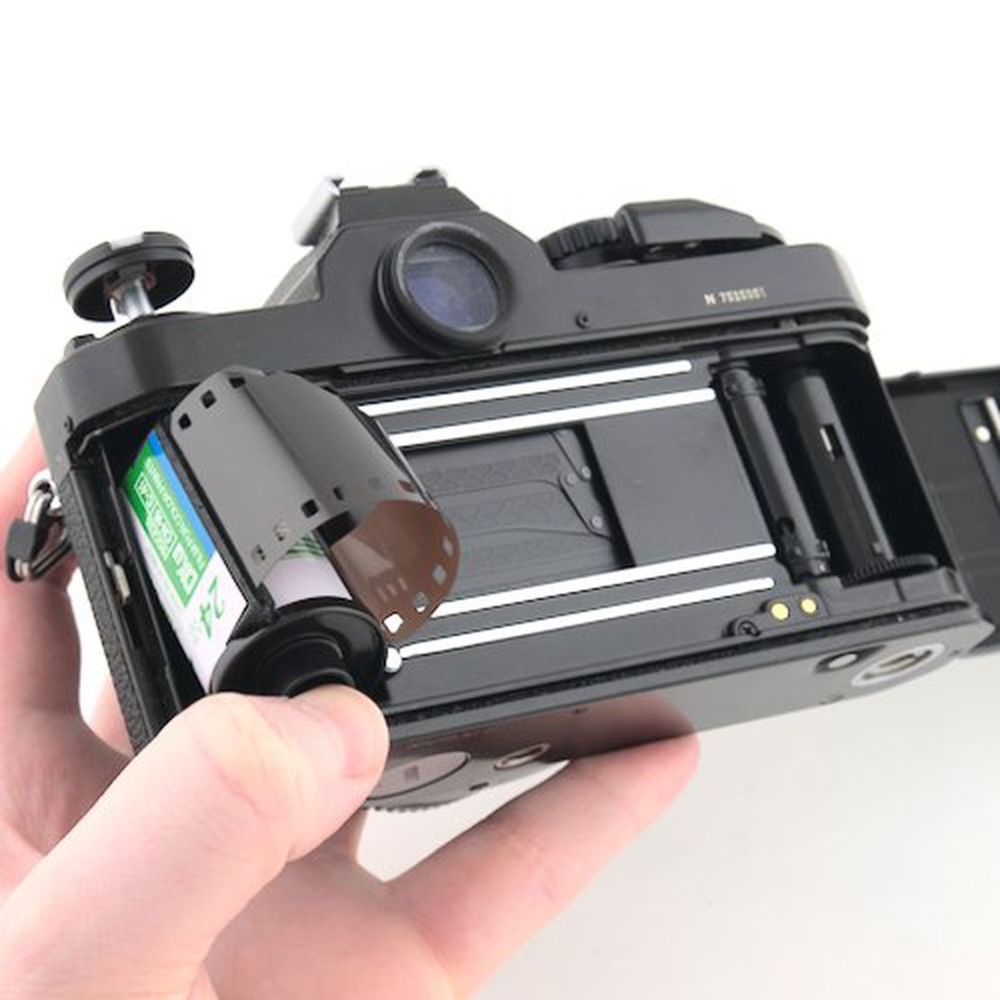
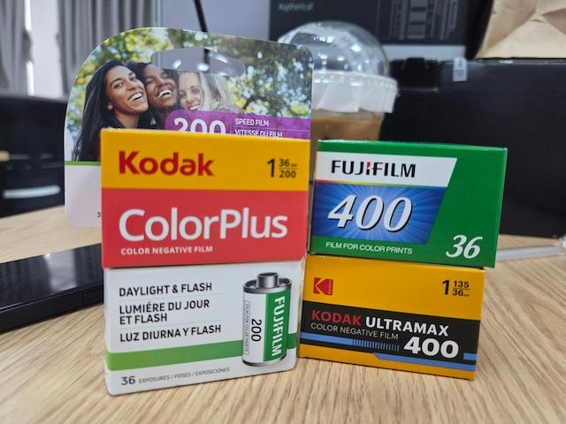
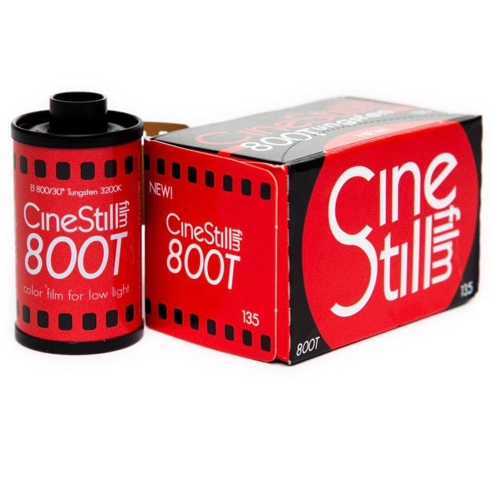

## Chiếc máy ảnh film đầu tiên (tự mua)

Một ngày đẹp trời mình thấy clip hướng dẫn chỉnh màu giả lập film với [Dehancer Desktop](https://www.dehancer.com/shop/desktop) của [Justin Vo](https://youtu.be/rwiEKPCXqaw?si=mjs-f399mATYDdpA). Mình cũng có tải thử về vọc vạch và thấy có hứng thú với cuộn film [Lomography Lomochrome Purple XR](https://www.analog.cafe/r/lomography-lomochrome-purple-xr-film-review-hw0y). Và trong quá trình ráng giả lập lại màu film thì phát hiện ra cuộn này khá nhạy với ISO. Màu ở ISO 100, 200, và 400 khác nhau nhiều, kèm thêm cái nữa là mình chỉnh thấy sai sai sao đó. Thế là hành trình với film, máy film bắt đầu từ đây.

Sau mấy ngày lượn lờ YouTube, tiêu chí ban đầu đặt ra là máy film phải hoàn toàn thủ công, có hỗ trợ đo sáng, giá rẻ. Và cũng mất khoảng mấy ngày lượn từ các chợ trên Facebook, Shopee thì chốt được một chiếc [Canon Canonet QL17 GII](https://global.canon/en/c-museum/product/film74.html). Cũng chỉ là thấy mấy nào giá hợp lý rồi kiểm tra thông tin trên mạng thì mua.

## Đóng tiền học phí

Bây giờ, mình sẽ chia sẻ quá trình rút kinh nghiệm từ việc tìm hiểu chưa tới nơi, tới chốn từ nguồn thông tin trên mạng.

### Bộ tứ huyền thoại trong làng máy film

Mình có lượn lờ kênh của [Kiệt Nguyễn](https://www.youtube.com/@kietnguyen) khi tìm hiểu về máy [Canon Canonet QL17 GIII](https://www.youtube.com/watch?v=CPBoclyLB94). Từ đây mình mới biết khái niệm 4 máy ảnh film huyền thoại mọi người săn đón, gồm:
- [Canon Canonet QL17 GIII](https://global.canon/en/c-museum/product/film84.html)
- [Yashica Electro 35 GX](https://camera-wiki.org/wiki/Yashica_Electro_35_GX)
- [Olympus 35 RD](https://www.brokencamera.club/blog/2017/1/25/olympus-35-rd)
- [Minolta Hi-matic 7sII](https://casualphotophile.com/2017/05/24/minolta-hi-matic-7sii-35mm-film-rangefinder-camera-review/)

Và điều này được củng cố này khi thấy các chợ trên Facebook, bình luận liên quan đều nhắc những dòng khác trong bộ tứ. Kể cả chỗ mình mua máy nữa.

Và sau một buổi trải nghiệm việc lấy nét trên con Canonet QL17 thì mình mới thắc mắc cách lấy nét phiền phức như vậy mà sao trở thành huyền thoại hay vậy? Mất thêm một ngày lượn lờ tìm con máy nào khác có lấy nét đơn giản hơn thì... mới biết khái niệm này phổ biến ở Việt Nam, chứ không tìm được trên mấy trang nước ngoài.

### Rangefinder

Ban đầu nghĩ `rangefinder` là kiểu thiết kế máy có ống ngắm lệch qua một bên, tiêu biểu là [Fujifilm X100 series](https://www.fujifilm-x.com/global/products/cameras/x100vi/). Nhưng thực tế, cái tên này lại bắt nguồn từ cơ chế lấy nét.

Như hình trên là một minh họa cơ bản về cơ chế lấy nét của `coupled optical rangefinder`. Khi nhìn qua ống ngắm (viewfinder), ta sẽ thấy hai hình ảnh của cùng một chủ thể: hình ảnh chính đi vào từ cửa sổ ngắm, và một hình ảnh phụ được thu qua một cửa sổ khác rồi phản xạ vào hệ thống quang học bên trong máy.

Khi xoay vòng lấy nét, cơ cấu rangefinder sẽ làm dịch chuyển hình ảnh phụ này. Hai hình ban đầu bị lệch sẽ dần trùng khít với nhau; tại thời điểm đó, ống kính cũng đã được lấy nét đúng khoảng cách tới chủ thể.

Nhân tiện, đây cũng chính là lý do tại sao `Fujifilm X100 series` không phải là máy ảnh rangefinder. Nó có thể mang kiểu dáng và trải nghiệm gợi nhớ đến rangefinder, nhưng không có cơ chế quang học tạo ra hai hình ảnh để căn chỉnh khi lấy nét.

### Cơ chế lấy nét

Đối với máy ảnh thời kỳ đầu, người dùng sẽ quan sát hình ảnh thông qua một tấm kính mờ, gọi là `ground glass`, nơi hình ảnh được tạo ra trực tiếp từ ống kính. Sau đó, người chụp sẽ vặn vòng lấy nét cho tới khi hình ảnh trở nên sắc nét.

Từ việc quan sát trực tiếp hình ảnh trên ground glass, nhiều cách khác nhau đã xuất hiện để giúp việc xác định điểm nét trở nên dễ dàng hơn, từ [coincidence rangefinder](https://en.wikipedia.org/wiki/Coincidence_rangefinder), [split-image](https://camera-wiki.org/wiki/Split_prism) cho đến [microprism](https://camera-wiki.org/wiki/Microprism).

#### Coincidence rangefinder

Người ta thường gọi đây là `lấy nét điểm vàng`. Khi nhìn qua ống ngắm, ở giữa khung hình sẽ xuất hiện một hình chữ nhật màu vàng — hay còn gọi là `rangefinder patch.` Hình ảnh phụ, được thu từ một cửa sổ khác và phản xạ qua hệ thống quang học bên trong máy, sẽ chỉ xuất hiện trong vùng này. Người chụp chỉ cần điều chỉnh vòng lấy nét cho đến khi hình ảnh trong vùng màu vàng trùng khớp với hình ảnh chính.

Tuy nhiên, cơ chế này chỉ xuất hiện trên máy ảnh rangefinder. Lớp màu vàng của `rangefinder patch` cũng có thể phai dần theo thời gian, khiến việc quan sát hình ảnh phụ trở nên khó khăn hơn. Vẫn có những cách để khắc phục, nhưng việc phục hồi thường khá phức tạp. Ngoài ra, trong điều kiện thiếu sáng, việc nhận ra và căn chỉnh hai hình ảnh cũng trở nên khó khăn hơn.

#### Split-image

Cái này gọi là `lấy nét cắt`. Khi nhìn qua ống ngắm, ta sẽ thấy hai nửa hình tròn này tách rời nhau. Người chụp chỉ cần điều chỉnh vòng lấy nét cho đến khi hai nửa hình tròn trùng khớp với nhau thì đã lấy nét được.

So với `coincidence rangefinder`, cơ chế này cho phép quan sát trực tiếp hình ảnh đi qua ống kính trên toàn bộ màn lấy nét, đồng thời sử dụng vùng `split-image` để xác định chính xác điểm nét. Tuy nhiên, nó cũng có một nhược điểm: `split-image` hoạt động hiệu quả nhất khi chủ thể có đường nét hoặc cạnh rõ ràng. Nếu đường nét cần lấy nét lại song song với đường chia của vòng tròn, việc nhận ra độ lệch sẽ khó hơn; lúc này có thể xoay nhẹ máy để dễ quan sát.

#### Microprism

Nếu `split-image` giúp người chụp nhận biết điểm nét thông qua sự lệch giữa hai phần của hình ảnh, `microprism` lại hoạt động theo một cách khác.

Khi chủ thể chưa được lấy nét, hình ảnh trong vùng `microprism` sẽ trở nên nhấp nháy hoặc vỡ thành nhiều mảng nhỏ, khiến chi tiết khó quan sát. Khi xoay vòng lấy nét đến đúng điểm, hiện tượng này sẽ biến mất và hình ảnh trong vùng đó trở nên rõ ràng hơn.

Trên một số máy ảnh, `microprism` được sử dụng độc lập. Nhưng cũng có những thiết kế kết hợp cả `split-image` ở trung tâm và `microprism` bao quanh nó, như trên màn lấy nét của [Nikon FM](https://imaging.nikon.com/imaging/information/chronicle/cousins09-e/).

### Màn trập: Vải hay kim loại?

Cái này mình biết do coi nhược điểm của [Olympus OM-1](https://www.reddit.com/r/AnalogCommunity/comments/1ixqw13/problem_with_olympus_om1/). 

#### Màn trập vải

Màn trập vải thường gắn liền với những chiếc máy ảnh đời cũ. Thay vì các lá kim loại, màn trập được làm từ một loại vải chuyên dụng, thường có bề mặt màu đen để hạn chế ánh sáng xuyên qua.

Khi bấm máy, hai rèm màn trập sẽ di chuyển qua phía trước mặt phẳng film, tạo ra một khoảng hở cho ánh sáng đi vào. Tốc độ màn trập càng nhanh, khoảng hở giữa hai rèm càng hẹp.

Điều thú vị là màn trập vải không đơn giản chỉ là một công nghệ cũ bị thay thế bởi kim loại. Nó nhẹ, có cấu trúc tương đối đơn giản và đã được sử dụng trên rất nhiều máy ảnh nổi tiếng. Tuy nhiên, vật liệu này cũng có những giới hạn riêng về độ bền, khả năng chịu nhiệt và tốc độ mà màn trập có thể di chuyển.

#### Màn trập kim loại

Sau này, nhiều máy ảnh chuyển sang sử dụng màn trập kim loại. Về nguyên lý hoạt động, chúng vẫn giải quyết cùng một vấn đề: hai rèm di chuyển qua mặt phẳng film để kiểm soát lượng ánh sáng đi vào.

Sự khác biệt nằm ở vật liệu và thiết kế của các rèm màn trập. Kim loại cho phép tạo ra những lá màn trập mỏng, cứng và ổn định hơn, đồng thời giúp các nhà sản xuất phát triển những hệ thống có tốc độ màn trập cao hơn.

Tuy nhiên, `màn trập kim loại` cũng không đơn giản là phiên bản nâng cấp hoàn toàn của `màn trập vải`. Cả hai đều là những cách tiếp cận khác nhau cho cùng một cơ chế `focal-plane shutter`, và mỗi loại đều gắn với những giới hạn kỹ thuật cũng như đặc điểm riêng của thời đại mà chúng xuất hiện.

### Các con số liên quan tới ISO trên cuộn film

#### ISO trên cuộn film

Chắc khi mới nhập môn, đa phần mọi người đều được dặn rằng: cứ nhìn thông số `ISO`/`ASA` trên cuộn film rồi set máy theo đúng con số đó. Và trong phần lớn trường hợp, cách này hoàn toàn đúng.

Ví dụ, [Kodak Portra 400](https://www.analog.cafe/r/kodak-portra-400-film-review-teli) có ISO danh định là 400 thì máy cũng được set ở ISO 400. Tương tự, [Fujifilm Superia Premium 400](https://www.analog.cafe/r/fujifilm-superia-premium-400-film-review-zl9n) thì set ở ISO 400. Thông số này thường được ghi trực tiếp trên vỏ hộp, nên cũng khá dễ để làm theo.

Tuy nhiên, không phải cuộn film nào cũng đơn giản như vậy.

Lấy [ORWO Wolfen NC 500](https://www.analog.cafe/r/orwo-wolfen-nc-500-film-review-and-exposure-guide-7y1k) làm ví dụ. Nhìn vào cái tên, khá dễ nghĩ rằng đây là một cuộn film ISO 500. Nhưng thông số ISO khuyến nghị trên vỏ hộp lại là 400. Thậm chí, sau khi tham khảo trải nghiệm của những người đã chụp qua cuộn này, còn thấy khá nhiều người khuyên nên chụp ở ISO 200.

Lý do là khi chụp ở ISO 400, ảnh có thể hơi tối so với cách nhiều người muốn khai thác cuộn film này. Nếu set máy ở ISO 200, máy sẽ đo sáng để cho film nhận nhiều ánh sáng hơn khoảng 1 stop. Sau đó vẫn tráng theo quy trình thông thường của cuộn film, kết quả sẽ là một tấm ảnh sáng hơn.

#### Chữ "D" và "T" trong ISO

Thể nào bạn cũng sẽ gặp cuộn này khi lựa chọn film. Đó là [Cinestill 800T](https://cinestillfilm.com/products/800tungsten-c41-36exp-35mm-high-speed-color-negative-135). Như ở phần trên, ISO định danh của cuộn này là ISO 800. Nhưng chữ `T` ở trên vỏ hộp này cho biết nó sẽ là ISO 800 cho tungsten light, dùng để chỉ loại ánh sáng mà cuộn film được cân bằng màu. Trong trường hợp này là ánh sáng tungsten, với nhiệt độ màu khoảng 3200K.

Điều này có nghĩa là `ISO 800` và `T` đang nói về hai thứ hoàn toàn khác nhau: một bên là độ nhạy sáng của film, còn bên kia là cân bằng màu mà cuộn film được thiết kế để sử dụng.

Nếu chụp dưới ánh sáng ban ngày, vốn có nhiệt độ màu cao hơn ánh sáng tungsten, ảnh từ một cuộn film như `Cinestill 800T` thường sẽ có ám màu xanh nếu không sử dụng kính lọc chuyển đổi màu phù hợp.

Tương tự, một số cuộn film khác có thể sử dụng chữ `D`, viết tắt của `Daylight`. Ví dụ như [Cinestill 50D](https://cinestillfilm.com/products/50daylight-36exp-135-fine-grain-color-film-35mm-roll). Cuộn film này được cân bằng màu cho ánh sáng ban ngày, thay vì ánh sáng tungsten.

Vì vậy, nếu chỉ nhìn vào tên `Cinestill 800T`, ta có thể tách nó thành:

- `800`: độ nhạy của film.
- `T`: `Tungsten`, tức cân bằng màu cho ánh sáng tungsten.

Hai thông số này không thay thế hay bổ sung cho nhau, mà là đang mô tả hai đặc tính khác nhau của cùng một cuộn film.

## Tham khảo

- Dmitri, [Lomography Lomochrome Purple XR Film Review: A Unique, False-Colour Experimental Film With an “Extended” Dynamic Range](https://www.analog.cafe/r/lomography-lomochrome-purple-xr-film-review-hw0y), Analog Cafe.
- TinhTang, [Bộ tứ lừng danh Rangefinder 40mm 1.7](http://www.vnphoto.net/forums/showthread.php?t=32369), VNPhoto.
- Daniel O'Neil, [What is a Rangefinder Camera?](https://petapixel.com/what-is-a-rangefinder-camera), PetaPixel.
- Paul Hemming, [A quick guide to camera focusing systems : Rangefinders](https://thebigworldpicture.blogspot.com/2014/04/a-quick-guide-to-camera-focusing.html), The Big World Picture.