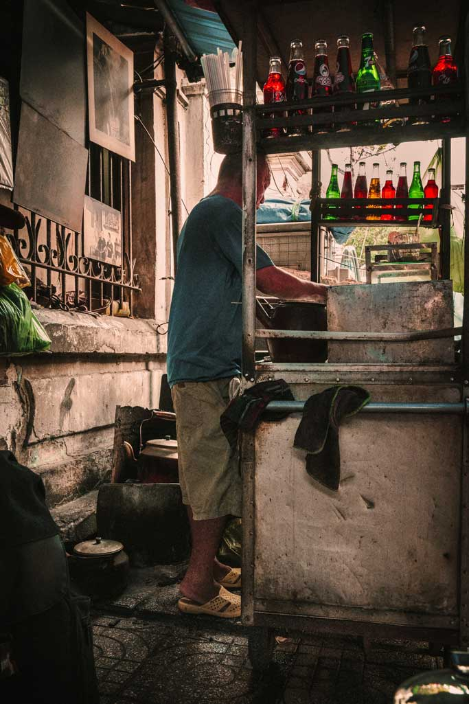
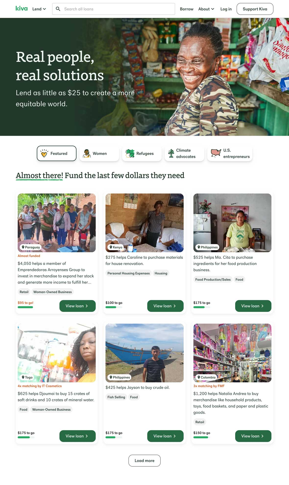
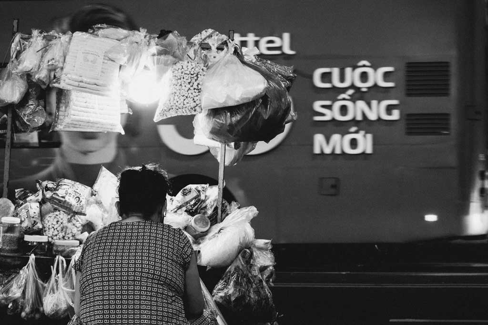
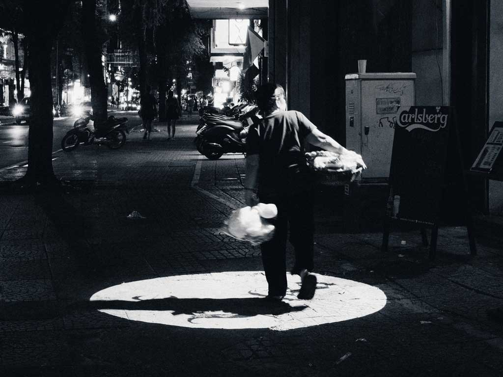
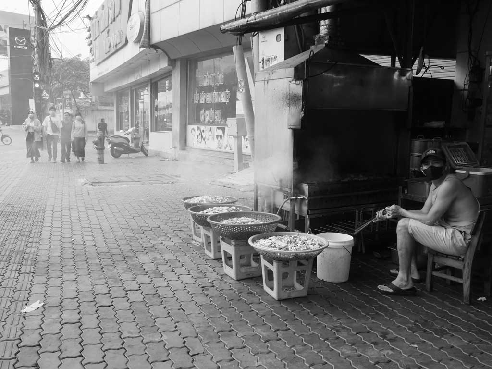
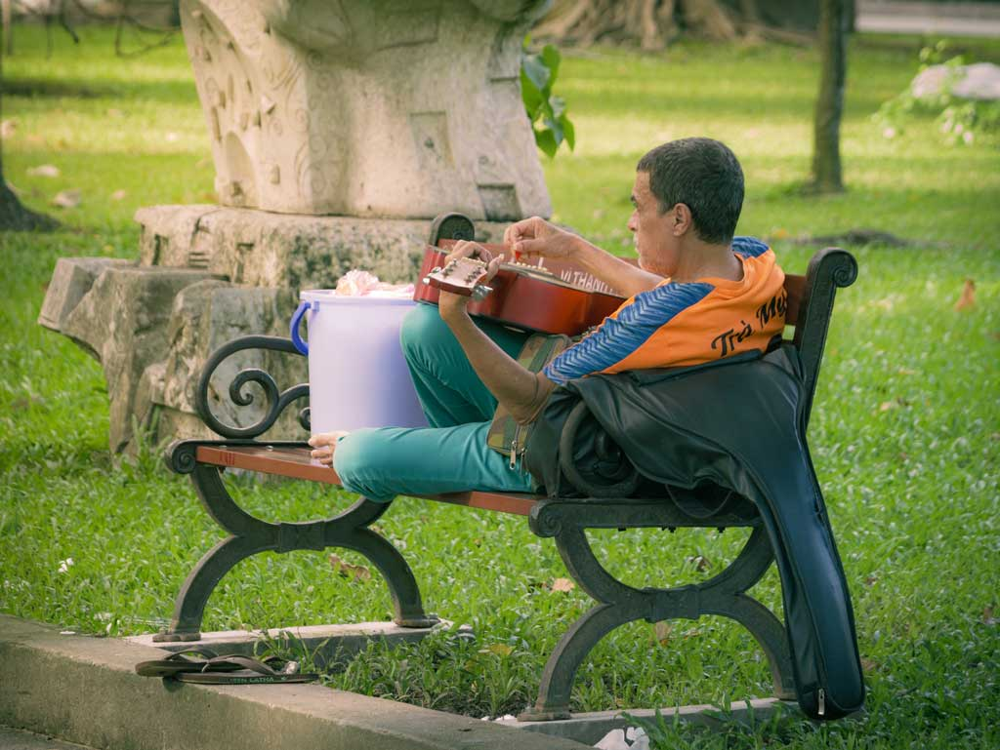
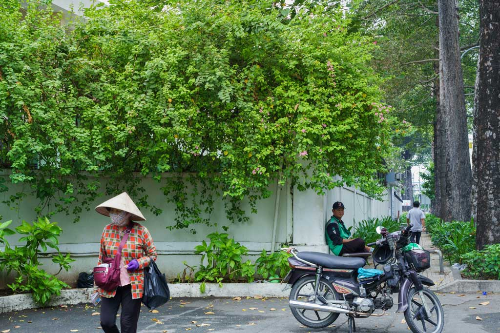
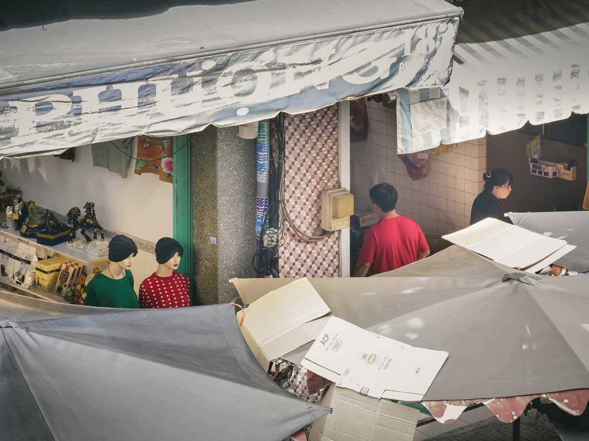
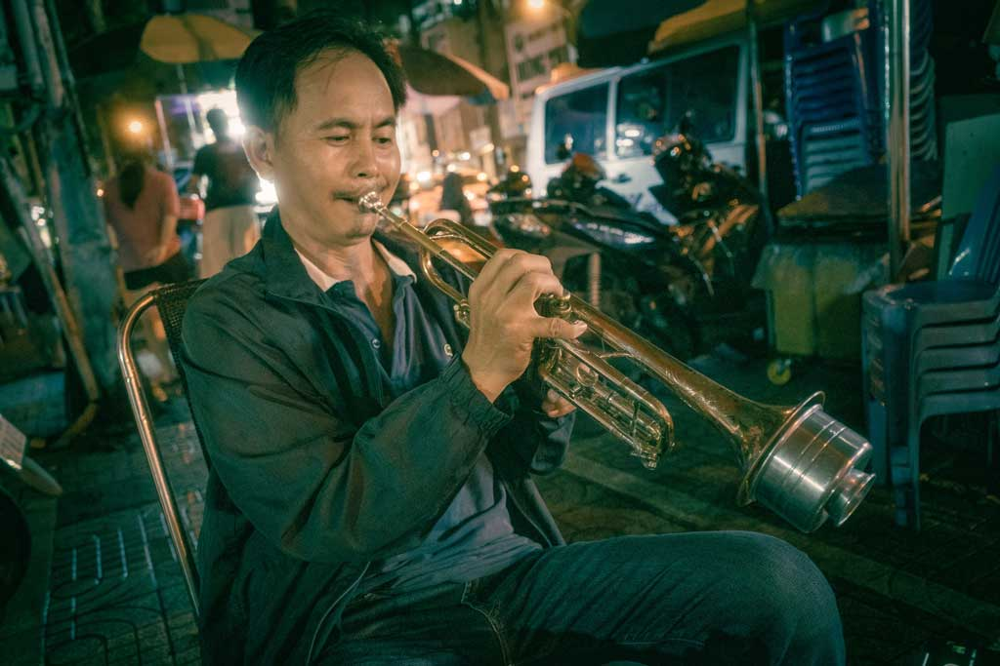

Dạo gần đây, mình thấy ngày càng nhiều những bộ ảnh về “sự lam lũ” xuất hiện trên Facebook. Từ các photo tour rầm rộ cho đến những buổi set up có kịch bản, nơi cái “khổ” được dàn dựng để trở thành một thứ có thể chụp, có thể bán, và có thể kể lại như một câu chuyện nhân sinh.

Đứng bên ngoài quan sát những “show diễn” đó, mình chợt nhớ đến một ý đã đọc đâu đó:

> `Đừng biến người nghèo thành chất liệu của nhiếp ảnh`.

Nhưng rồi một câu hỏi khác xuất hiện:

`Liệu mình đang kể câu chuyện của họ — hay đang sử dụng họ để kể câu chuyện của chính mình?`

Sau đó mình nhận ra, có lẽ câu hỏi đó vẫn chưa đủ. Vì trước cả chuyện mình chụp họ như thế nào, còn một điều cơ bản hơn:

`Tại sao họ lại phải đứng ở đó — để mình có thể chụp?`

## Tại sao có người nghèo ở đây?

Không phải vì họ “phù hợp” với một khung hình đẹp.

Họ ở đó vì những lý do rất đời thường và rất không điện ảnh: mưu sinh, hoàn cảnh, những lựa chọn bị giới hạn, và đôi khi là những thứ nằm hoàn toàn ngoài khả năng kiểm soát của họ.

Nhưng khi đi qua ống kính, những bối cảnh đó thường bị lược bỏ. Sự phức tạp của một cuộc đời bị nén lại thành một khoảnh khắc — đủ để gây xúc động, nhưng không đủ để hiểu.

Nhiếp ảnh về người nghèo, nếu làm đúng, là một cầu nối nhân văn tuyệt vời để nâng cao nhận thức xã hội như cách báo chí vẫn ca ngợi. Nhưng đứng từ "cửa sổ" của mình nhìn ra, mình thấy một mảng tối khác: nơi sự thấu cảm bị biến thành hàng hóa.

Điều làm mình khó chịu không phải là việc người ta chụp những hình ảnh đó, mà là cách họ tiếp cận chúng. Thay vì trao máy ảnh để họ tự kể chuyện ([Photovoice](https://en.wikipedia.org/wiki/Photovoice)), người ta lại vây quanh họ như những 'Sở thú nhân học' ([Human Zoo](https://en.wikipedia.org/wiki/Human_zoo)) để săn tìm sự khắc khổ. Nhân văn không nằm ở việc bạn chụp người nghèo bao nhiêu tấm, mà nằm ở việc bạn đối xử với nhân phẩm của họ như thế nào phía sau ống kính.

Đọc thêm một cuộc thảo luận trên [Reddit](https://www.reddit.com/r/photography/comments/451lzv/a_look_at_the_blurry_line_between_ethical_and/) về ranh giới giữa đạo đức và sự bóc lột, mình nhận ra một sự thật cay đắng: Nhiều người đang 'ký sinh' cảm xúc trên nỗi đau của người lạ.

Họ bỏ tiền mua một kịch bản khắc khổ, rồi dùng ống kính đắt tiền để "thu hoạch" sự lam lũ đó về làm vốn liếng cho sự thấu cảm của bản thân trên mạng xã hội. Đó không phải là nhiếp ảnh nhân văn, đó là một cuộc trao đổi không sòng phẳng.

Khi thẩm mỹ lấn át nhân phẩm, khi "nét căng" quan trọng hơn sự tự trọng của chủ thể, thì đó chính là lúc mình bắt đầu nhìn con người như một thứ để khai thác, thay vì để hiểu.

Sự tráo đổi vị thế này dẫn đến một hệ quả tất yếu trong quy trình sáng tạo: Khi thực tại không đủ 'đắng', người ta bắt đầu pha thêm gia vị. Trong nhiếp ảnh, ranh giới giữa việc 'ghi lại' một khoảnh khắc nghiệt ngã và việc 'chế biến' nó để lấy nước mắt người xem là cực kỳ mong manh. Đó là lúc mình bước vào vùng tối của việc thao túng cảm nhận.

## Khi sự thấu cảm bị “thiết kế”

Roland Barthes từng dùng khái niệm `punctum` để mô tả khoảnh khắc một bức ảnh “đâm” vào người xem — một chi tiết nhỏ nhưng đủ sức gây ra cảm xúc rất cá nhân.

Trong nhiều bức ảnh về “sự lam lũ”, punctum gần như xuất hiện ngay lập tức: một ánh nhìn mệt mỏi, một bàn tay chai sạn, một khung cảnh thiếu thốn. Nhưng có lẽ điều đáng hỏi không phải là _"vì sao mình xúc động?"_.

Mà là: **liệu khoảnh khắc đó được tìm thấy — hay được dàn dựng để tạo ra xúc động?**

Khi sự thấu cảm trở thành thứ có thể “thiết kế”, punctum không còn là một sự va chạm chân thật nữa — mà trở thành một công cụ. Và khi đó, bức ảnh không còn là một “cửa sổ” để hiểu người khác, mà là một “chiếc gương” phản chiếu nhu cầu được xúc động của chính mình.

## Vậy mình nên đứng ở đâu?

Có lẽ vấn đề không nằm ở việc mình có nên chụp những hình ảnh này hay không? Mà nằm ở cách mình **đứng ở đâu** khi cầm máy. Giữa một bên là nhu cầu được thể hiện, được kể chuyện, được tạo ra cảm xúc — và một bên là một con người thật, với hoàn cảnh thật, và nhân phẩm thật.

Mình nhận ra, rất dễ để trượt từ “quan sát” sang “khai thác” mà không hề nhận ra. Rất dễ để một bức ảnh bắt đầu như một “cửa sổ” — rồi kết thúc như một “chiếc gương”. Và nếu đã vậy, có lẽ điều cần thiết không phải là thêm kỹ thuật. Mà là một vài nguyên tắc đủ rõ ràng — để tự kiểm tra mình trước khi bấm máy, và trước khi đăng một bức ảnh.

Những dòng dưới đây không phải là một hệ thống hoàn chỉnh, cũng không phải là thứ mình nghĩ là “đúng” cho tất cả mọi người. Chỉ là một bản ghi chú — những nguyên tắc mình đang thử áp dụng, để không quên rằng phía trước ống kính luôn là một con người, chứ không phải một chủ thể.

_Cà phê vợt ở quán "Ông Lù - Bà Huề" aka quán chú Ba Lù._

## Một vài nguyên tắc mình đang thử để không quên điều cơ bản

Mình không nghĩ có một bộ quy tắc nào đủ đúng cho tất cả mọi người. Nhưng sau khi nhìn lại cách mình chụp, cách mình viết caption, và cách mình phản ứng với những bức ảnh “đánh vào cảm xúc”, mình nhận ra: nếu không có một điểm tựa rõ ràng, rất dễ để trượt đi mà không biết mình đang trượt. Không phải vì mình cố tình làm sai — mà vì mọi thứ diễn ra quá trơn tru: một khoảnh khắc “đắt”, một bức ảnh “đẹp”, một chút cảm xúc được khuếch đại… và thế là đủ.

Vì vậy, mình thử viết ra một vài nguyên tắc — không phải để đúng, mà để tự kiểm tra mình trước khi bấm máy, và trước khi đăng một bức ảnh. Không phải để trở thành một nhiếp ảnh gia “tốt hơn”. Mà để không quên rằng: phía trước ống kính luôn là một con người, không phải một khung hình.

### 1. Nhận diện ngữ cảnh trước khi giơ máy

Không phải mọi hoàn cảnh đều giống nhau.

Việc mình chụp một người đang mưu sinh trên vỉa hè khác hoàn toàn với việc mình chụp một góc phố hay một bức tường có ánh sáng đẹp.

Đây không phải là cách phân loại con người — mà là cách nhận diện **mức độ nhạy cảm của hoàn cảnh**, để điều chỉnh cách mình tiếp cận.

- Với những người đang mưu sinh hoặc ở trong hoàn cảnh dễ bị tổn thương → giữ mô tả trung thực, hạn chế cái tôi
- Với người lạ trong không gian công cộng → có thể chia sẻ cảm nhận, nhưng không áp đặt
- Với trẻ em hoặc tình huống nhạy cảm → ưu tiên an toàn và sự tôn trọng
- Với cảnh vật → đây là nơi duy nhất cái tôi được phép làm chủ sân khấu mà không sợ làm tổn thương ai

### 2. Con người là con người — không phải chất liệu

Một bức ảnh đẹp nhưng làm mất đi sự tự trọng của người trong ảnh thì vẫn là một bức ảnh sai.

Quyền tự quyết không chỉ là việc họ “cho phép” mình chụp. Mà là việc họ xuất hiện trong bức ảnh với tư thế của một người **đang làm chủ cuộc sống của mình** — không phải một nạn nhân đang chờ được thương hại, hay một chi tiết để phục vụ câu chuyện của người khác.

### 3. Ba điều mình cố tránh khi viết caption

- Không biến con người thành “mảng màu” hay yếu tố trang trí cho bố cục
- Không mượn hoàn cảnh của người khác để kể câu chuyện về bản thân mình
- Không điều hướng cảm xúc người xem bằng lyric hay câu chữ “ép buồn/ép thương”

Nếu không biết viết gì cho đúng, tốt nhất là viết ít lại — hoặc chỉ mô tả những gì đang diễn ra.

### 4. Nhớ rằng mình chỉ là người đứng ở một vị trí cụ thể

Mình không phải là người trong cuộc. Mình chỉ là người đứng ở một vị trí nào đó, vào một thời điểm nào đó, nhìn thấy một khoảnh khắc.

- Nếu mình đứng xa — hãy thừa nhận sự xa cách đó.
- Nếu mình không tương tác — đừng giả vờ thân mật trong caption.

Sự trung thực về vị trí của mình cũng là một phần của sự trung thực với bức ảnh. Có lẽ đến đây, vấn đề không còn là “chụp cái gì”, mà là mình đang đứng ở đâu khi chụp.

### 5. Dùng caption để làm rõ, không phải để “deep”

Caption không phải để làm cho bức ảnh có vẻ “sâu sắc hơn”. Nó là nơi để giữ lại những gì bức ảnh có thể làm mất:

- Chuyện gì đang xảy ra
- Mình bấm máy vì điều gì
- Mình có tương tác với người trong ảnh hay không

Nếu không thể viết một cách trung thực — có lẽ mình chưa nên đăng bức ảnh đó.

### 6. Cảnh giác với những cảm xúc đến quá nhanh

Có những bức ảnh khiến mình xúc động ngay lập tức. Nhưng không phải mọi cảm xúc đều là sự thật. Mình bắt đầu tự hỏi:

- Khoảnh khắc này mình tình cờ gặp — hay mình đang tìm kiếm nó?
- Bức ảnh này giúp người xem hiểu thêm — hay chỉ khiến họ cảm thấy gì đó?

Một bức ảnh chỉ tạo ra cảm xúc mà không tạo ra hiểu biết rất dễ trở thành một “chiếc gương” — nơi mình nhìn thấy chính mình đang xúc động.

### 7. Tự kiểm tra trước khi bấm máy và trước khi đăng

Trước khi chụp:

- Mình đang quan sát — hay đang săn tìm?
- Người trước ống kính đang làm chủ khoảnh khắc — hay đang dễ bị tổn thương?

Sau khi chụp:

- Bức ảnh này có giá trị gì ngoài việc “đẹp”?
- Mình có đang vô tình bóp méo thực tế không?

Trước khi đăng:

- Mình có đang “nói hộ” người trong ảnh không?
- Mình có đang dùng họ để làm đẹp cho cái tôi của mình không?
- Họ có bị mất quyền kiểm soát cách họ được nhìn thấy không?
- Nếu họ yêu cầu xóa — mình có sẵn sàng xóa ngay, kể cả trong thùng rác, trước mặt họ không?

### 8. Nhiếp ảnh là mối quan hệ, không phải hành vi

Nếu có thể:

- hãy tương tác
- nếu chụp quán, hãy ủng hộ một ly nước
- nếu chụp người, hãy gửi lại ảnh
- nếu đăng, hãy ghi rõ địa điểm

Một bức ảnh tốt không chỉ là thứ mình “lấy được” mà là thứ **có ý nghĩa cho cả hai phía**.

### 9. Điều mình cố không quên

Mình có thể lãng mạn hóa ánh sáng, màu sắc, hay một cơn mưa. Nhưng khi đứng trước một con người, thứ duy nhất mình không có quyền làm sai lệch — là nhân phẩm của họ.

## Vấn đề có lẽ không nằm ở “cái nghèo”

Có một ví dụ khiến mình phải dừng lại khá lâu.

_Hình chụp màn hình trang chủ Kiva.org_

Trên [Kiva](https://www.kiva.org/) — một nền tảng cho vay vi mô — người ta cũng chụp những người đang sống trong những điều kiện không hề “dễ chịu” theo tiêu chuẩn của mình. Nhưng cách họ xuất hiện trong ảnh lại rất khác. Họ không xuất hiện như “người nghèo”, mà như những người đang làm việc.

Không có ánh nhìn cầu cứu. Không có khoảnh khắc “đắt giá” nào được đẩy lên để gây xúc động. Chỉ là một con người — đang làm việc của họ.

Điều lạ là, những bức ảnh đó gần như không “đánh vào cảm xúc” theo cách mà nhiều bộ ảnh về “sự lam lũ” vẫn làm. Nhưng càng nhìn, mình lại càng thấy khó rời mắt. Vì ở đó, người trong ảnh không bị rút gọn thành một hoàn cảnh. Họ vẫn là một người đang vận hành cuộc sống của mình. Có thể họ vẫn thiếu thốn, nhưng họ không xuất hiện như một nạn nhân.

Có lẽ vấn đề không nằm ở việc mình có chụp “cái nghèo” hay không, mà là mình đặt người đó vào vai trò gì trong bức ảnh.

## Những vết sẹo đằng sau ống kính của mình

Có lẽ vấn đề không nằm ở việc mình chụp sai, mà là mình đã mô tả sai vấn đề ngay từ đầu — như cách [Andrew Clarke](https://mural.maynoothuniversity.ie/id/eprint/21049/1/Andrew%20Clarke_Describe%20the%20Problem%20Properly_Nov%202025.pdf) nói, nếu không định nghĩa đúng vấn đề, mọi giải pháp sau đó đều sẽ lệch.

Nhìn lại những bức ảnh từng chụp, mình buộc phải đối diện với một sự thật không mấy dễ chịu: phần lớn trong số đó — nếu soi lại bằng chính những nguyên tắc mình đang nói — đều có vấn đề. Những tấm hình từng khiến mình đắc ý vì ánh sáng đẹp hay bố cục “nét căng”, thực ra lại là những khung hình mình đã chọn trước, rồi sau đó dùng caption để hoàn thiện bằng những lớp diễn giải mà khoảnh khắc đó có thể chưa từng có. Ranh giới giữa thứ mình thấy và thứ mình muốn thấy bắt đầu mờ đi, và bức ảnh, lúc đó, không còn là nơi để nhìn ra người khác nữa.

_Hướng về "cuộc sống mới"_

_Con người vừa là đạo diễn, vừa là diễn viên cho vở kịch về chính bản thân mình_

Mượn góc nhìn “human-centered” của [Don Norman](https://jnd.org/books/design-for-a-better-world/) — nơi con người không phải là đối tượng để tối ưu, mà là một chủ thể có mục đích và phẩm giá — mình nhận ra nhiều bức ảnh cũ của mình đã đi ngược lại điều đó. Thay vì chụp một con người với đầy đủ sự tự chủ, mình lại chỉ chăm chăm vào những khoảnh khắc họ trông có vẻ “lỗi”: sự vất vả, nhếch nhác hay mệt mỏi, chỉ để phục vụ cho một ý đồ thẩm mỹ có sẵn trong đầu. Lúc đó, mình không hề thấu cảm với họ, mà đang biến cuộc đời họ thành chất liệu cho sự sáng tạo ích kỷ của chính mình. Có lẽ đây cũng là điều [Susan Sontag](https://monoskop.org/images/a/a6/Sontag_Susan_2003_Regarding_the_Pain_of_Others.pdf) từng cảnh báo: khi đứng trước nỗi đau của người khác, việc nhìn và ghi lại nó luôn đi kèm với một quyền lực mà mình rất dễ lạm dụng.

_Trong sương_

_Góc nhỏ của tự do_

Đó cũng là lúc cái “nhột” mà Teju Cole từng cảnh báo xuất hiện rõ rệt hơn bao giờ hết: sự thấu cảm hời hợt của một kẻ đứng ngoài. Mình đứng xa, không tương tác, không biết gì về người trong ảnh ngoài vài giây quan sát. Và như một bài viết trên The Guardian đã chỉ ra: gần như không có người nghèo nào được quyền quyết định cách họ được chụp và được nhìn thấy. Nhưng khi đăng lên, mình lại viết như thể mình hiểu thấu tâm can họ. Sự “thân mật giả tạo” này thực chất là cách mình mượn nỗi đau của người lạ để làm trang sức, khiến bản thân trông có vẻ “sâu sắc” hơn trên mạng xã hội.

_Chú xanh lá bị xa lánh_

_Same palette, different roles._

Trong tất cả những sai số đó, chỉ có một tấm khiến mình thấy thực sự nhẹ lòng.

_Liên hoan tiếng kèn ở quán sinh tố_

Tấm hình này ổn vì mình chụp một người bạn đang sống trọn vẹn với niềm vui và kỹ năng của chính anh. Như cách Norman nhấn mạnh về việc đặt con người làm trung tâm, mình chụp anh vì mình thực sự biết và trân trọng anh. Khi có một mối quan hệ thực sự, việc kể chuyện cũng trở nên trung thực hơn — câu chuyện không chỉ là thứ mình kể, mà còn là thứ người trong ảnh có quyền tham gia và kiểm soát. Mình không cần “nhét chữ” vào tiếng kèn đó, vì bản thân sự kiên cường và niềm vui của anh đã là một câu chuyện trọn vẹn và đầy tự trọng.

Khoảnh khắc đó khiến mình hiểu rằng: nhiếp ảnh tử tế không nằm ở việc bạn có bao nhiêu bức ảnh “đắt”, mà nằm ở việc bạn có đủ can đảm để trở thành một người chứng kiến thực sự — biết khi nào nên bấm máy.

Và khi nào nên buông máy để bảo vệ nhân phẩm của người đối diện.

## Tham khảo

- Reddit, [Making a "poor" photo. How people from third countries are being photographed.](https://www.reddit.com/r/photography/comments/c97jk/making_a_poor_photo_how_people_from_third/)
- Reddit, [A look at the blurry line between ethical and unethical travel photography](https://www.reddit.com/r/photography/comments/451lzv/a_look_at_the_blurry_line_between_ethical_and/)
- Wikipedia, [Photovoice](https://en.wikipedia.org/wiki/Photovoice)
- Wikipedia, [Human Zoo](https://en.wikipedia.org/wiki/Human_zoo)
- The Guardian, [No poor person decides how they get photographed](https://www.theguardian.com/artanddesign/2023/jul/24/no-poor-person-decides-how-they-get-photographed)
- Sontag Susan, [Regarding The Pain of Others](https://monoskop.org/images/a/a6/Sontag_Susan_2003_Regarding_the_Pain_of_Others.pdf)
- Khalid Warsame, [Teju Cole: "We are Made of All the Things We Have Consumed"](https://lithub.com/teju-cole-we-are-made-of-all-the-things-we-have-consumed/)
- Andrew Clarke, [“Describe the problem properly”: Teju Cole's aesthetic of uncertainty](https://mural.maynoothuniversity.ie/id/eprint/21049/1/Andrew%20Clarke_Describe%20the%20Problem%20Properly_Nov%202025.pdf)
- Don Norman, [Design for a Better World: Meaningful, Sustainable, Humanity Centered](https://jnd.org/books/design-for-a-better-world/)
