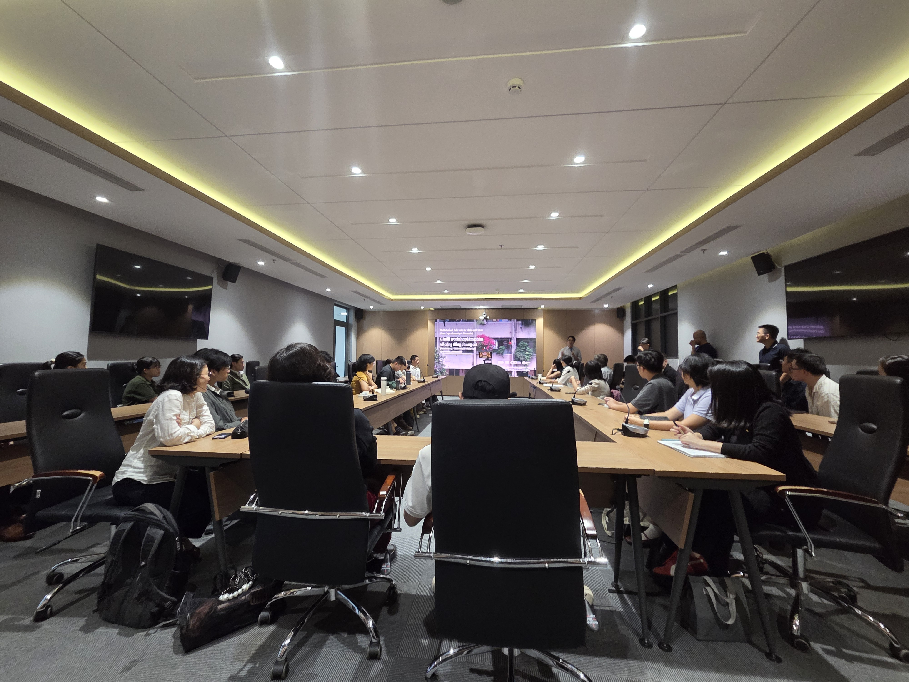
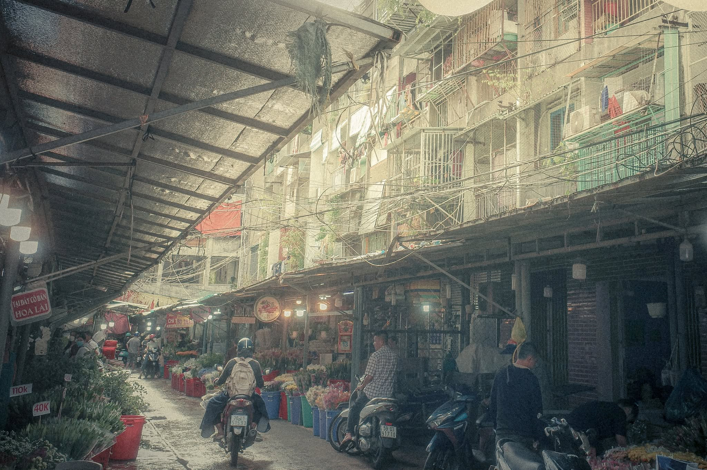
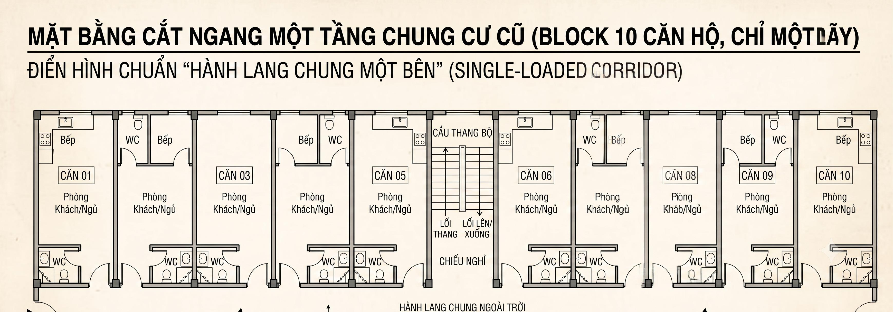
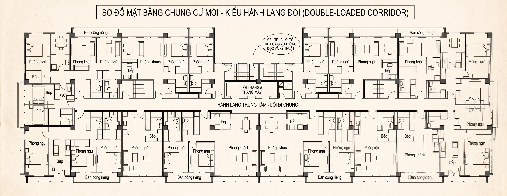
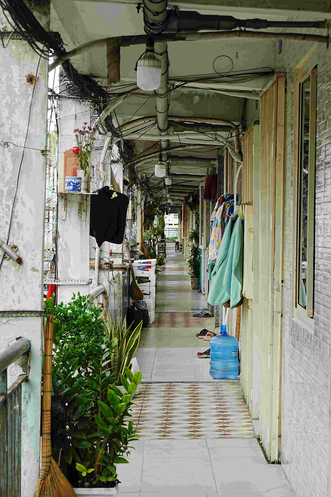

Vừa rồi mình có tham gia ["Buổi chiếu và thảo luận tác phẩm cuối khoá làm phim về cộng đồng chung cư"](https://www.facebook.com/share/p/1HbGeUgxPk/). Nó là bước đầu để kết nối những người yêu thích chung cư cũ ở Saigon thông qua cách kể chuyện bằng phim tài liệu. Bạn có thể không có kinh nghiệm quay dựng, họ có chuyên gia hỗ trợ thực hiện ý tưởng.

Mình đi với tâm thế coi cách kể chuyện hoặc được tiếp cận bài bản nó thế nào. Ai ngờ cái đọng lại sau buổi đó là cách họ nhìn một khu chung cư, thông qua thành qua của các nhóm, câu hỏi của người tham gia.

## Những câu chuyện

Điều mình nhớ nhất là cách một nhóm chọn kể câu chuyện của cả khu chung cư thông qua góc nhìn của một đứa trẻ cỡ đâu đó 10 tuổi.

Ye! Một đứa trẻ.

Nó không kể về lịch sử, nó không kể về biến cố, chỉ kể về nơi mình lớn lên, về những người hàng xóm quen thuộc, về việc cùng mọi người giữ gìn khu chung cư và cả mong muốn nơi mình sống sẽ được sửa sang trong tương lai. Và đây chính là sự **"sống"** mà lần đầu cảm nhận được khi coi phim tài liệu.

Không phải vì tòa nhà vẫn tồn tại ở đó. Mà vì bên trong nó vẫn còn có người lớn lên, vẫn còn có ký ức mới được tạo ra mỗi ngày.

## Về kỹ thuật làm phim

### Cách xây dựng bối cảnh

Thông qua sản phẩm của các nhóm, mình mới nhận ra một điểm yếu trong cách quay của bản thân: mình rất ít khi dành thời gian để giới thiệu không gian trước khi kể câu chuyện.

Mình hay mải mê tìm những chi tiết đặc trưng hoặc những góc nhìn lạ. Đến khi ghép lại, mình thì nhớ rất rõ nơi đó, còn người xem lại khó hình dung được mình đang ở đâu và câu chuyện đang diễn ra trong bối cảnh như thế nào.

Lúc đó mình mới nhận ra, những cảnh toàn không chỉ có nhiệm vụ "định vị" địa điểm. Chúng còn giúp người xem hiểu vì sao câu chuyện ấy lại diễn ra ở đó.

Một khu chung cư nằm giữa trung tâm quận 1 sẽ mang một nhịp sống rất khác với một khu nằm sâu trong hẻm hay sát bờ kênh. Cùng là một dãy hành lang hay một khoảng sân, nhưng khi đặt trong những bối cảnh khác nhau, cảm nhận của người xem cũng sẽ khác.

Có lẽ vì vậy mà trước khi kể câu chuyện của một con người, mình cần kể câu chuyện của nơi chốn trước.

Nhân tiện, chia sẻ với mọi người một trong những ví dụ về cách giới thiệu bối cảnh mà mình rất thích. Chỉ vài cảnh đầu thôi nhưng đã khiến mình có cảm giác: "Ừ, Wowy đúng là thuộc về khu này."

<iframe width="560" height="315" src="https://www.youtube.com/embed/mT8NjOL_mCo?si=BP17WjjfiKN4YGUS" title="WOWY - Show BÍ MẬT (Official MV) - Khu Tao Sống và Sài Gòn Đẹp Lắm" frameborder="0" allow="accelerometer; autoplay; clipboard-write; encrypted-media; gyroscope; picture-in-picture; web-share" referrerpolicy="strict-origin-when-cross-origin" allowfullscreen></iframe>

### Nhịp cắt

Một bài học khác mình để ý là nhịp dựng cũng ảnh hưởng rất nhiều đến cách người xem cảm nhận câu chuyện.

Có một nhóm muốn giới thiệu lễ hội diễn ra xung quanh khu chung cư nên đưa khá nhiều cảnh quay về hoạt động này. Tuy nhiên, vì thời lượng dành cho nó hơi nhiều nên mình bắt đầu bị tách khỏi mạch chính của bộ phim và quên mất câu chuyện ban đầu đang muốn kể.

Ngoài ra, nhóm sử dụng hiệu ứng step-printing (kiểu chuyển động thường thấy trong phim của Vương Gia Vệ) ở cảnh diễu hành. Hiệu ứng này tự nó không có vấn đề, nhưng với mình thì nó chưa thật sự hòa hợp với nhịp điệu chung của bộ phim.

Có lẽ điều mình rút ra là mỗi kỹ thuật đều nên phục vụ cho câu chuyện. Bản thân kỹ thuật không có đúng hay sai, nhưng nếu nó khiến người xem chú ý đến cách làm hơn là điều bộ phim muốn kể, thì nó đã bắt đầu phản tác dụng.

Nếu mọi người muốn tìm hiểu thêm về nhịp cắt và cách tạo nhịp điệu cho một bộ phim, có thể tham khảo thêm video này.

<iframe width="560" height="315" src="https://www.youtube.com/embed/halavxLJ6V4?si=8Cc5KL6-35Z9R74Y" title="
Biên tập video cơ bản với Nhịp - Linh hồn của Video (phần 2)" frameborder="0" allow="accelerometer; autoplay; clipboard-write; encrypted-media; gyroscope; picture-in-picture; web-share" referrerpolicy="strict-origin-when-cross-origin" allowfullscreen></iframe>

### Sự liên kết

Có một nhóm quay ở khu chung cư gần nhà mình. Hồi nhỏ mình cũng hay qua đây chơi nên khá quen thuộc. Thế nhưng khi xem phim, mình lại có cảm giác rất xa lạ. Ban đầu mình còn tưởng là một khu chung cư khác, mãi đến khi nhìn thấy vài cửa tiệm quen mới nhận ra.

Sau phần thảo luận, mình có chia sẻ rằng khu chung cư này có nhiều block, và mỗi block lại có một nhịp sống, một câu chuyện riêng. Bộ phim chỉ ghi lại một block, nên với mình, nó giống như một lát cắt của cả khu chung cư hơn là bức tranh tổng thể.

Điều đó cũng khiến mình tự hỏi: bộ phim đang muốn kể câu chuyện của riêng block đó, hay muốn nói về đời sống của cả khu chung cư? Hai cách tiếp cận đều không sai, nhưng nếu không làm rõ ngay từ đầu thì người xem sẽ hơi khó kết nối những lời kể với không gian mà bộ phim đang hướng tới.

Có lẽ vì mình từng quen nơi này nên cảm giác đó càng rõ hơn. Mình biết ngoài khung hình vẫn còn những block khác, những câu chuyện khác và một nhịp sống khác mà bộ phim chưa chạm tới.

Nghĩ lại thì cũng hơi kỳ, vì mình đâu có sống trong đó, mình chỉ là đứa hàng xóm hay qua chơi. Nhưng nó cũng là một mảnh tuổi thơ của mình mà. Có lẽ gắn bó với một nơi không nhất thiết phải là sở hữu nó — đôi khi chỉ cần nó kịp trở thành một phần của mình.

*Một góc khác của cùng khu chung cư. Bộ phim không quay block này.*

Nhưng điều thú vị là những bài học về cách làm phim lại khiến mình bắt đầu nghĩ nhiều hơn về chính chủ đề của workshop. Mình không mang về câu trả lời. Mình mang về nhiều câu hỏi hơn.

## Những câu hỏi mình còn băn khoăn

### Chung cư cũ - Chung cư mới

Đây có lẽ là điều đầu tiên mình muốn "tranh luận" với workshop.

Một trong những slide mình thích nhất là phần đối chiếu giữa **"Tư duy cũ"** và **"Khung tư duy mới"** khi nói về chung cư cũ.

| Tư duy cũ | Khung tư duy mới |
| --- | --- |
| Chung cư là gánh nặng, đô thị rệu rã | Chung cư là di sản sống, tài sản văn hóa |
| Chính quyền & doanh nghiệp "giải cứu" | Chính quyền kiến tạo, doanh nghiệp đồng hành |
| Cư dân bị động, phải di dời | Cộng đồng làm chủ, phát triển nội lực tại chỗ |

Mình khá đồng ý với tinh thần của bảng này. Thay vì chỉ nhìn những khu chung cư cũ như những công trình xuống cấp chờ giải tỏa, workshop gợi ý một cách nhìn khác: hãy xem chúng như những cộng đồng vẫn đang sống và có giá trị văn hóa riêng. Nhưng cũng chính từ đó, mình lại nảy ra một câu hỏi khác.

> **Nếu điều đáng giữ là những mối quan hệ giữa con người với nhau, thì liệu bài học lớn nhất có nằm ở chính những tòa nhà cũ? Hay nằm ở cách chúng được thiết kế để những mối quan hệ ấy có cơ hội hình thành?**

Điều đầu tiên mình để ý lại nằm ở... mặt bằng.

Ở nhiều khu chung cư cũ, mỗi block thường chỉ có một dãy căn hộ, tất cả cửa đều mở ra cùng một hành lang ngoài trời (*single-loaded corridor*).

Chỉ cần bước ra khỏi cửa là có thể thấy hàng xóm. Trẻ con chạy dọc hành lang. Người lớn ngồi trước cửa nói chuyện. Nhà nào đang nấu cơm, nhà nào vừa tưới cây... gần như đều trở thành một phần của nhịp sống chung. Hành lang không chỉ còn là lối đi, mà giống như phần mở rộng của mỗi căn hộ.

Trong khi đó, phần lớn chung cư mới sử dụng kiểu hành lang giữa (*double-loaded corridor*).

Không gian chung vẫn tồn tại, nhưng cách con người sử dụng nó đã khác. Cửa thường đóng kín để giữ sự riêng tư, cư dân đi thẳng từ thang máy về nhà, những cuộc gặp gỡ tình cờ dường như cũng ít đi hơn.

Tất nhiên, mình không nghĩ chỉ riêng thiết kế hành lang có thể tạo ra một cộng đồng. Chất lượng của một nơi còn phụ thuộc vào rất nhiều yếu tố khác như cách quản lý, mật độ cư dân hay văn hóa sống. Nhưng mình cũng tự hỏi liệu kiến trúc có đang góp phần tạo ra nhiều hay ít cơ hội để những mối quan hệ ấy hình thành.

Có lẽ vì vậy mà mình thấy bài học lớn nhất từ những khu chung cư cũ không nằm ở việc giữ nguyên những tòa nhà. Điều đáng học hơn là vì sao những không gian đó từng nuôi dưỡng được một cộng đồng.

Nhưng càng nghĩ, mình lại càng thấy thiết kế chỉ mới giải thích được một nửa câu chuyện. Một không gian có thể tạo cơ hội để con người gặp nhau, nhưng điều gì khiến họ tiếp tục gắn bó với nhau suốt hàng chục năm?

### Điều gì giữ một cộng đồng ở lại?

Mình nghĩ câu trả lời có lẽ không còn nằm ở kiến trúc nữa.

Phần lớn những khu chung cư cũ ở TP.HCM được xây dựng trong một bối cảnh rất khác hiện nay. Có nơi được xây trước năm 1975, có nơi sau này được các cơ quan hoặc xí nghiệp xây làm nhà ở cho cán bộ, công nhân viên. Qua nhiều lần chuyển nhượng, chúng dần trở thành nơi sinh sống của nhiều thế hệ cư dân khác nhau.

Điểm chung là hầu như không còn một chủ thể nào đứng phía sau để chịu trách nhiệm cho toàn bộ vòng đời của công trình. Khi chung cư xuống cấp, người dân gần như phải tự xoay xở: từ chuyện bảo trì, sửa chữa cho đến gìn giữ những không gian chung.

Đọc đến đây mình chợt nghĩ, liệu một phần sức mạnh của những cộng đồng ấy có đến từ chính hoàn cảnh này hay không?

Khi không còn ai lo thay mình, cư dân buộc phải dựa vào nhau nhiều hơn. Nếu thiết kế tạo ra cơ hội để gặp gỡ, thì hoàn cảnh lại tạo ra lý do để họ tiếp tục gắn bó. Hai điều này không thay thế nhau, mà dường như cùng tồn tại.

Nhưng mình cũng không nghĩ nên lãng mạn hóa điều đó. Cũng chính sự thiếu vắng một chủ thể chịu trách nhiệm lâu dài đã khiến nhiều khu chung cư phải đối mặt với những vấn đề rất thực tế: công trình xuống cấp, kinh phí bảo trì, tranh chấp sở hữu hay các yêu cầu về an toàn. Nghĩ lại thì cũng khá trớ trêu. Cùng một hoàn cảnh vừa khiến cộng đồng gắn kết hơn, vừa khiến việc duy trì nơi họ đang sống trở nên khó khăn hơn.

Đến đây thì mình thấy có một khoảng trống.

> **Cộng đồng làm chủ, phát triển nội lực tại chỗ.**

Nhưng **"làm chủ"** cụ thể là làm chủ điều gì? Làm chủ ký ức? Làm chủ quyền tham gia vào những quyết định? Hay làm chủ cả quá trình bảo tồn và cải tạo?

Và cũng từ câu hỏi đó, mình bắt đầu nhìn lại một vấn đề khác...

### Di sản sống

Đến đây thì mình lại quay về đúng tinh thần của workshop.

**Di sản sống.**

Trước đó, mình cứ nghĩ về chuyện thiết kế không gian, về cách một khu chung cư được vận hành hay về vai trò của cộng đồng. Nhưng càng nghĩ thì mình càng thấy tất cả những câu hỏi đó đều đang xoay quanh cùng một chữ: **di sản**.

Ngày trước, mỗi khi nghe đến hai chữ này, mình thường nghĩ đến một thứ gì đó cần được giữ lại. Một công trình cũ, một khu phố cổ hay một ngôi nhà đã tồn tại hàng chục năm. Nhưng nếu gọi đó là **di sản sống**, thì có lẽ thứ cần được giữ không còn chỉ là bản thân công trình nữa.

Một cộng đồng thì luôn thay đổi. Người cũ chuyển đi, người mới chuyển đến. Những đứa trẻ rồi sẽ lớn lên và rời khỏi nơi mình từng sống. Những cửa hàng dưới tầng trệt cũng sẽ đổi chủ theo thời gian. Nếu mọi thứ đều thay đổi như vậy, thì rốt cuộc điều gì mới là thứ cần được giữ lại?

Đó cũng là lúc mình nhận ra, từ đầu chương này mình đã vô tình nghĩ đến hai loại giá trị rất khác nhau.

Có những thứ chỉ tồn tại đúng ở nơi chúng được tạo ra. Ký ức của một đứa trẻ, mối quan hệ giữa những người hàng xóm hay cảm giác thân thuộc khi bước qua một hành lang cũ đều không thể mang sang một nơi khác. Có lẽ chính vì không thể sao chép nên chúng mới trở nên đáng quý.

Nhưng cũng có những thứ hoàn toàn có thể được mang đi. Cách một hành lang tạo ra cơ hội để hàng xóm gặp nhau, cách những khoảng không gian chung được tổ chức hay những bài học về việc một cộng đồng được hình thành đều có thể trở thành kinh nghiệm cho những khu chung cư sẽ được xây trong tương lai.

Có lẽ vì vậy mà mình không nghĩ "di sản sống" chỉ có một nghĩa.

Nếu một ngày khu chung cư cũ buộc phải tháo dỡ nhưng những bài học về cách nó từng nuôi dưỡng một cộng đồng vẫn còn được áp dụng ở những nơi khác, mình nghĩ chúng ta đã giữ lại được một điều gì đó rất quan trọng.

Nhưng đồng thời, mình cũng biết sẽ có một điều khác biến mất mãi mãi.

Không phải mặt bằng.

Không phải hành lang.

Mà là những câu chuyện chỉ thuộc về đúng nơi ấy.

Và điều đó lại dẫn mình đến một câu hỏi khác.

Nếu di sản không chỉ là một tòa nhà, mà còn là những câu chuyện gắn với nó, thì điều gì sẽ xảy ra khi những người từng sống ở đó không còn nữa?

### Ai sẽ kể lại câu chuyện này?

Trong phần thảo luận sau buổi chiếu, có một khán giả đặt câu hỏi mà mình rất thích.

> Tại sao bộ phim lại chủ yếu phỏng vấn người lớn tuổi và trẻ con?

Nhóm làm phim trả lời khá thẳng thắn. Người trẻ phần lớn đi làm nên rất khó gặp trong quá trình ghi hình, còn người lớn tuổi và trẻ con là những người có nhiều thời gian hơn, đồng thời cũng là hai nhóm đã có đủ trải nghiệm để chia sẻ về cuộc sống trong khu chung cư. Mình nghĩ đó là một câu trả lời hoàn toàn hợp lý.

Nhưng trên đường về, mình lại thấy câu hỏi thú vị hơn không nằm ở việc **vì sao người trẻ vắng mặt**, mà là **điều gì sẽ xảy ra khi một ngày nào đó không còn những người từng sống ở đây để kể nữa**.

Một khu chung cư có thể được cải tạo. Cũng có thể bị tháo dỡ. Những cư dân cũ rồi sẽ lần lượt chuyển đi, thay vào đó là một thế hệ khác với những trải nghiệm hoàn toàn khác. Hai mươi hay ba mươi năm sau, nếu có một bộ phim tài liệu khác được thực hiện về chính nơi này, ai sẽ là người kể câu chuyện của nó?

Có thể họ sẽ là những người từng thuê một căn hộ vài năm. Có thể là khách Airbnb chỉ ghé qua vài ngày. Cũng có thể là những cư dân chuyển đến sau khi khu chung cư đã được xây mới. Những câu chuyện họ kể chắc chắn vẫn là thật, vì đó là những gì họ đã trải qua.

Nhưng rất có thể sẽ không còn ai kể rằng nơi này từng là một khu lao động, từng gắn với những vấn đề về tệ nạn hay từng phản chiếu một giai đoạn rất khác trong quá trình phát triển của thành phố.

Không phải vì những câu chuyện ấy không còn quan trọng.

Mà vì không còn những người đã sống trong giai đoạn đó để kể lại.

Điều đó không có nghĩa là thế hệ sau đang kể sai. Họ chỉ đang kể một câu chuyện khác. Mỗi thế hệ đều nhìn cùng một nơi từ chính khoảng thời gian mà họ đã sống trong đó. Khi người kể thay đổi, câu chuyện cũng thay đổi theo. Có những ký ức mới sẽ được tạo ra, nhưng cũng sẽ có những ký ức cũ lặng lẽ biến mất, đơn giản vì không còn ai đủ trải nghiệm để kể lại.

Có lẽ đó cũng là điều mình thấy đáng quý ở những bộ phim tài liệu như thế này. Chúng không chỉ ghi lại hình ảnh của một khu chung cư, mà còn lưu lại lời kể của những người đã sống trong chính thời điểm đó.

Đến một lúc nào đó, khi những người ấy không còn nữa, có thể chính những lời kể ấy sẽ trở thành cách duy nhất để những thế hệ sau biết nơi này đã từng như thế nào.

### Nếu mình cầm máy quay lên

Nghĩ tới đây, mình lại quay về nghĩ đến chính mình.

Suốt từ đầu chương này, mình cứ hỏi ai sẽ còn ở đó để kể câu chuyện của một nơi, ai sẽ không còn. Nhưng rồi mình nhận ra, nếu một ngày mình cầm máy quay lên, thì mình cũng đang tham gia vào quá trình lựa chọn đó rồi. Không cần đợi đến hai mươi năm sau. Nó bắt đầu ngay từ lúc mình quyết định sẽ tìm đến ai.

Mình sẽ gõ cửa căn hộ nào trước? Mình sẽ hỏi người lớn tuổi, trẻ con hay người đang chuẩn bị dọn đi? Nếu gặp một người vừa chuyển đến và một người đã sống ở đó ba mươi năm, mình sẽ dành nhiều thời gian hơn cho ai? Chỉ riêng những lựa chọn đó thôi cũng đủ khiến bộ phim mình làm trở thành một câu chuyện khác.

Rồi mình lại nghĩ đến chính những câu hỏi mình sẽ đặt. Nếu mình hỏi một người lớn tuổi: *"Bác nhớ nhất điều gì ở nơi này?"* có lẽ mình sẽ nghe một câu chuyện về ký ức. Nhưng nếu mình hỏi: *"Bác có muốn khu chung cư này được giữ lại không?"* thì rất có thể mình sẽ nhận được một câu chuyện hoàn toàn khác. Người được phỏng vấn vẫn là một người, nhưng chỉ cần đổi cách hỏi thì câu chuyện cũng bắt đầu rẽ sang một hướng khác. Có khi ký ức không phải là một thứ nằm sẵn ở đó để mình đến ghi lại. Biết đâu chính cách mình hỏi đã khiến người đối diện nhớ về điều này thay vì điều khác. Có khi mình không chỉ đang ghi lại một câu chuyện, mà còn đang góp phần tạo ra phiên bản của câu chuyện sẽ được kể.

Có khi mình hỏi rất chân thành. Người được phỏng vấn cũng trả lời rất chân thành. Nhưng biết đâu cả hai đứa vẫn chỉ đang chạm vào một mảnh rất nhỏ của câu chuyện. Rồi mình lại nghĩ xa hơn một chút. Biết đâu vấn đề không nằm ở chỗ mình hỏi chưa đủ nhiều người. Biết đâu sẽ không bao giờ có một câu chuyện đủ để đại diện cho cả một nơi. Mỗi người chỉ đang giữ một mảnh rất nhỏ của nó.

Đến lúc đó, mình lại thấy những nhóm khác dũng cảm hơn mình rất nhiều. Trong khi các nhóm tản ra đi tìm người để phỏng vấn, mình lại không bước theo. Không phải vì mình nghĩ cách làm đó không hay. Ngược lại, mình rất ngưỡng mộ cách họ sẵn sàng gõ cửa một căn nhà, ngồi xuống lắng nghe một người xa lạ rồi cố gắng kể lại câu chuyện của họ một cách tử tế.

Chỉ là lúc đó mình nhận ra mình vẫn chưa tìm được cách kể mà bản thân đủ tin.

Có lẽ mình vẫn muốn bắt đầu bằng việc đứng ở phía sau máy quay nhiều hơn là cầm micro. Mình muốn nhìn một nơi trước khi hỏi về nó. Muốn để những con người, không gian và nhịp sống của họ tự tồn tại trong khung hình trước khi mình tìm cách giải thích chúng. Điều đó không có nghĩa là bộ phim sẽ khách quan hơn. Cuối cùng thì mình vẫn là người quyết định quay gì, bỏ gì, dựng gì và đặt những cảnh quay cạnh nhau như thế nào. Chỉ là mình muốn sự hiện diện của mình trong câu chuyện bắt đầu muộn hơn một chút.

Có lẽ rồi mình sẽ tìm được cách của riêng mình. Có thể là cách lựa chọn câu chuyện. Có thể là cách dựng. Có thể chỉ bằng vài dòng chữ xuất hiện đúng lúc. Mình chưa biết. Nhưng sau workshop này, mình biết mình muốn tiếp tục đi theo hướng đó.

## Kết

Điều mình mang về sau workshop này không phải là một bộ phim. Mà là một cách quan sát.

Trước đây, mỗi lần nhìn một khu chung cư cũ, điều khiến mình tò mò thường là câu chuyện của chính công trình ấy. Nó được xây từ bao giờ, đã trải qua những gì, và sẽ ra sao nếu một ngày không còn tồn tại.

Sau workshop, mình nhận ra mình đã nhìn thiếu một nửa bức tranh.

Một công trình không chỉ sống bằng bê tông hay những bản vẽ kiến trúc. Điều khiến nó tiếp tục sống theo thời gian là những con người vẫn đang ở đó. Chính họ tạo nên những mối quan hệ, những ký ức, rồi từng ngày viết tiếp câu chuyện của nơi ấy.

Từ giờ, mỗi khi đứng trước một không gian nào đó, mình nghĩ mình sẽ không còn chỉ nhìn vào công trình nữa. Mình sẽ nhìn xem đang có những ai sống ở đó.

## Tham khảo

- Tạp chí Kiến trúc, [Diện mạo mới của những chung cư cũ](https://www.tapchikientruc.com.vn/chuyen-muc/dien-mao-moi-cua-nhung-chung-cu-cu.html)
- Happy Cities, [Learning from community housing movements: Transforming corridors into social spaces](https://www.heyneighbourcollective.ca/2022/08/learning-from-community-housing-movements-transforming-corridors-into-social-spaces/)