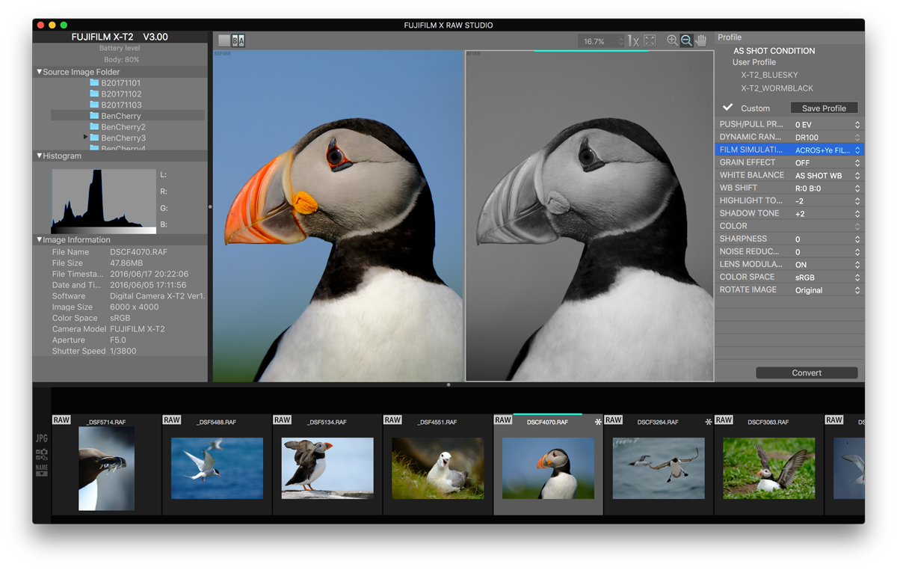
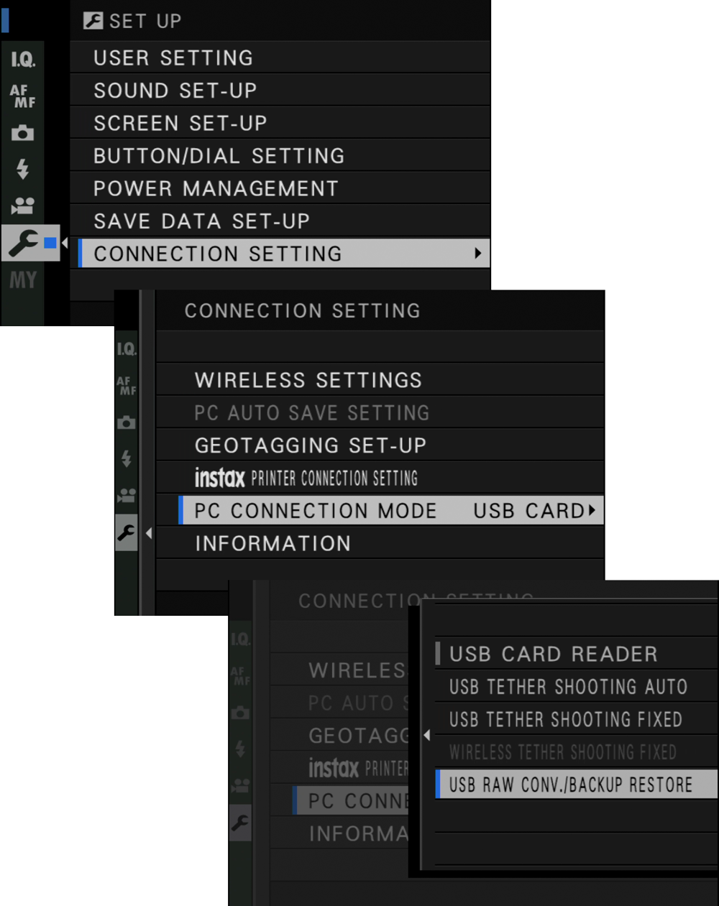
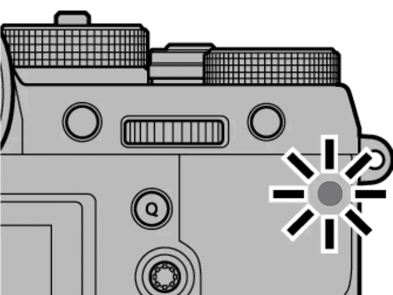
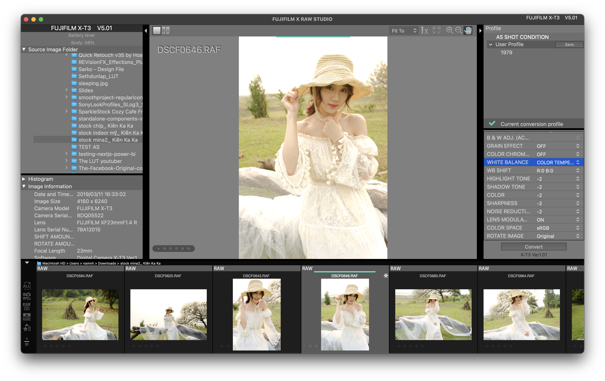
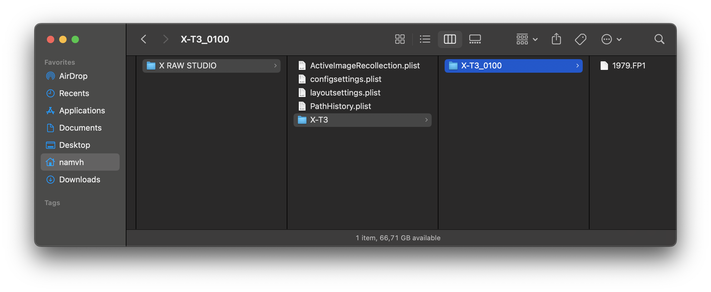

## Fujifilm X Raw Studio

[Fujifilm X Raw Studio](https://fujifilm-x.com/en-us/support/download/software/x-raw-studio/) là một phần mềm được chính Fujifilm phát triển để người dùng chỉnh ảnh được chụp bằng máy Fujifilm.

Về giao diện, nó giống như đem menu Hình Ảnh trong máy Fujifilm lên máy tính để dễ dàng chỉnh sửa.



## Chuẩn bị

Thứ nhất, phần mềm chỉ chơi với file RAW với định dạng `.RAF`. Nếu không có thì có thể vô đây tải về bộ ảnh tương ứng với model bạn đang xài.

- [Kiên Ka Ka - Stock](https://kienkaka.pro/category/stock_2)

Thứ hai, bạn bắt buộc phải có một máy ảnh Fujifilm, cùng model với file ảnh bạn muốn xử lý rồi kết nối với máy tính. Ví dụ hình được chụp bởi dòng X-T5 thì bạn phải cắm body X-T5 với máy tính mới được. Vì phần mềm sẽ đọc thông tin từ [Exif](https://exifinfo.org/) của file ảnh và nó sẽ tận dụng bộ xử lý của body thay vì CPU của máy tính.

> Quickly convert RAW files. Converting RAW files with FUJIFILM X RAW STUDIO takes around the same time as taking a photo on the camera, regardless of the performance of your computer, because the FUJIFILM X RAW STUDIO system utilizes the image processor in the camera instead of the CPU in the computer.

## Cách sử dụng

### 1. Cài đặt máy ảnh ở chế độ USB RAW CONVERSION

Hầu hết các đời máy Fujifilm không có thay đổi gì nhiều, làm như hình là được.



### 2. Cắm cáp để kết nối

Nhớ là phải tắt máy trước khi cắm máy ảnh vô máy tính. Sau khi cắm dây xong thì mới mở máy lên.

Sau khi cắm xong, màn hình sẽ tắt và sẽ có đèn màu xanh chớp chớp ở chỗ tựa ngón cái.



### Chọn hình và chỉnh sửa

Sau khi kết nối thành công, mình chọn hình muốn chỉnh sẽ có được giao diện như sau.


Sau đó mình sẽ thử chỉnh theo giả lập phim ["1979"](https://craigbergonzoniblog.com/2020/09/06/1979-a-vintage-look-film-simulation-for-x-t1-and-more/) của Craig Bergonzoni.

```
BASE FILM SIMULATION: Astia
DYNAMIC RANGE: DR400
WHITE BALANCE: 6300K
COLOR: -2
SHARPNESS: -2
HIGHLIGHT TONE: -2
SHADOW TONE: -2
NOISE REDUCTION: -2
```

Sau đó bấm nút `Save` ở dưới phần **User Profile**, rồi nhập `"1979"`. Lúc này ta đã áp công thức và lưu lại thành công. Sau này tái sử dụng dễ dàng, đỡ phải thử trên máy ảnh.



### Lưu file

Công thức được lưu dưới dạng file `*.FP1` được lưu ở đường dẫn sau, tùy vào hệ điều hành.

#### Windows

```
%USERPROFILE%\AppData\Local\com.fujifilm.denji\X_RAW_STUDIO\<DEVICE>\<DEVICE_VERSION>
```

#### MacOS

```
~/Library/Application Support/com.fujifilm.denji/X_RAW_STUDIO/<DEVICE>/<DEVICE_VERSION>
```

Ví dụ mình xài model `X-T3`, trên máy Mac sẽ là

```
~/Library/Application Support/com.fujifilm.denji/X_RAW_STUDIO/X-T3/X-T3_0100
```



## Cấu trúc file FP1

Thực chất, đây là một file XML chứa các thuộc tính để Fujifilm X Raw Studio đọc hiểu một số thuộc tính của một User Profile.

Lưu ý, phần mềm sẽ so sánh metadata trong Exif và model được khai báo trong file FP1 để cho phép bạn xử lý hay không. Như phần trên mình có nói, phần mềm sẽ dùng chip xử lý của máy ảnh. Do đó model đang xài không khớp với model của tấm hình sẽ không hiểu.

```xml
<?xml version="1.0" encoding="utf-8"?>
<ConversionProfile application="XRFC" version="1.12.0.0">
    <PropertyGroup device="X-T3" version="XT3_0100" label="1979">
        <SerialNumber>KEO-502</SerialNumber>
        <TetherRAWConditonCode>XT3_0100</TetherRAWConditonCode>
        <Editable>TRUE</Editable>
        <SourceFileName/>
        <Fileerror>NONE</Fileerror>
        <RotationAngle>0</RotationAngle>
        <StructVer>65536</StructVer>
        <IOPCode>FF159501</IOPCode>
        <ShootingCondition>OFF</ShootingCondition>
        <FileType>JPG</FileType>
        <ImageSize>L3x2</ImageSize>
        <ImageQuality>Fine</ImageQuality>
        <ExposureBias>0</ExposureBias>
        <DynamicRange>AUTO</DynamicRange>
        <WideDRange>0</WideDRange>
        <FilmSimulation>Astia</FilmSimulation>
        <BlackImageTone>0</BlackImageTone>
        <MonochromaticColor_RG>0</MonochromaticColor_RG>
        <GrainEffect>OFF</GrainEffect>
        <GrainEffectSize>SMALL</GrainEffectSize>
        <ChromeEffect>OFF</ChromeEffect>
        <ColorChromeBlue/>
        <SmoothSkinEffect/>
        <WBShootCond>OFF</WBShootCond>
        <WhiteBalance>Temperature</WhiteBalance>
        <WBShiftR>0</WBShiftR>
        <WBShiftB>0</WBShiftB>
        <WBColorTemp>63000K</WBColorTemp>
        <HighlightTone>-2</HighlightTone>
        <ShadowTone>-2</ShadowTone>
        <Color>-2</Color>
        <Sharpness>-2</Sharpness>
        <NoisReduction>-2</NoisReduction>
        <Clarity>0</Clarity>
        <LensModulationOpt>ON</LensModulationOpt>
        <ColorSpace>sRGB</ColorSpace>
        <HDR/>
        <DigitalTeleConv/>
    </PropertyGroup>
</ConversionProfile>
```

Một số thẻ đóng, có nghĩa là thuộc tính đó máy bạn đang sử dụng sẽ không hỗ trợ. Ví dụ như `<ColorChromeBlue />` từ những máy ra chung đợt `X-T4` mới có, `<SmoothSkinEffect />` thì những máy ra chung đợt với `X-T5` mới có.

Mình có thể tái sử dụng lại file `FP1` này bằng cách chép sang máy khác, đổi `device`, `version`, `SerialNumber`, `StructVer` và `IOpcode` là được. Để biết giá trị của máy ảnh của bạn là gì, cứ save đại một công thức nào đó rồi mở file `*.FP1` này chép vô. Sau đó, chép ngược lại vào folder lưu file `FP1` của phần mềm.

## Tổng kết

Sử dụng Fujifilm X Raw Studio cũng có cái tiện là sử dụng các công thức custom, lưu chúng lại dưới dạng file FP1 để dễ dàng chia sẻ, và thử nghiệm các màu mới trên máy tính, đỡ phải chậm chạp như trên máy ảnh. Mình chỉ cần chụp RAW rồi về chọn công thức sau.

Nếu các bạn thấy cái này giới hạn, có thể sử dụng Capture One bản mới nhất để áp các giả lập phim mặc định rồi custom theo ý mình. Đồng thời cách này cũng giúp các máy cũ sử dụng các giả lập mới nhất cho hình ảnh của mình. Ví dụ áp màu `Nostalgic Negative` của X-T5 cho hình chụp từ X-T3.

## Tham khảo

- Fujifilm X, [FUJIFILM X RAW STUDIO - Features & Users Guide](https://fujifilm-x.com/en-us/stories/fujifilm-x-raw-studio-features-users-guide)
