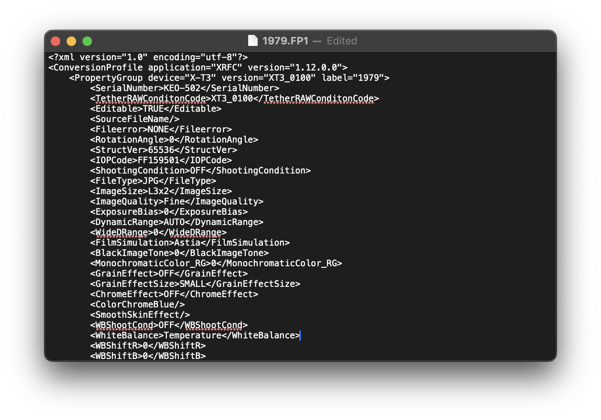
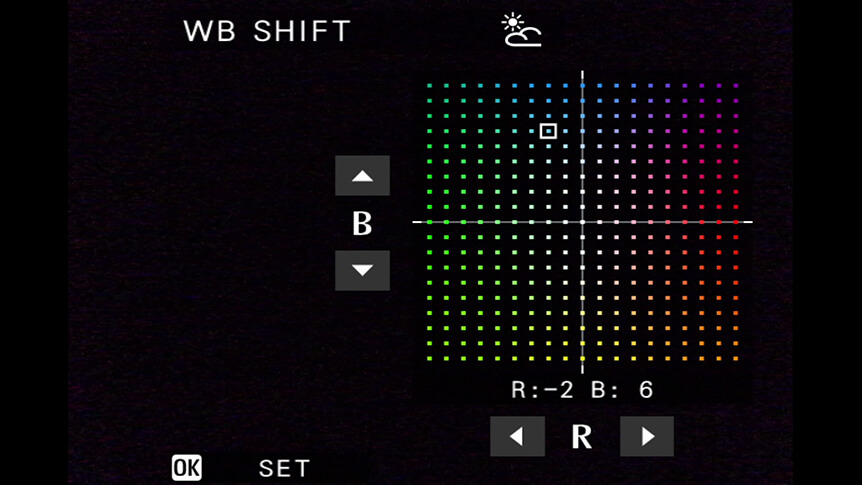

## Tổng quan

Như bài viết trước, mình đã chia sẻ rằng User Profile của Fujifilm X Raw Studio sẽ được lưu dưới định dạng FP1. Đây là lưu trữ các thiết lập về giả lập phim gốc, highlight, shadow, sharpness,... để cho con chip bên trong body của máy ảnh hiểu mà xử lý.

Có thể đọc lại bài viết tại [Fujifilm X Raw Studio và các giả lập màu phim](/hobbies/fujifilm-x-raw-studio-va-cac-gia-lap-mau-phim)



## Các thuộc tính không thể tái sử dụng

Các thuộc tính dưới đây, nó sẽ phụ thuộc vào model của máy ảnh của bạn, trừ `label` trong thẻ `<PropertyGroup>` vì nó là tên của profile.

```xml
<?xml version="1.0" encoding="utf-8"?>
<ConversionProfile application="XRFC" version="1.12.0.0">
    <PropertyGroup device="X-T3" version="XT3_0100" label="1979">
        <SerialNumber>KEO-502</SerialNumber>
        <TetherRAWConditonCode>XT3_0100</TetherRAWConditonCode>
        <Editable>TRUE</Editable>
        <SourceFileName/>
        <Fileerror>NONE</Fileerror>
        <RotationAngle>0</RotationAngle>
        <StructVer>65536</StructVer>
        <IOPCode>FF159501</IOPCode>
        ...
    </PropertyGroup>
</ConversionProfile>
```

Một điều nữa, tên file bắt buộc phải trùng với `label`. Do đó nếu có generate hàng loạt thì nhớ để ý. Tốt nhất là đặt tên theo `kebabCase` cho lành. Ví dụ:

- `Elite Chrome 200 Color Fade` thành `elite-chrome-200-color-fade.FP1`
- `Reminiscent Print` thành `reminiscent-print.FP1`

Để có những giá trị trên thì bạn cứ save đại một file FP1 và nó sẽ xuất ra với giá trị của máy ảnh bạn đang cắm vào. Sau đó replace đoạn đó vào file custom là được.

## Các thuộc tính ảnh hưởng tới User Profile

Trước hết, chúng ta cần làm rõ chỗ khái niệm `"công thức"`. **"Công thức (recipe)"** mọi người hay nhắc ở đây sẽ là User Profile của Fujifilm X Raw Studio. Còn `"giả lập phim"` sẽ nói tới `<FilmSimulation>`.

Dưới đây là các thuộc tính để xác định công thức cho từng User Profile.

```xml
<?xml version="1.0" encoding="utf-8"?>
<ConversionProfile application="XRFC" version="1.12.0.0">
    <PropertyGroup device="X-T3" version="XT3_0100" label="1979">
        ...
        <FilmSimulation>Astia</FilmSimulation>
        <BlackImageTone>0</BlackImageTone>
        <MonochromaticColor_RG>0</MonochromaticColor_RG>
        <GrainEffect>OFF</GrainEffect>
        <GrainEffectSize>SMALL</GrainEffectSize>
        <ChromeEffect>OFF</ChromeEffect>
        <ColorChromeBlue/>
        <SmoothSkinEffect/>
        ...
        <WhiteBalance>Temperature</WhiteBalance>
        <WBShiftR>0</WBShiftR>
        <WBShiftB>0</WBShiftB>
        <WBColorTemp>63000K</WBColorTemp>
        <HighlightTone>-2</HighlightTone>
        <ShadowTone>-2</ShadowTone>
        <Color>-2</Color>
        <Sharpness>-2</Sharpness>
        <NoisReduction>-2</NoisReduction>
        <Clarity>0</Clarity>
        ...
    </PropertyGroup>
</ConversionProfile>
```

### Film Simulation

Đây là thuộc tính `<FilmSimulation>`.

Nó là các giả lập phim mặc định mà Fujifilm cung cấp sẵn (tính tới 01/2024) cho người dùng gồm: `PROVIA/Standard`, `Velvia/Vivid`, `ASTIA/Soft`, `Classic Chrome`, `REALA ACE`, `PRO Neg.Hi`, `PRO Neg.Std`, `Classic Neg.`, `Nostalgic Neg.`, `ETERNA/Cinema`, `ETERNA BLEACH BYPASS`, `ACROS`, `ACROS + Ye Filter`, `ACROS + R Filter`, `ACROS + G Filter`, `Black & White`, `Black & White + Ye Filter`, `Black & White + R Filter`, `Black & White + G Filter`, `Sepia`.

Tuy nhiên, các giá trị của nó sẽ khác khi lưu ở file FP1. Tham khảo bảng này.

| Tên                       | Mã            |
| ------------------------- | ------------- |
| PROVIA/Standard           | Provia        |
| Velvia/Vivid              | Velvia        |
| ASTIA/Soft                | Astia         |
| REALA ACE                 |               |
| PRO Neg.Hi                | NEGAhi        |
| PRO Neg.Std               | NEGAStd       |
| Classic Neg.              | ClassicNEGA   |
| Nostalgic Neg.            | NostalgicNEGA |
| ETERNA/Cinema             | Eterna        |
| ETERNA BLEACH BYPASS      | BleachBypass  |
| ACROS                     | Acros         |
| ACROS + Ye Filter         | AcrosYe       |
| ACROS + R Filter          | AcrosR        |
| ACROS + G Filter          | AcrosG        |
| Black & White             | BW            |
| Black & White + Ye Filter | BYe           |
| Black & White + R Filter  | BR            |
| Black & White + G Filter  | BG            |
| Sepia                     | Sepia         |

### White Balance

Đây là các thuộc tính `<WhiteBalance>`, `<WBShiftR>`, `<WBShiftB>` và `<WBColorTemp>`.

Dưới đây là bảng các giá trị của `<WhiteBalance>` khi được lưu trong file FP1.

| Tên                              | Mã          |
| -------------------------------- | ----------- |
| Auto                             | Auto        |
| Color Temperature (2500K~10000K) | Temperature |
| Daylight                         | Daylight    |
| Shade                            | Shade       |
| Fluorescent Light                | FLight      |
| Fluorescent Light-1              | FLight1     |
| Fluorescent Light-2              | FLight2     |
| Fluorescent Light-3              | FLight3     |
| Incandescent                     | Incand      |
| Underwater                       | Underwater  |

**Lưu ý:** Khi chọn `WhiteBalance=Temperature` thì lúc đó giá trị của `<WBColorTemp>` sẽ là giá trị độ K mà bạn chọn. Ví dụ ở profile [1979](https://craigbergonzoniblog.com/2020/09/06/1979-a-vintage-look-film-simulation-for-x-t1-and-more/) thì `WBColorTemp=6300K`.

Khi bạn muốn hình ảnh bị ám màu thông qua White Balance thì bạn sẽ cho WB dịch chuyển sang các kênh Red và Blue tương ứng. Chức năng này gọi là `White Balance Shift`. Tùy vào đời máy mà cách set trên body sẽ khác nhau, như X-T3 thì set trong khi chọn White Balance. Còn đời sau thì có hẳn một mục `WB Shift` riêng luôn. Lúc này, bạn mới cần gán giá trị cho `<WBShiftR>` và `<WBShiftB>`.



### Grain Effect

| Tên             | Giá trị           |
| --------------- | ----------------- |
| GrainEffect     | STRONG, WEAK, OFF |
| GrainEffectSize | LARGE, SMALL      |

Ở các đời từ X-T3 trở về trước thì chỉ cần set `Grain Effect`. Tuy nhiên, từ các đời ra chung với X-T4 như X-E4, X-S10 trở về sau thì Fujifilm cho phép chỉnh kích thước hạt grain cho giống chất ảnh của máy phim ngày xưa hơn nên có thêm thuộc tính `<GrainEffectSize>`.

Các đời máy không hỗ trợ `Grain Effect Size` thì giá trị mặc định là `SMALL`.

### Các thuộc tính liên quan tới chất lượng ảnh

| Tên           | Giá trị              |
| ------------- | -------------------- |
| HighlightTone | Range [-2~4, step 1] |
| ShadowTone    | Range [-2~4, step 1] |
| Color         | Range [-4~4, step 1] |
| Sharpness     | Range [-4~4, step 1] |
| NoisReduction | Range [-4~4, step 1] |
| Clarity       | Range [-5~5, step 1] |

Các đời máy không hỗ trợ `Clarity` thì mặc định là thẻ đóng `<Clarity />`.

### Các thuộc tính khác

| Tên                   | Giá trị                   |
| --------------------- | ------------------------- |
| BlackImageTone        | Range [-180~180, step 10] |
| MonochromaticColor_RG |                           |
| ColorChromeBlue       | STRONG, WEAK, OFF         |
| SmoothSkinEffect      | STRONG, WEAK, OFF         |

## Các thuộc tính liên quan tới điều kiện chụp của file ảnh

```xml
<?xml version="1.0" encoding="utf-8"?>
<ConversionProfile application="XRFC" version="1.12.0.0">
    <PropertyGroup device="X-T3" version="XT3_0100" label="1979">
        ...
        <ShootingCondition>OFF</ShootingCondition>
        <FileType>JPG</FileType>
        <ImageSize>L3x2</ImageSize>
        <ImageQuality>Fine</ImageQuality>
        ...
        <LensModulationOpt>ON</LensModulationOpt>
        <ColorSpace>sRGB</ColorSpace>
        <HDR/>
        <DigitalTeleConv/>
    </PropertyGroup>
</ConversionProfile>
```

Các giá trị này cũng không rõ lắm, cứ để mặc định vậy thôi.

## Tổng kết

Khi bạn hiểu được cấu trúc của file FP1 thì mình có thể tự tay tạo file để test các công thức nhanh chóng hơn.

Một lưu ý nữa, khi xài các đời máy từ X-T4 trở đi thì Fujifilm X Raw Studio cho phép import công thức trực tiếp vào máy ảnh.
