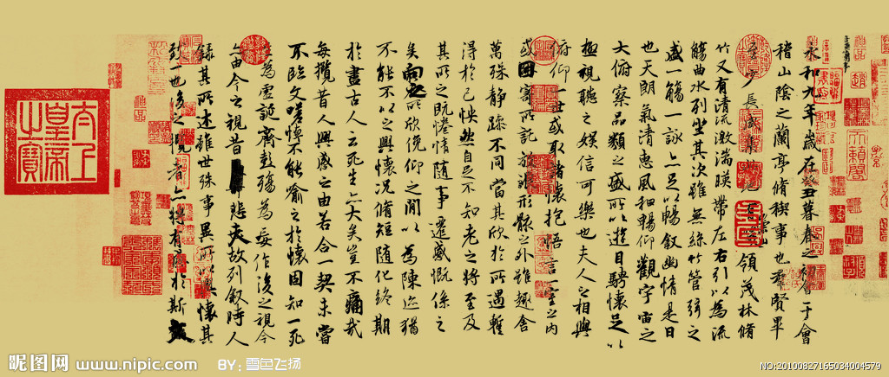
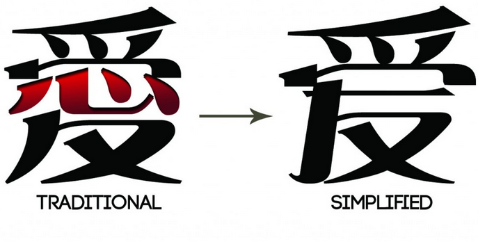
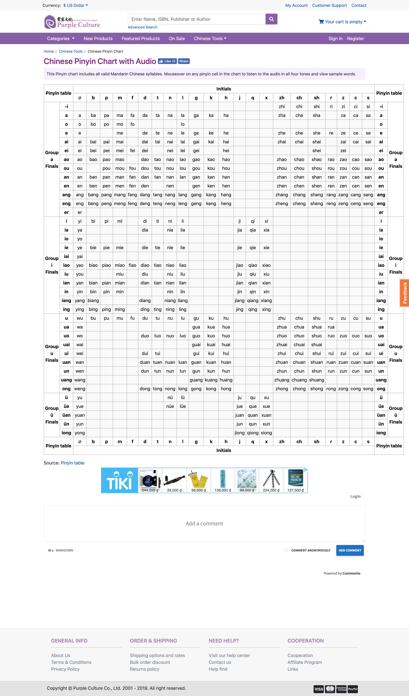
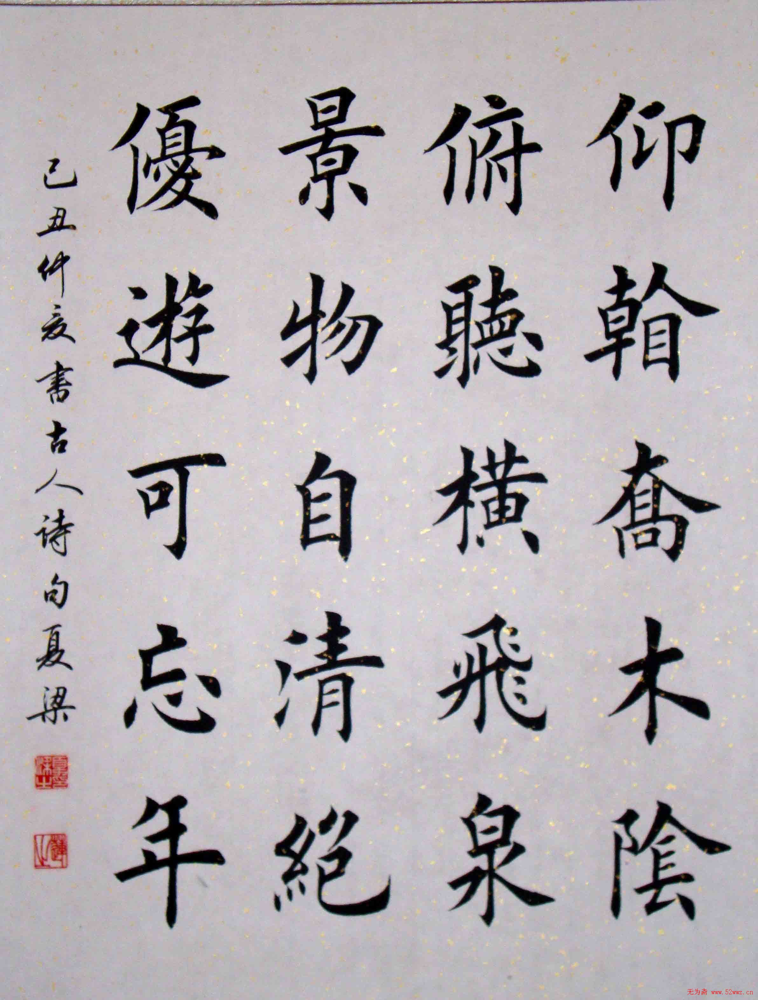

Khoảng tầm giữa tháng 7 lon ton đi đăng ký học tiếng Hoa với nhỏ bạn. Nhưng mà khoàng 2 tuần gần đây do dự án di quá nên cúp. Viết lại cách mình tự luyện viết tiếng Hoa như thế nào để sau này có cái coi lại phương pháp.

## Lý do đi học

Mình nghe nhạc Hoa thường xuyên. Khổ nỗi là chả biết ca sĩ hát gì, muốn biết thì đi tìm mấy bản dịch. Sẵn dịp nhỏ bạn rủ đi học thì đi luôn.

Trước khi đi học thì cũng nghe qua ông anh nói là chữ viết gồm 2 loại là Phồn Thể (繁體字) và Giản Thể (简体字). Ban đầu, đi học cũng định học Giản Thể thôi cho nhẹ người. Nhưng mà mấy bài hát mình thích của Hong Kong và Đài Loan lại dùng chữ Phồn Thể. Thôi thì học luôn cả hai vậy.

## Giáo trình

Mình đăng ký học tiếng Hoa ở trường ĐH Khoa học Xã hội và Nhân văn, ở đây thì theo giáo trình [BOYA](https://chinese.com.vn/co-nen-hoc-tieng-trung-theo-giao-trinh-boya.html). Nói thiệt thì mình giáo trình này dạy quá ư là nhanh. Tầm 2,5 buổi là cô dạy hết một bài gồm từ vựng, ngữ pháp và luyện tập. Cuốn này thích hợp với những bạn đã biết trước rồi hoặc là có thời gian để luyện tập.

Nói vậy chứ mình cũng có một giáo trình khác để tự học. Mấy cái này do ông anh và sư phụ của ổng giới thiệu.

 - Purple Culture, [Chinese Pinyin Chart with Audio](https://www.purpleculture.net/chinese-pinyin-chart)
 - Vạn Doanh - Lý Hiếu Nhàn, [Nhập môn nghe nói Hán ngữ](https://mcbooks.vn/san-pham/nhap-mon-nghe-noi-han-ngu/)
 - Hoàn Khả Hưng, [Nhập môn đọc viết Hán ngữ](https://tiki.vn/nhap-mon-doc-viet-han-ngu-nguyen-ban-tieng-trung-khong-cd-p428623.html)
 - Nguyễn Văn Phú, [Đọc và viết tiếng Hoa](https://shopngoaingu.com/doc-va-viet-tieng-hoa-mot-huong-dan-tong-quat-cho-he-thong-viet-tieng-hoa-nguyen-van-phu/)

## Phương pháp học

Cơ bản thì mình học theo giáo trình BOYA trên lớp. Ở nhà thì học thông qua việc tìm bài hát trên mạng, luyện chữ.

### Thông qua bài hát

Cách này phổ biến khi học ngôn ngữ bất kì. Như đã nói ở trên, nhờ việc nghe nhạc của Hong Kong, Đài Loan thì mình phải luyện thêm chữ Phồn Thể. Chẳng hạn như việc tìm nhạc của Mai Diễm Phương (梅艷芳 / Anita Mui Yim-fong), Đồng Lệ (童麗 / Tong Li), hoặc vô tình nghe của Lưu Kha Hĩ (劉珂矣 / Cori Liu),... cũng phải viết bằng chữ Hán Phồn thể. Còn các ca sĩ ở Đại Lục thì cứ chữ Hán Giản Thể mà chơi.

Cách này có phần hơi loạn, vì các ca sĩ ở Hong Kong dùng tiếng Quảng Đông (Cantonese). Mình thì lại học tiếng Phổ Thông (tiếng Bắc Kinh). Do đó, dễ nhất là cứ kiếm chữ 一 (số một), tiếng Phổ Thông đọc là _Yī_, tiếng Quảng đọc là _Yāt_.

### Phát âm

Hồi lúc mới học phát âm, thì mình về nhà luyện với trang [Purple Culture](https://www.purpleculture.net/chinese-pinyin-chart). Trang này được cái dễ dàng tra chữ mình cần đọc và khi đi với các thanh.

### Luyện chữ

Chữ Hoa là thứ rất là khó nhớ nên việc luyện viết để quen với mặt chữ là điều cần thiết. Để luyện viết thì mình dùng [Pleco](https://www.pleco.com/). Với app này có một số chức năng hay xài là nhận diện chữ viết, tìm chữ theo Pinyin, tham khảo cách viết, chiết tự. Có một điều lưu ý là một số chức năng xịn xò thì phải bỏ tiền ra mua.

Danh sách add-ons trả phí đang sử dụng.

- Audio Pronunciation (male)
- Duogongneng Chengyu Cidian
- Extended Audio (female)
- Flashcard System
- Full-screen Handwriting
- KaiTi Stroke Order Diagrams
- Optical Character Recogizer
- Selections from TCB - HSK6
- Stroke Order Diagrams

Danh sách add-ons miễn phí đang sử dụng.

- A Dictionary of Chinese Buddhist Terms
- Adsotrans Chinese - English Dict
- Bebelcarp Chinese Tea Terms
- CC-Canto Cantonese - English Dict
- Cross-Straits Chinese Dictionary
- Extended Chinese Font
- LDC English - Chinese Wordlist
- MoEDict
- Unihan Character DB (extended)
- Wiseman Chinese Medical Terms
- Words.HK Cantonese Dictionary

Ngoài ra, khi viết thì phong cách chữ cũng là một điều đáng lưu ý. Trong chữ viết Trung Hoa, có nhiều kiểu viết như Khải, Lệ, Hành, Thảo, Triện,... Nên khi luyện viết chữ thì mình chọn chữ Khải (楷書 / Kai) để học theo.

Để luyện được chữ này thì nên dùng viết bi dạng Gel hoặc viết máy thì ngòi flex là được.

## Tham khảo

- Chinese.com.vn, [Chữ Hán Phồn thể và Giản thể khác nhau như thế nào?](https://chinese.com.vn/su-khac-nhau-giua-chu-han-phon-va-gian.html)
- Chinese.com.vn, [Giáo trình Hán Ngữ và Giáo trình Boya nên học Giáo trình nào?](https://chinese.com.vn/giao-trinh-han-ngu-6-quyen-va-giao-trinh-boya-nen-hoc-giao-trinh-nao.html)
- Chinese.com.vn, [Có nên học tiếng Trung theo giáo trình Boya?](https://chinese.com.vn/co-nen-hoc-tieng-trung-theo-giao-trinh-boya.html)
- Vũ Thành Lâm, [Nên học viết chữ giản thể 简体 hay chữ phồn thể 繁體？](http://gotiengviet.com.vn/nen-hoc-viet-chu-gian-the-%E7%AE%80%E4%BD%93-hay-chu-phon-the-%E7%B9%81%E9%AB%94-%EF%BC%9F/)
- Nguyễn Hải Online, [Chữ Trung Quốc - Khải, Lệ, Hành, Thảo, Triện là gì?](https://nguyenhaionline.com/blog/chu-trung-quoc-khai-le-hanh-thao-trien-la-gi.aspx)