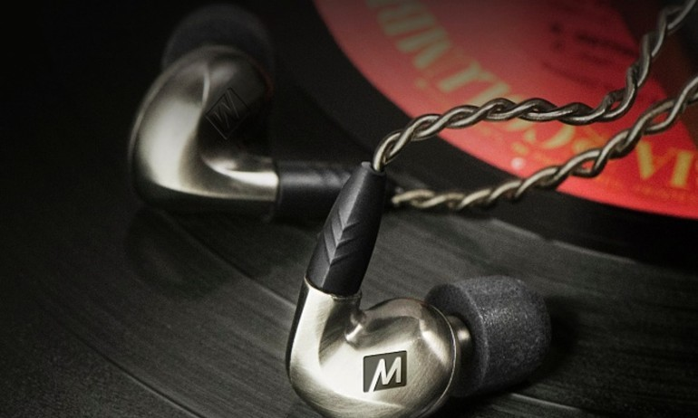
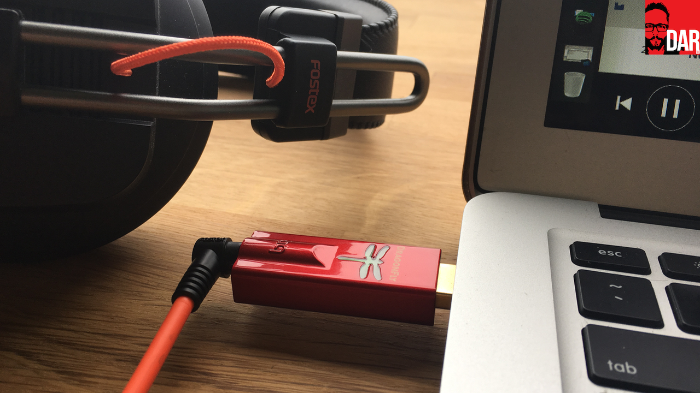
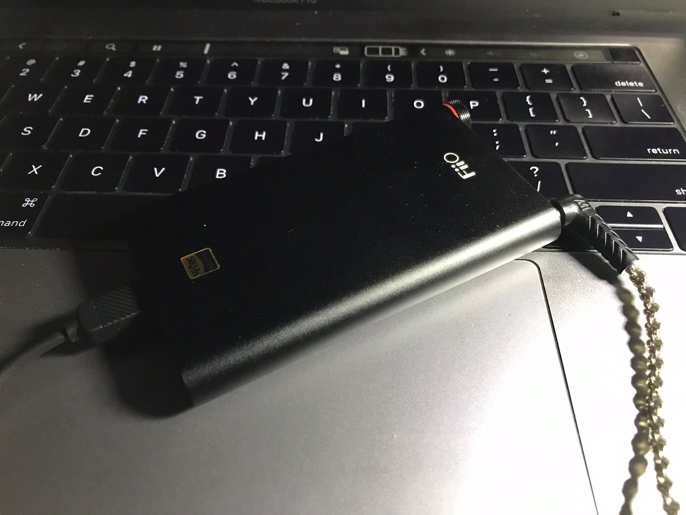
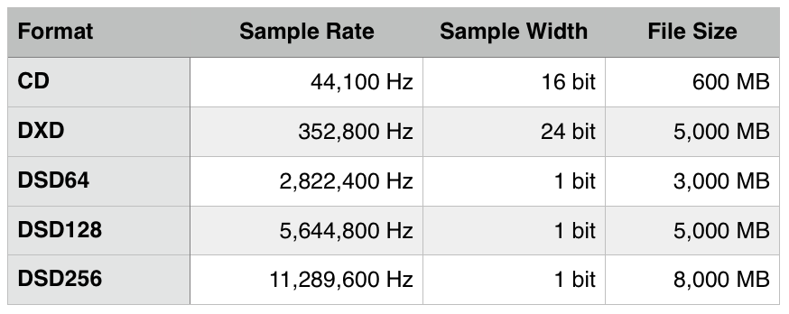
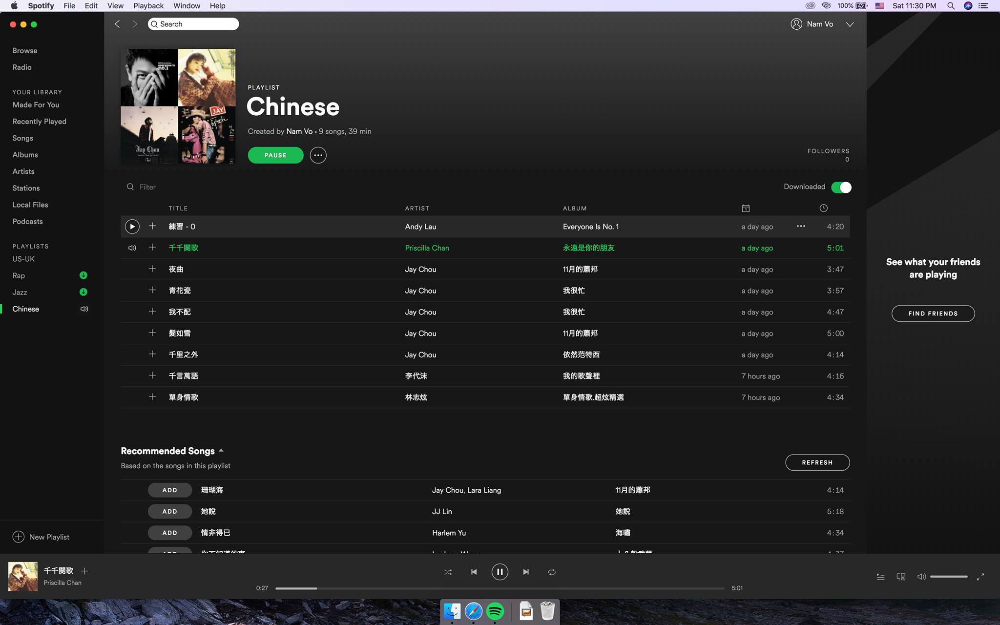
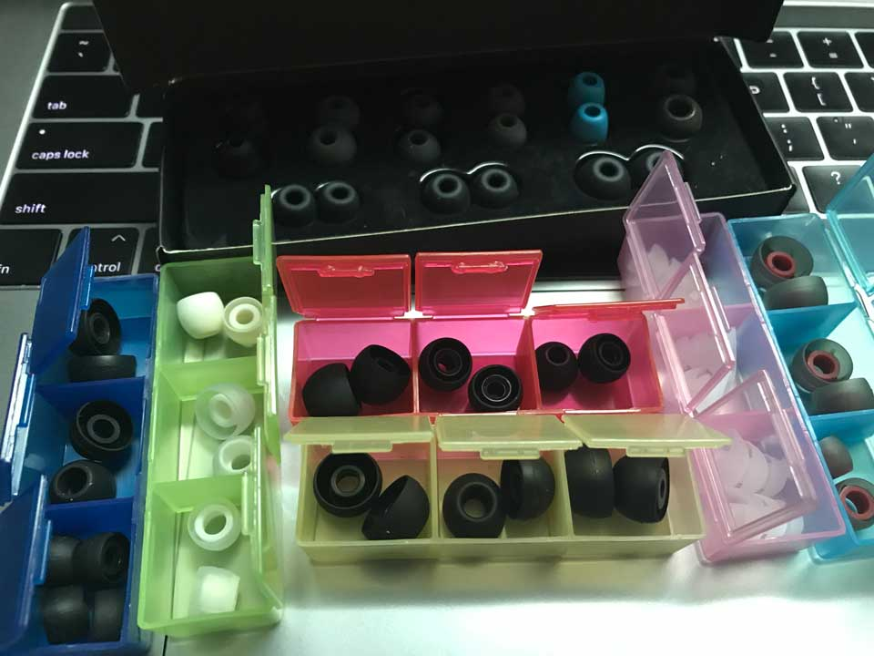

Mình có người bạn có quen biết với nhạc sĩ Nguyễn Đình Quang Anh (con trai thứ của cố nhạc sĩ Nguyễn Ánh 9). Anh nhạc sĩ chia sẻ với bạn mình rằng người chơi nhạc phải biết làm chủ âm thanh của mình. Từ khâu thu âm cho đến xử lý hậu kỳ. Dạo gần đây, ông anh mình "đầu độc" mình món sử dụng các thiết bị nghe nhạc để nghe được chi tiết hơn.

## Lần đầu biết thế nào là nghe nhạc có đầu tư

Thỉnh thoảng mình muốn nghe rõ từng chi tiết của bài nhạc để biết được cách hoà âm phối khí như thế nào. Cứ nghĩ ra tiệm mua tai nghe xịn xịn là được. Mình đã từng rất thích con **Beyerdynamic Byron Wired** cử tưởng nó đã chi tiết lắm rồi.

Một ngày nọ, ông anh mình ở ngoài Tao Đàn hôm đó xách máy nghe nhạc ra. Thắc mắc trong đầu là tại sao sắm sợi dây xịn và nguồn nhạc Lossless là được rồi, lên WAV càng tốt. Thời này ai xài máy nghe nhạc nữa? Ổng còn khoe độ dây này nọ nữa? Khi nghe thử thì... nghe rõ luôn tiếng Cello (bao gồm tiếng vĩ lúc mới chạm vào dây), vị trí của từng nhạc cụ trong dàn nhạc giao hưởng và nghe có cảm giác như mình đừng ở vị trí nhạc trưởng nghe nhạc vậy.

Lần đầu được mở mang tầm mắt. Cứ nghĩ ổng chỉ biết làm động tiêu 12 lỗ ai dè cũng là một Audiophile. Và setup được như vậy hết 30,000,000 VND (30 triệu). Một con số thiệt khủng hoảng.

## Dấn thân vào con đường ăn chơi

### Tai nghe

Thế là mình mua lại con **MEE Pinnacle P1** của ông anh. Mới đầu về thì nghe chưa thực sự nổi bật hẳn so vởi **Apple EarPods** được cái là tách âm tốt hơn nhiều. Dòng này là in-ear tức là nhét kín tai. Mục đích mua con này để cách âm với mấy người trong công ty.

> "Công sở, nơi hít drama hàng đầu Việt Nam" - [@chuyencongso69](https://www.facebook.com/chuyencongso69/photos/a.259366048003618/287953561811533/?type=3&theater)

Dòng Pinnacle P1 này là loại có thể thảo củ tai nên thay được dây. Lúc này mới biết chất lượng dây và thành phần đồng/bạc cũng ảnh hưởng đến màu âm. Nhưng mình chỉ lấy sợi dây stock có thành phần là đồng mạ bạc.

Với kiến thức hạn hẹp, với tai nghe thì mình biết thêm được mút tai cũng ảnh hưởng đến âm thanh. Tai mỗi người có cấu trúc khác nhau nên chọn mút tai phù hợp. Kín quá thì nghe rõ bass nhưng dễ nhức đầu, hở quá thì nghe không hết công suất của tai.

### DAC/AMP

Số là lúc thử hàng, ổng cho mình thử chất lượng của sợi dây bạc tinh khiết và dây đồng mạ bạc như thế nào. Mình cắm vào Macbook Pro 2017 của mình phân biệt không rõ lắm. Chỉ cảm nhận được âm bass đánh gọn hơn. Thế là được thử sợi dây độ trong setup 30 củ cắm vô. Kết quả là nghe không thể chịu nổi. Méo mó âm một cách kinh dị, không như hồi cắm vào máy nghe nhạc. Nhớ lại lời ông bạn khác đã từng nói mỗi loại tai nghe, để ý đuôi cắm có số khấc khác nhau thể hiện kháng trở cao hay thấp sẽ ảnh hưởng đến chất lượng tai nghe. Ông anh mình bảo chắc phải cần một thiết bị gì đó để kéo tai phone và đó là DAC.

**DAC** (hay còn gọi là D/A, D2A hay D-to-A) là viết tắt của cụm từ Digital Analog Converter – bộ chuyển đổi tín hiệu điện tử thành analog. Ngay cái tên đã nói lên công dụng của thành phần quan trọng hàng đầu trọng hệ thống nghe nhạc này. Sở dĩ cần tới DAC bởi ampli chỉ nhận tín hiệu dạng analog, trong khi các tập tin nhạc số lại lưu trữ dưới dạng tín hiệu điện tử, và đây chính là nhiệm vụ của DAC.

Để hiểu rõ tầm quan trọng của ampli, mọi người đều cần biết rằng nếu thiếu ampli thì loa hay tai nghe đều không thể phát nhạc. Mức tín hiệu đi từ DAC hay đầu CD đến loa có âm lượng cực nhỏ, mà tai người không thể nghe được. Nhiệm vụ cơ bản của ampli (hay cũng gọi là amplifier) chính là khuếch đại tín hiệu đủ để nghe được.

Ban đầu, ông anh gợi ý mình một em bé bé xinh xinh nhưng giá éo xinh tí nào là **AudioQuest DragonFly Red**. Một loại DAC có tích hợp luôn AMP được kết nối theo chuẩn USB-A. Chỉ cần cắm vào cổng USB Type-A là được. Mà mình đang xài Macbook Pro 2017, chỉ có 4 cổng USB Type-C nên đành câm nín.

Một hôm, lão nhắn qua coi thử con Fiio Q1 Mark II (Gen 2). Con này nó rẻ hơn so với con Dragonfly Red. Mình có đọc qua review trên Tinh Tế cũng ổn thế là hốt liền. Con này được cái là dây kết nối laptop và DAC có thể thay đổi cáp nên yên tâm hơn nhiều. Thiệt ra là mình vẫn có thể mua con Draagonfly Red do mình xài ở công ty nhiều hơn ở nhà, và ở công ty thì dùng Macbook Air 2017 có 2 cổng USB Type-A nên không sợ. Kết quả cắm con Q1 này vào, so sánh với con Apple EarPods là quả thực một trời một vực. Khi nghe tai Pinnacle P1 cắm vào Fiio Q1 với nhạc cổ điển được thể hiện bằng dàn nhạc giao hưởng thì nghe rõ chi tiết hơn, có chiều sâu hơn nhiều. Trong khi đó ở EarPods thì nó ngang ngang. Nguồn nhạc ở đây mình thử là FLAC lẫn WAV.

### Nguồn nhạc

Cái này mới thiệt sự thú vị. Nào giờ mình biết có 3 loại nguồn nên nghe để có chất lượng cao (sắp xếp tăng dần) là MP3 320kbps, FLAC (Lossless) và WAV. Có một tính năng mà lão giới thiệu cho mình con Fiio Q1 Mark II đó là chơi được định dạng DSD. Google một hồi cũng chả hiểu mô tê gì do họ dùng thuật ngữ chuyên ngành nhiều quá. Nên thôi, biết nó là chất lượng cao nhất hiện tại rồi. Muốn chơi được định dạng này thì phải cần can thiệp của phần mềm mới được.

Bây giờ mình an phận nghe nhạc trên Spotify. Bỏ 59,000 VND/tháng nghe nhạc có bản quyền và chất lượng cao cũng được, không đến nỗi nào.

### Phần mềm chơi nhạc

Cái này xuất phát từ định dạng DSD mà ra. Để chơi được nó thì cần phần mềm giải mã, khốn nạn là Fooobar2000 ngon - bổ - rẻ cài trên MacOS không thể cài plugin. Nên dùng các phần mềm khác thay thế như Audirvana Plus, JRiver, Vox... nó nói free chứ thực sự vẫn phải trả tiền để xài được hết toàn bộ chức năng của nó.

### Cáp

Vấn đề này xuất phát từ việc dùng con Dragonfly Red kết nối qua cổng USB Type-C. Nguyên tắc chung là càng qua nhiều adapter thì sẽ bị giảm chất lượng tín hiệu. Nên ưu tiên các giải pháp kết nối trực tiếp DAC với tai nghe/ laptop/ điện thoại.

Có một sự thật khá hài là sau khi mình mua sợi cáp chuyển Fiio CL06 thì nghe nhạc trực tiếp trên YouTube liên tục bị rè, chất lượng âm thanh khá hơn hẳn. Để từ từ tìm cách giải quyết.

### Eartips

Nó chính là các mút nhét tai. Mỗi loại ra một màu âm riêng. Khi bạn thay dây cáp, nguồn nhạc, thể loại nhạc thì mút sẽ cho ra âm thanh khác nhau. Do đó, bà con cũng có vụ chơi eartip. Đây là bộ đồ chơi của ông anh cho mình.

## Chốt

Mình mới xoá mù việc thưởng thức âm nhạc sao cho có chất lượng tốt nhất. Còn về việc thu âm, xử lý hậu kỳ chắc cần một thời gian nữa để tìm hiểu.

Cảm ơn đại ca LeeHonSo đã khai sáng.

## Tham khảo

- Stereo Wiki, [DAC là gì và công dụng của nó](https://stereo.vn/tin-tuc/xu-huong/stereo-wikidac-la-gi-va-cong-dung-cua-no-403.html)
- Stereo Wiki, [Ampli là gì và các dạng ampli](https://stereo.vn/tin-tuc/xu-huong/stereo-wikiampli-la-gi-va-cac-dang-ampli-417.html)
