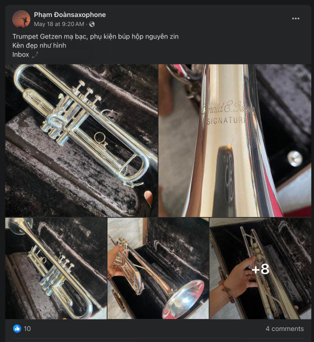
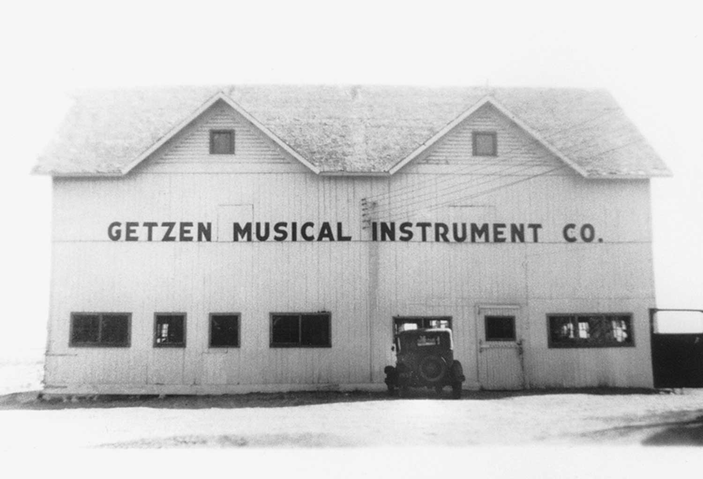
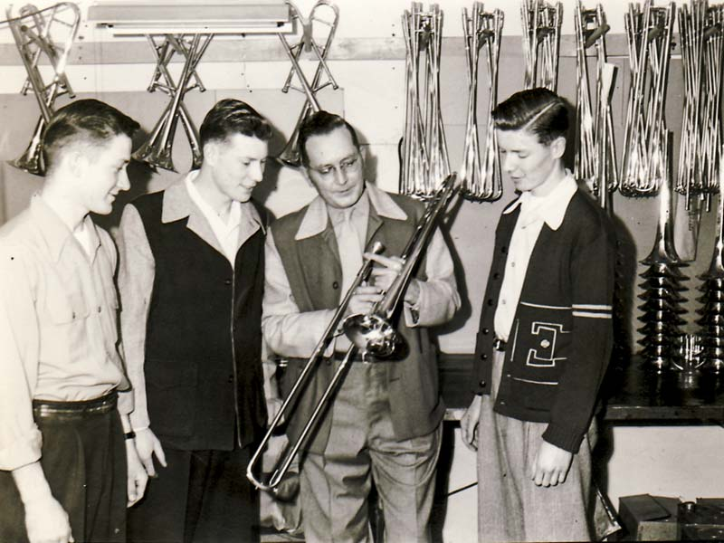
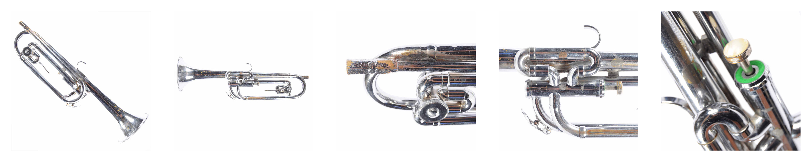
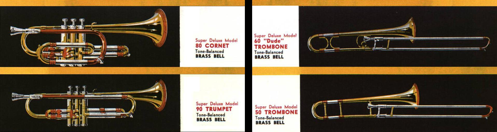
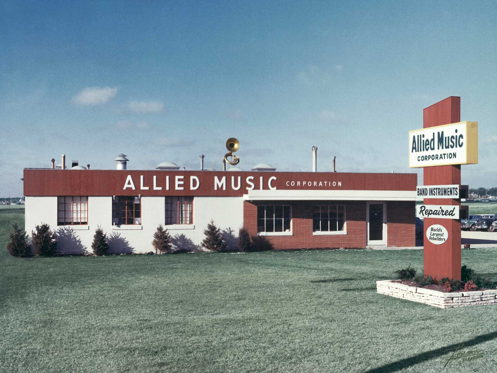
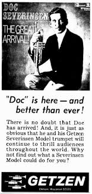
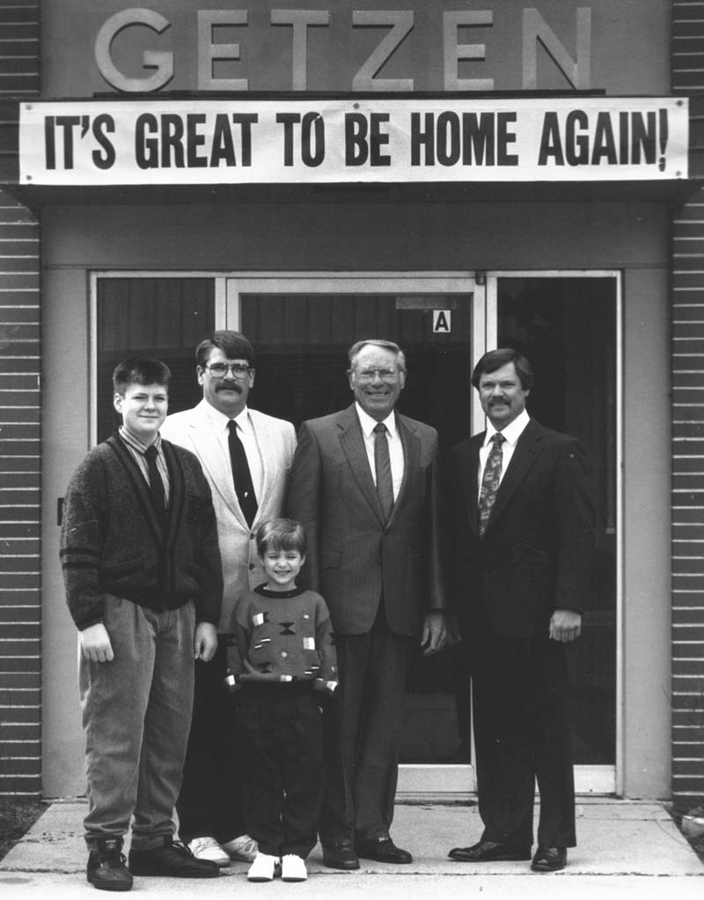
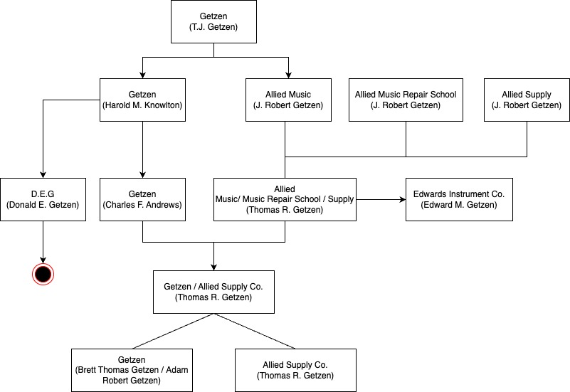

Số là hôm trước thấy có một người rao cây trumpet Getzen, valve 1 xài trigger y chang cây [Olds Mendez](https://www.robbstewart.com/olds-mendez-trumpet). Tưởng nó là cây Eterna custom, ai dè nó là **Donald E. Getzen Signature**.

Có thể do rào cản ngoại ngữ, nên đa phần người bán hay nhầm lẫn dòng kèn học sinh với dòng kèn chuyên nghiệp, hoặc là nhầm lẫn như vầy. Do đó, mình sẽ chia sẻ với mọi người một tí về hãng kèn **Getzen**.

## Lịch sử của Getzen đến năm 1991

**Getzen** là một công ty có trụ sở ở Mỹ chuyên về sản xuất và bán nhạc cụ bộ đồng, gồm `trumpet`, `cornet`, `flugelhorn`, `trombone`, `baritone horn` và được điều hành bởi 4 thế hệ của gia đình. 

**T.J. Getzen** (1894 - 1968), tên khai sinh là **Anton James Getzen**, nhưng sau này đổi tên thành **Tony James Getzen**. Vào năm 1939, sau 10 năm cống hiến cho [Holton](https://en.wikipedia.org/wiki/Holton_(Leblanc)), ông thành lập công ty **Getzen**. Lúc này, công ty chỉ tập trung vào sửa chữa nhạc cụ bộ đồng.

Năm 1946, cùng với dịch vụ sửa chữa, T.J. Getzen cho sản xuất `trombone`. Và năm 1947, ông quyết định mở rộng sản xuất `trumpet` và `cornet`.

Năm 1949, T.J. Getzen mở rộng các dòng sản phẩm, cho sản xuất [piston bugle](/hobbies/tong-quan-ve-ken-trumpet/#bugle). Mẫu kèn và thiết kế này trở nên phổ biến bởi các ban nhạc trong nước tại thời điểm này. Cùng năm 1949 này, **J. Robert Getzen** (con trai của T.J. Getzen, hay còn gọi là **Bob Getzen**) được bổ nhiệm làm giám đốc nhà máy, và khởi đầu cho truyền thống của gia đình.

Giai đoạn 1950s, Getzen mở rộng quy mô và cũng cải thiện chất lượng. Đánh dấu cột mốc này là dòng `Super Deluxe Tone Balanced`, gọi tắt là `Super Deluxe`. Tuy nhiên, đây vẫn là dòng kèn học sinh với chất lượng cao.

Năm 1959, Bob rời Getzen để mở công riêng của mình là **Allied Music Corporation**, chuyên làm về sửa chữa nhạc cụ, với 1 nhân viên và 0 khách hàng.

Năm 1960, T.J. Getzen bán công ty Getzen cho **Harold M. Knowlton**. Lúc này, **Donald E. Getzen** (hay còn gọi là **Don**, một người con trai khác của T.J. Getzen) vẫn còn ở lại làm việc cho Getzen. Từ đây, ta nên hiểu **Getzen** là một công ty không thuộc quyền sở hữu của gia đình Getzen, nhưng vẫn đề cập tiếp tục để nói về sự phát triển của công ty cho tới khi quay trở về với gia đình Getzen.

Trước 1962, Getzen nổi tiếng với nhạc cụ dòng học sinh chất lượng cao. Tuy nhiên, từ năm 1962 với sự hơp tác với [Carl "Doc" Severinsen](https://en.wikipedia.org/wiki/Doc_Severinsen) và nhiều nghệ sĩ khác đã giúp Getzen hoàn thiện dòng nhạc cụ chuyên nghiệp của `trumpet`, `cornet`, `flugelhorn`. Và công ty **Kiefer Mfg Corporation** sản xuất loa kèn cho dòng Eterna.

Năm 1965, **Don Getzen** rời Getzen và thành lập công ty [D.E.G. Music Products](https://degmusic.com/) tập trung vào phân khúc ban nhạc diễu hành. Sang 1966, Bob hợp tác với Don thông qua việc Allied Music Corporation sản xuất piston bugle cho D.E.G. Music Products.

Năm 1967, Bob thành lập [Allied Supply Corporation](https://www.alliedsupplycorp.com/) chuyên về cung cấp giải pháp sửa chữa kèn. Đồng thời, Bob cũng mở trường **Allied Music Repair School** để dạy sửa chữa nhạc cụ. Một khóa học ở đây sẽ mất khoảng 48 tuần, và học viên được dạy cách sửa nhạc cụ bộ đồng và bộ gỗ.

Năm 1969, Getzen giới thiệu các dòng kèn gồm `300 series` cho dòng kèn học sinh, `Capri` cho dòng kèn trung cấp, và `Eterna` cho dòng kèn chuyên nghiệp.

Năm 1972, Allied Music chuyển đổi mô hình kinh doanh từ sửa chữa sang sản xuất đầy đủ các dòng nhạc cụ (từ học sinh tới chuyên nghiệp) gồm `trumpet`, `cornet`, `trombone` và nhạc cụ dành cho diễu hành cho **D.E.G**. Lưu ý, **D.E.G** chưa bao giờ tự sản xuất nhạc cụ. Cũng trong năm này, phía Getzen cho ra mắt dòng Eterna 900 Severinsen trumpet.

Năm 1974, Bob bán **Allied Supply** cho 2 người con trai của mình là **Thomas R. Getzen** (hay còn gọi là **Tom**) và **Edward M. Getzen** (hay còn gọi là **Ed**). Lúc này, truyền thống gia đình Getzen được truyền tới thế hệ thứ 3.

Năm 1978, Doc Severinsen ngưng hợp tác với Getzen.

Năm 1985, **Harold Knowlton** bán lại Getzen cho **Charles F. Andrews**, với **David Ference** là đồng sở hữu. Ngoài ra, Getzen cũng cho ra mắt dòng Eterna II trumpet vào năm này.

Năm 1988, Bob bán lại **Allied Music** cho Tom và Ed.

Năm 1989, Ed thành lập công ty **Edwards Instrument Co.** sản xuất dòng trombone chuyên nghiệp tên là **Edwards**. Và **Allied Music** sản xuất trombone cho **Edwards**.

Năm 1990, **Allied Music** bắt đầu sản xuất nhạc cụ của riêng mình và hợp tác với nhiều nghệ sĩ nổi tiếng để làm riêng cho họ, tiêu biểu là **Canadian Brass**.

Năm 1991, công ty Getzen tuyên bố phá sản dưới thời **Charles Andrews**. Tom và Ed quyết định mua lại Getzen dưới danh nghĩa **Allied Music**. Từ thời điểm này, công ty trở về tay gia đình Getzen. Lúc này, bộ máy công ty được phân bổ lại, Getzen là công ty sản xuất và Allied Music là công ty sửa chữa nhạc cụ.

## Lịch sử của gia đình Getzen từ năm 1991

Từ năm này, việc kinh doanh của gia đình Getzen phân ra nhiều nhánh, nên mình chia ra theo từng nhánh nhỏ.

### Getzen và Allied Supply / Music / Repair School

Năm 1993, Tom và Ed quyết định đóng cửa **Allied Music Repair School** để tập trung nhân sự cho việc sản xuất các dòng sản phẩm mới.

Năm 1994, Allied Music đóng cửa bộ phẩn nhạc cụ bộ gỗ, tập trung vào sửa chữa nhạc cụ bộ đồng.

Năm 1995, **Allied Music** đóng cửa dịch vụ sửa chữa và toàn bộ nhân sự được chuyển về công ty **Getzen** để tập trung sản xuất các dòng nhạc cụ chất lượng cao và các dòng nhạc cụ mới. Chính thức đóng cửa **Allied Music**.

Năm 1999, Tom quyết định mua lại phần của Ed và chính thức toàn quyền sở hữu toàn bộ công ty **Getzen** và **Allied Supply**.

Năm 2001, Doc Severinsen quay trở lại hợp tác với Getzen để sản xuất dòng trumpet Severinsen Custom mới.

Một lần nữa vào năm 2003, Doc Severinsen không hợp tác với Getzen nữa, mà mua lại một nhà máy sản xuất khác để làm phiên bản riêng của mình.

Năm 2013, Tom quyết định bán lại **Getzen** cho 2 người con trai của mình là **Brett Thomas Getzen** (hay còn gọi là **Brett**) và **Adam Robert Getzen** (hay còn gọi là **Adam**). Brett với vai trò Chủ tịch, chuyên về bán hàng và marketing. Adam tập trung vào sản xuất và thiết kế.

### Allied Supply Co.

Sau 1999, Tom chính thức sở hữu và là chủ tịch của công ty **Getzen** và **Allied Supply**.

Năm 2002, thế hệ thứ 4 của gia đình Getzen bắt đầu tham gia công ty.

Năm 2013, Tom sau khi bán lại **Getzen** cho Brett và Adam, ông giữ lại quyền điều hành **Allied Supply** cho tới nay (2024).

Năm 2023, **Allied Supply** cập nhật lại website, không in những cuốn catalog, và yêu cầu đăng nhập tài khoản để có thể coi được sản phẩm của công ty, với hơn 13,000 sản phẩm liên quan tới sữa chữa nhạc cụ.

### Edwards Instrument Co.

Từ 1989, Edwards bắt đầu sản xuất dòng trombone chuyên nghiệp của riêng mình.

Tới năm 1994, Edwards bắt đầu thiết kế trumpet các mẫu B♭/C và đưa vào sản xuất vào năm 1998.

Năm 2015, Edwards giới thiệu X-Series và kèm theo đó là ra flugelhorn.

Tính tới hiện tại (2024), Edwards vẫn nằm dưới quyền công ty Getzen, và cùng sử dụng chung vật liệu với kèn của Getzen. Tuy nhiên, trombone vẫn là thế mạnh của Edwards.

Xin phép dẫn lại một bài viết của cố nghệ sĩ Phạm Lân tại [đây](https://www.facebook.com/permalink.php?story_fbid=pfbid029q8BERD9sVKL1KnVhcL1L31zYYP7e49zy2WqKycryyZCStd52VFxNocU69gfAtzTl&id=362609997531775).

### D.E.G Music Corporation

  

    
  

Từ năm 1965, D.E.G tập trung vào phân khúc nhạc cụ và phụ kiện dành cho các ban nhạc diễu hành. Do đó, chất lượng nó không bằng dòng chuyên nghiệp cho các nghệ sĩ như Getzen, Edwards.

Năm 2009, Don bán lại **D.E.G** cho **Tony Scodwell**.

Năm 2019, **D.E.G** tuyên bố đóng cửa dưới thời **Tony Scodwell**

Hiện tại (2024), chúng ta chỉ tìm thấy một số phụ kiện như giá nhạc rời, hoặc gắn trên kèn ở các website bán nhạc cụ. Hiện chỉ tìm được một số ít nhạc cụ từng mang tên D.E.G như `trumpet`, `cornet`, `bugle`, `slide trumpet/soprano trombone`, `quadro trombone`, `tuba`, `sousaphone`, `mellowphone`, `saxophone`, `sax-shaped trumpet`.

## Chốt

Tính tới hiện tại, cả 4 thế hệ của gia đình Getzen vẫn phát triển, đóng góp lớn vào ngành sản xuất kèn đồng của Mỹ và thế giới. Có mỗi D.E.G phải dừng cuộc chơi sớm.

## Tham khảo

- Brass History, [Getzen History](https://www.brasshistory.net/Getzen%20History.pdf)
- Kenneth H. Piatt, [Selected Manufacturer's Professional Trumpet Component Specifications: A Compendium of Measurements, Materials, and Playing Characteristics](https://researchrepository.wvu.edu/cgi/viewcontent.cgi?article=7457&context=etd)
- Wikipedia, [Getzen](https://en.wikipedia.org/wiki/Getzen)
- Getzen Company, [Getzen History](https://www.getzen.com/about/history/)
- Ron Berndt, [Tony Getzen and a modern American Brass Making Dynasty](https://trumpet-history.com/Getzen_Dynasty.pdf)
- TrumpetHerald, [T.J. (Tony) Getzen - who was he? Many questions
](https://www.trumpetherald.com/forum/viewtopic.php?t=157596&sid=64e3f25e30f896fc66035f2a88675abb)
- The Music Den, [Elkhorn by Getzen Single Valve Rotary G Bugle USED](https://themusicden.com/elkhorn-by-getzen-single-valve-rotary-g-bugle-used/)
- Allied Supply, [About Us](https://www.alliedsupplycorp.com/Home/About)
- TrumpetHerald, [Getzen Eterna Cornet History](https://www.trumpetherald.com/forum/viewtopic.php?p=1308142)
- Wisconsin Department of Natural Resources, [GETZEN CO INC](https://apps.dnr.wi.gov/botw/GetLocationDetail.do?siteId=600100&detailSeqNo=35736&locName=GETZEN+CO+INC&crumb=)
- Getzen Company, [Frequently Asked Questions](https://www.getzen.com/about/frequently-asked-questions/)
- Allied Supply, [History](https://alliedsupplycorp.com/Home/Page/history)
