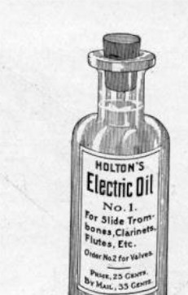
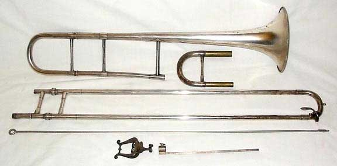

## Lịch sử

**Frank Ezra Holton** (28/09/1857) sinh trong một gia đình nông dân tại Allegan, bang Michigan, Mỹ. Thời thiếu niên, ông học việc với chú mình ở lò rèn tại Battle Creek, bang Michigan.  Ở đây, ông tham gia `Allegan Band` rồi bắt đầu học chơi kèn Cornet, Trombone, Baritone.

> "Mr. Frank Holton of Kalamazoo, was the successful individual contestant on the trombone at the band tournament in Detroit. Frank is indeed a fine musician."
>
> -- <cite>Kalamazoo Gazette, 15 June 1883</cite>

Năm 1880, Holton làm việc như một thợ rèn ở Kalamazoo và chơi cho ban nhạc địa phương. Ông cũng có tham gia cuộc thi `State Band Tournament` năm 1983 với kèn Trombone và đạt giải Nhất. Năm sau ông thi tiếp, nhưng không ai muốn thi kèn Trombone với ông. Thế là ông thi kèn Bariton rồi ẵm luôn giải nhì.

### Sự nghiệp nghệ sĩ kèn Trombone

Holton bắt đầu sự nghiệp trombone chuyên nghiệp với tư cách nghệ sĩ solo ở [Hi Henry Minstrels](http://www.georgewpeck.com/minstrels.html) và ban nhạc của rạp xiếc [Barnum and Bailey](https://en.wikipedia.org/wiki/Ringling_Bros._and_Barnum_%26_Bailey_Circus).

Sau đó, ông tham gia với [Ellis Brooks](https://www.kpl.gov/local-history/kalamazoo-history/biographies/brooks-ellis-l/) năm 1885. Brooks tổ chức lưu diễn vào mùa hè ở New York, mùa đông ở Florida. Ở đây, về kỹ thuật thì không ai sánh bằng Holton. Năm 1892 khi còn diễn cho ban của Brooks, Holton được mời diễn cho ban nhạc mới của [John Philip Sousa](https://en.wikipedia.org/wiki/John_Philip_Sousa). Tại ban nhạc của Sousa, Holton tạo được mối quan hệ với nghệ sĩ kèn trombone bậc thầy - [Arthur Pryor](https://en.wikipedia.org/wiki/Arthur_Pryor) khi còn là một nghệ sĩ trẻ khoảng năm 1893.

### Sự nghiệp kinh doanh

Năm 1886, Holton bắt đầu cho ra mắt dầu kèn cho ống trượt `Electric Oil` do ông phát triển. Theo như quảng cáo là cho Slide Trombone, kèn Clarinet, Flute. Chắc là tra vô các ống.

Năm 1898, Holton thuê phòng ở góc đường `Clark & Madison St.`, Chicago, bang Illinois để mở cửa hàng. Tình hình kinh doanh chưa khởi sắc, ông quyết định bán thêm nhạc cụ đã qua sử dụng.

Tiếp theo, ông thuê một vài người thợ sửa nhạc cụ, và thiết kế nhạc cụ cho riêng mình và cho ra mắt mẫu kèn [Trombone đầu tiên](https://holtonloyalist.com/trombones/) - mẫu `Special` vào năm 1899.

### Frank Holton & Company

Năm 1900, Holton thuê 2 phòng làm trụ ở ở **#70 Madison St.** trong 4 năm. Từ đây, ông bắt đầu sản xuất thêm kèn Cornet.

Năm 1904, Holton chuyển tới **#107 E. Madison St.** và thành lập `Frank Holton & Company`.

Năm 1905, Holton cho ra mẫu thiết kế kèn Trumpet đầu tiên.

Năm 1906, Holton đã có 100 nhân công, và ông quyết định xây nhà máy mới ở **#2638-2646 Gladys Ave, Chicago** với diện tích khoảng 15,000 feet (gần 1,400 m2). Tại đây, Holton sản xuất [Slide Trombone](https://www.yamaha.com/en/musical_instrument_guide/trombone/mechanism/mechanism002.html) và [Valve Trombone](https://en.wikipedia.org/wiki/Valve_trombone), [Mellophones](https://en.wikipedia.org/wiki/Mellophone), [Cornet](https://en.wikipedia.org/wiki/Cornet). Nhà máy chỉ hoạt động một nửa đầu vào 1907 và phần còn lại vào 1911. 

*Nhà máy tại Gladys*

Năm 1909, cùng với trào lưu sản xuất kèn sousaphone, Holton cũng cho ra mắt một phiên bản của riêng mình với tên [Holtonphone](https://tubapastor.blogspot.com/2012/12/sousaphones-not-made-by-conn.html). Vụ này cũng hay ho lắm, sẽ có bài viết.

### Chuyển nhà máy tới Elkhorn, Wisconsin

Năm 1916, tài chính của Frank Holton rủng rỉnh hơn và ông quyết định chuyển tới **Elkhorn**, bang Wisconsin. Đồng thời nhà máy ở Chicago cần được mở rộng, nhờ sự giúp đỡ của ng bạn là **George Renner** đã đi vận động hành lang để công ty của Holton được dời về đây.

*Nhà máy của Holton, tại Wisconsin khoảng năm 1920* 

Năm 1918, toàn bộ nhà máy của Holton được chuyển về Elkhorn rộng 6 mẫu Anh. Để được như vậy, Holton phải cam kết trả lương tổng cộng ít nhất nửa triệu USD trong 7 năm tiếp theo.

Tuy nhiên, tình hình nước Mỹ tham gia vào Thế Chiến I làm cho thiếu nguồn đồng thau do cần làm vỏ đạn, mà nguồn nhân lực trẻ để vận hành nhà máy cũng vậy. Holton ráng vượt qua để không phải đóng cửa nhà máy bằng cách cắt giảm nguyên liện, rồi cũng trầy vượt vượt qua năm 1919 khi tình hình chiến tranh dịu xuống. Sau Thế Chiến I, tình hình kinh doanh bắt đầu khởi sắc. Holton sát nhập ban nhạc của công ty với ban nhạc Elkhorn, được lập bởi  **Charles Seelye** vào năm 1840.

*Elkhorn Band*

Năm 1928, [Lyon & Healy](https://en.wikipedia.org/wiki/Lyon_%26_Healy) bán lại [Couturier](https://www.brasshistory.net/Couturier%20History.pdf) cho Holton. Tất cả máy móc được chuyển tới Holton và duy trì sản xuất saxophone cho họ tới năm 1930.

### Hậu Frank Holton

Năm 1939, lúc này Frank Holton nghỉ hưu và bán lại công ty Holton cho **Fred Kull** (1872-1944), có nguồn khác là **William Kull**. Tuy nhiên, Holton vẫn giữ vai trò chủ tịch hội đồng quản trị cho tới khi mất vào 14/6/1942.

Vào Thế Chiến II, Holton lại một lần nữa rơi rơi vào tình trạng khó khăn khi kho nhạc cụ bị đóng băng, việc thu mua đồng thau bị quản lý chặt chẽ. Công ty sống lây lất nhờ đơn hàng gia công nhỏ cho chiến tranh tới năm 1943. Holton bận rộn với hợp đồng sản xuất ốc vít và ngòi nổ chống tăng M-66 cho khi kết thúc chiến tranh.

Cuối năm 1944, **Fred Kull** qua đời, giao lại cổ phiếu cho **Grover Kull** với điều kiện là Grover phải bán cho **Elliot Kehl** trong nhiều năm. Nhưng về cơ bản, **Grover** trốn tránh trách nhiệm, và **Kehl** đã điều hành công ty trong nhiều năm. Sau này, Kehl được phép mua phần lớn cổ phần, ông bắt đầu chương trình tái thiết kế và cải tiến nhạc cụ. Thời điểm này, nhà thiết kế nhạc cụ chính là **Arvid Walters**, một người bản xứ có tay nghề có thể xử lý từ Trumpet tới Tuba. Walters cùng [Philip Farkas](https://en.wikipedia.org/wiki/Philip_Farkas) cho ra mắt mẫu French Horn Farkas huyền thoại vào năm 1956.

*Philip Farkas*

Holton trở thành nhà cung cấp nhạc cụ bộ đồng và saxophone cho phân khúc học sinh của Vito thuộc Leblanc từ năm 1951.

Đầu năm 1962, **Kehl** nhận được lời đề nghị từ **Vito Pascucci** của [G. Leblanc Corporation](/hobbies/lich-su-hang-ken-leblanc/) về việc mua lại công ty Holton. Về phía Holton, công ty không bị áp lực doanh thu và tập trung vào thứ họ giỏi nhất là sản xuất nhạc cụ. Và chính thức năm 1964, **G. Leblanc Corporation** đã mua lại công ty **Frank Holton & Co.**.

Dưới thời Leblanc, Holton đã ngừng cải tiến. Như việc năm 1971, Leblanc có sử dụng thương hiệu `Martin Committee` cho một vài mẫu nhạc cụ của Holton.

### Thời kỳ Conn-Selmer

Năm 2004, **Leblanc** được bán cho [Conn-Selmer](https://www.connselmer.com/), kéo theo **Holton** cũng về dưới trướng công ty này. May mắn là Conn-Selmer vẫn giữ Holton là một thương hiệu riêng, sản xuất Cornet, Trumpet, French Horn, Trombone và dầu cho Slide/Valve.

Năm 2008, nhà máy ở Elkhorn bị đóng cửa và bộ phận sản xuất chuyển tới Eastlake, bang Ohio để sản xuất nhạc cụ bộ hơi cho thương hiệu **King** và **C. G. Conn**.

## Nhạc cụ của Frank Holton

### Trumpet & Cornet

Các mẫu trumpet nổi tiếng của Holton gồm `Revelation`, `Symphony`, `Llewellyn`, `Stratodyne`, `Galaxy`, `Reso-tone`, `Collegiate`, `Super Collegiate`.

Các mẫu cornet nổi tiếng gồm `Holton-Clarke`, `Collegiate`, `Coutier`, `New Proportion`.

Mọi người có thể tham khảo
- **Trumpet** tại [Brass History](https://www.brasshistory.net/Holton%20Trumpets.pdf)
- **Trumpet** và **Cornet** tại [Trumpet History](https://trumpet-history.com/Holton%20Models.pdf)

### Trombone

Về trombone thì có các mẫu `Special`, `Revelation`, `Symphony`,`Professional`, `Reso-tone`, `Stratodyne`, `Llewellyn`,...

Mọi người có thể tham khảo thêm tại [horn-u-copia](https://horn-u-copia.net/Reference/Productline.php?maker=Holton&instrument=Trombone).

Ngoài ra, Holton có một mẫu đặc biệt đó là [Superbone](https://en.wikipedia.org/wiki/Superbone), con lai giữa Slide và Valve Trombone.

<iframe width="560" height="315" src="https://www.youtube.com/embed/y55M0hIHLzc?si=3dEMdxoL4fOrP4Wi" title="YouTube video player" frameborder="0" allow="accelerometer; autoplay; clipboard-write; encrypted-media; gyroscope; picture-in-picture; web-share" referrerpolicy="strict-origin-when-cross-origin" allowfullscreen></iframe>

### French Horn

Mọi người có thể vào trang [Holton French Horn](https://www.holtonfrenchhorn.com/) để tham khảo.

### Nhạc cụ khác

Ngoài ra, Holton còn có sản xuất kèn `Sousaphone (Holtonphone)`, `Clarinet`, `Saxophone` và `Flute`.

## Ngoài lề

### Tìm được đối thủ xứng tầm - Arthur Pryor

Năm 1893, Holton quay lại chơi cho ban nhạc của `John Philip Sousa` cho sự kiện [World's Columbian Exposition](https://en.wikipedia.org/wiki/World%27s_Columbian_Exposition) tại Chicago. Khi ban nhạc đang tập, chàng trai trẻ [Arthur Pryor](https://en.wikipedia.org/wiki/Arthur_Pryor) xuất hiện. Sousa mời chàng trai khởi động và mọi người kinh ngạc với những gì họ nghe được. Sousa cho Pryor chơi bè I trombone và cho Holton hướng dẫn.

Lúc đó, Sousa muốn chơi một bản nhạc khó, phần trombone nhanh hơn mức Holton có thể xử lý. Sau đó, Holton nhờ Pryor chơi thử và tập luyện theo. Sousa nghe Holton chơi đúng vào lần đầu tiên khá ngạc nhiên. Sau đó, Holton mới thú nhận là đã nhờ Pryor chơi thử và xin rời ban. Sousa thuyết phục Holton ở lại chơi cho tới khi kết thúc hội chợ, đề phòng Pryor có phong độ nhất thời.

Tại thời điểm này, Holton là một nghệ sĩ solo tài năng, vậy mà ông vẫn nể phục Pryor. Mọi người nghe thử bản thu năm 1901 khi Pryor còn chơi cho ban của Sousa.

<iframe width="560" height="315" src="https://www.youtube.com/embed/29WZxaGkvE0?si=glBdzCe-FLSMKo3P" title="YouTube video player" frameborder="0" allow="accelerometer; autoplay; clipboard-write; encrypted-media; gyroscope; picture-in-picture; web-share" referrerpolicy="strict-origin-when-cross-origin" allowfullscreen></iframe>

## Tham khảo

- Holton Loyalist, [History](https://holtonloyalist.com/history/)
- Trumpet History, [A History of Frank Holton & Company](https://trumpet-history.com/Holton.htm)
- Holton Frenchhorn, [Holton's history](https://www.holtonfrenchhorn.com/holtons-history/#content)
- Brass History, [Frank Holton & Co.](https://www.brasshistory.net/Holton%20History.pdf)
- Brass History, [Frank Holton & Co. Trumpets](https://www.brasshistory.net/Holton%20Trumpets.pdf)
- Brass History, [Frank Holton & Co. Surviving Brass Instruments](https://www.brasshistory.net/Holton%20Brass%20List.pdf)
- Trumpet History, [Holton Trumpets & Cornets](https://trumpet-history.com/Holton%20Models.pdf)
- Wikipedia, [Holton (Leblanc)](https://en.wikipedia.org/wiki/Holton_(Leblanc))
- Trumpet Herald, [Frank Holton and Company](https://www.trumpetherald.com/forum/viewtopic.php?t=145924&sid=fd54397a4fc3f1cf14593254fca2c1ae)
- Wisconsin Historical Society Online Collections, [A Trip Through The Holton Factory](https://content.wisconsinhistory.org/digital/api/collection/tp/id/30142/download)
- Kalamazoo Public Library, [Frank E. Holton](https://www.kpl.gov/local-history/kalamazoo-history/music/frank-e-holton/)
- Musicology for Everyone, [Frank Holton: trombonist and band instrument manufacturer](https://music.allpurposeguru.com/2022/03/frank-holton-trombonist-and-band-instrument-manufacturer/)
- Trumpet Herald, [Japanese Made Holton?](https://www.trumpetherald.com/forum/viewtopic.php?t=153333&sid=a35a5ce6f01d187d4fc33e9f47557a20)
- Horn-u-Copia, [Holton](https://www.horn-u-copia.net/Reference/display.php?thisrec=302)
- Dave Detwiler, [Sousaphones not made by C. G. Conn](https://tubapastor.blogspot.com/2012/12/sousaphones-not-made-by-conn.html)
- Brass History, [E. A. Couturier Band Instrument Co](https://www.brasshistory.net/Couturier%20History.pdf)
- Drobnak Brass, [History of Frank Holton & Company](https://redevelop.drobnakbrass.com/conc8/index.php/features/features-3/history-frank-holton-company)
- EverythingTrumpet, [Renold Schilke - History and Background](https://www.everythingtrumpet.com/schilke/Biography_and_Background.html)
- KGU Music, [HOLTON FRENCH HORNS: TRADITION MEETS INNOVATION](https://kgumusic.com/blogs/news/holton-french-horns-tradition-meets-innovation)