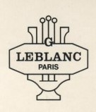
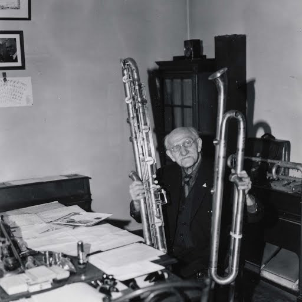
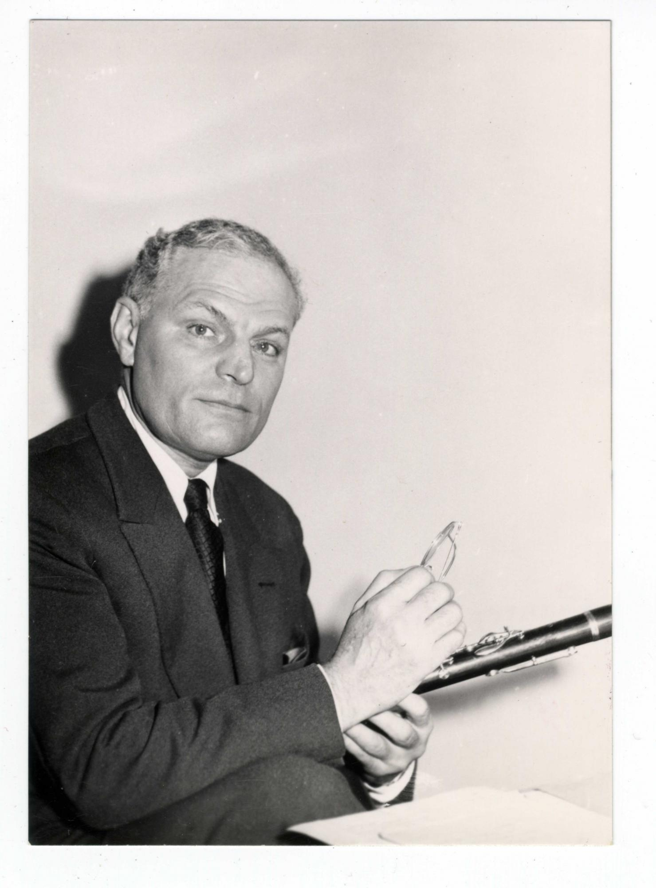
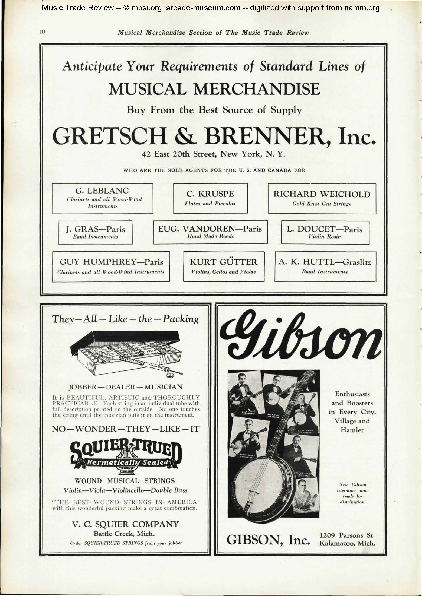
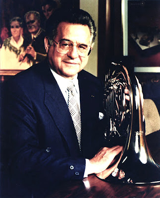
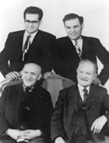
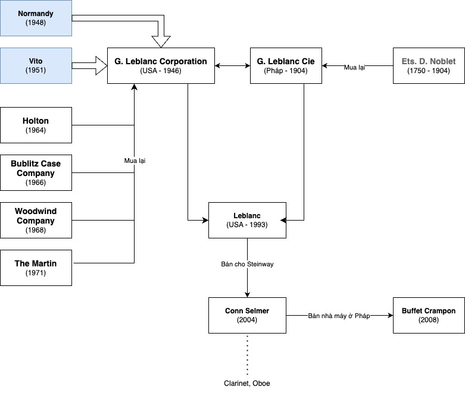
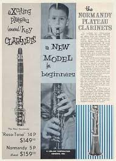
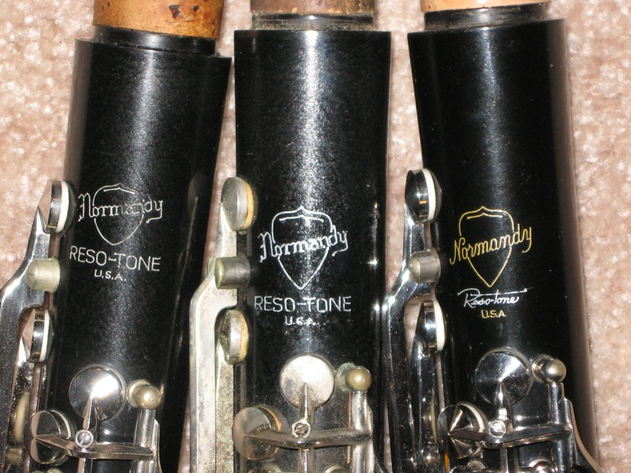

Đối với những ai săn kèn saxophone cũ ở Việt Nam, cũng như clarinet cũ trên thế giới sẽ đâu đó thấy qua hãng kèn này. Do trong loạt bài về lịch sử các hãng kèn đồng sẽ có nhắc tới nên mình cũng muốn đem nó ra ánh sáng một chút.

Tính ra khứa này là cầu nối giữa làng kèn phương Tây (Âu-Mỹ) và phương Đông (Nhật) luôn á.

## Lịch sử

### Khởi đầu ở Pháp

`"G. Leblanc Cie"` được thành lập bởi **Georges Leblanc** (1872-1959) vào cuối thế kỷ 19 (khoảng 1890s) tại [La Couture-Boussey](https://en.wikipedia.org/wiki/La_Couture-Boussey) - Pháp. Năm 1904, công ty mua lại `Ets. D. Noblet`, một hãng kèn lâu đời của Pháp (được thành lập vào 1750) do Noblet không có người thừa kế. Trong thời kỳ này, **Georges** cùng con trai là **Léon Leblanc** (1900-2000) thành lập xưởng ở Paris như một phòng thí nghiệm về nhạc cụ bộ hơi. Năm 1908, họ đã tuyển dụng được [Charles Houvenaghel](https://fr.wikipedia.org/wiki/Charles_Houvenaghel) (1878-1966), được coi là một acoustician (nhà âm học?) vĩ đại, kể từ sau [Adolphe Sax](https://en.wikipedia.org/wiki/Adolphe_Sax) (1814-1894, người phát minh ra kèn Saxophone).

*Charles Houvenaghel*

Leblanc và Houvenaghel đã áp dụng kết quả nghiên cứu của mình để mở rộng phạm vi âm vực của kèn clarinet, từ sopranino/piccolo cho tới octo-contrabass. Để tạo thành một dàn hợp xướng hoàn chỉnh bằng clarinet, với cao độ lớn hơn dàn nhạc bộ dây.

*Léon Leblanc*

Léon Leblanc là một nghệ sĩ clarinet tài năng. Mặc dù có thể trở thành nghệ sĩ biểu diễn, Léon quyết định ở lại với Leblanc, áp dụng hiểu biết vào sản xuất, cải tiến nhạc cụ. Dù cho nhạc cụ của Leblanc sản xuất thủ công, nhưng Léon vẫn muốn thợ thủ công phải tuân theo các phép đo đạc cẩn thận, để sản phẩm có chất lượng đồng nhất, dễ chơi.

### Mối liên kết ở Mỹ

**G. Leblanc Cie** đã làm việc với nhà phân phối ở Mỹ công ty **Gretsch & Brenner** (tại New York) từ năm 1921, chủ yếu là kèn Clarinet. Tuy nhiên, quá trình nhập khẩu từ Pháp tới New York - Mỹ luôn trong tình trạng tệ hại, lệch tông, dính khớp do thời tiết tiết thay đổi. Gretsch vẫn bán ra mà không có điều chỉnh hay sửa chữa gì. Dẫn tới là cuối Thế chiến II (1939-1945), số lượng nhạc cụ của Leblanc khá hạn chế, phần nhiều là các mẫu được chế tác đặc biệt cho một số nghệ sĩ Clarinet.

*Vito Pascucci*

Năm 1945, Leon may mắn gặp được **Vito Pascucci** (1922-2003). Do trước đây, Pascucci đã từng có ý tưởng mở một công ty phân phối và nhập khẩu nhạc cụ với [Glenn Miller](https://en.wikipedia.org/wiki/Glenn_Miller) (1904-1944). Sau khi Leon và Pascucci đạt được thỏa thuận thì họ quyết định lập **G. Leblanc Corporation** tại Kenosha, bang Wisconsin, nước Mỹ vào năm 1946. Nơi đây chuyên chỉnh sửa và điều chỉnh lại kèn clarinet sau khi vận chuyển từ Pháp tới Mỹ nhằm đảo bảo chất lượng tốt nhất về mặt âm học lẫn cơ học. 

*Theo chiều kim đồng hồ: Vito Pascucci, Léon Leblanc, Georges Leblanc, Charles Houvenaghel*

Khoảng thập niên 1950, **G. Leblanc Corporation** bắt đầu nhập thêm nhạc cụ bộ đồng và saxophone được sản xuất bởi [Courtois](https://www.a-courtois.com/) và **Beaugnier**, được dãn nhãn `Leblanc`. Ngoài ra năm 1951, Leblanc Mỹ bắt đầu sản xuất dòng kèn Clarinet cho học sinh dưới tên thương hiệu `Vito`.

Để mở rộng dòng sản phẩm, Leblanc đã mua lại một số công ty khác:
- Năm 1964, mua lại [Holton](/hobbies/lich-su-hang-ken-holton), sản xuất nhạc cụ bộ đồng.
- Năm 1966, mua lại [Bublitz Case Company](https://en.wikipedia.org/wiki/Bublitz_Case_Company), sản xuất hộp đựng kèn.
- Năm 1968, mua lại [Woodwind Company](https://www.saxontheweb.net/posts/2332830/), sản xuất mouthpiece cho clarinet và saxophone.
- Năm 1971, mua lại thương hiệu [The Martin Band Instrument Company](https://en.wikipedia.org/wiki/Martin_Band_Instrument_Company) từ [Wurlitzer](https://en.wikipedia.org/wiki/Wurlitzer), các nhạc cụ bộ đồng và saxophone.

Vào cuối thập niên 1960, [Yanagisawa](https://en.wikipedia.org/wiki/Yanagisawa_Wind_Instruments) xuất khẩu kèn saxophone cho các nhà phân phối dưới tên của họ. Trong đó có một lượng lớn cho Leblanc dưới tên **Leblanc**, **Vito** (Nhật) và **Martin** (sau 1971). Từ 1/1/1981, Yanagisawa phân phối với tên thương hiệu của họ, Leblanc được cấp quyền độc quyền phân phối saxophone dòng Artist của Yanagisawa ở Mỹ và Canada.

Tháng 4 năm 1989, Leblanc Mỹ mua lại 65% cổ phần công ty mẹ là Leblanc Pháp **(G. Leblanc Cie)** và nắm toàn quyền quản lý.

Năm 1993, Léon Leblanc bán 35% cổ phần còn lại cho Leblanc Mỹ (dưới thời Vito).

### Thế hệ mới

*Leon Pascucci*

Leon Pascucci tham gia vào Leblanc từ năm 1971, trải qua nhiều vị trí. Năm 1991, ông được bổ nhiệm làm chủ tịch. Năm 2003 trở thành CEO. Sau cái chêt của Vito Pascucci, Leon được bổ nhiệm làm chủ tịch hội đồng quản trị vào 28/8/2003. 

Cũng trong năm 2003, nhà máy Leblanc Pháp tại **La Couture-Boussey** bị cháy. May mắn là lính cứu hỏa đã dập tắt được lửa trước khi tòa nhà bị phá hủy. Số lượng hàng tồn kho bị hủy, nhưng số lượng gỗ không bị ảnh hưởng và nhà máy hoạt động trở lại 2 tháng sau đó.

Vào 12/8/2024, gia đình Pascucci bán **Leblanc** cho [Steinway Musical Instruments](https://en.wikipedia.org/wiki/Steinway_Musical_Instruments), và đặt dưới công ty con là **Conn-Selmer**.

Conn-Selmer đóng cửa nhà máy Leblanc ở Kenosha vào năm 2007. Đồng thời chuyển bộ phận điều hành ở Pháp về Elkhart, bang Indiana, Mỹ. Thương hiệu **Martin** bị khai tử. Sản phâm của **Holton** được chuyển về sản xuất ở nhà máy của Conn-Selmer ở Eastlake, bang Ohio vào năm 2008. Nhà máy sản xuất kèn Clarinet tại **La Couture-Boussey**, Pháp của Leblanc được bán lại cho [Buffet Crampon](https://en.wikipedia.org/wiki/Buffet_Crampon) vào năm 2008 (và nhà máy này được bán lại để mở nơi trưng bày xe cổ vào năm 2012).

### Tóm tắt

## Ngoài lề

### Bằng sáng chế

Georges và Léon Leblanc đã có nhiều bằng sáng chế từ 1909 tới 1966. Có một số trong số chúng có thể truy cập được, hên xui nha.
Với bằng sáng chế cuối cùng vào năm 1966, có thể còn có sự đóng góp của Charles Houvenaghel nữa.

- **FR387481A**: Improvements to clarinet mechanisms (năm 1908), và kèm theo 3 bằng sáng chế khác đi kèm là **FR9102E** (năm 1908), **FR9328E** (năm 1908), **FR11220E** (năm 1909).
- **FR614673A**: Improvements in wind musical instruments (năm 1925).
- **FR727312A**: Improvements to wind musical instruments such as clarinets and saxophones (năm 1931).
- [US1926489](https://patents.google.com/patent/US1926489): Key mechanism for wood wind instruments (năm 1933)
- [US2073425](https://patents.google.com/patent/US2073425A): Musical instrument (năm 1935)
- **FR778080A**: Reed for wind musical instruments (năm 1935)
- Năm 1948, Charles Houvenaghel phát minh ra [Double Bohem Clarinet](https://clariboles-et-cie.blogspot.com/2009/05/pas-de-panique-de-nouvelles-pages-sur.html). Nguồn [The Clarinet](https://books.google.fr/books?id=Hnh0G2wrJvsC&pg=PA209&lpg=PA209&dq=Charles+Houvenaghel&source=bl&ots=vmHNQSAP-G&sig=ACfU3U0O_6GjLLL3JYM17O5QI2G1M9t9Rg&hl=fr&sa=X&ved=2ahUKEwjwmpuNhNDpAhV88eAKHXnsCps4ChDoATAEegQICRAB#v=onepage&q=Charles%20Houvenaghel&f=false).
- [US2627776A](https://patents.google.com/patent/US2627776A): Key mechanism for alto and bass clarinets (năm 1950)
- [US2821102A](https://patents.google.com/patent/US2821102A): Clarinet neck attachment (năm 1955)
- [US2833175A](https://patents.google.com/patent/US2833175A): Alto clarinet (năm 1955)
- **FR1023557**: Clarinet, and in particular bass or alto clarinet, comprising a single emission hole of 3 harmonics (năm 1950)
- [US2971423](https://patents.google.com/patent/US2971423A): Brace for musical instrument (năm 1958)
- **FR1086484A**: Clarinet refinements (năm 1953), bằng sáng chế đi kèm là FR75444E (năm 1959)
- [FR1240588](https://data.inpi.fr/brevets/FR1240588?q=clarinette): Advanced clarinet (năm 1959)
- [US3136200](https://patents.google.com/patent/US3136200A): Saxophone (năm 1961)
- [US3163074](https://patents.google.com/patent/US3163074A): Musical wind instrument register mechanism (năm 1964)
- [US3191482](https://patents.google.com/patent/US3191482A): Musical wind instrument key stop (năm 1964)
- [US3237504](https://patents.google.com/patent/US3237504A): Musical wind instrument joint connection (năm 1964)

### Thương hiệu Vito

Từ năm 1951, Leblanc Mỹ bắt đầu sản xuất dòng kèn clarinet học sinh dưới tên thương hiệu là **Vito**. Loa kèn được sản xuất ở nhà máy Kenosha (Mỹ) và phần còn lại nhập từ Leblanc Pháp. Còn nhạc cụ bộ đồng của Vito được nhập từ Holton.

Sau một thời gian ngắn lấy nguồn cung saxophone từ Holton, họ nhập khẩu các bộ phận saxophone từ **Beaugnier** và ráp ở Kenosha, bán lại dưới thương hiệu **Vito**. Cuối thập niên 1950, saxophone Vito cũng được lắp ráp từ các bộ phận nhập từ **Art Best Manufacturing Company** tại Nogales, bang Arizona, Mỹ.

Có 2 phiên bản saxophone Vito là `Vito-Pháp` và `Vito-Kenosha` (kêu là `Vito-Mỹ` đi hen). Tầm giữa cuối thập niên 1960, Vito nhập các bộ phận kèn saxophone từ **Yamaha** cho dòng `Vito-Mỹ`.

Giữa năm 1968 và 1970, Leblanc giới thiệu dòng `Vito-Nhật`, với dòng **Alto/Tenor saxophone** nhập từ [Yamaha](https://en.wikipedia.org/wiki/Yamaha_Corporation), và **Soprano/Baritone saxophone** là từ [Yanagisawa](https://en.wikipedia.org/wiki/Yanagisawa_Wind_Instruments) (mẫu VSP). Đồng thời năm 1970, Leblanc nhập flute từ Yamaha cho dòng **Vito-Nhật**. Sau này, Leblanc đã thêm [KHS](https://en.wikipedia.org/wiki/Jupiter_Band_Instruments) (công ty mẹ của **Jupiter** ở Đài Loan) vào nguồn cung cấp **Alto/Tenor Saxophone** cho Vito vào năm 1981.

Dòng nhạc cụ bộ gỗ của Vito đóng cửa vào năm 2004, và bộ đồng đóng cửa vào năm 2007.

### Thương hiệu Normandy

Leblanc cho ra mắt thương hiệu `Normandy` vào năm 1948, chủ yếu là bán clarinet phân khúc cho người mới tập chơi và flute cho thị trường Mỹ.

Các mẫu kèn Clarinet của Normandy đều dựa trên [Noblet 40](https://www.woodwindforum.com/clarinetperfection/snleblanc-noblet/).

### Nhận định của một số cư dân mạng

Một số người đã sử dụng qua clarinet sản xuất bởi Leblanc Pháp, họ vô cùng tiếc nuối dòng chuyên nghiệp (Professional).

Một số người không đánh giá cao sản phẩm của Leblanc Mỹ do thời của Vito chỉ tập trung mở rộng thị trường chứ không chú tâm vào chất lượng như Leblanc Pháp. 

## Nhạc cụ của Leblanc

### Clarinet

Mọi người chịu khó lướt ở đây đi, nó dài quá.

https://fr.wikipedia.org/wiki/Georges_Leblanc_Paris#Mod%C3%A8les_de_clarinette_G._Leblanc_Paris

Cơ bản là Leblanc đã từng sản xuất một số dòng sau:
- Soprano clarinet Bb và A (hiện chỉ còn sản xuất Bb)
- Alto clarinet
- [Basset horn](https://en.wikipedia.org/wiki/Basset_horn) (nó không phải Bass clarinet đâu à nha và đã ngưng sản xuất)
- Harmony clarinet (ngưng sản xuất)
- Bass clarinet
- Contralto clarinet
- Contrabass clarinet

### Saxophone

Ai có hứng thú với saxophone của Leblanc thì vô đây.

https://www.saxontheweb.net/threads/leblanc-saxophone-history-with-photos.390653/

Ở đây, Leblanc chỉ có sản xuất cải tiến Alto và Tenor saxophone thôi.

### Nhạc cụ khác

Trumpet, toàn là đi nhập của **Courtois**, **Holton** rồi đóng mác Leblance, bà con vô đây coi nha.

https://www.brasshistory.net/Leblanc%20History.pdf

Trường hợp của `The Martin` sau khi mua lại thương hiệu này từ **Wurlitzer**, Leblanc cũng ráng cho ra vài mẫu `Committee`.

Ngoài ra, mọi người cũng có thể tìm thấy [Oboe](https://www.connselmer.com/leblanc-oboes) và [English Horn](https://en.wikipedia.org/wiki/Cor_anglais) của Leblanc trên thị trường. Thông tin về nhạc cụ này được Leblanc sản xuất khi nào, do ai thì hiện không tìm thấy trên mạng. Thông cảm nha.

## Tham khảo

- Wikipedia, [Leblanc (musical instrument manufacturer)](https://en.wikipedia.org/wiki/Leblanc_(musical_instrument_manufacturer))
- Wikipedia, [Georges Leblanc Paris](https://fr.wikipedia.org/wiki/Georges_Leblanc_Paris)
- Brass History, [Leblanc History](https://www.brasshistory.net/Leblanc%20History.pdf)
- Leblanc website, [History](https://web.archive.org/web/20060206213444/http://www.gleblanc.com/history/index.cfm)
- Trumpet History, [Leblanc Models](https://trumpet-history.com/Leblanc%20models.htm)
- Encyclopedia, [G. Leblanc Corporation](https://www.encyclopedia.com/books/politics-and-business-magazines/g-leblanc-corporation)
- Saxophone.org, [Leblanc's History](https://www.saxophone.org/museum/saxophones/manufacturer/75/history/0)
- Conn Selmer, [Leblanc](https://www.connselmer.com/leblanc)
- Wikipedia, [Charles Houvenaghel](https://fr.wikipedia.org/wiki/Charles_Houvenaghel)
- Google Arts & Culture, [Charles Houvenaghel](https://artsandculture.google.com/asset/charles-houvenaghel-1878-1966/5gFAQkCLo8rtmg?hl=en)
- The Clarinet BBoard, [What happened with Leblanc Paris factory?](http://test.woodwind.org/clarinet/BBoard/read.html?f=1&i=455043&t=455043)
- The Clarinet BBoard, [What happened to Leblanc?](http://test.woodwind.org/clarinet/BBoard/read.html?f=1&i=483178&t=483178)
- Wikipedia, [Vito (Leblanc)](https://en.wikipedia.org/wiki/Vito_(Leblanc))
- Sax On The Web, [The Woodwind Co NY Question](https://www.saxontheweb.net/threads/the-woodwind-co-ny-question.220512/)
- Sax On The Web, [Vito -- made in japan ?](https://www.saxontheweb.net/threads/vito-made-in-japan.206377/)
- Wikipedia, [Buffet Crampon](https://en.wikipedia.org/wiki/Buffet_Crampon)
- Clarinet Pages, [Detailed Normandy Model History](https://sites.google.com/clarinetpages.net/clarinetpages/wood/WOOD/normandy/detailed-normandy-model-history)
- The Clarinet BBoard, [Leblanc Normandy clarinet](http://test.woodwind.org/clarinet/BBoard/read.html?f=1&i=503713&t=503713)
- Sax On The Web, [A complete history of G Leblanc](https://www.saxontheweb.net/threads/a-complete-history-of-g-leblanc.224696/)
