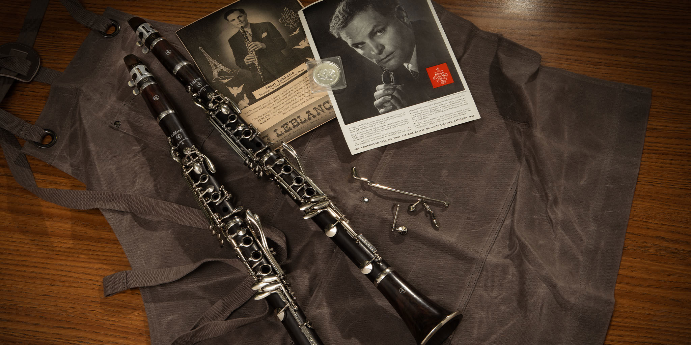

Đối với những ai chơi saxophone sẽ đâu đó thấy qua hãng kèn này. Bây giờ hãng cũng không còn nữa, do trong loạt bài về lịch sử các hãng kèn đồng sẽ có nhắc tới nó nên mình muốn viết vậy thôi.

## Lịch sử

`"G. Leblanc Cie"` được thành lập bởi **Georges Leblanc** (1872-1959) vào cuối thế kỷ 19 (khoảng 1890s) tại [La Couture-Boussey](https://en.wikipedia.org/wiki/La_Couture-Boussey) - Pháp. Năm 1904, công ty mua lại `Ets. D. Noblet`, một hãng kèn lâu đời của Pháp (được thành lập vào 1750) do Noblet không có người thừa kế. Trong thời kỳ này, **Georges** cùng con trai là **Leon** thành lập xưởng ở Paris như một phòng thí nghiệm về nhạc cụ bộ hơi. Họ đã tuyển dụng được [Charles Houvenaghel](https://fr.wikipedia.org/wiki/Charles_Houvenaghel) (1878-1966), được coi là một acoustician (nhà âm học?) vĩ đại, kể từ sau [Adolphe Sax](https://en.wikipedia.org/wiki/Adolphe_Sax).

## Đóng góp

Thành tựu của Leblanc đều có sự đóng góp lớn của **Charles Houvenaghel**.

- Năm 1908, cải tiến phím bấm cho soprano clarinet B♭.

## Tham khảo

- Wikipedia, [Leblanc (musical instrument manufacturer)](https://en.wikipedia.org/wiki/Leblanc_(musical_instrument_manufacturer))
- Wikipedia, [Georges Leblanc Paris](https://fr.wikipedia.org/wiki/Georges_Leblanc_Paris)
- Brass History, [Leblanc History](https://www.brasshistory.net/Leblanc%20History.pdf)
- Leblanc website, [History](https://web.archive.org/web/20060206213444/http://www.gleblanc.com/history/index.cfm)
- Trumpet History, [Leblanc Models](https://trumpet-history.com/Leblanc%20models.htm)
- Encyclopedia, [G. Leblanc Corporation](https://www.encyclopedia.com/books/politics-and-business-magazines/g-leblanc-corporation)
- SaxPics, [Leblanc History](http://www.saxpics.com/?v=man&manID=12)
- Saxophone.org, [Leblanc's History](https://www.saxophone.org/museum/saxophones/manufacturer/75/history/0)
- Conn Selmer, [Leblanc](https://www.connselmer.com/leblanc)
- Wikipedia, [Charles Houvenaghel](https://fr.wikipedia.org/wiki/Charles_Houvenaghel)
