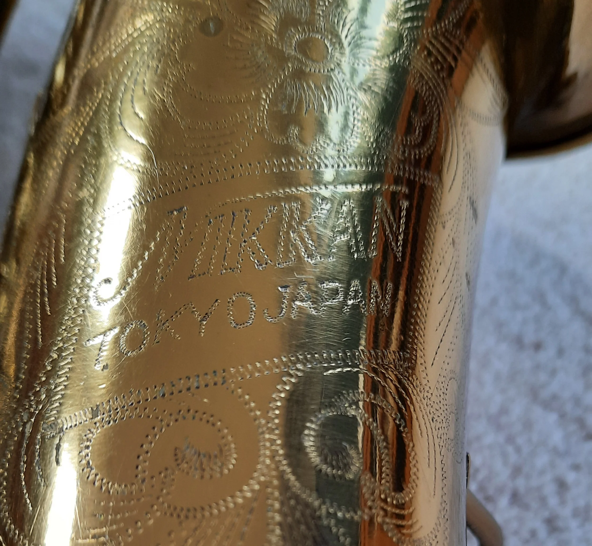
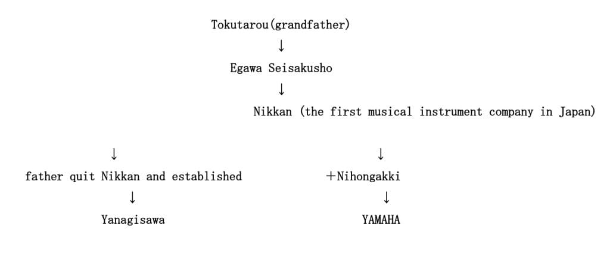
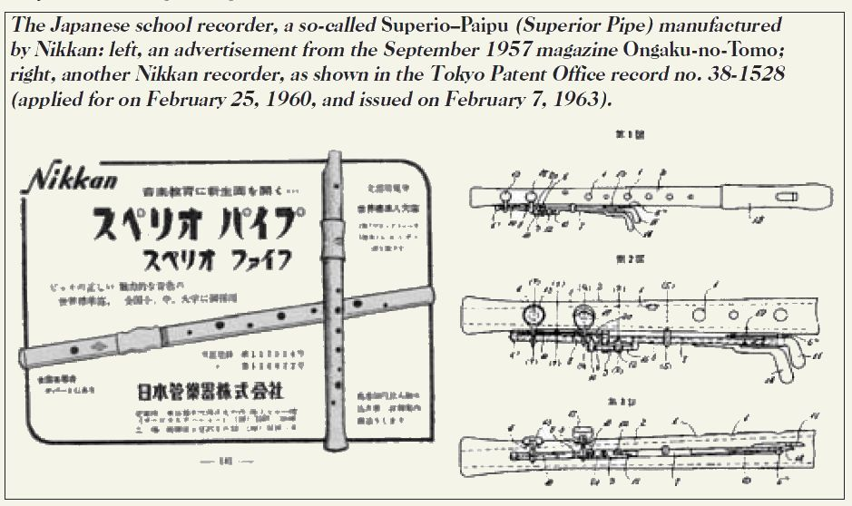
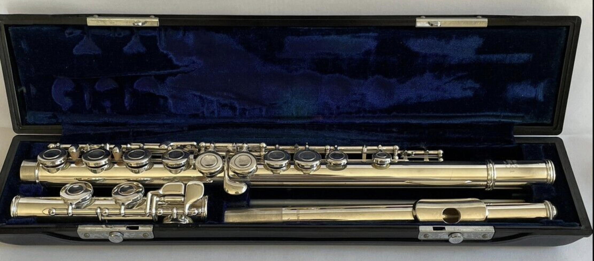
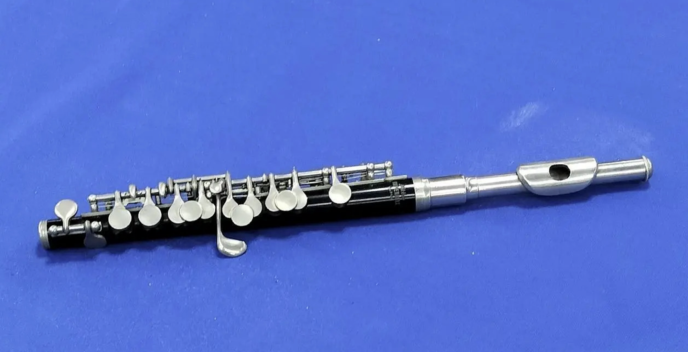
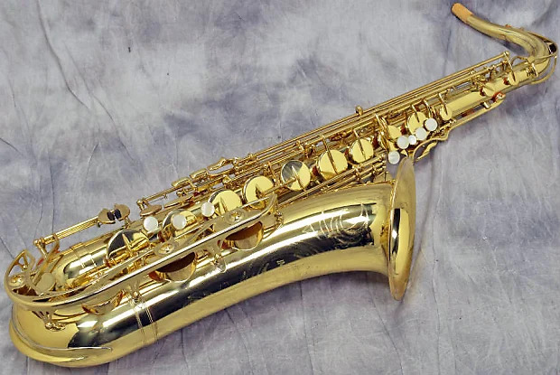
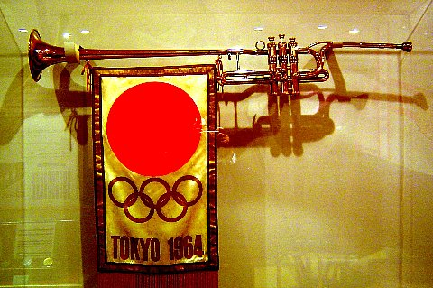
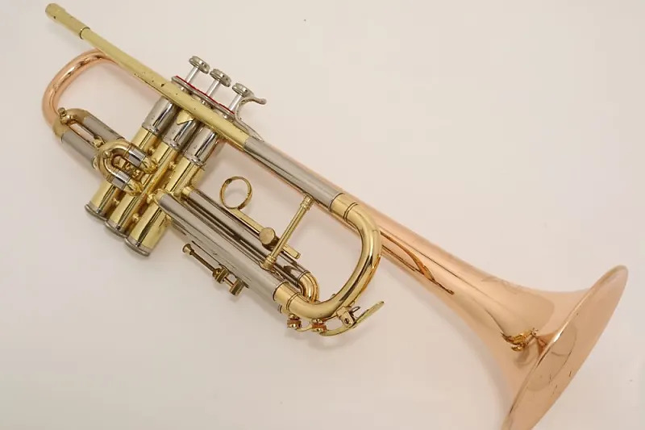
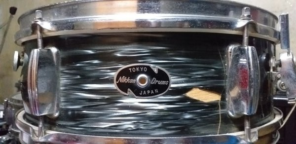
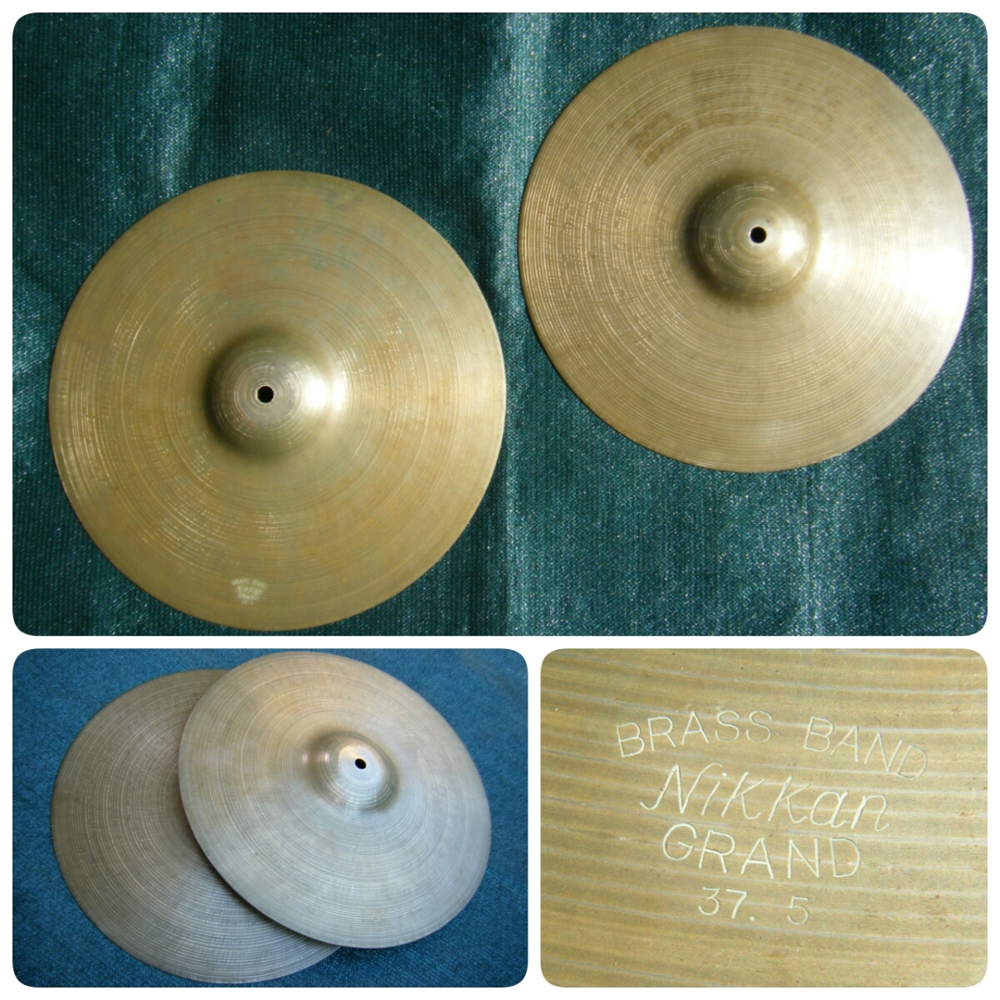

Chắc hẳn những ai chơi kèn cũng ít nhất đã từng thấy qua tên Nikkan, Nikkan Gakki. Có thể mọi người chỉ biết nó là một hãng kèn tới từ Nhật Bản, nhưng không biết nó là một phần quan trọng trong lịch sử công nghiệp nhạc cụ phương Tây của xứ sở hoa anh đào.

## Nikkan

Khoảng sau 1900, khi Nhật Bản gây chiến với nước ngoài, nhạc cụ phương Tây được du nhập vào trong nước. Tuy nhiên, vào thời gian này không có ai biết sửa kèn. Và những người thợ thủ công như người sửa chữa đền thờ bắt đầu học sửa nhạc cụ. Một trong số những người thợ thủ công đó có **Tokutaro Yanagisawa** cùng **Sentaro Egawa** thành lập `Egawa Seisakusho` là công ty sửa chữa nhạc cụ phương Tây đầu tiên ở Nhật Bản vào năm 1894, chủ yếu là nhạc cụ bộ gỗ cho quân nhạc. Có tài liệu khác cho rằng Nikkan được thành lập vào 1892.

Khúc này mới ly kỳ hấp dẫn nè, `Nihon Kangakki Kabushikigaisha` (hay được gọi là **Nikkan**) được lập bởi công ty `Egawa Seisakusho` sản xuất thêm trumpet, cornet và flute. Tới năm khoảng 1950s, sau khi Selmer hoàn thành các dòng saxophone như [Mark VI](https://www.selmer.fr/en/blogs/infos/history-notes-10-mark-vi) và [Balanced Action](https://www.selmer.fr/en/blogs/infos/history-notes-06-balanced-action). **Takanobu Yanagisawa** (con của **Tokutaro Yanagisawa**) bắt đầu nghiên cứu sản xuất saxophone để cạnh tranh với [Selmer](https://en.wikipedia.org/wiki/Henri_Selmer_Paris), [Conn](https://en.wikipedia.org/wiki/C._G._Conn) và [King](https://en.wikipedia.org/wiki/King_Musical_Instruments). **Takanobu** quyết định rời khỏi Nikkan và thành lập hãng kèn Yanagisawa cho tới bây giờ. Còn phía Nikkan sau khi **Takanobu** rời đi, đến 1970 được mua lại bởi [Nippon Gakki (tiền thân của Yamaha)](https://en.wikipedia.org/wiki/Yamaha_Corporation). Có một thông tin khác, Nikkan đã hợp tác với Yamaha từ năm 1937.

Dưới đây là sơ đồ được vẽ theo mô tả của **Nobushige Yanagisawa** - CEO hiện tại (2024) của Yanagisawa.

## Nhạc cụ của Nikkan

Lịch sử của Nikkan hiện không có nhiều, mình chỉ lượm lặt lại từ nhiều kênh riêng lẻ. 

### Recorder

Dạo các chợ nhạc cụ, về Recorder thì dòng Superior có vẻ phổ biến, nhưng khá ít hình ảnh về nó.

<iframe width="560" height="315" src="https://www.youtube.com/embed/Rme3mKvocg4?si=OH_dTPtHUOgF3-JP" title="YouTube video player" frameborder="0" allow="accelerometer; autoplay; clipboard-write; encrypted-media; gyroscope; picture-in-picture; web-share" allowfullscreen/>

Có một thông tin khác là tháng 9/1957, Nikkan có giới thiệu mẫu recorder có phím bấm như hình dưới, nhưng tìm không thấy hình.

### Flute

Về flute thì hầu như không có thông tin, chỉ thấy cách đánh mã của Nikkan được Yamaha sử dụng lại sau này, như alf FL-23, FL-31,... Về flute, thì theo như anh LeeHonSo, chất lượng của Nikkan không được cao, do lớp mạ nó khá dỏm.

### Piccolo

Thua toàn tập, chỉ có thể biết là Nikkan có sản xuất Piccolo thôi. Hình dưới đây là dòng Imperial.

### Saxophone

Về saxophone, Nikkan sản xuất các dòng Alto và Tenor, với các dòng Imperial, Imperiale, No1, No2.

Coi thêm hình tại https://bassic-sax.info/pix/index.php?/category/1223

### Trumpet

Trong lịch sử của hãng Nikkan, có lẽ điều tự hào với họ là mẫu Fanfare No.4 được sử dụng trong Olympic Tokyo năm 1964. 

Ngoài ra, dòng Imperial (TR-1) của Nikkan được Yamaha tái sử dụng cho mẫu YTR-1 trong năm 1966 và chỉ ở thị trường Nhật Bản.

### Trống

Có thông tin nói rằng trống của Nikkan là nhái thiết kế của [Slingerland](https://www.vintagedrumguide.com/slingerland_catalog_pages.html).

Vòng vòng trên mạng thì thấy có hình Snare, Bass và Hi-hat của Nikkan. Không rõ họ có sản xuất đủ bộ trống jazz không nữa.

## Đôi lời

Không như các hãng nhạc cụ phương Tây được kế thừa công nghệ với nhau, Nikkan chỉ biết đến nhạc cụ thông qua việc sửa chữa tận 1900 khi Nhật đi gây chiến với các nước, rồi dần tự sản xuất. Do đó, Nikkan phải đi nhái thiết kế của các hãng phương Tây, và chất lượng cũng chưa được tốt. Nhưng ít ra thì trong lịch sử phát triển nhạc cụ bộ đồng ở Nhật Bản nói riêng và cũng như thế giới nói chung, Nikkan đã đóng góp lớn, đối trọng với các hãng từ châu Âu và Mỹ.

## Tham khảo

- Sax on The Web, [Nikkan low serial no](https://www.saxontheweb.net/threads/nikkan-low-serial-no.390255)
- Sax on The Web, [1966 Nikkan 020- what is it related to?](https://www.saxontheweb.net/threads/1966-nikkan-020-what-is-it-related-to.89750)
- Jay Metcalf, [The Origin Of Yanagisawa Saxophones](https://bettersax.com/the-origin-of-yanagisawa-saxophones)
- Sherman Friedland, [Nikkan Gakki, quite acceptable prior to becoming Yamaha](https://clarinetcorner.wordpress.com/2012/12/21/nikkan-gakki-quite-acceptable-prior-to-becoming-yamaha)
- Wikipedia, [Yanagisawa Wind Instruments](https://en.wikipedia.org/wiki/Yanagisawa_Wind_Instruments)
- Conn-Selmer, [Yanagisawa](http://www.selmer.com/en-us/our-brands/yanagisawa)
- Yamaha Australia, [Xeno Behind Stories](https://au.yamaha.com/en/products/contents/winds/trumpet_custom/behind_stories/index.html)
- Nicholas S Lander, [Innovations in Recorder Design](https://www.recorderhomepage.net/history/innovations-in-recorder-design/)
- Nicholas S Lander, [Historic Makers](https://www.recorderhomepage.net/historic-makers/)
- CHUNICHI SHIMBUN,[Aichi police proudly displaying trumpet from 1964 Tokyo Olympics](https://www.japantimes.co.jp/news/2017/08/07/national/aichi-police-proudly-displaying-trumpet-1964-tokyo-olympics/)
- NiFTM ニッカン・ファンファーレ・トランペット 保存会, [Nikkan Fanfare Trumpet Memorial](http://sunlake.org/music/niftm/index.htm)
- YamahaCollector, [YTR-1 The Very First Yamaha Trumpet](https://www.facebook.com/media/set?set=a.242444402448703&type=3)
- TomiDrums, [Japanese Vintage "Nikkan" Drums](https://tomidrum.blogspot.com/2013/11/japanese-vintage-nikkan-drums.html)