Lần trước mình có mua [Canon Canonet QL17 GII](/hobbies/chi-dinh-thu-vai-cuon-phim), nhưng vì nhiều lý do nên mình đổi qua [Nikon S2](https://imaging.nikon.com/imaging/information/chronicle/rhnc08s2-e/). Trong quá trình tìm hiểu về Nikon S2, mình nhận ra đây không chỉ là một chiếc máy ảnh, mà còn là một bước ngoặt nhỏ nhưng quan trọng trong lịch sử rangefinder của Nikon.

## Khi Leica mở ra một kỷ nguyên mới

Bước vào thập niên 1950, nước Đức vẫn là trung tâm quan trọng nhất của ngành công nghiệp máy ảnh. `Leica` của [Ernst Leitz](https://leica-camera.com/en-US/press/four-generations-leitz-company-management-1869-1986) và `Contax` của [Zeiss Ikon](https://lenspire.zeiss.com/photo/en/article/a-compendium-of-the-history-of-zeiss-cameras) đã định hình phần lớn cuộc chơi rangefinder **35mm** trong nhiều thập kỷ trước đó. Trong khi đó, ngành máy ảnh Nhật Bản vẫn đang trong quá trình tìm kiếm bản sắc riêng. Nikon và Canon chịu ảnh hưởng rõ từ các thiết kế Đức, đặc biệt là Leica và Contax; còn Asahi Optical, Minolta, Olympus, Yashica… lại đang thử những hướng đi khác nhau.

Tháng 4/1954, tại Photokina ở Cologne, Leica cho ra mắt [Leica M3](https://www.kenrockwell.com/leica/m3.htm) — một chiếc rangefinder được hoàn thiện với nhiều cải tiến vượt bậc so với thời điểm đó:

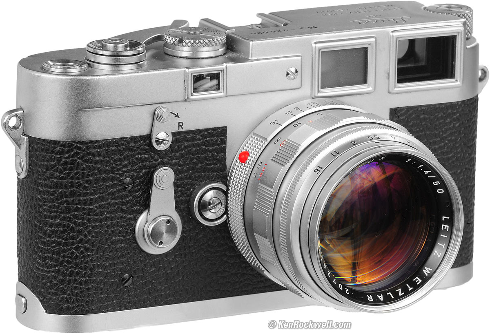

Theo thông tin từ [Leica Vietnam](https://www.facebook.com/share/p/1DRrTt28kh/):

> “M” là viết tắt của “Messsucher” — rangefinder trong tiếng Đức, thuật ngữ chỉ cách thức đo-ngắm khoảng cách khi chụp ảnh. Đây là hệ thống lấy nét độc lập với ống kính; khi sử dụng máy rangefinder, người chụp luôn quan sát khung hình chủ định rõ nét, hỗ trợ tối đa cho việc nắm bắt khoảnh khắc. Ban đầu, ký tự số “3” mang ý nghĩa chỉ ba khung hình được tự động điều chỉnh trong kính ngắm, dành cho các tiêu cự 50mm, 90mm và 135mm.

Tổng quan, Leica M3 mang đến nhiều trải nghiệm mới:

- Kết hợp rangefinder và viewfinder vào một khung ngắm lớn hơn, sáng hơn và dễ nhìn hơn.
- Tích hợp bright-line frameline cho các tiêu cự **50mm**, **90mm** và **135mm** ngay trong kính ngắm. Với các tiêu cự ngoài phạm vi này (như **35mm** trên bản M3 nguyên gốc), người dùng vẫn cần kính ngắm phụ.
- Giới thiệu ngàm M dạng **bayonet**, thay thế hoàn toàn ngàm **screw mount M39** trước đó, đồng thời đặt nền móng cho cả hệ thống Leica M sau này.
- Bộ đếm số khung hình tự động reset khi mở buồng phim, thay vì phải chỉnh tay.
- Gộp toàn bộ tốc độ màn trập vào cùng một núm chỉnh, thay cho cách bố trí tách riêng giữa tốc độ nhanh và chậm trên các máy Leica screw-mount trước đó.
- Thay núm xoay lên film bằng cần gạt nhanh và thuận tiện hơn.

Trước khi M3 xuất hiện, [Leica IIIf](https://www.kenrockwell.com/leica/screw-mount/iiif.htm) là đại diện tiêu biểu của dòng `Leica screw-mount`. Đặt hai chiếc máy cạnh nhau, có thể thấy rõ M3 không chỉ là một bản nâng cấp, mà gần như là một cuộc thiết kế lại toàn diện.

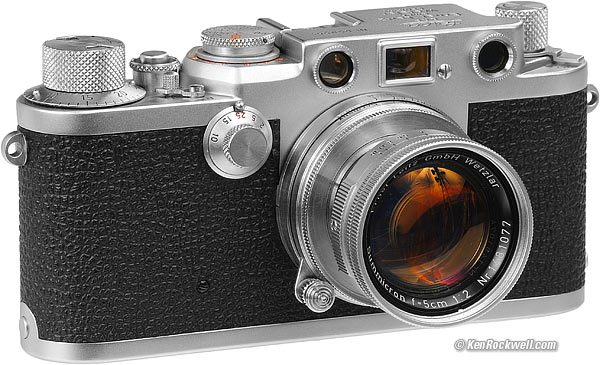

Vậy đúng lúc Leica đang mở ra một thế hệ rangefinder mới, Nikon đang đứng ở đâu?

## Nikon và con đường riêng

Như đã nói, lúc này ngành máy ảnh Nhật Bản vẫn đang tìm bản sắc. Canon những năm đầu đi khá gần với con đường của [Leica](https://global.canon/en/c-museum/history/story01.html), còn Nikon lại chọn học hỏi nhiều hơn từ [Contax](https://imaging.nikon.com/imaging/information/chronicle/rhnc09s-e/index.html).

Nikon bắt đầu cuộc chơi rangefinder sau chiến tranh với các mẫu [Nikon I](https://www.nikonmuseum.com/post/the-beginning-of-a-big-era-nikon-i), [Nikon M](https://www.pacificrimcamera.com/pp/nikonm.htm) và [Nikon S](https://elrectanguloenlamano.blogspot.com/2014/07/nikon-s-beginning-of-success.html). Ảnh hưởng từ Contax thể hiện rõ trên những thế hệ đầu, đặc biệt ở hệ ngàm [bayonet S-mount](https://www.photoethnography.com/ClassicCameras/index-frameset.html?Lens-CS.html~mainFrame) với hai vòng ngàm đồng tâm dành cho các nhóm ống kính khác nhau. Từ nền tảng đó, Nikon dần xây dựng hệ thống của riêng mình với các ống kính Nikkor do Nippon Kogaku tự phát triển và những thay đổi liên tục qua từng thế hệ.

Đến năm 1954, quá trình đó dẫn tới Nikon S2 — chiếc rangefinder mới nhất và hoàn thiện nhất của Nikon vào thời điểm ấy. Khi S2 bước vào giai đoạn cuối của quá trình phát triển, các linh kiện sản xuất đã được triển khai từ năm 1953.

Sự xuất hiện của Leica M3 trở thành một cú hích đối với đội ngũ kỹ thuật của Nikon. Họ nhìn lại những thông số cuối cùng của S2 trước khi đưa máy ra thị trường.

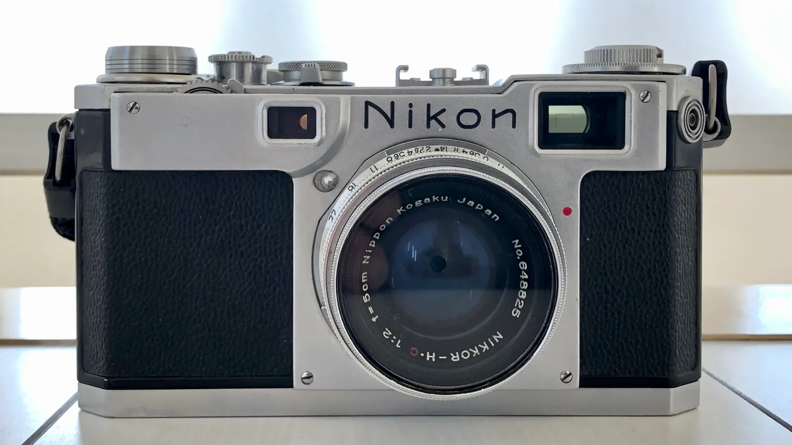

M3 không khiến Nikon làm lại S2 theo hướng của Leica. Nó xuất hiện đúng vào thời điểm Nikon đang đứng trước chiếc rangefinder hoàn chỉnh nhất của mình, trở thành cú hích để họ đẩy S2 đi thêm một bước trước khi ra mắt.

Và có lẽ, chính từ chiếc máy này, Nikon bắt đầu nhìn thấy rõ hơn khả năng của bản thân: họ không chỉ có thể làm một chiếc rangefinder tốt, mà còn có thể tiếp tục đẩy giới hạn của nó đi xa hơn nữa.

## Nikon S2 — Một bước nhỏ nhưng quan trọng

> “That's one small step for man, one giant leap for mankind.” — Neil Armstrong

Câu nói này hơi hơi liên quan tới Nikon S2. Bản thân S2 có thể không phải là chiếc máy đưa Nikon lên đỉnh cao của rangefinder, nhưng nó là bước quan trọng để Nikon nhận ra họ có thể đi xa tới đâu. Trước hết, hãy nhìn vào những gì Nikon đã làm được với chiếc máy này.

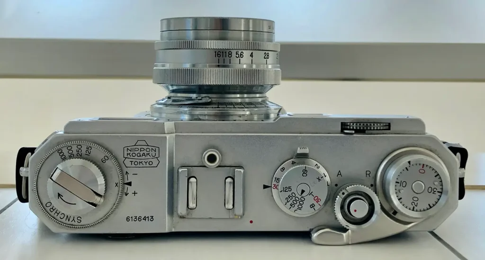

Nikon S2 là máy ảnh rangefinder hoạt động **hoàn toàn bằng cơ khí** và **không có hệ thống đo sáng tích hợp**. Khi chụp, người dùng phải tự đo sáng bằng máy đo sáng rời hoặc ước lượng theo các quy tắc như [Sunny 16](https://en.wikipedia.org/wiki/Sunny_16_rule).

Nhìn từ phía trên, vòng tròn hai tầng ở giữa là vòng chỉnh tốc độ màn trập. Tầng dưới dùng cho các tốc độ chậm, tầng trên dùng cho các tốc độ nhanh. Với một chiếc máy không có đo sáng tích hợp, thiết kế này không phải vấn đề quá lớn: bạn đo sáng bên ngoài rồi mới chọn tốc độ và khẩu độ phù hợp. Nhưng nếu phải vừa quan sát thông số vừa thao tác trực tiếp trên máy, cách bố trí hai tầng rõ ràng kém thuận tiện hơn — một trong những điểm mà Leica M3 đã cải thiện bằng cách đưa tất cả tốc độ vào cùng một núm chỉnh.

Bánh xe ngoài cùng bên phải là bộ đếm số khung hình. Sau khi thay film, bạn phải tự đặt lại về vị trí `0`. Hoặc cũng có thể kệ nó; khi cần gạt không lên được nữa thì biết là đã hết film. Leica M3 sau này đã tự động reset bộ đếm khi mở đáy máy để thay film.

Cần gạt lên film của S2 đã sử dụng cơ chế một lần gạt tương tự những chiếc Leica M-series đầu tiên. Có một chi tiết nhỏ mình khá thích: khi máy đã được lên film và sẵn sàng chụp, hai mũi tên trên vòng chỉnh tốc sẽ nằm đối đầu nhau. Nhờ đó, bạn có thể nhìn nhanh để biết máy đã lên film hay chưa — một cách hữu ích để tránh vô tình lên film trong balo hoặc túi xách rồi tốn oan một khung hình.

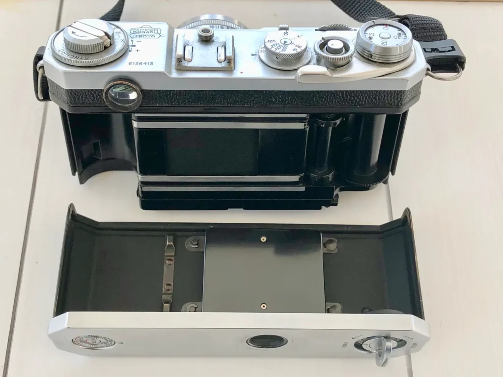

Bạn không thấy chỗ chỉnh ISO đúng không? Đơn giản là Nikon S2 không có hệ thống đo sáng tích hợp, nên vòng chỉnh ASA ở đây chỉ mang tính chất ghi nhớ thông số của cuộn film đang sử dụng. Vòng này nằm ở đáy máy và khá cứng, phải dùng một vật nhỏ như đầu vít để xoay phần bên trong.

Ở vị trí viewfinder, bạn sẽ thấy một khung màu vàng. Đây là frameline dành cho tiêu cự `5cm` (hay `50mm` theo cách gọi ngày nay) — và cũng là frameline duy nhất được tích hợp trên Nikon S2. Thiết kế kính ngắm Galilean với độ phóng đại `0.9x` được thay bằng kính ngắm Albada `1.0x`.

Điều đáng chú ý là khi nhìn qua kính ngắm, bạn không chỉ thấy khung hình mà còn thấy luôn rangefinder patch (điểm vàng) ở giữa để lấy nét. Tức là Nikon đã kết hợp việc ngắm và lấy nét vào cùng một khung ngắm, thay vì phải nhìn qua hai cửa sổ riêng như những chiếc rangefinder đời cũ.

Tuy nhiên, Nikon S2 vẫn chỉ được tối ưu cho ống kính tiêu chuẩn 5cm. Khi sử dụng những tiêu cự khác, người chụp vẫn phải dùng viewfinder gắn ngoài để xác định khung hình. Đây cũng là một trong những khác biệt lớn giữa S2 và Leica M3, vốn đã tích hợp nhiều frameline cho các tiêu cự khác nhau ngay trong kính ngắm.

Chức năng synchro để chụp với flash thì mình không bàn tới, vì đơn giản là mình không dùng flash nên cũng không có nhiều trải nghiệm với nó.

Và thứ mình thích nhất trên Nikon S2 này là hệ thống lấy nét.

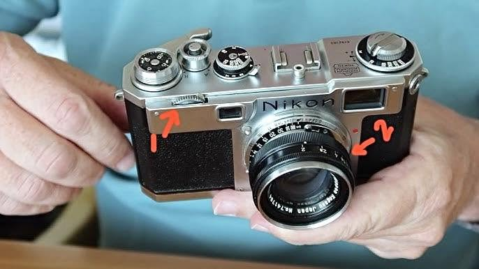

Bạn vẫn có thể lấy nét bằng cách xoay vòng lấy nét trên ống kính như bao ống kính MF _(manual focus)_ khác, ở vị trí số `2` trong hình. Nhưng đồng thời, khi xoay ống kính thì bánh xe lấy nét ở vị trí số `1` cũng sẽ xoay theo.

Điều này khá tiện với hệ ống kính ngàm S. Hành trình lấy nét của các ống kính này tương đối dài, nên thay vì phải xoay trực tiếp vòng lấy nét trên ống kính, bạn có thể dùng bánh xe nhỏ trên thân máy để điều chỉnh chính xác hơn khi canh rangefinder patch.

Một chi tiết cần lưu ý là khi xoay tới vị trí vô cực, cơ chế lấy nét sẽ được khóa lại. Để xoay trở lại, bạn phải gạt lẫy trên bánh xe lấy nét hoặc gạt nút khóa nằm bên dưới cửa sổ rangefinder — cái nút có hình khá giống một viên đạn.

Tóm lại, Nikon S2 vẫn chưa phải là chiếc máy hoàn thiện về mặt trải nghiệm như Leica M3. Một số thứ mà M3 đã giải quyết tốt hơn — như hệ thống kính ngắm đa tiêu cự hay cách bố trí các thao tác trên thân máy — vẫn chưa xuất hiện trên S2.

Nhưng Nikon cũng không cố biến S2 thành một bản sao của M3. Thay vào đó, họ giữ lại nền tảng mà mình đã xây dựng, hoàn thiện những gì cần thiết và đưa chiếc máy ra thị trường.

Có lẽ chính Nikon S2 đã cho họ một câu trả lời quan trọng: `Nền tảng đó đủ tốt để tiếp tục đi xa hơn?`

Và Nikon đã không dừng lại ở đó.

## Từ tiềm năng đến đỉnh cao, rồi đến số đông

### Nikon SP

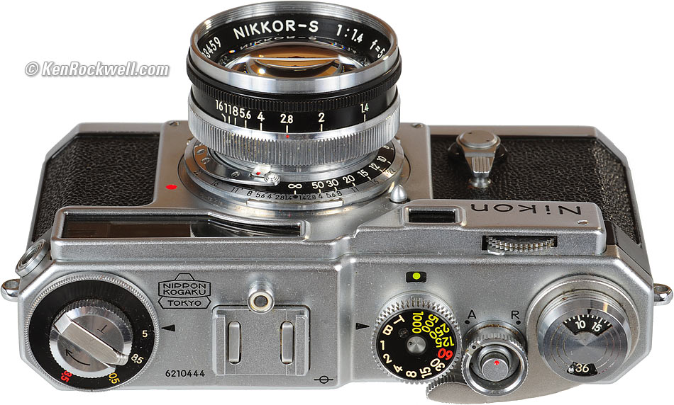

**Nikon SP** là câu trả lời của Nikon cho câu hỏi: nền tảng đó đủ tốt để tiếp tục đi xa hơn không?

Nếu Nikon S2 là chiếc máy giúp Nikon nhận ra tiềm năng của mình, thì SP là lúc họ bắt đầu khai thác toàn bộ tiềm năng đó. Những thay đổi đầu tiên có thể thấy ngay trên thân máy, đặc biệt là cách Nikon hoàn thiện những thao tác mà người chụp phải thực hiện hàng ngày.

Vòng chỉnh tốc độ màn trập đã chuyển từ thiết kế hai tầng trên S2 sang một núm xoay duy nhất. Các tốc độ nhanh và chậm giờ đây được đặt chung trên cùng một vòng chỉnh, giúp việc thay đổi thông số trực quan và thuận tiện hơn.

Bộ đếm số khung hình cũng được tự động đặt lại khi mở đáy máy để thay film. Hai mốc `20` và `36` đóng vai trò tham chiếu cho những loại cuộn film phổ biến vào thời điểm đó. Ngoài ra, film 35mm vẫn có những độ dài khác như `12` hoặc `24` kiểu.

Ô cửa sổ nhỏ nằm phía trên vòng chỉnh tốc độ màn trập là **flash synchro selector**. Nó dùng để điều chỉnh thời điểm máy kích hoạt flash nhằm đồng bộ với màn trập. Nikon SP sử dụng các vị trí màu khác nhau để phù hợp với từng loại flashbulb, trong khi vị trí `FX` dành cho electronic flash. Nếu không sử dụng flash thì thiết lập này không ảnh hưởng tới việc chụp bình thường.

Một thay đổi khác là cơ chế hẹn giờ chụp. Trên Nikon SP, Nikon đưa nó thành một cần gạt riêng nằm bên hông ống kính. Bạn chỉ cần gạt cần, sau đó bấm nút chụp và máy sẽ đếm ngược khoảng 10 giây trước khi màn trập hoạt động.

Nikon S2 cũng có chức năng này, nhưng thao tác phức tạp hơn khá nhiều. Với SP, Nikon tiếp tục đơn giản hóa những cơ chế vốn đã tồn tại trên thế hệ trước để người dùng có thể thao tác nhanh và trực quan hơn.

Nhưng những thay đổi trên vẫn chủ yếu nằm ở trải nghiệm sử dụng. Thứ thực sự khiến Nikon SP khác biệt lại nằm ở nơi người chụp nhìn vào chiếc máy.

#### Một hệ thống kính ngắm cho cả hệ ống kính

Trên Nikon S2, người dùng chỉ có một frameline duy nhất dành cho ống kính tiêu chuẩn `5cm`. Nếu sử dụng các tiêu cự khác, bạn cần một external viewfinder để xác định khung hình.

Nikon SP giải quyết vấn đề này bằng cách xây dựng một hệ thống kính ngắm dành cho nhiều tiêu cự khác nhau.

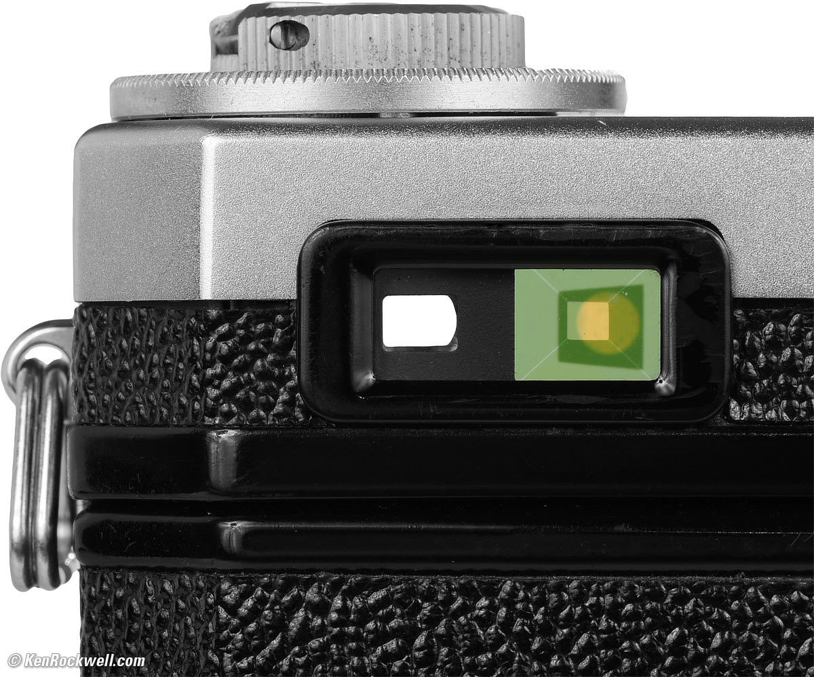

Nhìn từ phía trước, Nikon SP có tới hai cửa sổ kính ngắm. Kính ngắm chính bên phải hỗ trợ các tiêu cự `5cm`, `8.5cm`, `10.5cm` và `13.5cm`.

Vòng xoay bên trái thân máy, với các con số `5`, `8.5`, `10.5` và `13.5`, chính là nơi để chọn tiêu cự đang sử dụng. Khi xoay vòng này, frameline tương ứng sẽ xuất hiện trong kính ngắm chính.

Nhờ đó, khi thay đổi ống kính, người chụp không còn phải gắn thêm một viewfinder riêng bên ngoài. Chỉ cần chọn đúng frameline tương ứng với tiêu cự của ống kính.

Hệ thống này cũng có cơ chế bù thị sai. Khi lấy nét ở khoảng cách gần, vị trí của frameline sẽ thay đổi để bù lại sự khác biệt giữa vị trí của kính ngắm và vị trí thực tế của ống kính.

Tuy nhiên, bài toán trở nên khó hơn khi Nikon muốn hỗ trợ các tiêu cự góc rộng.

Các tiêu cự từ `5cm` đến `13.5cm` vẫn có thể được đưa vào trường nhìn của kính ngắm chính. Nhưng với `3.5cm`, và đặc biệt là `2.8cm`, góc nhìn rộng hơn rất nhiều.

Thay vì cố gắng đưa tất cả vào một kính ngắm duy nhất, Nikon đặt thêm một kính ngắm góc rộng bên cạnh.

Kính ngắm thứ hai này hỗ trợ hai tiêu cự `2.8cm` và `3.5cm`.

Với ống kính `3.5cm`, người dùng có frameline để xác định khung hình. Còn với `2.8cm`, Nikon sử dụng toàn bộ trường nhìn của kính ngắm góc rộng làm vùng tham chiếu cho góc nhìn của ống kính.

Đổi lại, hai kính ngắm này không làm cùng một nhiệm vụ.

Kính ngắm chính chứa rangefinder patch, vì vậy bạn sử dụng nó để lấy nét. Khi dùng ống kính `2.8cm` hoặc `3.5cm`, sau khi lấy nét xong, bạn phải chuyển mắt sang kính ngắm góc rộng để bố cục.

Đây rõ ràng không phải là giải pháp đơn giản nhất. Nhưng nó cho thấy tham vọng của Nikon với SP: thay vì chỉ tối ưu chiếc máy cho một hoặc hai tiêu cự phổ biến, họ muốn người dùng có thể sử dụng cả một hệ thống ống kính từ `2.8cm` đến `13.5cm` mà không cần mang theo external viewfinder.

Nếu Nikon S2 chỉ có một frameline dành cho `5cm`, thì Nikon SP đã biến kính ngắm thành một hệ thống có thể phục vụ gần như toàn bộ hệ ống kính rangefinder của Nikon.

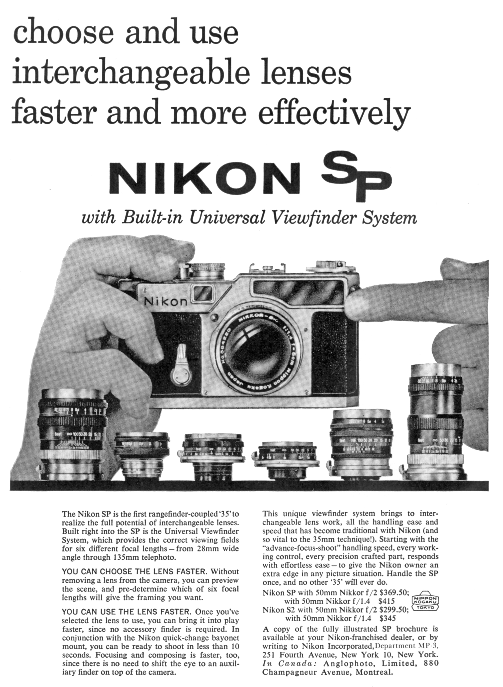

#### Những thay đổi bên trong

Nikon không chỉ cải thiện những gì người chụp có thể nhìn thấy và thao tác bên ngoài. Bên trong thân máy, hệ thống màn trập cũng tiếp tục được cải tiến.

Từ [Nikon I](https://www.nikonmuseum.com/post/the-beginning-of-a-big-era-nikon-i) cho tới S2, Nikon vẫn sử dụng một nền tảng màn trập được kế thừa và hoàn thiện qua từng thế hệ. Đến Nikon SP, họ tiếp tục cải tiến cơ cấu này với hệ thống tăng tốc cho rèm sau và một cơ chế hãm mới nhằm giảm chấn động khi màn trập hoạt động.

Nhờ đó, màn trập trên SP có thể hoạt động ổn định hơn ở tốc độ cao `1/1000s`, đồng thời giảm tiếng động và độ rung khi chụp. Nikon cũng đạt được tốc độ đồng bộ flash `1/60s`.

Những chiếc Nikon SP đầu tiên sử dụng rèm màn trập bằng lụa *habutae* phủ cao su. Từ khoảng tháng 5 năm 1959, Nikon bắt đầu sử dụng rèm titanium trên những chiếc SP sản xuất sau đó, thay cho rèm vải truyền thống.

Có thể nói, Nikon SP không phải là một chiếc Nikon S2 được nâng cấp đơn thuần.

Nếu S2 là lúc Nikon chứng minh rằng họ có thể tạo ra một chiếc rangefinder đủ tốt để đứng cạnh những cái tên lớn của thời đại, thì SP là lúc họ gần như đặt toàn bộ những gì mình có vào một chiếc máy.

Họ cải thiện cách người dùng thao tác với máy, mở rộng hệ thống kính ngắm cho cả một dải tiêu cự từ `2.8cm` đến `13.5cm`, đồng thời tiếp tục hoàn thiện cả những cơ cấu nằm sâu bên trong thân máy.

Và có lẽ đó là lý do Nikon SP thường được xem là đỉnh cao của dòng rangefinder Nikon.

### Nikon S3

Nếu Nikon SP là chiếc máy mà Nikon gần như đặt toàn bộ khả năng kỹ thuật của mình vào đó, thì Nikon S3 lại đi theo một hướng khác.

Nikon không cố gắng làm một chiếc SP tốt hơn. Thay vào đó, họ lấy phần lớn nền tảng kỹ thuật của SP và loại bỏ những cơ chế phức tạp, đắt tiền mà không phải người dùng nào cũng thực sự cần.

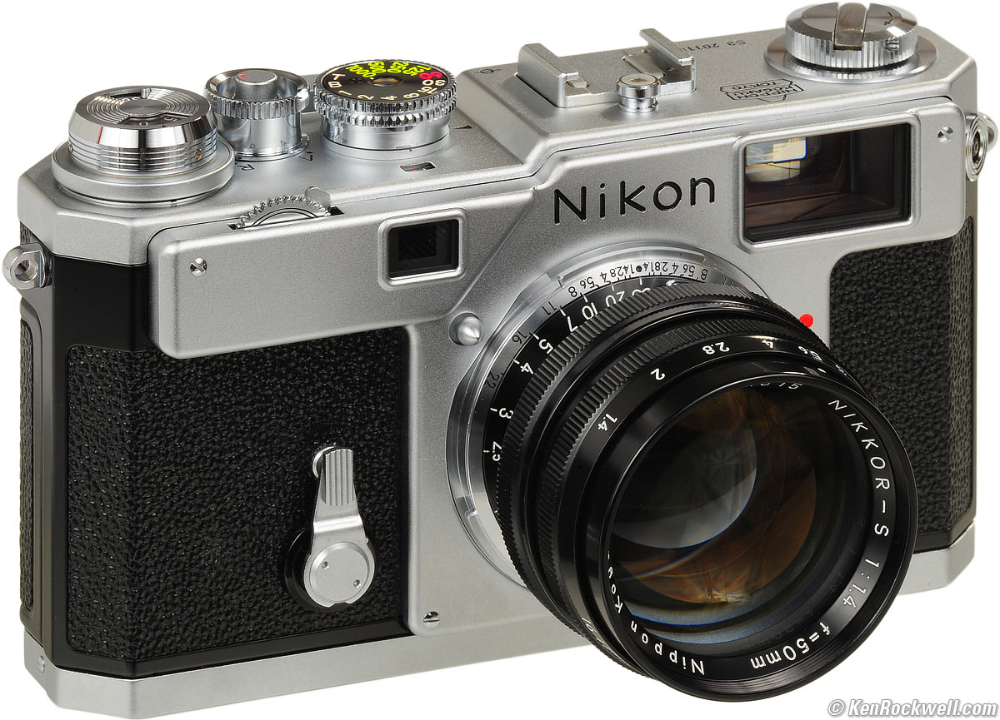

Về cơ bản, Nikon S3 vẫn sử dụng thân máy và hệ thống rangefinder tương tự SP. Máy vẫn có kính ngắm lớn, sáng và rangefinder tích hợp. Nhưng hệ thống kính ngắm kép phức tạp trên SP đã được thay bằng một kính ngắm duy nhất.

Điều này đồng nghĩa với việc S3 không còn cố gắng hỗ trợ toàn bộ dải tiêu cự từ `2.8cm` tới `13.5cm` ngay trong thân máy. Mà Nikon tập trung vào ba tiêu cự phổ biến hơn: `3.5cm`, `5cm` và `10.5cm`. Ba frameline này được đặt chung trong một kính ngắm duy nhất, với cơ chế tự động chuyển khung hình khi thay ống kính.

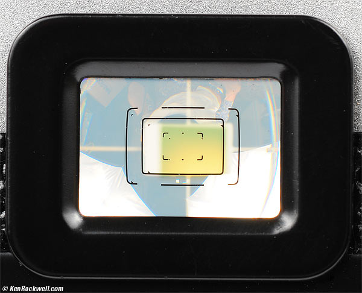

So với SP, đây rõ ràng là một bước lùi về mặt thông số.

Nhưng nếu nhìn theo cách khác, Nikon S3 đang làm một việc rất thực tế: giữ lại những gì quan trọng nhất với phần lớn người dùng, đồng thời loại bỏ một hệ thống kính ngắm kép cực kỳ phức tạp và tốn kém để sản xuất. Mục tiêu của S3 không phải là vượt qua SP, mà là đưa tinh hoa kỹ thuật của SP đến gần hơn với nhiều người hơn.

## Một bước nhỏ

Nikon S2 không đưa Nikon tới đỉnh cao của rangefinder. Nhưng nó là bước quan trọng giúp họ nhìn rõ khả năng của chính mình.

Họ có thể bắt chước Leica M3. Nhưng họ không làm vậy. Thay vào đó, họ chọn cải thiện những chỗ hợp lý trên nền tảng đã có của S2, rồi dồn toàn bộ tinh hoa kỹ thuật vào Nikon SP — chiếc máy gần như chứa đựng tất cả những gì Nikon có thể làm được với rangefinder lúc bấy giờ.

Sau đó, họ vẫn muốn đưa những thành quả đó đến với nhiều người hơn, nên mới có Nikon S3 — phiên bản thực tế hơn, dễ tiếp cận hơn, dù phải đánh đổi một số tham vọng kỹ thuật.

Có lẽ đó mới là phần thú vị nhất trong câu chuyện này: không phải lúc nào cũng cần nhảy một bước khổng lồ. Đôi khi chỉ cần một bước nhỏ, đủ để nhìn thấy rõ hơn con đường phía trước, rồi từ đó tiếp tục đi xa hơn theo cách của riêng mình.

## Tham khảo
- Nikon Corporation, [Nikon Rangefinder Cameras](https://imaging.nikon.com/imaging/information/chronicle/history_e/index.html#id05)
- Wikipedia, [Leica M Mount](https://en.wikipedia.org/wiki/Leica_M_mount)
- Wikipedia, [M39 lens mount](https://en.wikipedia.org/wiki/M39_lens_mount)
- Ken Rockwell, [Leica M3](https://www.kenrockwell.com/leica/m3.htm)
- KJ Vogelius, [Leica M3 - An indisputable classic](https://gear.vogelius.se/-editorials/leica-m3/index.html#viewfinder)
- M. Butkus, [Contax 35mm Guide - Contassa 35, Contina 35, Ikonta 35 instruction manuals](https://www.cameramanuals.org/contax/contax_guide.pdf)
- Pacific Rim Camera, [Zeiss Ikon Finders for Contax](https://www.pacificrimcamera.com/pp/zicontaxfinder.htm)
- Camera-Wiki, [Leica (Screw-mount)](https://camera-wiki.org/wiki/Leica_(Screw-mount))
- Nikon Corporation, [Vol. 8. Nikon S2](https://imaging.nikon.com/imaging/information/chronicle/rhnc08s2-e/)
- Leica Historica, [The Leica M3](https://leicahistorica.com/M3.html)
- Ken Rockwell, [Leica IIIf](https://www.kenrockwell.com/leica/screw-mount/iiif.htm)
- Canon Camera Museum, [1933-1936: The birth of Canon](https://global.canon/en/c-museum/history/story01.html)
- Nikon Corporation, [Vol. 9. Nikon S/M/I](https://imaging.nikon.com/imaging/information/chronicle/rhnc09s-e/index.html)
- John E. Greivenkam, [Camera Systems](https://wp.optics.arizona.edu/jgreivenkamp/wp-content/uploads/sites/11/2019/08/502-23-Camera-Systems.pdf) at University of Arizona,College of Optical Sciences - "Optical Design and Instrumentation I"
- Wikipedia, [Sunny 16 rule](https://en.wikipedia.org/wiki/Sunny_16_rule)
- Av Mooda, [Nikon S2 rangefinder focusing method?](https://www.facebook.com/groups/1591757517518383/posts/25152734657660671/) at Facebook's group - "Rangefinder Cameras"
- Nikon Corporation, [Vol. 7. Nikon SP/S3/S3M/S4](https://imaging.nikon.com/imaging/information/chronicle/rhnc07sp-e/)
- Ken Rockwell, [Nikon SP User's Guide](https://kenrockwell.com/nikon/rangefinder/sp-users-guide.htm)
- Nikon Corporation, [Nikon SP Limited Edition](https://imaging.nikon.com/imaging/information/chronicle/history-sp/index.html?utm_source=chatgpt.com)
- Mike Eckman, [Nikon SP (1957)](https://mikeeckman.com/2019/02/nikon-sp-1957/)
- hometecheasy, [The Beginning of a Big Era: Nikon I](https://www.nikonmuseum.com/post/the-beginning-of-a-big-era-nikon-i) at Nikon Museum
- Pacific Rim Camera, [Nikon M](https://www.pacificrimcamera.com/pp/nikonm.htm)
- Pacific Rim Camera, [Nikon S](https://www.pacificrimcamera.com/pp/nikons.htm)
- José Manuel Serrano Esparza, [NIKON S : THE BEGINNING OF SUCCESS](https://elrectanguloenlamano.blogspot.com/2014/07/nikon-s-beginning-of-success.html) at El Rectángulo en la Mano
- José Manuel Serrano Esparza, [NIKON S: THE BEGINNING OF SUCCESS ( I I )](https://elrectanguloenlamano.blogspot.com/2014/08/nikon-s-beginning-of-success-i-i.html) at El Rectángulo en la Mano
- Karen Nakamura, [Contax and Nikon Rangefinder Bayonet Mount Lenses](https://www.photoethnography.com/ClassicCameras/index-frameset.html?Lens-CS.html~mainFrame) at PhotoEthnography
