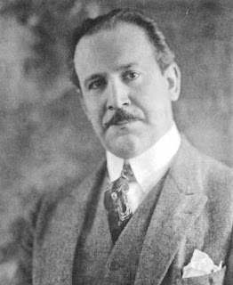
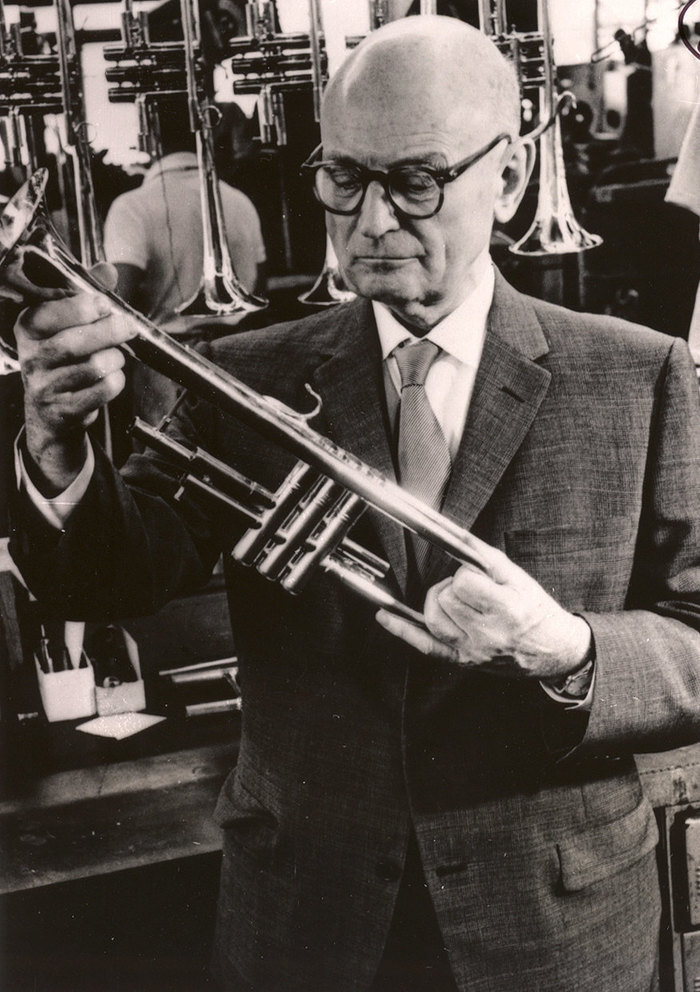
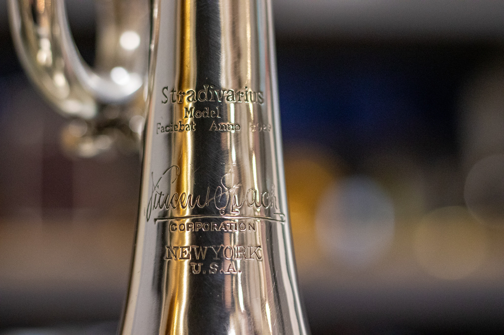
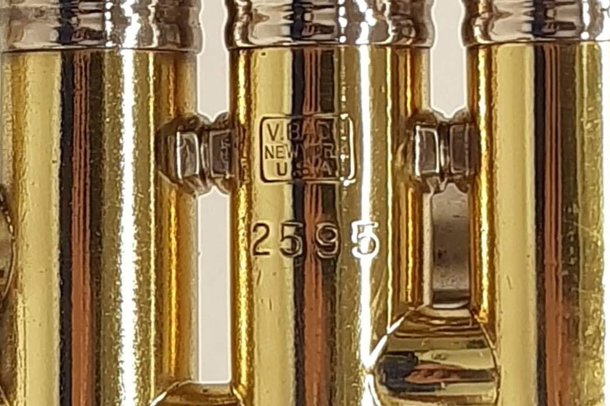
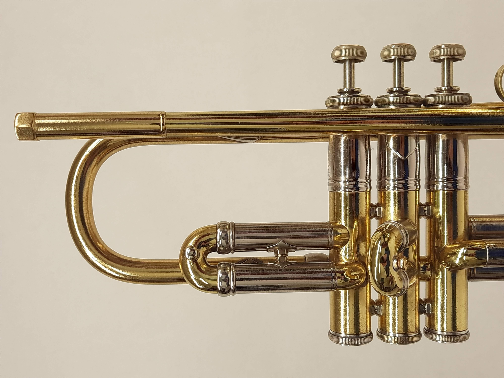
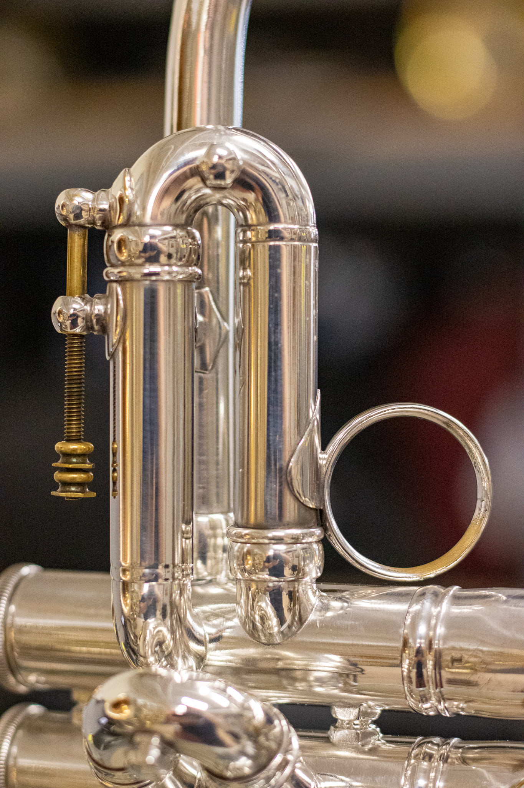
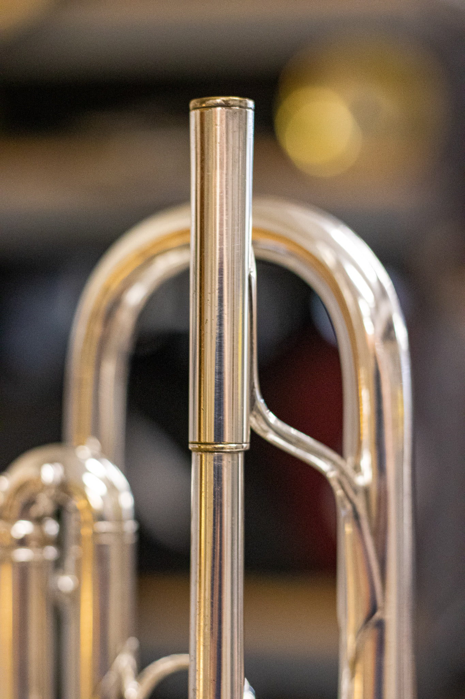
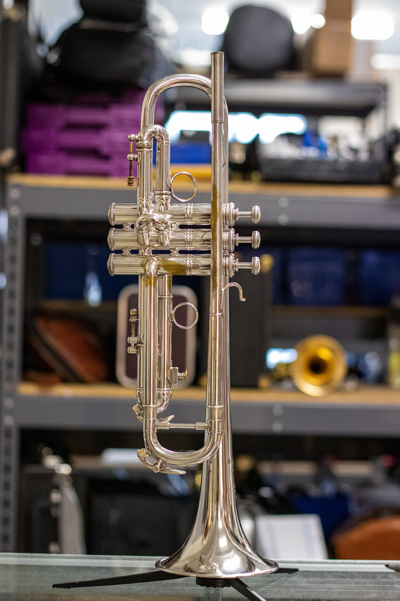

<iframe width="315" height="560"
src="https://www.youtube.com/embed/NnadaA7lv9Y"
title="YouTube video player"
frameborder="0"
allow="accelerometer; autoplay; clipboard-write; encrypted-media; gyroscope; picture-in-picture; web-share"
allowfullscreen></iframe>

Số là mình được YouTube gợi ý clip này, thắc mắc là cây trumpet nào được định giá tới 72,000 USD. Trong phần bình luận có người chia sẻ các cây lần lượt là:

1. Max Schlossberg's 1929 NY Bach 6L/6 ($72,500)
2. 1968 Olds Recording ($1,500)
3. Wallace Roney's 1980 Martin Committee ($17,000)
4. "Seahorse" (Priceless)
5. Midtown Brass Pocket Trumpet ($475)
6. Kalison Mini Trumpet #16 ($3,500)

Câu hỏi đặt ra là thế éo nào một cây Vincent Bach Stradivarius mà giá lên tới tận 72,500 USD dữ vậy? Theo thời giá năm 2024, một cây **Vincent Bach Stradivarius** _(Bach Strad)_ đời New York không quá 5,000 USD.

## Lịch sử

### Max Schlossberg

Mặc dù có tìm hiểu về lịch sử liên quan tới kèn trumpet cũng lâu, nhưng mình mới biết ông này lúc viết bài này.

**Max Sclossberg** (1873 - 1936) sinh ra tại Libau, Latvia. Ông học nhạc tại Học viện Âm nhạc Quốc gia Moscow. Sau đó, ông qua Mỹ và trở thành thành viên của New York Philharmonic 1910 - 1936.

Ngoài việc biểu diễn, ông còn dạy ở Juilliard Graduate School, và được coi là người sáng lập ra trường dạy chơi trumpet tại Mỹ. Và được [William Vacchiano](https://en.wikipedia.org/wiki/William_Vacchiano) đánh giá là bậc thầy về giảng dạy trong thời kỳ của ông.

Flexing giúp Max Sclossberg, học trò của ông có một số cái tên nổi bật như:
- **Elden E. Benge** (1904 - 1960), nhà sáng lập hãng kèn Benge
- **Renold O. Schilke** (1910 - 1982), nhà sáng lập hãng kèn Schilke
- **Harry James** (1916 - 1983), nghệ sĩ trumpet nổi tiếng người Mỹ
- **William Vacchiano** (1912 - 2005), nghệ sĩ trumpet và là thầy của [Wynton Marsalis](https://en.wikipedia.org/wiki/Wynton_Marsalis), [Miles Davis](https://en.wikipedia.org/wiki/Miles_Davis).

Ông có viết cuốn sách [Daily Drills and Technical Studies for Trumpet](https://www.amazon.com/Daily-Drills-Technical-Studies-Trumpet/dp/B001XFTGOC) là một cuốn chân kinh của trumpet, ngang hàng với cuốn [Arban's Complete Conservatory Method for Trumpet](https://www.amazon.com/Complete-Conservatory-Trumpet-Baritone-Euphonium/dp/0825803853)  của [Jean B. Arban](https://en.wikipedia.org/wiki/Jean-Baptiste_Arban).

### Hãng kèn Vincent Bach

`Vincent Bach` là tên của một hãng kèn nổi tiếng của Mỹ, được thành lập bởi nghệ sĩ, nhạc sĩ, kỹ sư, doanh nhân **Vincent Bach**, tên gốc là **Vincenz Schrottenbach** (24/03/1980 - 08/01/1976).

Lấy ý tưởng từ những cây đàn hiệu [Stradivarius](https://en.wikipedia.org/wiki/Stradivarius) được làm bởi [Antonio Stradivari](https://en.wikipedia.org/wiki/Antonio_Stradivari) (1644 - 1737), tên tiếng Latin là **Antonius Stradivarius**. Vincent Bach mong muốn làm ra một dòng nhạc cụ cao cấp nhất và cho tới hiện tại (năm 2024) thì nó vẫn là dòng nhạc cụ định hình chuẩn mực cho nhạc cụ chơi nhạc cổ điển. Với khẩu hiệu **“An instrument for the Virtuoso, Symphony and Opera Artist and All Players Whose Positions Demand the Best.“**

Các nhạc cụ trong dòng Stradivarius này gồm có `Trumpet`, `Cornet`, `Flugelhorn`, và `Trombone`.

## Một cây trumpet Vincent Bach New York có gì?

Mấy cây trumpet Bach Strad thời kỳ đầu ở New York (1925 - 1931) có khắc chữ `Faciebat Anno`, trong tiếng Latin nghĩa là **"năm sản xuất"** và kèm theo năm sản xuất. Ví dụ, `Faciebat Anno 1929`, tức là được sản xuất vào năm 1929.

Đặc điểm của một cây trumpet New York gồm:
- Đóng chữ `NEW YORK U.S.A` trên loa.
- Mấy cây thời kỳ đầu có chữ `Faciebat Anno` trên loa
- Có đóng dấu `V.BACH New York U.S.A` ở bên ngoài piston số 2.
- Valve số 1 không có vòng hay là trigger gì để kéo.
- Receiver có hình lục giác

## Max Schlossberg's 1929 NY Bach 6L/6

Cây này do [Harry Glantz](https://en.wikipedia.org/wiki/Harry_Glantz) (học trò của Max Schlossberg) chọn cho thầy, trực tiếp tại xưởng của Bach tại New York.

Cây trumpet này valve 1 có nút chặn, xài thiết kế của hãng Besson và có vòng xỏ ngón cái.

Receiver xài loại trước chiến tranh của French Besson.

`6L` trong **6L/6** tức là size của loa là `6` (không có thông tin gì từ hãng) và `L` là đường kính của ống (bore) là 0.462 inches. Còn `6` trong **6L/6** là kích thước của leadpipe, sẽ tạo lực nặng hơn so với size chuẩn là `25` (tương đương với kích thước của trumpet Yamaha "Z").

## Chốt

Nhờ vào tiểu sử khủng bố của Max Schlossberg mà cây trumpet này hét giá cao quá trời. Hiện tại (năm 2024) thì giá nó rớt còn 62,000 USD thôi.

## Tham khảo

- J. Landress Brass, [1929 NY Bach 6L/6 - Max Schlossberg Collection](https://www.jlandressbrass.com/shop/c/p/1929-NY-Bach-6L6---Max-Schlossberg-Collection-x50860281.htm)
- O.J's Trumpet Page, [Max Schlossberg](https://ojtrumpet.no/schlossberg)
- Austin Custom Brass, [Vintage 1927 New York Bach Stradivarius Trumpet in Silver Plate!](https://www.austincustombrass.biz/vintage-1927-new-york-bach-stradivarius-trumpet-in-silver-plate/)
- TrumpetHerald.com, [New York Bach faciebat anno.](https://www.trumpetherald.com/forum/viewtopic.php?p=1617470)
- Bach Loyalist, [Bach Trumpets - Bell Logo Variations](https://bachloyalist.com/bach-trumpets-bell-logo-variations/)
- Bach Loyalist, [Bach History - Brands](https://bachloyalist.com/vincent-bach-brands/)
- Bach Loyalist, [Bach Trumpets - Leadpipes](https://bachloyalist.com/bach-trumpets-leadpipes/)
- Bach Loyalist, [Bach Trumpets - Bells](https://bachloyalist.com/bach-trumpets-bells/)
- Pro Winds, [Bach Stradivarius](https://www.prowinds.com/category/Bach_Strad)
- Wikipedia, [Vincent Bach Corporation](https://en.wikipedia.org/wiki/Vincent_Bach_Corporation)
- Command Brass LLC, [Byron Stripling's: 1935 N.Y. Bach Stradivarius Bb Trumpet](https://www.commandbrass.com/product-page/byron-stripling-s-1935-n-y-bach-stradivarius)
- Padiwarada Mahamad, [Max Schlossberg](https://prezi.com/l8eg_x8eorg1/max-schlossberg/)

### Lưu ý

Nếu link của **J. Landress Brass** bị bay màu thì vô bài viết trên [Facebook](https://www.facebook.com/JLandressBrass/posts/pfbid02VwV8yVwZpbctyF9eKBs7g1LMze4dyEiWKoejeJTvGW5U3SDgU8QpLyDdrarSkSFLl)