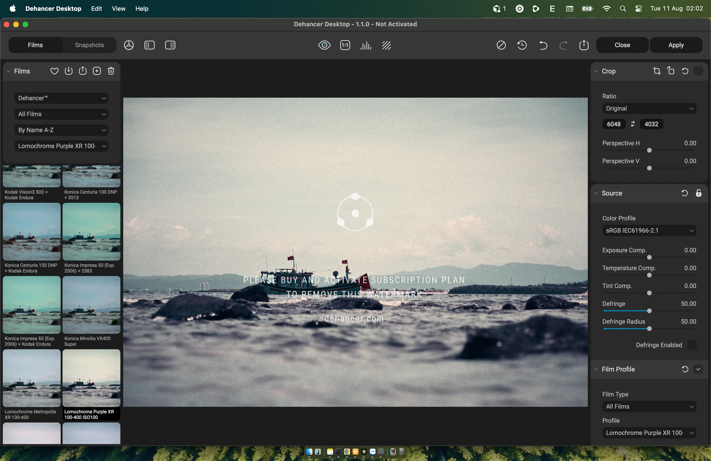
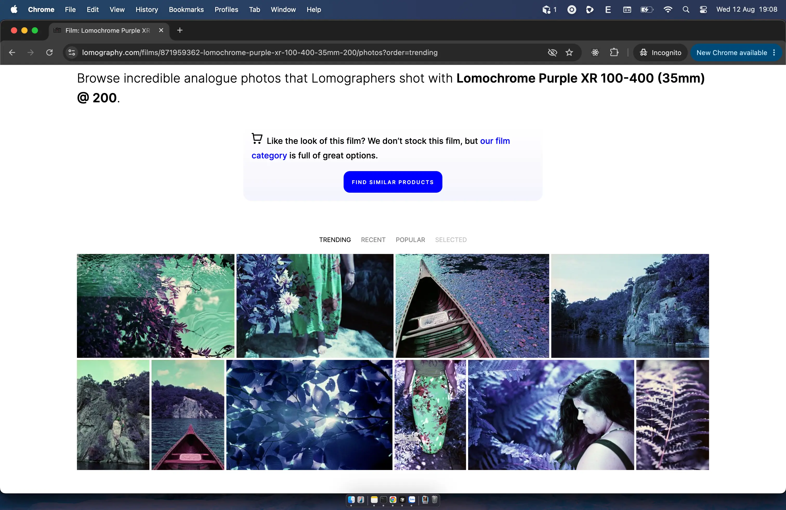
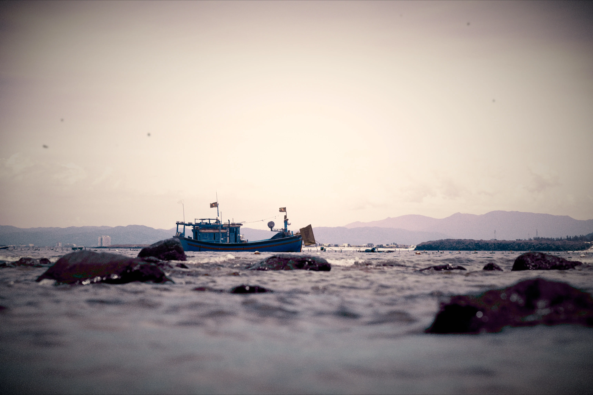
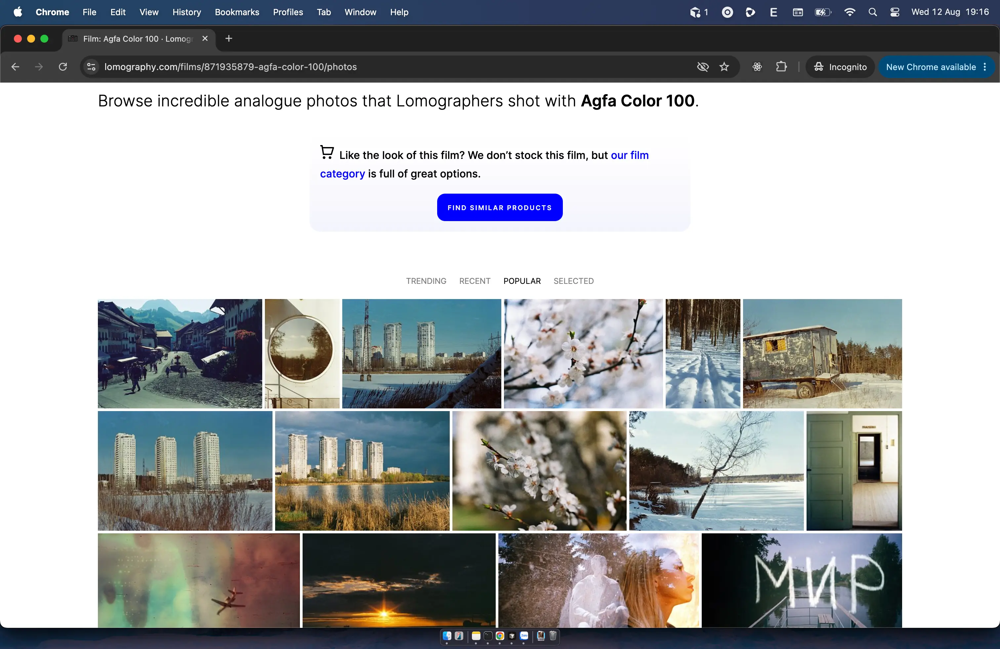
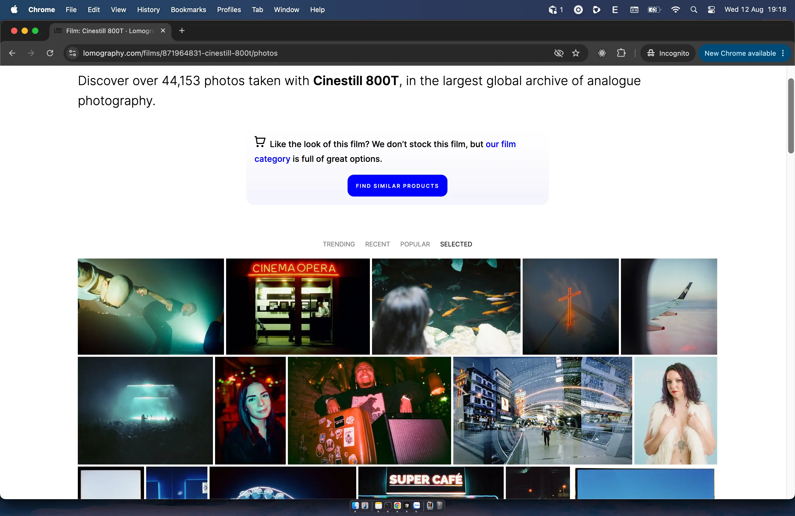
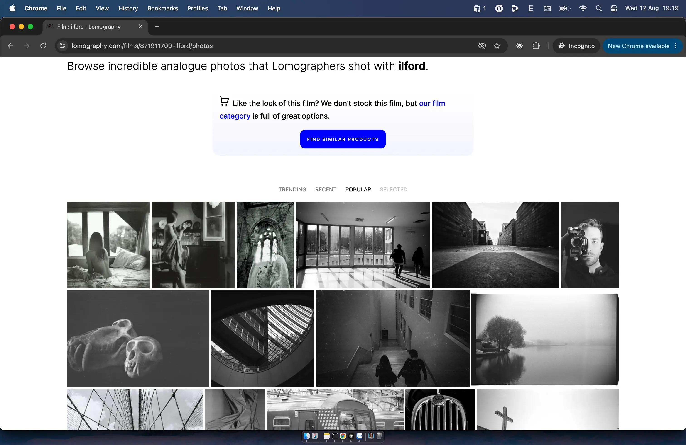
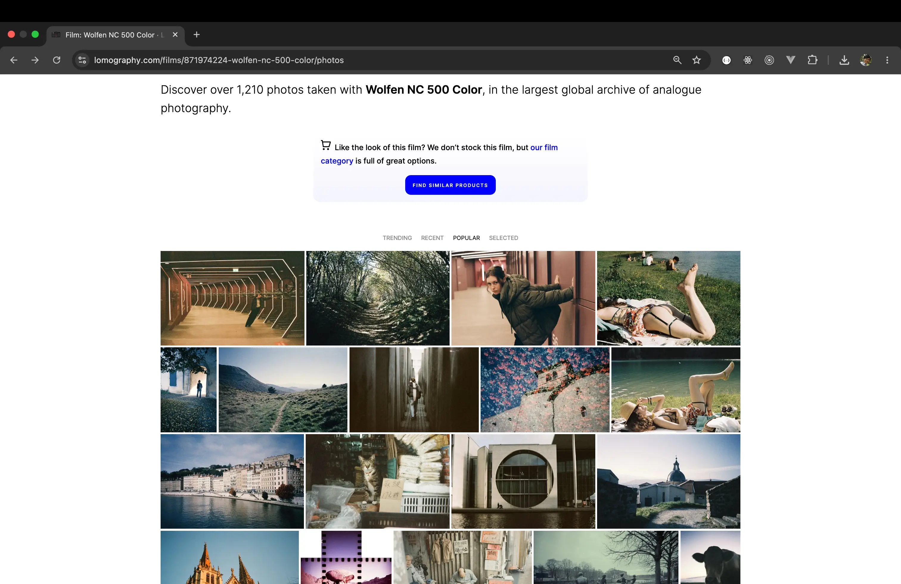

Dạo gần đây, mình đang có hứng thú vọc mấy cái [PowerGrade](https://pixeltoolspost.com/blogs/resolve/powergrades) trong [DaVinci Resolve](https://www.blackmagicdesign.com/products/davinciresolve) như là [FilmVision](https://www.shopmoment.com/global/products/filmvision-v2-powergrade-davinci-resolve-2), [CinePrint35](https://www.tombolles.net/cineprint35) để giả lập màu của phim nhựa. Nguồn cơn tới từ việc sau khi coi phim [Quán Kỳ Nam](https://www.imdb.com/title/tt36616095/) được quay bằng phim nhựa `Kodak Vision 3 500T 5219`.

<iframe width="560" height="315" src="https://www.youtube.com/embed/6bW9byYRhz8?si=j9YKodr_udGi0_sv" title="Quán Kỳ Nam" frameborder="0" allow="accelerometer; autoplay; clipboard-write; encrypted-media; gyroscope; picture-in-picture; web-share" referrerpolicy="strict-origin-when-cross-origin" allowfullscreen></iframe>

Thêm cái nữa là mới biết [Dehancer](https://www.dehancer.com/) mới ra [Dehancer Desktop](https://www.dehancer.com/shop/desktop) - công cụ mô phỏng phim nhựa và chỉnh hình màu analog dành cho nhiếp ảnh. Trong công cụ này, có khá nhiều mô phỏng phim nhựa, các bạn tham khảo thêm tại [đây](https://www.dehancer.com/profiles/film).

Trong đây có một số cuộn phim nào giờ muốn thử mà chưa muốn xuống tiền để trải nghiệm, hên là họ có để mình thử nghiệm.

## Phim nhựa

Lưu ý một chút: mình có tham khảo kết quả mô phỏng từ Dehancer Desktop trong quá trình chỉnh màu để làm cơ sở so sánh.

### Lomochrome Purple XR 100-400

Tình cờ biết được cuộn phim nhựa này nhờ rapper Sol'Bass, ấn tượng cặp màu `magenta` và `cyan`.

Về mặt kỹ thuật, LomoChrome Purple XR 100-400 là một cuộn phim âm bản màu tạo ra hiệu ứng màu giả (false-color), gợi nhớ đến những dòng phim hồng ngoại màu như [Kodak Aerochrome](https://www.analog.cafe/r/kodak-aerochrome-a-colour-ir-film-guide-and-review-uwi3). Điểm thú vị ở chỗ, thay vì đòi hỏi kỹ thuật phức tạp hay kính lọc (filter) chuyên dụng, Lomochrome Purple cho phép bạn chụp bằng máy ảnh thông thường rồi tráng chuẩn [C-41](https://www.analog.cafe/r/developing-colour-film-as-an-absolute-beginner-n3q4).

Ban đầu mình cũng nghĩ đơn giản là chỉ cần đẩy các vùng **xanh lá** về **tím**, **vàng** về **hồng**, **xanh dương** về **xanh lơ** rồi **tăng tương phản** lên là được. Nhưng khi bắt tay vào chỉnh mới thấy mọi thứ không tách biệt như vậy. Chỉ cần đẩy một màu quá tay là những màu xung quanh cũng bắt đầu thay đổi theo, và bức ảnh rất nhanh mất đi cảm giác tự nhiên ban đầu.

Tìm hiểu một hồi, mình đã tìm được [bí kíp](https://www.lomography.com/magazine/270862-lomochrome-purple-xr-how-to-get-that-purple) để giả lập màu LomoChrome Purple trên Davinci Resolve.

> - Màu xanh lá (green) chuyển sang tím (purple) và thậm chí là xanh dương (blue)
> - Màu vàng (yellow) chuyển sang hồng (pink)
> - Màu cam (amber) chuyển sang sắc hồng (pinkish)
> - Màu đỏ (red) chuyển sang sắc nâu phớt (brown)
> - Màu xanh dương (cyan) chuyển sang xanh lơ (cyan)

Tuy nhiên, có một lưu ý khác về sự tương phản. Ban đầu mặc dù kéo `Hue` như trên nhưng vẫn còn thiếu thiếu

> - Không phải tất cả các loại cây xanh đều chuyển sang màu tím; bạn sẽ phải thử nghiệm nhiều lần để tìm ra kết quả phù hợp. Điều đó cũng có nghĩa là màu sắc thu được sẽ đa dạng hơn!
> - Độ nhạy sáng của cuộn phim này giảm khá nhanh, khiến hình ảnh có độ tương phản cao hơn hoặc xuất hiện những mảng tối lớn.
> - Màu tím nổi bật kém hơn rất nhiều so với màu xanh lá. Hãy lưu ý điều này khi bố cục và lựa chọn khung hình.
> - Cây càng non, màu xanh tự nhiên càng sáng thì sắc tím thu được càng mạnh và nổi bật.

Và đây là kết quả mình đạt được.

### Agfa Agfacolor 100

Đây là màu phim mình thích nhất. Nó lạnh, và cho mình cảm giác như đang ở một nơi có tuyết, đâu đó ở châu Âu — mặc dù mình chưa từng đi châu Âu. Từ hồi còn xài FujiFilm X-T3 cho tới Nikon Z5II (bây giờ), mình vẫn uu tiên tìm giả lập màu phim này đầu tiên.

### Kodak Portra 400

Đây là màu phim mình thích tiếp theo. Nó ấm hơn, da và các vùng sáng có cảm giác mềm, tổng thể mang lại một không khí nóng và năng động hơn.

### Cinestill 800T

Còn đây là một cuộn film gây ấn tượng bởi cách nó xử lý ánh sáng đỏ và các nguồn sáng nhân tạo. Chính những vùng đỏ này là thứ khiến mình muốn thử tái tạo màu của nó bằng digital.

### Ilford

Ilford không phải một cuộn phim cụ thể mà là một hãng khiến mình đặc biệt chú ý với các dòng phim đen trắng.

### ORWO Wolfen NC 500

Vô tình mình khoe tấm hình do mình chỉnh màu ngẫu hứng cho bạn nhân viên của [Tiệm máy ảnh Phúc Ánh](https://www.facebook.com/profile.php?id=61555659249301) rồi bạn đó nói màu của mình gần với với cuộn NC500 này.

## Không chỉ có phim nhựa

Có một điều thú vị khi tìm hiểu về những cuộn phim này: mỗi loại không chỉ có một "màu riêng", mà còn là kết quả của cả một cách tạo ảnh.

### Daguerreotype

### Ambrotype

### Tintype

### Cyanotype

## Tham khảo

- Dehancer, [Dehancer Desktop](https://www.dehancer.com/shop/desktop)
- Dmitri, [Kodak Aerochrome — a Colour IR Film Guide & Review](https://www.analog.cafe/r/kodak-aerochrome-a-colour-ir-film-guide-and-review-uwi3), Analog.Cafe
- ihave2pillows, [LomoChrome Purple XR: How to Get that Purple](https://www.lomography.com/magazine/270862-lomochrome-purple-xr-how-to-get-that-purple), Lomography
- Michael Talbert, [Early Agfa colour materials](https://www.photomemorabilia.co.uk/Colour_Darkroom/Early_Agfa.html), Photographic Memorabilia
- Blake Wylie, [Tintype, Daguerreotype, or Ambrotype? How to tell them apart](https://www.blakewylie.com/blog/tintype-vs-daguerreotype-vs-ambrotype)
- kdstevens, [Beat the Blues: Making Cyanotypes](https://www.lomography.com/magazine/98652-beat-the-blues-making-cyanotypes), Lomography
- Nguyễn Đức Hiệp, [Vài nét về lịch sử kỹ thuật nhiếp ảnh và nhiếp ảnh ở Việt Nam](https://digital-photography-school.com/film-color-and-negative-positive/), Cộng Đồng Người Dùng Máy Ảnh Việt Nam's Facebook Group
- Dmitri, [ORWO Wolfen NC 500 Film Review: A Film for the Summer](https://www.analog.cafe/r/orwo-wolfen-nc-500-film-review-and-exposure-guide-7y1k), Analog.Cafe