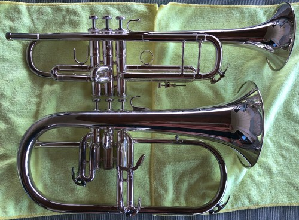

## Đôi lời

Chắc hẳn các bạn sẽ thắc mắc sao lấy nhiều clip của [Trent Hamilton](https://www.youtube.com/@TrentHamilton) vậy. Là vì ổng sưu tầm và độ chế các kiểu, nên có kiến thức, kinh nghiệm và trải nghiệm để chúng ta có cái nhìn tổng quát về kèn trumpet. Khi nào vô vấn đề liên quan, mình sẽ dẫn chứng thêm vài nguồn khác.

Bài viết này dựa trên kinh nghiệm chơi trumpet part-time từ 2007 và quá trình tìm hiểu qua Internet từ 2013. Nên có gì mọi người không thích thì cứ viết bài mới phản bác nhé.

<strong className="text-red-500">Lưu ý:</strong> Bài viết sẽ giữ các thuật ngữ tiếng
Anh, và sẽ ráng chú thích tiếng Việt. Mục đích để bạn đọc có thể tra cứu chúng trên
Google dễ dàng hơn.

## Bộ Kèn Đồng

`Bộ Kèn Đồng` hay gọi tắt là `Bộ Đồng`, tên tiếng anh là `Brass` là nói đến các nhạc cụ được làm từ đồng. Mặc dù nguồn gốc xa xưa của chung được làm bằng sừng. Do đó, hầu hết các nhà nhạc cụ học (Organologist) cho rằng thuật ngữ `"nhạc cụ bằng đồng"` nên được định nghĩa theo cách tạo ra âm thanh phát ra giống như tiếng kèn đồng, chứ không phải bởi nhạc cụ có thực sự được làm bằng đồng hay không. **Vì có nhạc cụ khác cũng được làm bằng đồng nhưng được xếp vào bộ Gỗ (Woodwinds) chính là kèn Saxophone, sáo Flute.**

Trong bộ Đồng, có 4 loại nhạc cụ chính là `Trumpet`, `Trombone`, `Horn` (hay gọi là kèn `Cor`) và `Tuba`.

Điểm chung của bộ đồng là tạo ra âm thanh bằng cách tạo ra rung động bằng môi, thông qua búp kèn (mouthpiece). Lưu ý, cùng là `mouthpiece` nhưng bộ Đồng dịch ra tiếng Việt là `búp`, nhưng bộ Gỗ gọi là `béc`.

Đặc tính âm thanh của bộ Đồng là do dùng hơi, nên kiểm soát được cường độ (tiếng lớn - nhỏ), cho cảm giác mạnh mẽ, thôi thúc, trang trọng.

<iframe
  width="560"
  height="315"
  src="https://www.youtube.com/embed/bwQumQpug_E?si=CPPvKbP2qFfpWOpn"
  title="YouTube video player"
  frameborder="0"
  allow="accelerometer; autoplay; clipboard-write; encrypted-media; gyroscope; picture-in-picture; web-share"
  allowfullscreen
/>

## Kèn Trumpet

Kèn Trumpet là nhạc cụ cao nhất trong bộ Đồng (lấy cao độ theo Piano).

| Cao độ    | Nhạc cụ                                                                                                |
| --------- | ------------------------------------------------------------------------------------------------------ |
| B♭4 / A4  | Piccolo Trumpet                                                                                        |
| E♭4       | Soprano Cornet, Soprano Trumpet (?)                                                                    |
| B♭3       | Trumpet, Cornet, Flugelhorn, Soprano Trombone, Soprano trombone                                        |
| F3        | F Mellophone                                                                                           |
| E♭3       | Alto Horn, Alto Trombone, Alto Trumpet                                                                 |
| B♭2       | Tenor & Bass Trombone, Baritone horn, Euphonium, B♭ Horn, Bass trumpet, Natural trumpet, B♭ Mellophone |
| F2        | French Horn, Contrabass trombone, Cimbasso                                                             |
| E♭2 / F2. | Bass Tuba                                                                                              |
| B♭1 / C2  | Contrabass Tuba, Contrabass trombone                                                                   |

Bảng này thể hiện khoảng cao độ mọi người hay sử dụng nhất, thường là `F#3` tới `A5`.

Còn nốt cao nhất thì tùy vào mỗi người. Như mình thì lên được tới `C6`. Còn Aturo Sandoval thì mấy nốt cao tít.

<iframe width="560" height="315" src="https://www.youtube.com/embed/EXjyU9M9mII?si=2dd6F69Wvg638IPy" title="YouTube video player" frameborder="0" allow="accelerometer; autoplay; clipboard-write; encrypted-media; gyroscope; picture-in-picture; web-share" referrerpolicy="strict-origin-when-cross-origin" allowfullscreen></iframe>

Thường mọi người nhắc đến kèn Trumpet là mọi người hay nhắc đến Trumpet `B♭` (Si giáng), do nó phổ biến nhất. Ngoài ra, kèn trumpet còn có các giọng các như `C` (Do), `D` (Re), `E♭` (Mi giáng),`A` (La), `F` (Fa).

Còn xét về thiết kế, thì kèn Trumpet được chia ra theo các loại sau:
- Natural Trumpet
- Bugle
- 3-Valve Trumpet
- 4-Valve Trumpet
- Pocket Trumpet
- Slide Trumpet
- Cornet
- Flugelhorn

### Natural Trumpet

<iframe width="560" height="315" src="https://www.youtube.com/embed/b24w_ykmwD4?si=5olenCVS5pLX1nhs" title="YouTube video player" frameborder="0" allow="accelerometer; autoplay; clipboard-write; encrypted-media; gyroscope; picture-in-picture; web-share" allowfullscreen/>

Có nguồn nói Natural Trumpet xuất hiện từ trước cuối thời Baroque. Ban đầu, người chơi phải điều chỉnh môi để có thể điều chỉnh cao độ. Sau này, người ta cải tiến lại bằng cách khoét thêm lỗ để bấm như trong clip của [Alison Balsom](https://www.alisonbalsom.com) phía trên.

### Bugle

<iframe width="560" height="315" src="https://www.youtube.com/embed/2yQFvZsN43A?si=xlFX6gQdbko47wua" title="YouTube video player" frameborder="0" allow="accelerometer; autoplay; clipboard-write; encrypted-media; gyroscope; picture-in-picture; web-share" allowfullscreen/>

Bugle chính là biến thể của Natural Trumpet, loại kèn có chiều dài chỉ bằng một nửa Natural Trumpet, nên có cao độ cao hơn 1 quãng 8 và hay sử dụng trong quân đội, hướng đạo sinh trong phim hay coi.

Sau này, người ta cải tiến dần Bugle có 1 hoặc 2 valve để có thể thay đổi cao độ.

<iframe width="560" height="315" src="https://www.youtube.com/embed/OkbspKwa76k?si=1rRQ5zETTnU_ivLu" title="YouTube video player" frameborder="0" allow="accelerometer; autoplay; clipboard-write; encrypted-media; gyroscope; picture-in-picture; web-share" allowfullscreen/>

### 3-Valve Trumpet

Đây là mẫu kèn Trumpet phổ biến, với 3 phím bấm. Thường là ở giọng `B♭`, `C`, `D`, `Eb`. Tuy nhiên vẫn có một số mẫu hiếm ở giọng `F`, `G` và `A`.

Có một biến thể khác là `Fanfare Trumpet` hay còn gọi là `Herald Trumpet`, loa dài hơn, nhỏ hơn so với loại thông thường và cho tiếng sáng hơn. Thường hay được dùng trong nghi lễ hoàng gia hoặc quân đội.

<iframe width="560" height="315" src="https://www.youtube.com/embed/x7LoCOWvbdU?si=GKqoYmVKNGQefuSr" title="YouTube video player" frameborder="0" allow="accelerometer; autoplay; clipboard-write; encrypted-media; gyroscope; picture-in-picture; web-share" allowfullscreen/>

Mỗi valve có một chức năng, nhìn vào số được đánh trên valve từ búp ra tới loa kèn, lần lượt là `1`, `2` và `3`.
- Không bấm gì hết
- Bấm valve 1 để xuống 1 cung
- Bấm valve 2 để xuống 1/2 cung (nửa cung)
- Bấm valve 3 để xuống 1+1/2 cung (1 cung rưỡi)

Và ta kết hợp việc bấm và điều chỉnh môi để thay đổi cao độ. Coi bảng dưới đây.

Thường người ta sẽ bấm `1+2` thay vì `3` để xuống **một cung rưỡi**. Do thực tế, cao độ của valve `3` bị thấp hơn so với khi bấm `1+2`. Có thể đo tần số để biết, mà cũng tùy kèn mà chênh lệch nhiều hay ít. Và cũng tùy người chơi nữa.

### 4-Valve Trumpet

Thường các mẫu 4 valve là giọng `A`, tên thường gọi là `Piccolo Trumpet`. Vì nó là giọng cao nhất. Thấy vậy, nó là kèn khó chơi nhất trong các loại kèn trumpet do cao độ không ổn định. Bạn phải tập để giữ đúng cao độ, và cần thiết bị hỗ trợ.

<iframe width="560" height="315" src="https://www.youtube.com/embed/Zw1kLdFdxMI?si=OnvDgXVmErBXoIDA" title="YouTube video player" frameborder="0" allow="accelerometer; autoplay; clipboard-write; encrypted-media; gyroscope; picture-in-picture; web-share" allowfullscreen/>

3 valve đầu cũng y chang loại phía trên. Riêng valve `4` được thêm vào để xuống `2+1/2` cung (2 cung rưỡi)

### Pocket Trumpet

Loại này sinh ra nhằm mục đích nhỏ gọn. Phổ biến là giọng `B♭`.

<iframe width="560" height="315" src="https://www.youtube.com/embed/jVzQKWiDN9A?si=-pF4mDm-7mvb29iY" title="YouTube video player" frameborder="0" allow="accelerometer; autoplay; clipboard-write; encrypted-media; gyroscope; picture-in-picture; web-share" allowfullscreen/>

### Slide Trumpet

Xa xưa, người ta có thử cách chế một cái ống trượt trên Natural Trumpet để thay đổi cao độ giống loại trong clip này.

<iframe width="560" height="315" src="https://www.youtube.com/embed/UZFDhFBFHck?si=7V8AYom5WSyNAHs4" title="YouTube video player" frameborder="0" allow="accelerometer; autoplay; clipboard-write; encrypted-media; gyroscope; picture-in-picture; web-share" allowfullscreen/>

Những người theo trường phái này phát triển và nó gần giống cách kéo Trombone. Nhưng vẫn giữ được cao độ và màu âm của Trumpet. Tới ngày nay, nó bắt đầu lẫn lộn giữa `Slide Trumpet` và `Soprano Trombone` luôn.

<iframe width="560" height="315" src="https://www.youtube.com/embed/biqJ0apNk8Q?si=0633LvhMgwvbEEJ8" title="YouTube video player" frameborder="0" allow="accelerometer; autoplay; clipboard-write; encrypted-media; gyroscope; picture-in-picture; web-share" allowfullscreen/>

### Cornet

Tuy cùng hình dáng, nhưng lịch sử phát triển Cornet song song với lịch sử phát triển của Trumpet chứ không hẳn là biến thể. Trong lịch sử phát triển của 2 nhạc cụ này, công nghệ được chia sẻ lẫn nhau. Về cơ bản thì tiếng Cornet sẽ tối hơn so với Trumpet.

Kèn Cornet có 2 trường phái, một là `short model` thường được sử dụng ở các dàn nhạc của Anh với giọng `E♭`.

Trường phái còn lại là `long model`, phổ biến hơn ở Mỹ với giọng `B♭`.

### Flugelhorn

Cũng là cùng thiết kế 3 phim như Trumpet, Cornet và cùng giọng `B♭`, nhưng Flugelhorn cho tiếng tối hơn cả Cornet.

<iframe width="560" height="315" src="https://www.youtube.com/embed/zo8hIc7DpuE?si=DKrt_VJocbYG_fOD" title="YouTube video player" frameborder="0" allow="accelerometer; autoplay; clipboard-write; encrypted-media; gyroscope; picture-in-picture; web-share" allowfullscreen/>

## Một số thông tin thú vị

Từ `"horn"` với nghĩa ban đầu là những nhạc cụ được làm từ sừng động vật, thường là sừng bò. Từ `"bugle"` có nguồn gốc từ tiếng Latin `"buculus"`, có nghĩa là _bò con (young bull)_. Còn từ `"cor"` trong `cornet`, `cor anglais`, `tenor cor` có nguồn gốc từ tiếng Latin, `"cornu"`, nghĩa là _sừng_.

## Tham khảo

- Mr. Q's Music, [BRASS](https://www.mrqsmusic.com/brass-family.html)
- Wikipedia, [Bộ Đồng](https://vi.wikipedia.org/wiki/B%E1%BB%99_%C4%91%E1%BB%93ng)
- Wikipedia, [Pitch of brass instruments](https://en.wikipedia.org/wiki/Pitch_of_brass_instruments)
- Yamaha, [The tone is affected by the material](https://www.yamaha.com/en/musical_instrument_guide/horn/selection)
- Trent Hamilton, [The Trumpet Family](https://www.youtube.com/watch?v=0UxaeYoDtdA)
- Gear4music, [The 9 Types Of Trumpets Every Brass Player Should Know](https://www.gear4music.com/blog/types-of-trumpets)
- Wikipedia, [Natural Trumpet](https://en.wikipedia.org/wiki/Natural_trumpet)
- Jean-Baptiste Arban, [Arban's Complete Conservatory Method for Trumpet (Cornet) or Eb Alto, Bb Tenor, Baritone, Euphonium and Bb Bass in Treble Clef](https://www.amazon.com/Complete-Conservatory-Trumpet-Baritone-Euphonium/dp/0825803853)
- Gregg Monks, [The History of The Cornet, From Pre-History to the Present](http://blackdiamondbrass.org/tpthist/trpthist.htm)
- Bruce Chidester , [Why did the Cornet become a second rate citizen?](https://www.thetrumpetblog.com/why-did-the-cornet-become-a-second-rate-citizen)
- Trumpet Biz, [What Is A Flugelhorn?](https://trumpet.biz/flugelhorn/what-is-a-flugelhorn)
- Wikipedia, [Flugelhorn](https://en.wikipedia.org/wiki/Flugelhorn)