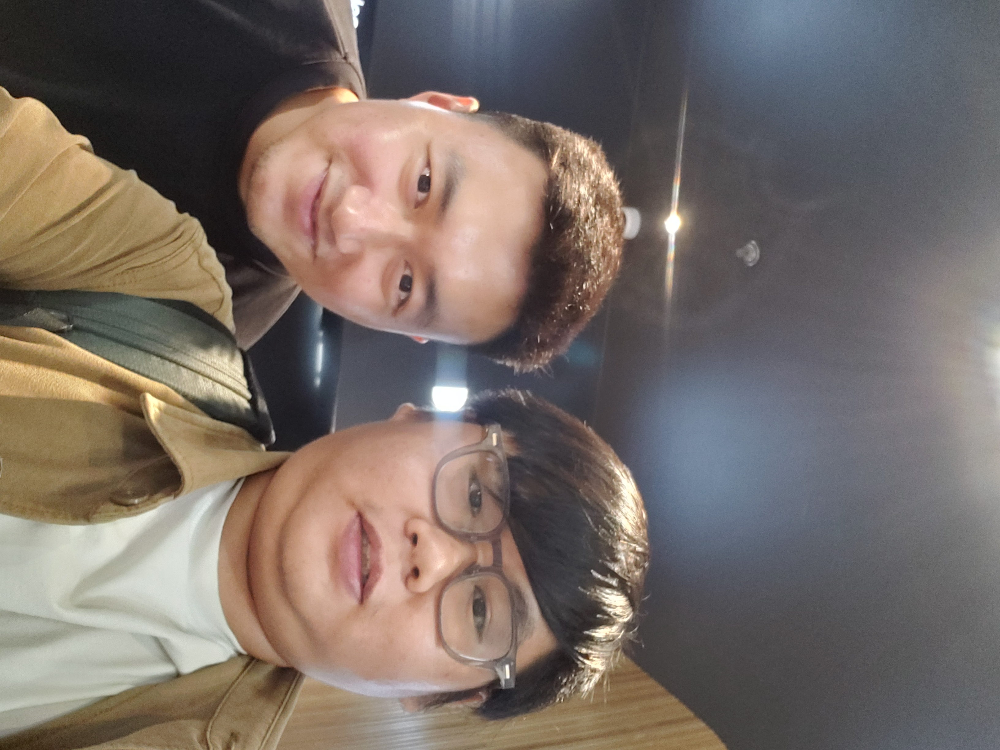
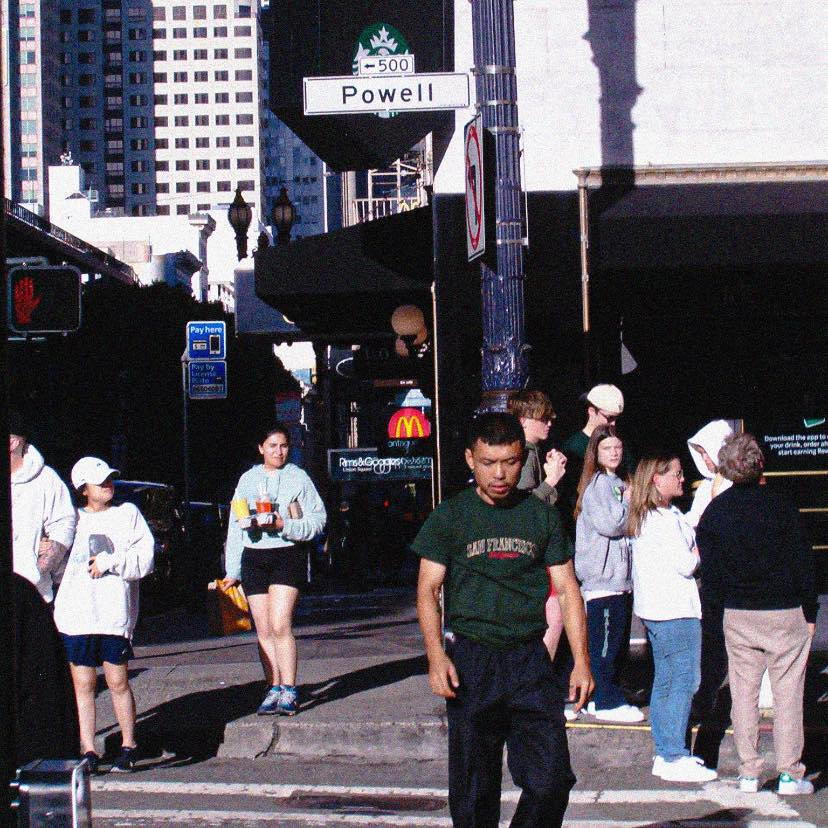

Tấm hình này mình chụp với Cường Vũ (trumpet), Stomu Takeishi (bass) và Ted Poor (trống). Đánh dấu một cột mốc khi được nghệ sĩ trumpet đạt 2 giải Grammy chia sẻ về quan điểm chơi nhạc.

Ngày mai là ngày đầu tiên bước qua tuổi 30, mình muốn viết lại một chút về tuổi 29. Vì tuổi 29 mình đã thử nhiều cái mới, làm nhiều cái mà trước đây còn do dự. Trong đó, nhiếp ảnh là thứ mang lại nhiều cái mới mẻ nhất.

## Tại sao lại nhiếp ảnh?

Ban đầu chỉ nghĩ mua máy ảnh để có động lực đi vòng vòng chụp, sẵn tiện tập thể dục luôn. Tới một ngày nọ, thằng bạn rủ mình đi chụp beauty và thế là gắn với nó được nửa năm.

Trong nửa năm này, mình học được cách giao tiếp với người lạ, cụ thể là mấy bạn mẫu. Ngoài ra, còn kỹ năng làm việc nhóm ở một môi trường mới, không phải trong dàn nhạc, cũng như môi trường IT.

Tiếp nữa, để nâng cao kỹ năng, mình cũng siêng đi workshop và học thêm được cách kể chuyện thông qua hình ảnh. Và duyên tới vụ quay cũng xuất phát từ đây. Đúng thiệt là ban đầu nói mua máy chỉ chụp cảnh, `không chụp chân dung, không quay video` nhưng giờ dính hết.

Sau khi mình nghỉ chụp beauty do một số lý do thì mình tập trung nhiều vào mục đích ban đầu là chụp ảnh đường phố. Từ đây, mình mới biết cách kể chuyện thông qua hình ảnh là như thế nào và gặp được nhiều con người hay ho.

## Những người hay ho

Những người này mình biết qua YouTube, hoặc Workshop. Họ có cách nhìn khá thú vị và nó ảnh hưởng tới cách chụp ảnh của mình.

### Tùng Phạm

Tùng Phạm khá dễ gần, mấy hôm workshop của bạn đều có thực hành tại chỗ. Mình học được từ bạn cách chỉnh màu ảnh thông qua Curve. Lần gần nhất, mình học được cách dựng một video bắt đầu với phần âm thanh trước.

### Jason Ng

Jason Ng lúc nào cũng chia sẻ hết mình trong những buổi workshop. Mình luôn cảm nhận được nỗ lực sáng tạo không ngừng mỗi khi tiếp xúc với anh. Mình học được cách chụp ảnh chân dung với góc rộng.

Ví dụ về bộ ảnh chụp góc rộng với mẫu Thanh Tâm tại workshop của Viltrox Việt Nam

<iframe src="https://www.facebook.com/plugins/post.php?href=https%3A%2F%2Fwww.facebook.com%2Fpermalink.php%3Fstory_fbid%3Dpfbid02MuFQdxqFfiidvc7xiW1FeAeyjFYN25oXtoCy29HBPgW4udNqaXYr8kzhrTjQFf3nl%26id%3D61554991931672&show_text=true&width=500&is_preview=true" width="500" height="723" style="border:none;overflow:hidden" scrolling="no" frameborder="0" allowfullscreen="true" allow="autoplay; clipboard-write; encrypted-media; picture-in-picture; web-share"></iframe>

Một bộ ảnh khác với mẫu Trương Hân.

<iframe src="https://www.facebook.com/plugins/post.php?href=https%3A%2F%2Fwww.facebook.com%2Fpermalink.php%3Fstory_fbid%3Dpfbid0351Jfpy4G8w5g9bVpUWNeA69MzemVsmNTLTYZQJ4uSL26AjdcHhbNNE4j3BKiDaBal%26id%3D61554991931672&show_text=true&width=500&is_preview=true" width="500" height="723" style="border:none;overflow:hidden" scrolling="no" frameborder="0" allowfullscreen="true" allow="autoplay; clipboard-write; encrypted-media; picture-in-picture; web-share"></iframe>

Nói thiệt thì sau workshop này, mình bắt đầu siêng xài lens góc rộng để chụp mẫu hơn trước.

### Nguyễn Khờ

Mình xém có dịp chụp chung với khứa, tiếc là không có duyên nên lụm hình trên FB khứa vậy.

Khứa có vài chia sẻ vài mẹo chụp street khá hay, chôm lại đề phòng bài viết bị xóa:

> saigon 23.02.2024
>
> 28mm là một tiêu cự khó xử bởi vì nó chứa quá nhiều thông tin và gây kịch tính không cần thiết. Tuy nhiên, theo mình, 28mm sẽ giúp > cách framing của photographer trở nên mạnh mẽ mà bất cứ tiêu cự nào khác cũng không cạnh tranh lại.
>
> Mình tin vào lí thuyết nếu như chúng ta không thực sự hiện diện trong bối cảnh đó, bức ảnh của chúng ta không thật sự đáng tin. 
>
> Mình muốn chia sẻ một số cách tiếp cận khi chúng ta thâm nhập vào nơi công cộng để tạo ra các bức ảnh :
> - luôn luôn quan sát tính tương phản của ánh sáng
>- con người chỉ là đối tượng như tất cả những yếu tố khác trong không gian
> - định hình trước những gì có thể xảy ra và kiên nhẫn với những biến số
> - nơi công cộng là một nơi với lưu lượng lớn thông tin. Luyện tập composition như một cách để chắt lọc những gì chúng ta muốn để trong frame.
> - nếu bản thân mình không lén lút, ko ai nghĩ chúng ta lén lút
> - chọn một chi tiết nhưng quan sát theo góc nhìn toàn cảnh
> - đừng sợ bỏ sót, kiểu gì cũng bỏ sót

Bài viết khứa chia sẻ trong nhóm [Ricoh GR Vietnam](https://www.facebook.com/groups/1724548661121868/user/100092037556694), giúp mình để ý tới tính tương phản trong tấm hình. Sau này thực hành nhiều thì mới biết nó là yếu tố để đem `cinematic` vào khung hình.

### Nam Trịnh

Gặp được anh Nam do ảnh về VN tổ chức workshop về làm phim cưới tailor-made. Trong buổi workshop này, ngoài việc chia sẻ workflow khi quay phim cưới ở bên Mỹ, ảnh có giải thích với mọi người thế nào là `Cinematic`. Khái niệm này được nhắc đi nhắc lại nhiều bởi anh Jason Ng và Nguyễn Khờ có nói về tính tương phản. Nhưng anh Nam mới là người giải thích rõ ràng về nó nhất.

Nhờ vậy mới biết là anh Nam có chia sẻ một số phim cưới tại [Nam Trinh Studio](https://www.facebook.com/namtrinhstudioz) để tham khảo.

### Lê Hoàng Mến

Mình có dịp biết anh zai qua buổi workshop về Ảnh Bộ do Sony tổ chức và anh là diễn giả. Nói thật thì mình không ấn tượng lắm về hình chụp của ảnh. Tuy nhiên, cách kể chuyện thông qua những tấm hình chung một chủ đề được trình bày chung với nhau làm mình ấn tượng. Bữa đó, ảnh giới thiệu về cách tạo Ảnh Bộ (thuật ngữ này có vẻ chỉ VN xài) và mình áp dụng trình bày từ ngày đó.

Đây là ảnh bộ của anh Mến trong buổi workshop, mình tham khảo và tạo ra nhiều ảnh bộ sau này.

### Kmon Nguyen

Anh trai này có triết lý chụp đường phố phải có tí châm biếm, mỗi tấm hình đều có một câu chuyện đằng sau - `"mang tính châm biếm, và gieo sự tích cực cho cuộc sống"`.

Lần đầu tham gia workshop Minimalism của ảnh, mình mới được khai sáng vụ đi chụp street với lens góc rộng. Và ảnh hưởng tới việc mình hay xài lens 70-350mm.

<iframe src="https://www.facebook.com/plugins/post.php?href=https%3A%2F%2Fwww.facebook.com%2Fkmonnguyen%2Fposts%2Fpfbid025d22uhPpzEZCjyrBRK5dBLLMmNhzRRx5a9iMWgyCwfX477fpBEHrJwrwmpGF4keSl&show_text=true&width=500&is_preview=true" width="500" height="684" style="border:none;overflow:hidden" scrolling="no" frameborder="0" allowfullscreen="true" allow="autoplay; clipboard-write; encrypted-media; picture-in-picture; web-share"></iframe>

### Mấy đứa bạn

Đầu tiên là 2 tên này, cũng là khởi đầu và cũng như kết thúc quá trình chụp beauty, cũng là động lực để quay video.

Tiếp đến là mấy khứa bạn cấp 2, lâu lâu cũng rủ đi chụp street. 

## Kết

Nói chung thì đi chụp hình, nhất là street giúp mình sống chậm hơn, nhận ra được chữ `tham` nó như thế nào.

||
|:--:| 
|*Xung quanh chợ Bến Thành*|

||
|:--:| 
|*Một góc quận 7*|

||
|:--:| 
|*Trên đường đi làm*|
