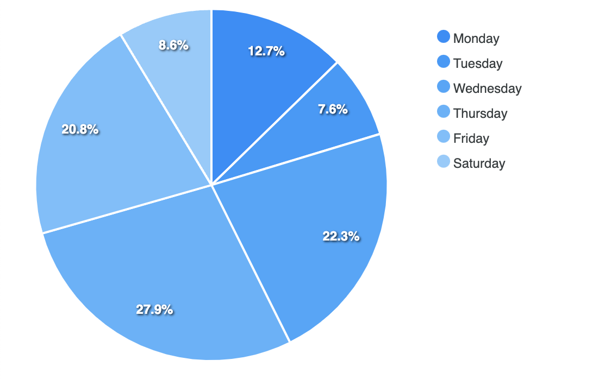
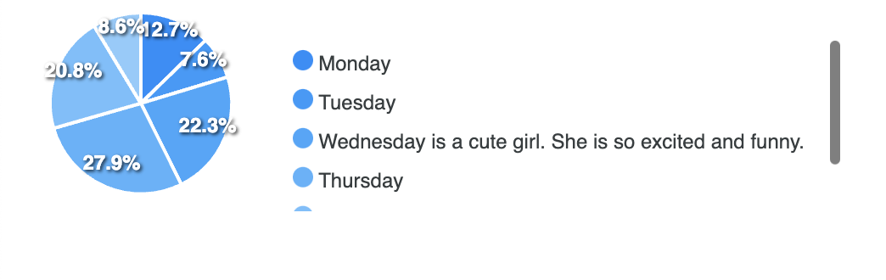
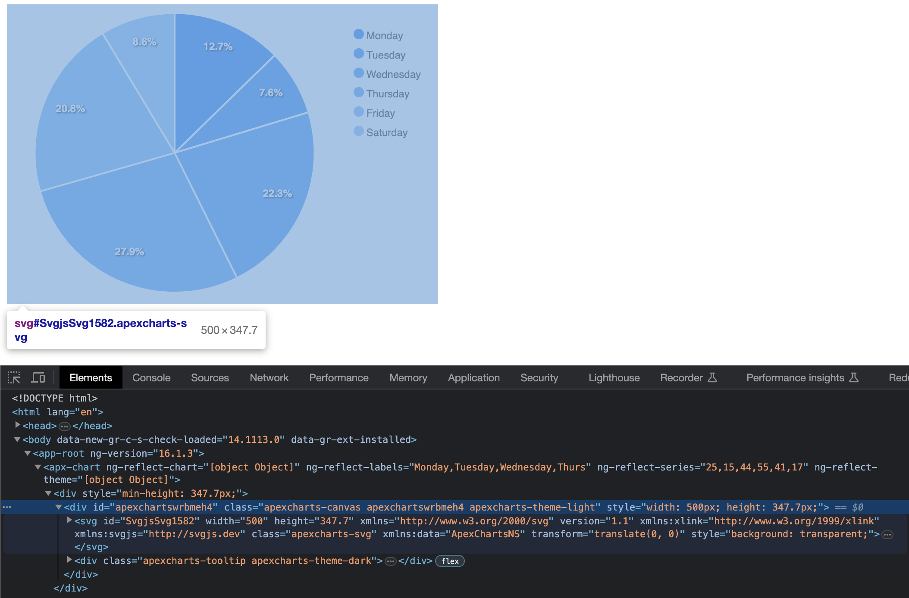
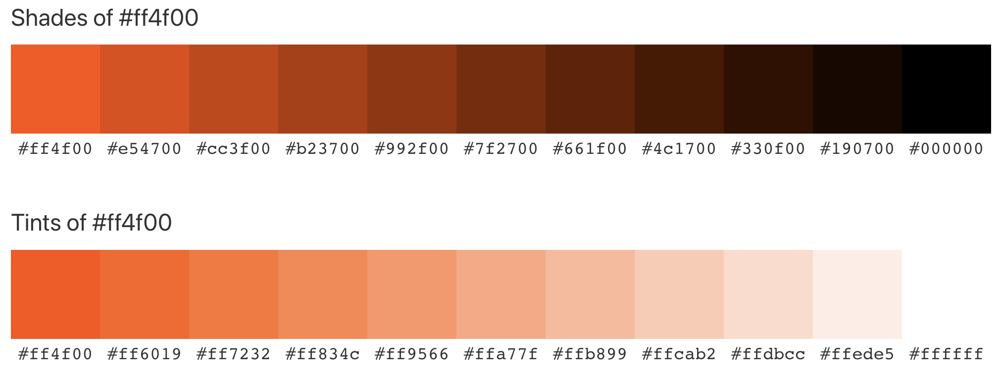
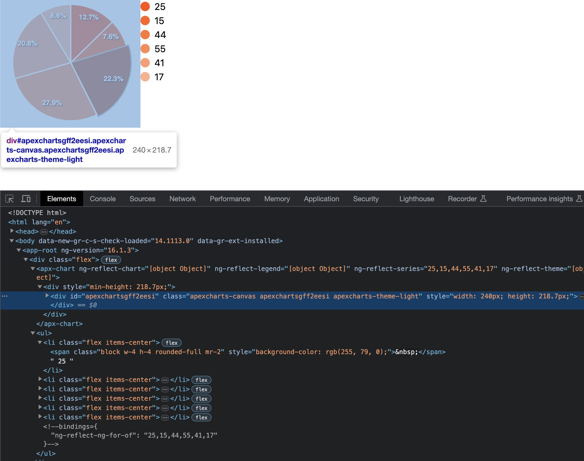
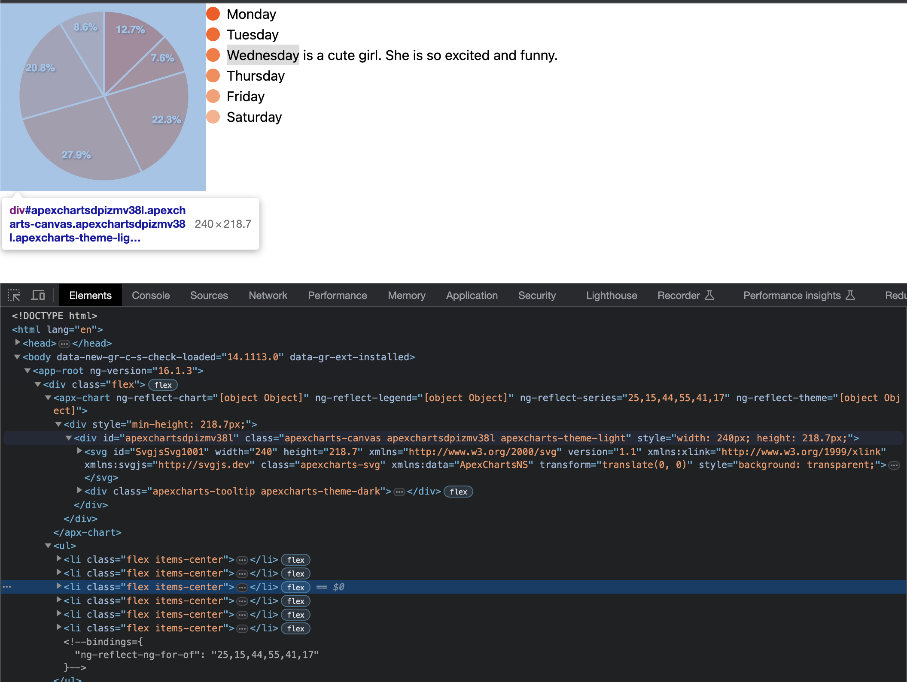

## ApexCharts

Trong một số thư viện vẽ chart liên quan đến Angular như [Highcharts](https://www.highcharts.com), [ngx-charts](https://swimlane.github.io/ngx-charts), [Google Charts](https://developers.google.com/chart), [PrimeNG](https://primeng.org/chart),... thì [ApexCharts](https://apexcharts.com/) cung cấp UI tối giản, cho phép chỉnh sửa và hiển thị dưới dạng SVG phù hợp với yêu cầu hiện tại.


## Vấn đề phát sinh

Trong yêu cầu hiện tại, mình sẽ hiện Pie Chart có màu xanh dương và sắc thái sáng dần. Ta gọi theme này là `Monochrome`, tức là chỉ có 1 màu với các sắc thái khác nhau.

```ts
import { Component } from "@angular/core";
import { ApexChart, ApexTheme, NgApexchartsModule } from "ng-apexcharts";

interface ChartOptions {
  chart: ApexChart;
  labels: string[];
  series: number[];
  theme: ApexTheme;
}

@Component({
  standalone: true,
  selector: "app-root",
  imports: [NgApexchartsModule],
  template: `
    <apx-chart
      [chart]="options.chart"
      [labels]="options.labels"
      [series]="options.series"
      [theme]="options.theme"
    />
  `,
})
export class AppComponent {
  options: ChartOptions = {
    chart: {
      width: "500px",
      height: "500px",
      type: "pie",
    },
    labels: [
      "Monday",
      "Tuesday",
      "Wednesday",
      "Thursday",
      "Friday",
      "Saturday",
    ],
    series: [25, 15, 44, 55, 41, 17],
    theme: {
      monochrome: {
        enabled: true,
      },
    },
  };
}
```

Trong phần code trên, mình khai báo chart sẽ nằm trong một vùng giới hạn `width=500px` và `height=500px`.



Tiếp theo, mình sửa label `Wednesday` thành `Wednesday is a cute girl. She is so excited and funny.` và cho ra kết quả.



Cái quái gì ta? Sao nó lại thành ra thế lày? Thử đổi lại text như cũ rồi bật DevTools lên coi thử.



Ờ ha... Mình nghĩ `width=500px` là phần chart, nhưng rất tiếc nó bao gồm luôn cả phần danh sách chú giải.

## Tách phần chú giải ra khỏi chart

Để đảm bảo dù có thay đổi độ dài phần chú thích thì kích thước chart không đổi thì mình phải tự viết lại code chỗ đó. Phần listing thì dễ rồi, nhưng làm thế nào để lấy được màu của chú thích trùng với từng phần trong Pie chart ta??? Trước hết thì tắt phần **Legend** (chú giải) ở trong template.

```ts
@Component({
  standalone: true,
  selector: 'app-root',
  imports: [NgApexchartsModule],
  template: `
    <apx-chart
      [chart]="options.chart"
      [legend]="options.legend"
      [series]="options.series"
      [theme]="options.theme"
    />
  `,
})
```

Và trong ChartOptions.

```ts
options: ChartOptions = {
  // ...
  legend: {
    show: false,
  },
  // ...
};
```

### Shade và Tint

Theo định nghĩa, ta sẽ giải thích về shade và tint như sau:

- `Tint` - làm một màu nào đó sáng (nhạt) hơn bằng cách pha thêm màu trắng.
- `Shade` - làm một màu nào đó tối (đậm) hơn bằng cách pha thêm màu đen.



Như vậy, để tạo ra được chú giải ở danh sách ta phải tạo được dải màu bằng cách áp dụng `Tint` theo tỉ lệ nào đó. Đục code tí xem lào!

Dựa vào config `monochrome.enabled=true`, mình đã tìm được chỗ khai báo tại [đây](https://github.com/apexcharts/apexcharts.js/blob/main/src/modules/Theme.js#L78).

```js
if (w.config.theme.monochrome.enabled) {
  let monoArr = [];
  let glsCnt = w.globals.series.length;
  if (this.isBarDistributed || this.isHeatmapDistributed) {
    glsCnt = w.globals.series[0].length * w.globals.series.length;
  }

  let mainColor = w.config.theme.monochrome.color;
  let part = 1 / (glsCnt / w.config.theme.monochrome.shadeIntensity);
  let shade = w.config.theme.monochrome.shadeTo;
  let percent = 0;

  for (let gsl = 0; gsl < glsCnt; gsl++) {
    let newColor;

    if (shade === "dark") {
      newColor = utils.shadeColor(percent * -1, mainColor);
      percent = percent + part;
    } else {
      newColor = utils.shadeColor(percent, mainColor);
      percent = percent + part;
    }

    monoArr.push(newColor);
  }
  w.globals.colors = monoArr.slice();
}
```

Như vậy, mình rút ra được tham số có ý nghĩa như sau

| Tham số   | Ý nghĩa                                                                                                        |
| --------- | -------------------------------------------------------------------------------------------------------------- |
| monoArr   | danh sách kết quả màu sẽ trả về                                                                                |
| glsCnt    | số lượng phần tử sẽ hiện trong pie chart, dựa vào số lượng phần tử của series                                  |
| mainColor | màu gốc                                                                                                        |
| part      | tỉ lệ % khác nhau giữa các sắc thái, dựa vào `theme.monochrome.shadeIntensity`. Mặc định `shadeIntensity=0.65` |
| shade     | theme đang là `dark` hay `light`                                                                               |
| percent   | tỉ lệ lệch bao nhiêu % so với màu gốc                                                                          |

### Đục code

Giờ đục tiếp hàm `utils.shadeColor` có cái gì bên trong tại [đây](https://github.com/apexcharts/apexcharts.js/blob/main/src/utils/Utils.js#L272).

```js
// beautiful color shading blending code
// http://stackoverflow.com/questions/5560248/programmatically-lighten-or-darken-a-hex-color-or-rgb-and-blend-colors
shadeColor(p, color) {
  if (Utils.isColorHex(color)) {
    return this.shadeHexColor(p, color)
  } else {
    return this.shadeRGBColor(p, color)
  }
}
```

Oh... vậy là tham số `color` có thể là `string` dưới dạng `Hex` hoặc `RGB` đều được. ĐM! Trong document không có ghi.

Đây là hàm `shadeHexColor`

```js
shadeHexColor(percent, color) {
  let f = parseInt(color.slice(1), 16),
    t = percent < 0 ? 0 : 255,
    p = percent < 0 ? percent * -1 : percent,
    R = f >> 16,
    G = (f >> 8) & 0x00ff,
    B = f & 0x0000ff
  return (
    '#' +
    (
      0x1000000 +
      (Math.round((t - R) * p) + R) * 0x10000 +
      (Math.round((t - G) * p) + G) * 0x100 +
      (Math.round((t - B) * p) + B)
    )
      .toString(16)
      .slice(1)
  )
}
```

Còn đây là hàm `shadeRGBColor`

```js
shadeRGBColor(percent, color) {
  let f = color.split(','),
    t = percent < 0 ? 0 : 255,
    p = percent < 0 ? percent * -1 : percent,
    R = parseInt(f[0].slice(4), 10),
    G = parseInt(f[1], 10),
    B = parseInt(f[2], 10)
  return (
    'rgb(' +
    (Math.round((t - R) * p) + R) +
    ',' +
    (Math.round((t - G) * p) + G) +
    ',' +
    (Math.round((t - B) * p) + B) +
    ')'
  )
}
```

### Xào code

Trước tiên là mình chỉ định xài `HexColor` thôi.

```ts
export function getPalette(mainColor: string, seriesLength: number) {
  const palette = [];
  const part =
    1 / (seriesLength / CHART_OPTIONS.theme.monochrome.shadeIntensity);
  let percent = 0;

  for (let index = 0; index < seriesLength; index++) {
    const newColor = shadeHexColor(percent, mainColor);
    palette.push(newColor);
    percent = percent + part;
  }

  return palette;
}
```

Cách sử dụng sẽ là thế này ở trong phần Class

```ts
palette: string[] = [];

constructor() {
  this.palette = this.getPalette('#ff4f00', this.series.length);
}
```

Code trong phần template sẽ thế này

```ts
@Component({
  standalone: true,
  selector: 'app-root',
  imports: [NgFor, NgApexchartsModule],
  template: `
    <div class="flex">
      <apx-chart
        [chart]="options.chart"
        [legend]="options.legend"
        [series]="options.series"
        [theme]="options.theme"
      />
      <ul>
        <li
          *ngFor="let item of series; let i = index"
          class="flex items-center"
        >
          <span
            class="block w-4 h-4 rounded-full mr-2"
            [style]="{ 'background-color': palette[i] }"
            >&nbsp;</span
          >
          {{ item }}
        </li>
      </ul>
    </div>
  `,
})
```



Thử đổi text cái nè.



Các bạn có thể đọc code trực tiếp tại [StackBlitz!](https://stackblitz.com/edit/stackblitz-starters-4zduuq?file=src%2Fapp%2Fapp.component.ts).

## Tham khảo

- Mỹ thuật MS, [Cách sử dụng Tint và Shade trong TK](https://mythuatms.com/hoc-ve--d2123.html)
