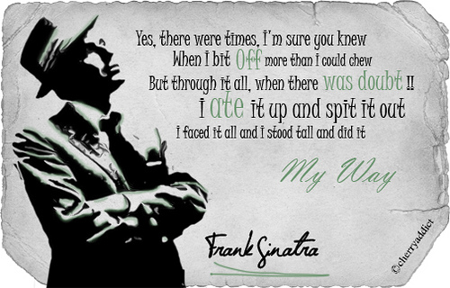
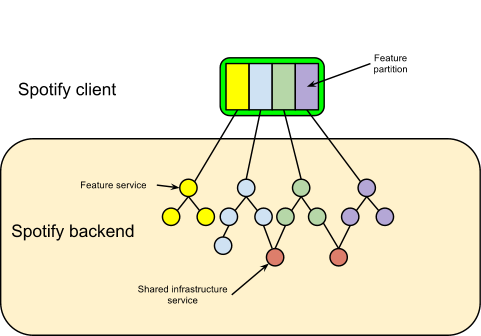
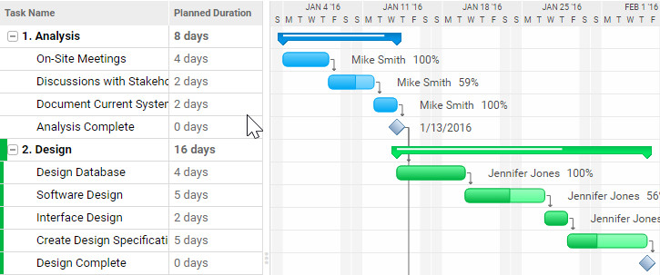
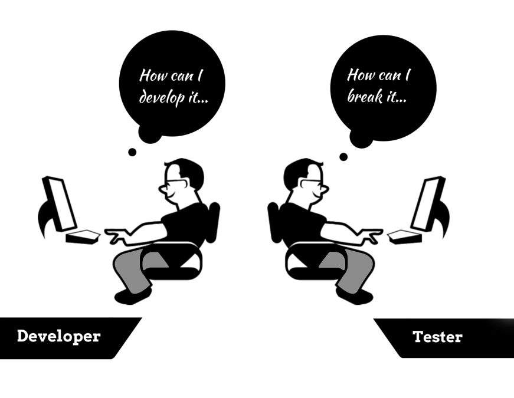
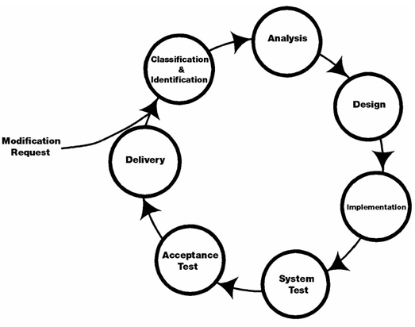

Có vài em khoá dưới vẫn còn đang phân vân không biết nên chọn chuyên ngành nào vào học kỳ tới. Mình có ý định làm bài viết này từ lâu rồi. Hôm nay, mình sẽ giới thiệu về các vai trò và cần học những gì để giúp mấy em chọn được chuyên ngành mong muốn. Mình sẽ đi với góc độ là một người làm sản phẩm để giới thiệu từng vai trò với kinh nghiệm hiện tại.

## Quy trình phát triển phầm mềm

Hiện nay có rất nhiều quy trình phát triển phần mềm như là [Rational Unified Process](https://en.wikipedia.org/wiki/Rational_Unified_Process), [Spiral](https://en.wikipedia.org/wiki/Spiral_model), [Scrum](<https://en.wikipedia.org/wiki/Scrum_(software_development)>), [Kanban](<https://en.wikipedia.org/wiki/Kanban_(development)>), [Extreme Programming](https://en.wikipedia.org/wiki/Extreme_programming),... Tuy nhiên, tất cả vẫn dựa trên các bước cơ bản như sau:

1.  Phân tích và lên kế hoạch
2.  Phân tích yêu cầu
3.  Thiết kế
4.  Phát triển sản phẩm
5.  Kiểm thử
6.  Triển khai
7.  Bảo trì

### Phân tích và lên kế hoạch

Ở bước này, chúng ta sẽ tìm hiểu và phân mục đích, giới hạn, thời gian thực hiện cần thiết, tài chính, nhân sự và rủi ro cho dự án. Về cơ bản, chúng ta phải xác định được cần làm gì, cần những gì, làm thế nào, khi nào hoàn thành. Do đó, ta cần các vai trò tham gia vào bước này gồm:

- **Business Analyst (BA)** - Nhận yêu cầu từ khách hàng, đề xuất giải pháp.
- **Project Manager (PM)** - Lên kế hoạch dự án gồm các công việc cần làm, các vấn đề kỹ thuật, nhân sự, lịch làm việc, rủi ro,...
- **Technical Architect (TA)** - Lựa chọn công cụ, giải pháp kỹ thuật trước khi phát triển sản phẩm.

### Phân tích yêu cầu

Chúng ta sẽ tìm hiểu và phân tích các ràng buộc trong quy trình nghiệp vụ, đối tượng của dự án, tầm nhìn dự án, các chức năng cần có. Các vai trò tham gia gồm:

- **Business Analyst (BA)** - Phân tích lại với nhóm phát triển về yêu cầu của khách hàng, phát hiện và đề xuất giải pháp cho các yêu cầu phát sinh thêm.
- **Project Manager (PM)** - Làm việc chung với BA và nhóm phát triển để thống nhất yêu cầu từ khách hàng và chốt danh sách các chức năng cần làm.

### Thiết kế

Sau khi chúng ta chốt được danh sách chức năng với khách hàng, bước này sẽ lên khung sườn cho dự án gồm khung về giao diện và kiến trúc hệ thống.

Về phần giao diện người dùng, chúng ta cần giao diện hoàn chỉnh và prototype nếu cần (giao diện hoàn chỉnh, có thể giả lập thao tác để chuyển màn hình). Ở bước này, nên có một bộ quy tắc về giao diện để thống nhất cho toàn sản phẩm ([Style Guide](http://styleguides.io/)). Tham gia gồm:

- **Designer** - Gồm UX/UI Designer, Graphic Designer,... họ sẽ thiết kế giao diện người dùng cho sản phẩm dựa trên danh sách chức năng.
- **Project Manager (PM)** - Kiểm tra giao diện có thể hiện được yêu cầu của khách hàng hay không. Nếu có những thao tác hoặc nghiệp vụ chưa rõ sẽ bàn lại để bổ sung.

Về phần kỹ thuật, chúng ta quyết định kiến trúc và cấu hình môi trường phát triển, cách triển khai, công nghệ sử dụng là gì, có cần sử dụng các bên thứ ba hay không? Ngoài ra, ta sẽ phân tích cần truy xuất và lưu trữ đữ liệu như thế nào.

- **Technical Architect (TA)** - Thiết kế kiến trúc hệ thống.
- **Developer (Dev)** - Phân tích và thiết kế từng module.

### Phát triển sản phẩm

Sau khi đã có danh sách chức năng và thiết kế, chúng ta sẽ xây dựng sản phẩm theo tiến độ đã đề ra. Tham gia gồm:

- **Developer (Dev)** - Dev ở đây nói chung, gồm web developer (front-end/back-end/full-stack), mobile developer (Android/iOS), embed developer,... Nếu dự án quá phức tạp, ta cần thêm một số chuyên gia trong lĩnh vực khoa học máy tính, hệ thống thông tin,... để hỗ trợ.
- **Project Manager (PM)** - Quản lý tiến độ, theo dõi tâm sinh lý của dev để động viên đúng lúc.

### Kiểm thử

Giai đoạn này sẽ kiểm tra tính chính xác của từng chức năng, có hoạt động đúng với đặc tả và sửa lỗi. Tham gia gồm:

- **Tester/Quality Control (QC)** - Thực thi việc kiểm thử và báo cáo lỗi.
- **Developer (Dev)** - Sửa lỗi.

### Triển khai

Sau khi sửa lỗi xong, chúng ta sẽ đóng gói phần mềm và triển khai lên server của khách hàng hoặc công bố trên App Store/Google Play. Tham gia gồm:

- **Developer (Dev)** - Chịu trách nhiệm chính.
- **DevOps** - Vị trí này thì tuỳ công ty.

### Bảo trì

Trong quá trình đưa vào sử dụng, khách hàng sẽ yêu cầu sửa một số lỗi, thêm chức năng hoặc sửa một chức năng hiện tại thì chúng ta sẽ thực hiện bước này. Tham gia gồm nhóm phát triển (Dev, Tester, PM).

## Kiến thức

### Developer

Hầu hết các bạn học liên quan đến phần mềm đều xuất phát từ vị trí này. Dù các bạn có theo các hướng các nhau như Web, Mobile, Xử lý ảnh, Trí tuệ nhân tạo,... thì bạn cũng làm chung một việc là viết code. Nên đừng có thần thánh hoá hoặc tự ti quá về bản thân. Đọc chơi cho vui bí kíp của thầy Nguyễn Tấn Trần Minh Khang, ["Đoạt Hồn Kiếm Hàn Tử Nhai"](https://forum.uit.edu.vn/node/4079). Đọc cứ như chém gió, nhưng nó bao hàm các thứ cần thiết để phát triển lên các vị trí sau này như Technical Architect, Solution Architect, Functional Analyst, CTO. Làm dev có một đặc quyền đó là **được phép làm sai**. Vì sai đã có tester báo lỗi, nhưng đừng sai nhiều quá, kẻo bị trừ lương.

### Tester/Quality Control (QC)

Tester hay gọi sang hơn xíu là Quality Control (QC), công việc của bạn là viết test cases, thực thi test cases và viết báo cáo. Với kinh nghiệm làm việc với tester, khi bạn mô tả lỗi với dev, bạn nên viết rõ ràng lỗi xuất hiện ở phiên bản nào, môi trường nào, màn hình nào, các bước để tái tạo lỗi, kết quả mong muốn và kết quả thực tế để dev có thể hình dung. Tốt hơn là bạn nên đính kèm video tái tạo lỗi để dev có thể làm theo trong một số lỗi khó.

Kiến thức cho vị trí này có thể học được qua môn Kiểm thử phần mềm ở bộ môn Công nghệ phần mềm. Nếu không được học trên trường, bạn có thể tự học trên Google bằng từ khoá ["Software Testing"](https://www.google.com/search?q=software+testing). Bạn có thể có xuất phát điểm là một dev và khuyên nên biết chút ít về code. Vì có một số lỗi, bạn phải kiểm tra cách dev gọi API để bắt đúng. Ban đầu, bạn có thể test bằng thủ công (manual testing) nhưng giờ công nghệ đã phát triển, bạn cần tự học thêm automation testing để tự động hoá công việc.

Một số kỹ năng cần thiết đó là giám sát, giao tiếp và quản lý. Vì bạn phải giao tiếp trực tiếp với dev mỗi ngày và PM, nói thể nào để tránh xung đột là một nghệ thuật.

### Quality Assurance (QA)

QA là người chịu trách nhiệm đảm bảo chất lượng sản phẩm thông qua việc đưa ra quy trình làm việc giữa các bên liên quan. Công việc chủ yếu là đề xuất, giám sát và cải thiện quy trình làm việc; đưa ra tài liệu hướng dẫn để đảm bảo chất lượng cho nhóm phat triển. Tuy nhiên, một số công ty lại cho QA kiêm luôn việc của QC.

Về kỹ năng, QA cần phải nắm rõ hệ thống và các kiến thức liên quan đến lĩnh vực của dự án đang tham gia; phân tích tốt, giao tiếp tốt, tổ chức và tư duy có hệ thống; hiểu rõ các loại chứng chỉ như CMMI, ISO,... để xây dựng chuẩn cho team.

### Business Analyst (BA)

Vai trò như cầu nối giữa khách hàng và nhóm phát triển. Khi gặp khách hàng, BA sẽ lắng nghe mô tả dự án và biến nó thành yêu cầu, đề xuất giải pháp về mặt chức năng nhưng mà đừng có chém ẩu, hại dev. Sau đó về truyền lại cho nhóm phát triển, phối hợp với PM để chốt danh sách chức năng.

Về mặt kỹ năng, yêu cầu số một là giao tiếp và nhạy về mặt nghiệp vụ. Bạn lắng nghe khách hàng và hiểu họ đang nói gì, đang gặp vấn đề về gì. Bạn phải có kiến thức nghiệp vụ về lĩnh vực của dự án để phân tích rủi ro trong các yêu cầu. Và cuối cùng, nên biết sử dụng một công cụ vẽ wireframe để khách hàng hình dung được sơ sơ sản phẩm trông như thế nào.

### Project Manager (PM)

Công việc là lập kế hoạch, theo dõi tiến độ, động viên tâm sinh lý, giải quyết mâu thuẫn, viết báo cáo. Nói chung, PM sẽ giám sát kết quả theo từng giai đoạn để điều chỉnh kế hoạch khi cần. Đôi khi, trong quá trình phát triển, bạn phải đưa ra quyết định có nên làm hay không và làm như thế nào để chốt kết quả cho dev. Đối tượng làm việc chủ yếu là con người nên bạn cần kiên nhẫn, thấu hiểu đối phương.

### Designer

Công việc này yêu cầu phải có tính thẩm mỹ. Tuy nhiên, ở một số vị trí bạn phải có thêm kĩ năng quan sát, khả năng tư duy như UI Designer, UX Designer vì lúc đó bạn sẽ phải lên kế hoạch cho người dùng sử dụng sản phẩm của bạn như thế nào. Về mặt hình ảnh, bạn sẽ làm việc trực tiếp với Graphic Designer, Visual Designer. Về mặt nội dung thì làm việc với Copywriter.

## Tổng kết

Ở đây, mình muốn giới thiệu cho các bạn biết về các vai trò trong quy trình phát triển phần mềm để bạn hình dung sẽ làm gì ở vị trí đó, ở giai đoạn đó. Từ đó, bạn sẽ có tự định hướng được bản thân sẽ học thêm những gì vì... Google luôn luôn miễn phí. Mình luôn có một số điều tâm niệm khi làm ở bất cứ vị trí nào:

- Xác định đúng vấn đề. Phân tích kĩ vấn đề đó có thực sự là vấn đề hay không.
- Hãy tận dụng hết mọi thứ có trong tay để giải quyết vấn đề. Cho dù nó có ngu ngốc đi chăng nữa thì giải quyết trước, cải thiện sau.
- Khả năng của bạn chỉ bị giới hạn bởi trí tưởng tượng của bạn.

## Tham khảo

- Joy MacKay, [Software Development Process: How to Pick The Process That’s Right For You](https://plan.io/blog/software-development-process/)
- Simon Swords, [Software Development Project Roles and Responsibilities](https://www.atlascode.com/blog/software-development-project-roles-and-responsibilities)
- Jupitermedia Corp, [Breaking Down Software Development Roles](http://zimmer.csufresno.edu/~sasanr/Teaching-Material/SAD/breaking%20down%20software%20development%20roles.pdf)
- IBM, [Software development](https://www.ibm.com/topics/software-development)
- Kate Phạm, [Sinh viên có biết các vai trò (role) trong quá trình phát triển phần mềm chưa?](https://katephamblog.wordpress.com/2016/06/20/sinh-vien-co-biet-cac-vi-tri-trong-qua-trinh-phat-trien-phan-mem-chua/)
- Sherri Rose, [Software Project Team Roles and Responsibilities](https://medium.com/@SherrieRose/software-project-team-roles-and-responsibilities-152a7d575759)
- Quora, [What are the major roles that must be in a software development team? How can they split the work together? What is the ideal number of the team for small-mid projects for (beginner developers)?](https://www.quora.com/What-are-the-major-roles-that-must-be-in-a-software-development-team-How-can-they-split-the-work-together-What-is-the-ideal-number-of-the-team-for-small-mid-projects-for-beginner-developers)
- Ngô Huy Biên, **Giáo trình Quản lý Dự án Phần Mềm**
- IT Việc, [Business Analyst (BA) là gì? Kinh nghiệm onsite tại Mỹ của 1 Business Analyst](https://itviec.com/blog/business-analyst/)
- Top IT Works, [Nghề BA (Business Analyst) và những lời chưa nói](https://www.topitworks.com/blogs/business-analyst-secret-stories/)
- Văn Đức Thái, [Dev - Tester: Cuộc tình giang dở](https://kipalog.com/posts/DEV---Tester--Cuoc-tinh-giang-do)
- GeeksForGeeks, [Software Engineering | Software Maintenance](https://www.geeksforgeeks.org/software-engineering-software-maintenance/)
- TopDev, [QA là gì? QC là gì? Sự khác nhau giữa QA và QC](https://topdev.vn/blog/qa-la-gi-qc-la-gi/)
