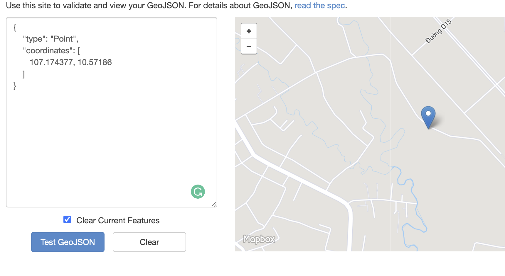
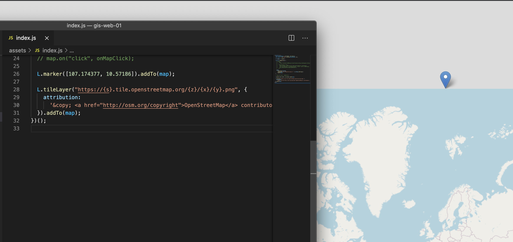
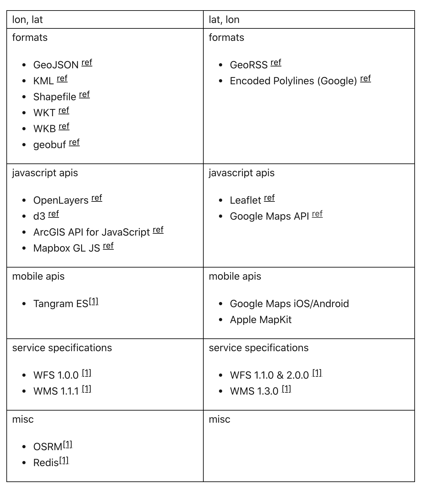
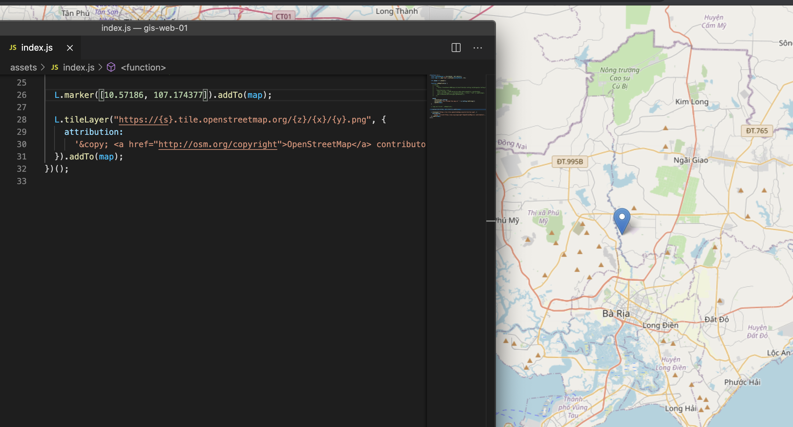

Chủ đề này có thể khá là không có gì để bàn đối với các bạn học về bản đồ có liên quan đến công nghệ GIS. Nhưng đối với mấy đứa học thuần về lập trình như mình thì nó rất ư là mới lạ.

## Đặt vấn đề

Lần trước, mình có viết bài về cấu trúc của [GeoJSON](/tutorials/geojson-la-gi). Trong đó, phần `coordinates` mình có nói các bạn là nó dùng hệ toạ độ [WGS84](https://support.virtual-surveyor.com/en/support/solutions/articles/1000261351-what-is-wgs84-) (World Geodetic System 1984). Tuy nhiên, khi bạn hiển thị bản đồ với Google, MapBox, Leaflet thì tụi nó sẽ cho ra kết quả khác nhau.

Giả sử bây giờ ta sẽ hiển thị một điểm có `kinh độ 107.174377` và `vĩ độ 10.57186`. Kết quả hiển thị trên MapBox như hình dưới đây.

Và giờ mình thử với nó trên Leaflet.

Tại sao với MapBox thì nó ở trên đất liền, còn với Leaflet thì nó ở tận ngoài bản đồ nhỉ?

## Giải thích

Số là trên thế giới này, mấy bạn học về địa lý thì có thói quen đọc theo cấu trúc `[kinh độ, vĩ độ]`. Nhưng theo quan điểm của toán học và phần mềm thì họ lại đọc `[vĩ độ, kinh độ]`.

Từ quan điểm trên, nó dẫn đến mấy ông làm bản đồ, kiểu dữ liệu liên quan đến hệ toạ độ cũng sân si theo. Do đó, các bạn nên tham khảo bảng dưới đây để biết cấu trúc của nó khi làm việc.

- **Kinh độ**: longtitude (lon, lng)
- **Vĩ độ**: latitude (lat)

Như bảng trên, cấu trúc của GeoJSON theo `[kinh độ, vĩ độ]`, còn Leaflet thì `[vĩ độ, kinh độ]`. Ta biết đường sửa lỗi rồi nhé.

## Tham khảo

- Tom MacWright, [lon lat lon lat](https://macwright.com/lonlat/)
