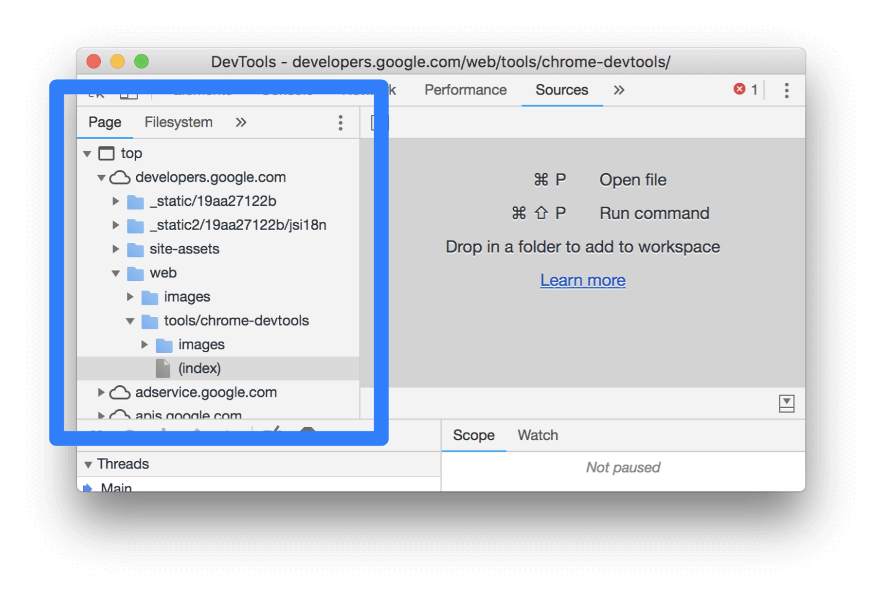
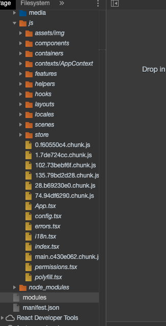
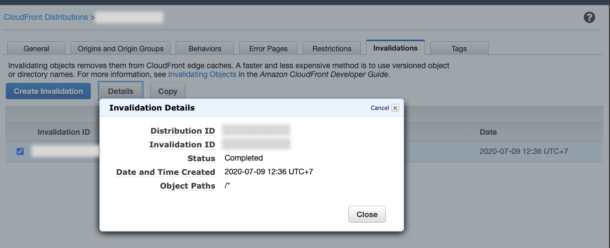

Có thể có bạn đã biết hoặc chưa biết về DevTools của trình duyệt, các file source maps. Lần này mình sẽ kể câu chuyện về các file source maps khi triển khai phiên bản production.

## Vào đề

Theo như thông tin hành lang, ban đầu Google muốn làm ra tab **Sources** tích hợp trong DevTools của Chrome nhằm giúp viết code trực tiếp trên trình duyệt. Do đó, họ đã hỗ trợ gần như đầu đủ đồ chơi. Bạn có thể tham khảo các chức năng tại [https://developers.google.com/web/tools/chrome-devtools/sources](https://developers.google.com/web/tools/chrome-devtools/sources). Chẳng hạn như:

- Xem danh sách các resouces của trang web như là CSS, JavaScript, hình ảnh dưới dạng cấu trúc thư mục.
- Chỉnh sửa CSS và JavaScript trực tiếp để thấy kết quả ngay lập tức

Theo lý thuyết thì nhưng gì để trình duyệt hiển thị đều là sản phẩm sau khi đã xử lý của bạn. Ví dụ như bạn viết TypeScript/CoffeeScript sẽ build ra code JavaScript, SASS ra được CSS.Tuy nhiên để mở rộng hơn, DevTools sau này còn hỗ trợ ánh xạ trực tiếp code của bạn trong đây với thư mục gốc. Tức là bạn viết bằng TypeScript, SASS nó sẽ ánh xạ đoạn code đó tương ứng với file nào trong source code của bạn. Để hình dung thì xem hình dưới đây.

Bạn thấy gì chứ? Thư mục code JavaScript nè và... `node_modules` sao lại xuất hiện ở đây nhỉ? Mà kệ nó đi, coi như giai đoạn development được hỗ trợ tận răng luôn. Cuộc đời thật là tươi đẹp biết bao.

## Điều gì phía sau nó thế?

Có thứ gì đó gọi là `source map`. Nó giúp bạn ánh xạ code đã được chuyển đổi sang code gốc. Để sử dụng được thì bạn phải bật tính năng này lên.

Đối với Chrome thì bạn bật **Settings**, phía dưới mục **Sources** chọn **Enable JavaScript Source Maps**. Muốn debug luôn cả CSS thì chọn **Enable CSS Source Maps**

Còn đối với Firefox thì bạn bật **Settings**, phía dưới mục **Advanced settings** chọn **Enable Source Maps**.

Sơ sơ về source map là thế còn tìm hiểu kỹ về nó thì bạn tham khảo các bài viêt sau:

- Nguyen Sy Hieu, [Giới thiệu về Source Maps](https://viblo.asia/p/gioi-thieu-ve-source-maps-1VgZvBY1ZAw)
- Matt West, [An Introduction to Source Maps](https://blog.teamtreehouse.com/introduction-source-maps)
- Ryan Seddon, [Introduction to JavaScript Source Maps](https://www.html5rocks.com/en/tutorials/developertools/sourcemaps/#toc-base64vlq)

Khi đọc qua, sẽ có điều vi diệu ở cái gọi là **Base64 VLQ**, trong đó, `VLQ` là viết tắt của `Variable Length Quantity`. Các bạn tạm thời tham khảo bài viết ở đây, có thời gian mình sẽ viết tiếp về cái này.

- Nguyen Trung, [Yet another explanation on sourcemap](https://medium.com/@trungutt/yet-another-explanation-on-sourcemap-669797e418ce)

## Khi nào dùng Source Map

Theo như thánh Dan Abramov của chúng ta, thánh bảo thế này.

> Consider deploying source maps to production. It doesn't hurt you, helps you diagnose prod problems, and lets other people learn.
>
> — Dan Abramov (@dan_abramov) [May 11, 2015](https://twitter.com/dan_abramov/status/597777508025634816?ref_src=twsrc%5Etfw)

Đồng ý là sự tuyệt vời của source maps đã giúp phía developer trong việc debug. Tuy nhiên, ở góc nhìn của phía khách hàng bỏ tiền ra thuê tụi tui thì nó không hề ổn tí nào. Do đó, mình chỉ thấy lời của thánh chỉ hợp lý với các ứng dụng mang tính cộng đồng hoặc là trong giai đoạn development. Không thì mặc định tắt nó đi nhé.

## Tớ đã tắt nó như thế nào?

Ở dự án đang làm, ở viết bằng **React** và dùng [create-react-app](https://github.com/facebook/create-react-app) để tạo project. Tuy nhiên, khi chuyển sang `NODE_ENV=production` thì source map vẫn được tạo và vẫn coi được code gốc ở phần **Sources**. Do đó, lúc build thì bạn phải dùng lệnh sau đây `GENERATE_SOURCEMAP=false react-scripts build`. Nói vậy chứ bạn chỉ cần gán biến môi trường (environment variables) `GENERATE_SOURCEMAP=false` rồi chạy lệnh build bình thường là được.

Còn nếu bạn dùng SSR như `Next.js` thì nó làm giùm bạn rồi.

### Lưu ý

Một lưu ý nhỏ là nhớ reset phần caching để có hiệu lực nhé. Nếu bạn có dùng **AWS CloudFront** mà không biết reset thì vào đây. Tạo **Invalidations** với **Object Paths** là `/*`.

## Tham khảo

- Stack Overflow, [How to disable source maps for React JS Application](https://stackoverflow.com/questions/51984146/how-to-disable-source-maps-for-react-js-application)
