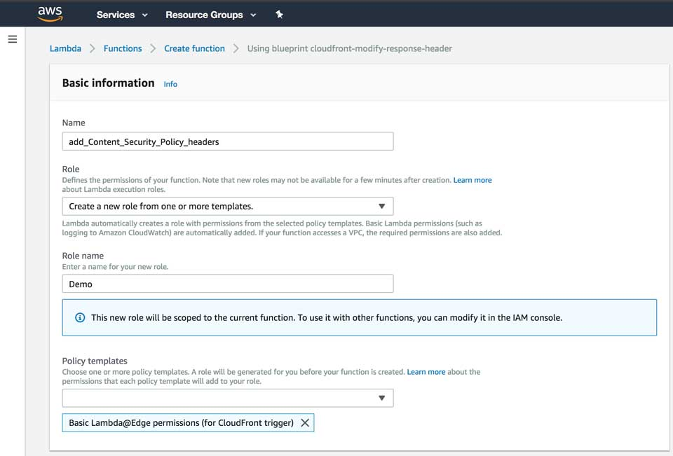
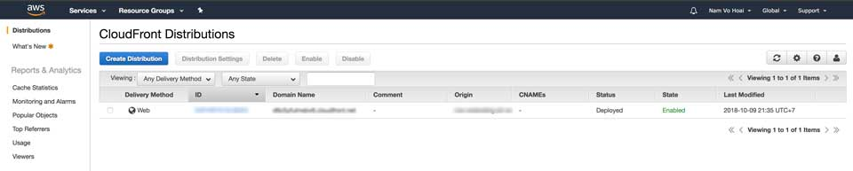
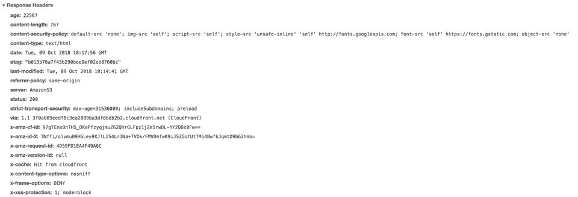

Công việc hiện tại, mình dùng AWS S3 để host static web. Do có việc phải gắn header vào response mỗi khi tải view, nhưng không thành công khi nhúng vào thẻ `meta`. Sau một hồi nhờ vả và Google đã tìm ra giải pháp gắn header vào CloudFront rồi kết nối tới S3. Nhân tiện ghi chú lại cho người sau luôn.

## Vấn đề

Cụ thể, mình cần gắn header [Content-Security-Policy](https://developer.mozilla.org/en-US/docs/Web/HTTP/Headers/Content-Security-Policy) ở trong thẻ `meta`. Tuy nhiên, kết quả không chạy.

 

## Giải pháp

Với vấn đề của mình, có tất cả 3 giải pháp.

### Giải pháp 1

Giải pháp 1 đó là dựng một server bằng Express (Node.js), Spring (Java), Laravel (PHP),... và gắn middleware để xử lý việc response trả về sẽ tự động gắn header. Ở đây, mình dùng AWS S3, chỉ hỗ trợ static web nên giải pháp này thất bại.

### Giải pháp 2

Giải pháp này là can thiệp vào Web Server như Apache, Nginx, IIS,... để gắn header. Về phía AWS không có vụ này nên coi như tạch.

### Giải pháp 3

Dùng CloudFront đón tất cả request/response đến server rồi can thiệp vào header. Mình chọn cách này.

## Cấu hình

Các bạn có thể tìm hiểu một số khái niệm liên quan đến giải pháp này gồm:

- [AWS CloudFront](https://aws.amazon.com/cloudfront/)
- [AWS Lambda](https://aws.amazon.com/lambda/)

### Cấu hình AWS Lambda

Tại sao có Lambda ở đây? Vì CloudFront giống như một người gác cổng nhưng không có vũ khí. Khi đụng chuyện sẽ cần gọi một API nào đó để nó xử lý, cụ thể ở đây là một hàm bất kỳ theo mô hình Serverless.

Trước tiên, sau khi vào AWS Lambda, bạn **BẮT BUỘC** chọn **Region** là `N. Virginia (us-east-1)`. Chọn **Create Function** » **Blueprints** » **cloudfront-modify-response-header** và nhập thông tin theo hình sau.

Kéo xuống phía dưới, chọn **Create Function**. Tiếp theo bạn nhìn sang góc phải, chọn **Actions** » **Publish new version** và lưu ý dòng `ARN`. Sau đó nhấn **Publish**.

Sau khi bạn tạo được Lambda Function, bạn sẽ chỉnh sửa lại code như sau.

### Cấu hình AWS CloudFront

Vào CloudFront chọn **Create Distribution** » **Web** » **Get Stared**.

Mục **Origin Settings**, ở phần **Origin Domain Name** trỏ tới bucket cần deploy bên AWS S3 của bạn. À mà lưu ý nhé, đừng có chọn mặc định của nó. Nên nhập thẳng domain name theo cấu trúc `<s3-bucket>.s3-website<region>.amazonaws.com`. Ví dụ: `demo-s3.s3-website-ap-southeast-1.amazonaws.com`.

Mục **Default Cache Behavior Settings**, ở **Viewer Protocol Policy** chọn **Redirect HTTP to HTTPS**. Ở phần **Lambda Function Associations**, **CloudFront Event** chọn **Viewer Response**, nhập ARN của Lambda Function đã tạo lúc nãy vào. Lưu ý một tí, nó chỉ nhận Lambda Function được tạo ở region là `N. Virginia (us-east-1)`.

Xong rồi đó, bạn nhấn **Create Distribution** là được. À quên, bạn chờ **Status** trở thành **Deployed** mới được nhé. Chờ cũng khoảng hơn 10 phút lận.

## Kết quả

Bạn quay trở lại CloudFront Console, vào mục **Domain Name**, dán địa chỉ ấy vào trình duyệt sẽ kết quả sau khi đã cấu hình nãy giờ.

Mình sẽ không nói tại sao mình phải làm cái này đâu. Dự án của công ty mà.
