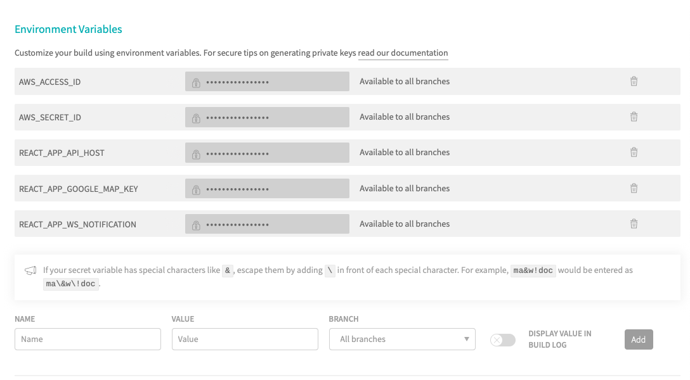
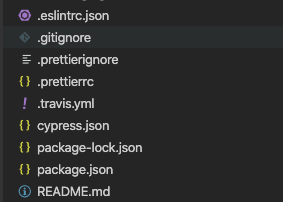
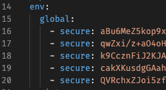

Có một dự án mình có nhu cầu dùng Travis CI để build tự động qua bên Amazon Web Services. Trong lúc build, cần dùng `Environment Variables` (biến môi trường) và mình viết bài này để ghi chú lại các thao tác.

## Tạo biến môi trường trên Travis CI

Đầu tiên, bạn vào project cần cấu hình, chọn `Settings`, kéo xuống phần `Environment Variables`.

Tiếp theo, bạn điền tên biến vào `NAME` và giá trị vào `VALUE`. Nếu bạn chỉ muốn biến đó chỉ sử dụng cho một nhánh nào đó thì chọn tên nhánh ở phần `BRANCH`, không thì chọn **All branches**. Và nhấn `ADD`.

Lưu ý một chút, nếu bạn tạo tên biến bằng cách này thì bạn vẫn thấy được giá trị khi vào Travis Settings.

## Mã hoá biến môi trường

Với cách này, không ai đọc được value và có thể tạo/xoá/sửa biến ở local, không nhất thiết phải vào web.

Đầu tiên là bạn phải tạo fle `.travis.yml` đặt ở thư mục root của project.

Tiếp theo, bạn cần cài đặt Travis CLI tại máy thông qua lệnh sau:

Sau đó cần phải đăng nhập để có thể sử dụng, bạn gõ `travis login` (dành cho [travis-ci.org](https://travis-ci.org)) hoặc `travis login --pro` (dành cho [travis-ci.com](https://travis-ci.com)). Mình dùng tài khoản GitHub (username + mất khẩu) và nhập GitHub Token (nếu có cài đặt) là đăng nhập được.

Với cách này, mình sẽ mã hoá từng biến, tức là có 5 biến thì nhập 5 lần nhé.

Và đây là kết quả.

## Tham khảo

- Travis CI, [Environment Variables](https://docs.travis-ci.com/user/environment-variables)
- Travis CI, [Encryption keys](https://docs.travis-ci.com/user/encryption-keys#usage)
