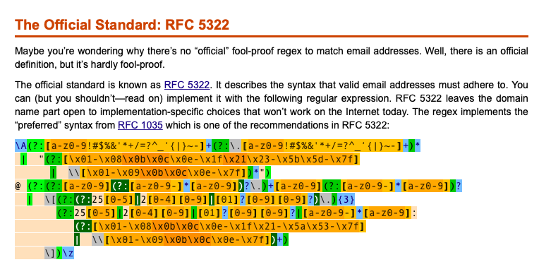
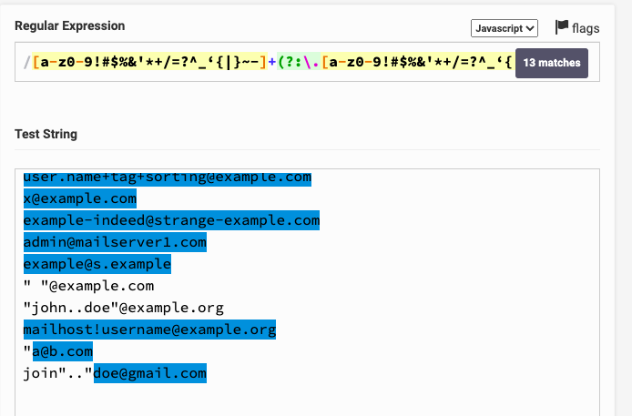

Trong dự án đang làm, phát hiện ra phần validation ở chức năng Create/Edit Users có vấn để ở chỗ email. Chị QA Leader quyền năng đã gợi ý về cách validate và hỏi mình có đề xuất gì không.

## Làm gì xoắn thế bà chị?

Hmmm... Có lẽ mình đã thiếu trường hợp đặc biệt nào đó mà không biết. Nào giờ chỉ gặp địa chỉ mail có dạng `([a-zA-Z0-9_\.\-])+\@(([a-zA-Z0-9\-])+\.)+([a-zA-Z0-9]{2,4})+`. Tức là các dạng sau đây:

- super-hero@domain.com
- super.hero@domain.com
- superhero420@domain.com
- superhero@hidden-domain.com
- super.genius.hero@hidden-domain.com
- super-genius-hero@hidden.domain.com

Chắc sửa cũng dễ thôi mà, lên StackOverflow đọc tí chắc cũng ra. Sau đó mình so lại với bug report là xong. Vào Google và nhấn vào link StackOverflow đầu tiên nè.

[https://stackoverflow.com/questions/46155/how-to-validate-an-email-address-in-javascript](https://stackoverflow.com/questions/46155/how-to-validate-an-email-address-in-javascript)

Đã tìm được vote có dấu xanh xanh, nhưng mà thấy bài vẫn còn dài, kéo xuống coi tiếp có gì hay ho không.

Ey... Cái quái gì thế này? Sao Regex nó dài thế? `RFC 2822` gì ở đây nữa?

## Hoang mang lần thứ I

Thấy có nhắc tới [RFC 2822](https://tools.ietf.org/html/rfc2822) nên bấm vô thử, thấy nó rối rối thế nào ấy. Bấm vô thử link **but you shouldn't** coi sao. Nó điều hướng tới trang [http://www.regular-expressions.info/email.html](http://www.regular-expressions.info/email.html) có sẵn mẫu Regular Expression, chỉ cần copy về là xài được. Kéo dưới cùng xem nó giải thích vụ liên quan đến RFC 2822 như thế nào cho dễ hiểu.

Cái nồi gì nữa đây? [RFC 5322](https://tools.ietf.org/html/rfc5322#section-3.4) và [RFC 1035](https://tools.ietf.org/html/rfc1035#section-2.3.1). Xin được phép từ chối hiểu! Cơ mà đọc qua 2 link đó cũng chả thấy nhắc gì đến ví dụ mẫu. Chữ toàn chữ!!!

Quay lại đọc link trên Wikipedia [Wikipedia](https://en.wikipedia.org/wiki/Email_address) của bà chị xem có dễ hiểu hơn không.

## Khai sáng lần thứ I

Sau khi đọc link Wikipedia, ta dễ dàng hiểu rằng cấu trúc của một email gồm có 2 phần đó là **Local-Part** và **Domain** như sau `local-part@domain`.

### Local-Part

Phần này đứng **trước** ký tự `@`. Phần này gồm có 4 lưu ý:

- Các chữ cái Latin được viết hoa và viết thường, từ `a-z` và `A-Z`
- Chữ số `0-9`
- Các kỹ tự đặc biệt có thể in được `` !#$%&'*+-/=?^_`{|}~ ``
- Ký tự `.`, không được đặt ở đầu hoặc cuối và cũng như không được biết liền. **super..hero@domain.com** là không hợp lệ

Ngoài ra, độ dài tối đa của một local-part là 64 octets, tức là 64 bytes, tương đương 64 ký tự.

### Domain

Phần này đứng **sau** ký tự `@`. Chỉ có 3 lưu ý:

- Các chữ cái Latin được viết hoa và viết thường, từ `a-z` và `A-Z`
- Chữ số `0-9`, nhưng không được được ở đầu
- Ký tự `-`, không được đặt ở đầu và cuối.

## Hoang mang lần thứ II

Dựa vào định nghĩa của `Local-Part` và `Domain` có một số chỗ không bị ràng buộc vị trí xuất hiện:

- **local-part**
  - Chữ số `0-9`
  - Các kỹ tự đặc biệt có thể in được `` !#$%&'*+-/=?^_`{|}~ ``

Như vậy các địa chỉ sau sẽ hợp lệ:

- `123456@domain.com`
- `^C4NN4B!S/g@domain.com`

Bình tĩnh, kéo xuống danh sách những địa chỉ email hợp lệ còn hoang mang hơn nữa kìa.

Bạn có thể 2 dòng lạ này không?

- `" "@example.com`
- `"join..doe"@example.com`

## Khai sáng lần thứ II

Thực ra lúc định nghĩa ở phần `local-part` mình bỏ sót vài đoạn quan trọng.

> If quoted, it may contain Space, Horizontal Tab (HT), any ASCII graphic except Backslash and Quote and a quoted-pair consisting of a Backslash followed by HT, Space or any ASCII graphic; it may also be split between lines anywhere that HT or Space appears.

> In contrast to unquoted local-parts, the addresses ".John.Doe"@example.com, "John.Doe."@example.com and "John..Doe"@example.com are allowed.

Do đó, bạn sẽ thấy tại sao 2 ví dụ trên có cặp dấu nháy kép đều hợp lệ.

## Thế còn chuẩn của Google thì sao?

Đầu tiên, mình tìm được một đoạn như thế này từ phía Gmail Help.

Mình thử với email cá nhân bằng cách thêm vài dấu chấm vô và nó đã thành công. Thế là mình nảy sinh ra ý nghĩ, nếu đã có ai đăng ký tài khoản với cú pháp ngược lại thì như thế nào? Ví dụ của mình là `super.hero@gmail.com`, đứa khác tạo `superhero@gmail.com` thì chả khác nào email tới mình đều vào hộp thư của nó? Và mình đã thử tạo phiên bản ngược của 2 trường hợp này và tất cả đều **KHÔNG TẠO MỚI ĐƯỢC**. Vỗ tay!

Google còn có một lưu ý nữa.

> If you use Gmail through work, school, or other organization (like yourdomain.com or yourschool.edu), dots do change your address. To change the dots in your username, contact your admin.

Quay lại vấn đề chính, Google không có đề cập chuẩn địa chỉ email của mình, chỉ nói về 2 cách có thể tạo thêm nhiều địa chỉ từ địa chỉ email của bạn.

- Thêm dấu `+` và kết hợp chữ hoặc sô phía sau nó. Ví dụ địa chỉ email của bạn là `hikingfan@gmail.com`, bạn có thể gửi email đến `hikingfan+friends@gmail.com` hoặc `hikingfan+mailinglists@gmail.com` đều được.
- Thêm 1 hoặc nhiều dấu `.` vào.
  Địa chỉ của bạn là `hikingfan@gmail.com`, bạn có thể dùng `hiking.fan@gmail.com` hay `hi.kin.g.fan@gmail.com` đều được.

## Tổng kết

Qua sự việc này, mình nhận thấy có 2 hướng đi.

- Ứng dụng liên quan đến việc **TẠO** email. Bạn sẽ nên cân nhắc có nên tuân thủ hoàn toàn vào chuẩn của RFC hay là dùng theo chuẩn của bạn. Chẳng hạn như bạn dùng [YopMail](http://www.yopmail.com/en/), nó chỉ cho bạn dùng `a-z0-9._-` mà thôi. Bạn cũng có thể cân nhắc việc dùng ký tự đặc biệt để tạo email thay thế như của Google bằng 2 ký tự `.` và `+`.
- Ứng dụng liên quan đến việc **SỬ DỤNG** email. Bạn cũng chả cần quan tâm lắm các chuẩn. Về cơ bản thì hỗ trợ local-part theo chuẩn như của **YopMail** là được. Ngoài ra, người dùng cuối sẽ chịu trách nhiệm với những gì họ nhập vào, tức là `super.hero@gmail.com` và `superhero@gmail.com` là 2 tài khoản khác nhau.

Còn về việc chữ hoa và thường, tốt nhất các bạn nên ép về kiểu chữ thường hết. Mình đã gặp một trường hợp người dùng tạo tài khoản bằng điện thoại di động. Sau đó họ đăng nhập trên máy tính thì báo không được. Sau một hồi tìm lỗi, bọn mình phát hiện ra trên điện thoại, mặc định chữ cái đầu tiên luôn luôn viết hoa. Và thế là bạn Back-End phải tốn thời gian ngồi sửa lại database.

Còn về việc Google cho phép tạo nhiều alias bằng ký tự `+` và `.` cũng hay. Chẳng hạn bạn làm chức năng Create/Edit Users có liên quan đến việc gửi email để xác thực gì đó thì tất nhiên cần sử dụng email thật. Theo như cách bình dân học vụ là tạo tài khoản mới với những cái tên khác nhau như `test01@gmail.com`, `test02@gmail.com`,... sẽ rất tốn thời gian. Bạn có thể sử dụng **YopMail** cũng được, nó sẽ tự động xoá địa chỉ email đó sau 7 ngày không hoạt động. Tuy nhiên nhược điểm là người khác sẽ thấy được nội dung trong thời gian chờ xoá địa chỉ và lại cộng tiếp 7 ngày. Bằng giải pháp của Google, bạn chỉ cần tạo `test+01@gmail.com`, `test+02@gmail.com`, `test+03@gmail.com`. Sau đó vào `test@gmail.com` kiểm tra email thôi. Dễ chơi, dễ trúng thưởng!

Còn về Regex, bạn có thể dùng cái này là ổn với hầu hết các email theo chuẩn của RFC. À mà nó sẽ loại bỏ cái format bệnh hoạn `" "@example.com` và `"john..doe"@example.com` ra nhé.

`\A[a-z0-9!#$%&'*+/=?^_‘{|}~-]+(?:\.[a-z0-9!#$%&'*+/=?^_‘{|}~-]+)*@ (?:[a-z0-9](?:[a-z0-9-]*[a-z0-9])?\.)+[a-z0-9](?:[a-z0-9-]*[a-z0-9])?\z`

## Tham khảo

- Wikipedia, [Email address](https://en.wikipedia.org/wiki/Email_address)
- StackOverflow, [How to validate an email address in JavaScript](https://stackoverflow.com/a/1373724)
- Phil Haack, [I Knew How To Validate An Email Address Until I Read The RFC](https://haacked.com/archive/2007/08/21/i-knew-how-to-validate-an-email-address-until-i.aspx)
- Gmail Help, [Getting someone else's mail](https://support.google.com/mail/answer/10313?topic=14822)
- Official Gmail Blog, [2 hidden ways to get more from your Gmail address](https://gmail.googleblog.com/2008/03/2-hidden-ways-to-get-more-from-your.html)
