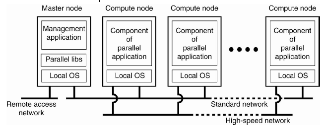
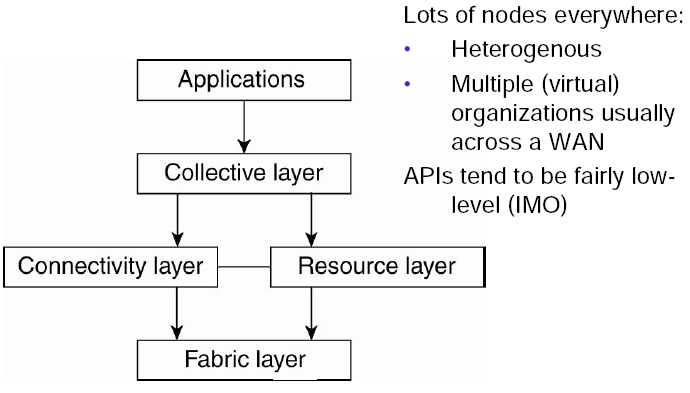
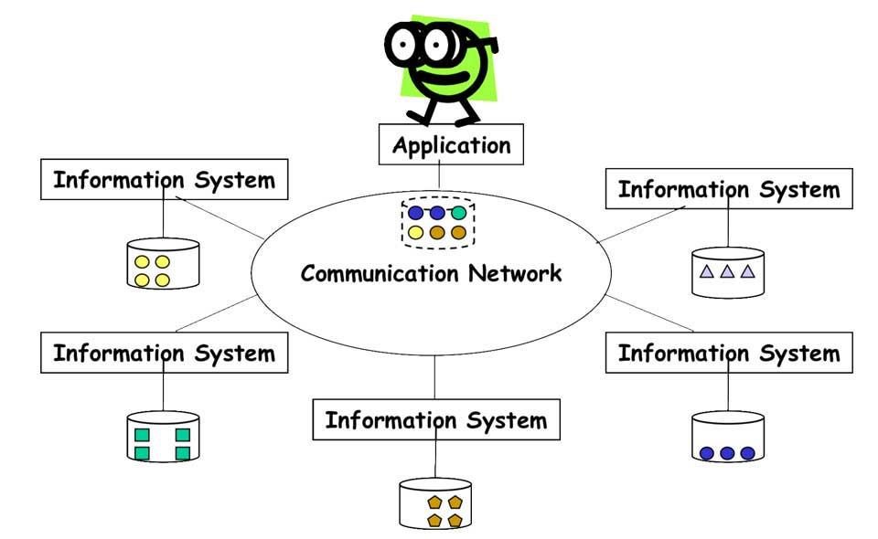
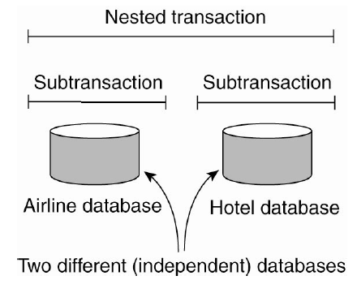
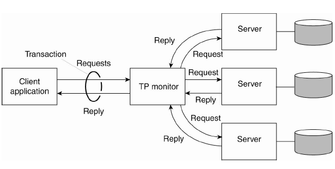
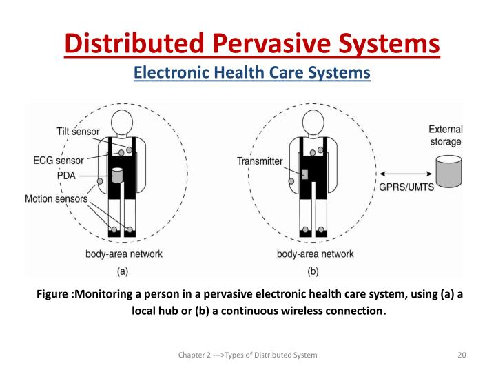

Sau khi tìm hiểu các tính chất của Distributed System (gọi tắt là DS). Phần này sẽ tìm hiểu các loại DS.

## Distributed Computing Systems

Distributed Computing System được sử dụng cho các hệ thống yêu cầu cao về hiệu năng xử lý tính toán.

### Cluster Computing Systems

Cluster Computing System trở nên phổ biến khi giá thành/hiệu suất máy tính cá nhân, máy trạm được cải thiện. Nó là tập hợp các máy tính tương đối đơn giản trong một mạng tốc độ cao để tạo thành một siêu máy tính có khả năng tính toán được lập trình song song (_parallel_).

### Grid Computing Systems

Thông thường trong Cluster Computing System, các máy tính được kết nối thường cùng một cấu hình, cùng hệ điều hành được kết nối thông qua cùng một mạng. Grid Computing System ngược lại, các máy tính được kết nối có thể khác cấu hình, có thể kết nối cụm máy của tổ chức A với cụm máy của tổ chức B trong một mạng ảo.

Thiết kế này được chia làm 4 lớp.

- **Fabric layer** - Cung cấp giao diện cho tài nguyên cục bộ tại một trang web cụ thể. Thông thường, chúng sẽ cung cấp các chức năng để truy vấn trạng thái và khả năng của một tài nguyên, cùng với các hàm để quản lý tài nguyên thực tế (ví dụ: khóa tài nguyên)
- **Connectivity layer** - Bao gồm các giao thức để hỗ trợ kết nối
  - Người dùng có thể sử dụng nhiều tài nguyên
  - Xác thực người dùng để sử dụng tài nguyên nhất định
- **Resource layer** - Chịu trách nhiệm quản lý tài nguyên, sử dụng thông tin từ Connectivity Layer để gọi Fabric Layer
- **Collective layer** - Xử lý quyền truy cập tài nguyên
- **Application layer** - Bao gồm các ứng dụng trong một tổ chức ảo và sử dụng Grid Computing System

Thông thường, Collective layer, Connectivity layer và Resource layer tạo thành trái tim của lớp trung gian lưới (_grid middleware layer_). Các lớp này cùng nhau kiểm soát quyền truy cập cũng như quản lý tài nguyên có khả năng phân tán trên nhiều web.

## Distributed Information Systems

Hệ thống chủ yếu để quản lý và tích hợp các xử lý nghiệp vụ.

### Transaction Processing System

Các bạn còn nhớ về xử lý Transaction tại database chứ?

BEGIN TRANSACTION(server, transaction);  
 READ(transaction, file-1, data);  
 WRITE(transaction, file-2, data);  
 newData := MODIFIED(data);  
 IF WRONG(newData) THEN  
 ABORT TRANSACTION(transaction);  
 ELSE  
 WRITE(transaction, file-2, newData);  
 END IF;  
END TRANSACTION(transaction);

Một transaction là một quá trình xử lý từ khi bắt đầu tới khi kết thúc thỏa mãn bốn tính chất **ACID**. Bốn chữ đó viết tắt của bốn tính chất quan trọng sau:

- **Atomicity** là một đề xuất tất cả hoặc không có gì. Tính chất này đảm bảo rằng khi một giao dịch liên quan đến hai hay nhiều xử lý, hoặc là tất cả các xử lý được thực hiện hoặc không có xử lý được thực hiện.
- **Consistency** đảm bảo rằng một giao dịch không bao giờ được thông qua cơ sở dữ liệu của bạn trong tình trạng dở dang. Tính chất này, hoặc là tạo ra toàn bộ trạng thái mới hoặc rollback tất cả các xử lý để về trạng thái ban đầu, nhưng không bao giờ thông qua cơ sở dữ liệu trong trạng thái dở dang.
- **Isolation** giữ giao dịch tách rời nhau cho đến khi chúng đã hoàn tất. Tính chất này đảm bảo rằng hai hoặc nhiều giao dịch không bao giờ được trộn lẫn với nhau, tạo ra dữ liệu không chính xác và không phù hợp.
- **Durability** đảm bảo rằng cơ sở dữ liệu sẽ theo dõi các thay đổi cấp phát trong một cách mà các máy chủ có thể phục hồi từ một sự kết thúc bất thường. Tính chất này đảm bảo rằng trong trường hợp thất bại hay dịch vụ khởi động lại các dữ liệu có sẵn trong trước khi gặp lỗi.

Cho đến nay, transaction thường được dùng trong một database đơn lẻ. Một transaction lồng (nested transaction) có thể được tạo từ nhiều transaction nhỏ khác. Và tính Durability chỉ áp dụng cho lớp trên cùng.

Transaction Processing (TP) cho phép ứng dụng truy cập nhiều server/database.

### Enterprise Application Integration

Enterprise Application Integration (EAI) là một tập hợp các công nghệ, dịch vụ hình thành một trung gian để cho phép tích hợp các hệ thống và các ứng dụng độc lập. EAI đóng vai trò như middleware để liên kết các ứng dụng.

Remote Procedure Calls (RPC) và Remote Method Invocations (RMI) là một ví dụ về middleware. Với RPC, ứng dụng A gọi đến ứng dụng B bằng cách thực hiện procedure call cục bộ, kết quả được B gửi lại tới A bằng message. RMI là một sự cái tiến từ RPC. Về cơ bản cũng tương tự RPC, nhưng hoạt động trên đối tượng thay vì ứng dụng. RPC và RMI đều có bất lợi là caller và callee cần phải chạy cùng lúc tại thời điểm giao tiếp.

Message-oriented middleware (MOM) cho phép ứng dụng gửi message đến các điểm liên lạc hợp lý (publish/subscribe).

## Distributed Pervasive Systems

Thường là các node nhỏ, sử dụng pin, dùng trong các hệ thống nhúng.

- Bao gồm thay đổi theo ngữ cảnh, tức là hệ thống nhận thức được môi trường của nó thay đổi liên tục. Ví dụ: nhận biết được bỗng dưng... rớt mạng
- Khuyến khích các thành phần ad-hoc, tức là nhiều thiết bị đa dạng trong hệ thống được sử dụng theo nhiều cách khác nhau bởi những người dùng khác nhau. Do đó, cần dễ dàng cấu hình bộ khung ứng dụng đang chạy trên thiết bị bởi người dùng hoặc điều chỉnh tự động (nhưng có kiểm soát)
- Nhận dạng chia sẻ (_Recognize sharing_) là mặc định,

## Tham khảo

- Andrew S.Tanenbaum, Maarten Van Steen, [Distributed Systems: Principles and Paradigms](https://www.amazon.com/Distributed-Systems-Principles-Paradigms-Tanenbaum/dp/B00BSZVOYC)
- California State University, San Bernardio, CSE 660, [An Introduction to Distributed Systems](http://cse.csusb.edu/tongyu/courses/cs660/notes/chap1.php)
- École polytechnique fédérale de Lausanne, [Introduction: Distributed Information Systems – An Overview](http://lsirwww.epfl.ch/courses/dis/2006ws/lecture/Overview.pdf)
- University of Oslo, [Introduction to Distributed Systems (DS)](https://www.uio.no/studier/emner/matnat/ifi/INF5040/h07/undervisningsmateriale/INF5040_WK35_IntroDS.pdf)
- Tedu, [Thuộc tính ACID trong cơ sở dữ liệu là gì?](https://tedu.com.vn/sql-server/thuoc-tinh-acid-trong-co-so-du-lieu-la-gi-27.html)
- Kipalog, [Một số giải pháp để xử lý distributed transaction trong hệ thống phân tán](https://kipalog.com/posts/Mot-so-giai-phap-de-xu-ly-distributed-transaction-trong-he-thong-phan-tan)
