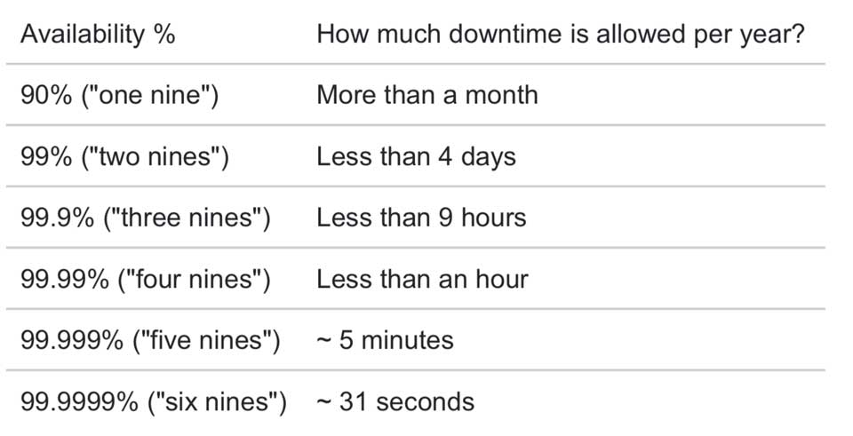

Ngày xưa, lúc mới bắt tay vào làm dự án **Penlook** với mấy ông anh, khi bàn về kiến trúc có đặt ra chia tải cho nhiều server. Sau này đi làm có kinh nghiệm rồi mới biết nó là gì. Giờ đây quyết định ghi chú lại để dành đọc.

## Dẫn nhập

Giả sử sau khi phát triển xong một website buôn bán nhạc cụ, ta sẽ nghĩ chỉ cần thuê 1 con server chạy là đủ rồi. Cấu hình tầm 1 CPU, 1GB RAM, 25GB SSD, 1TB băng thông là được. Và ta sẽ host lên server với domain là `https://instruments.com`.

Khoảng 3 tháng đầu làm ăn không phát triển lắm, tầm **1000 lượt truy cập/ngày**, tương đương **2 lượt truy cập/phút**. Bỗng một ngày đẹp trời, bạn nhập vè nhạc cụ mới quá hot đi, mọi người đổ xô vào web của bạn để đặt hàng. Có thời điểm lên tới **1000 lượt truy cập tại một thời điểm**, rồi server bị sập. Sau đó, bạn bắt đầu tìm hiểu nguyên nhân và cách giải quyết cho vấn đề trên.

## Tìm hiểu vấn đề

Công cụ đơn giản nhất để tìm hiểu số lượng requests dẫn đến sập server đó là [Apache JMeter](https://jmeter.apache.org/). Sau khi kiểm thử với nhiều khả năng thì đã phát hiện dấu hiệu của vấn đề. Vấn đề ở đây là đến **1000 requests tại một thời điểm** là server sẽ sập.

Cảm thấy hoang mang, bạn lên Google tìm hiểu và ra được giải pháp. Đó là **Scale Up** (hay _Scale Vertically_) và **Scale Out** (hay _Scaling Horizontally_).

- **Scale Up** - Mục đích là cải thiện performance của server hiện tại. Có 2 hướng tiếp cận đó là _nâng cấp phần cứng_ hoặc _tối ưu hoá mã nguồn_.
- **Scale Out** - Mục đích là tăng số lượng server. Sau đó, dùng công cụ **load balancing** để điều phối đến nhiều server đã cấu hình.

### Scale Up

Như đã nói, phương pháp Scale Up là tăng thêm tài nguyên (RAM/CPU/DISK) cho server. Phương pháp này khá tốn kém chi phí. Do đó, người ta có một cách khác để tiết kiệm chi phí đó là sử dụng công nghệ ảo hoá (_Virtualization_). Có một số loại công nghệ ảo hoá sau:

- Hardware Virtualization
- OS-level Virtualization
- Desktop Virtualization
- Application Virtualization
- Network Virtualization

### Scale Out

Phương pháp Scale Out là tăng thêm số lượng server. Phương pháp này ban đầu hơi tốn kém so với Scale Up nhưng về sau sẽ tiết kiệm hơn. Đây là phiên bản đơn giản của Distributed System. Vì yêu cầu của Distributed System phức tạp hơn nhiều và có nhiều vấn đề kỹ thuật cần quan tâm hơn.

## Tại sao cần Distributed System?

Hệ thống của bạn xử lý công việc cần tốn nhiều tài nguyên. Đôi khi vượt quá khả năng của một server nên bạn sẽ cần phải Scale Out hệ thống. Lúc đó, hệ thống bạn cần đảm bảo các tiêu chí sau:

- Tốc độ của bộ nhớ
- Dung lượng lớn với tốc độ Input/Output cực nhanh
- Tốc độ xử lý tính toán (10, 100,.. thậm chí cả ngàn core)
- Tin cậy, luôn sẵn sàng, downtime gần bằng 0
- Độ trễ thấp. Độ trễ được xác định như sau: `result = query(all data in the system)`

Do đó, với Distributed System thì bạn sẽ có phương pháp triển khai phù hợp với công việc hơn. Sau đây là định nghĩa.

> A distributed system is a collection of independent computers that appears to its users as a single coherent system.
>
> **Andrew S.Tanenbaum**

Có hai công việc cơ bản của một hệ thống máy tính đó là **Lưu Trữ** và **Tính Toán**. Distributed System là nghệ thuật giải quyết vấn đề của một máy tính trên nhiều máy tính.

## Mục tiêu của Distributed System

Để làm gì, cũng cần phải có mục tiêu của nó. Dưới đây là một số mục tiêu mà chúng ta cần nỗ lực để thực hiện nó.

### Dễ dàng truy xuất tài nguyên

Cho phép người dùng (ứng dụng) dễ dàng truy xuất tài nguyên từ xa.

### Tính trong suốt

Ẩn giấu sự rời rạc của hệ thống đối với người dùng. Theo như Andrew S.Tanenbaum và Maarten Van Steen giới thiệu trong "Distributed Systems: Principles and Paradigms", tiêu chuẩn này được ghi rõ ràng trong đặc tả ISO, năm 1995. Cụ thể thì mình trong rõ phiên bản nào.

- **Access transparency** - che giấu sự khác biệt về cách biểu diễn và cách truy cập tài nguyên
- **Location transparency** - che giấu vị trí của tài nguyên
- **Migration transparency** - che giấu khả năng chuyển vị trí của tài nguyên
- **Relocation transparency** - che giấu việc di chuyển của tài nguyên khi đang được sử dụng
- **Replication transparency** - che giấu tình trạng tình trạng sử dụng bản sao của tài nguyên
- **Concurency transparency** - che giấu sự chia sẻ tài nguyên đồng thời
- **Failure transparency** - che giấu lỗi hệ thống nếu có

Về mức độ của tính trong suốt, bạn nên cân nhắc thực hiện nhưng không phải hoàn toàn ẩn hết với người dùng.

- Người dùng ở các châu lục khác nhau, múi giờ sẽ khác nhau.
- Hoàn toàn ẩn các lỗi mạng là không thể (về thực tế lẫn lý thuyết), do:
  - Không phân biệt máy tính chậm hay bị lỗi
  - Không biết trước được máy tính có thực sự thực hiện xong một thao tác trước khi xảy ra sự cố
- Chi phí về hiệu năng nếu trong suốt hoàn toàn. Ví dụ, bạn muốn in tài liệu từ máy tính cá nhân. Máy tính của bạn kết nối với nhiều máy in. Nếu bạn biết máy in nào đang "rảnh" sẽ chọn để tiết kiệm thời gian hơn.

### Tính mở

**Tính mở của Distributed System** hiểu là có thể tương tác với các dịch vụ khác từ những hệ thống mở khác, bất kể môi trường nền tảng.

- Hệ thống phải phù hợp với giao diện được xác định rõ. Cụ thể là [Interface Definition Language - IDL](https://stackoverflow.com/questions/670630/what-is-idl).
- Hệ thống nên hỗ trợ tính di động của ứng dụng
- Hệ thống nên dễ dàng tương thích. Cụ thể hơn là dễ dàng cấu hình hệ thống ra khỏi các thành phần khác nhau (_should be easy to configure the system out of different components_). Cũng như là dễ dàng thêm vào hoặc thay thế một component bất kỳ mà không gián đoạn hệ thống.

Để đạt được tính mở, ít nhất làm cho Distributed System độc lập với tính không đồng nhất của môi trường nền tảng.

- Phần cứng
- Platform
- Ngôn ngữ

### Tính mở rộng

Khi nói về tính mở rộng, ta sẽ ít nhất về 3 tiêu chí sau:

- **Size scalability** - thêm node vào hệ thống để tăng tốc độ xử lý nhưng không làm tăng độ trễ
- **Geographic scalability** - sử dụng nhiều data center ở nhiều nơi khác nhau để giảm thời gian phải hồi đến người dùng, tuy nhiên bạn phải xử lý độ trễ cực kỳ hợp lý (khá giống tư tưởng của CDN)
- **Administrative scalability** - thêm nhiều node, nhưng không làm tăng chi phí quản lý

#### Những vấn đề khi mở rộng hệ thống

- **Tập trung dịch vụ** - Một server cho tất cả người dùng  
  Sẽ gây nên tình trạng thắt cổ chai (_bottleneck_)
- **Tập trung dữ liệu** - Một cuốn sổ điện thoại trực tuyến  
  Giả sử bạn lưu tên miền của tất cả các trang web hiện nay vào một table trong database, sẽ như thế nào nếu bạn gửi 1 request đến truy vấn thông tin? Một phiên bản thắt cổ chai khác tại database.
- **Thuật toán tập trung**  
  Đặc điểm của thuận toán trong Distributed System khác với các thuật toán trong Centralized System ở chỗ cần tập trung dữ liệu sẽ gây quá tải một phần mạng. Các đặc điểm đó bao gồm:
  - Không có máy nào có thông tin đầy đủ về trạng thái của hệ thống
  - Máy móc đưa ra quyết định dựa trên thông tin cục bộ
  - Thất bại của một máy không ảnh hưởng đến thuật toán
  - Không có giả định ngầm rằng đồng hồ toàn cục tồn tại

#### Các kỹ thuật mở rộng

Có 3 kỹ thuật cơ bản trong việc mở rộng Distributed System đó là: ẩn thời gian chờ, phân tán và nhân bản.

##### Ẩn thời gian chờ (_hiding communication latencies_)

Tránh thời gian chờ phản hồi quá lâu. Minh hoạ cho việc này là kiểm tra dữ liệu của người dùng. Thay vì chờ phía server xử lý thì kiểm tra tại client bằng JavaScript sẽ tiết kiệm thời gian hơn.

Hình (a) là kiểm tra tại phía server. Hình (b) là kiểm tra tại phía client.

##### Phân tán (_Distribution_)

Ta có thể hiểu cách này là **partition**, tức là chia để trị. Ví dụ về DNS là rõ ràng nhất về tính phân tán trên mạng Internet. Những nhóm **domain** được chia ra thành từng vùng. Chẳng hạn, tên miền `nl.vu.cs.flits`. Ban đầu nó được xử lý ở vùng Z1, sau đó chuyển sang vùng Z2 để còn `vu.cs.flits` rồi đến Z3 thành `cs.flits`.

##### Nhân bản (_Replication_)

Tức là ta sẽ sao chép dữ liệu ra nhiều nơi để tăng tốc độ xử lý. Điển hình là **caching**.

### Tính sẵn sàng

Phần này mình thấy Mikito Takada có nhắc đến khá thú vị, nên thêm vào luôn. Tính sẵn sàng thể hiện ở tỷ lệ thời gian hệ thống trong trạng thái hoạt động. Nếu người dùng không thể truy cập vào hệ thống, tức là nó không sẵn sàng. Distributed System cho phép ta đạt được những đặc tính mong muốn mà một máy lẻ không đáp ứng được. Vì nó là sự kết hợp từ nhiều máy nên có khả năng một máy trong hệ thống bị sập. Distributed System là sự kết hợp của nhiều mấy có thể sập bất cứ lúc nào và ta phải xây dựng một cơ đáng tin cậy bao quát chúng.

Tính sẵn sàng nhìn ở góc độ kỹ thuật, đó là khả năng chịu lỗi. Bởi vì xác suất xảy ra sự cố tỉ lệ thuận với số lượng thành phần. Ta có thể làm phép đo đơn giản về tính sẵn sàng của hệ thống.

Công thức: `Availability = uptime / (uptime + downtime)`

### Cạm bẫy

Có một số giả định sai lầm khi phát triển Distributed System. Bạn hãy bỏ đi nhé.

- Mạng là đáng tin cậy
- Mạng là bảo mật
- Mạng là đồng nhất
- Cấu trúc liên kết không thay đổi
- Độ trễ bằng không
- Băng thông là vô hạn
- Chi phí vận chuyển bằng không
- Chỉ có một quản trị viên

## Tổng kết

Ban đầu mình nghĩ Distributed System cũng chỉ là Scale Out hệ thống đơn thuần. Tuy nhiên, càng tìm hiểu thì càng rối nùi do để vận hành được hệ thống cần phải có một số tiêu chí nhất định. Mình tham khảo một số tài liệu để giản lược, tuy nhiên khó quá thì vẫn phải đọc **"Distributed Systems: Principles and Paradigms"** để khai sáng, và cuốn này khá khó nhai. Tuy nhiên, để dễ nắm được nội dung thì bạn có thể tham khảo **"Distributed Systems for fun and profit"** và **"CSE 660 - An Introduction to Distributed Systems"**.

## Tham khảo

- Mikito Takada, [Distributed Systems for fun and profit](http://book.mixu.net/distsys/ebook.html)
- Andrew S.Tanenbaum, Maarten Van Steen, [Distributed Systems: Principles and Paradigms](https://www.amazon.com/Distributed-Systems-Principles-Paradigms-Tanenbaum/dp/B00BSZVOYC)
- Hackernoon, [A Thorough Introduction to Distributed Systems](https://hackernoon.com/a-thorough-introduction-to-distributed-systems-3b91562c9b3c)
- Kipalog, [Giới thiệu MySQL Replication](https://kipalog.com/posts/Gioi-thieu-MySQL-Replication)
- PC Freak, [What is Vertical scaling and Horizontal scaling – Vertical and Horizontal hardware / services scaling](http://www.pc-freak.net/blog/vertical-horizontal-server-services-scaling-vertical-horizontal-hardware-scaling/)
- Wikipedia, [Virtualization](https://en.wikipedia.org/wiki/Virtualization)
- Git, [Bắt Đầu - Về Quản Lý Phiên Bản](https://git-scm.com/book/vi/v1/Bắt-Đầu-Về-Quản-Lý-Phiên-Bản)
- Quora, [Why use distributed databases?](https://www.quora.com/Why-use-distributed-databases)
- [Bài giảng Hệ phân tán](https://text.123doc.org/document/2506400-tinh-trong-suot-cua-mot-he-thong-phan-tan.htm)
- California State University, San Bernardio, CSE 660, [An Introduction to Distributed Systems](http://cse.csusb.edu/tongyu/courses/cs660/notes/chap1.php)
