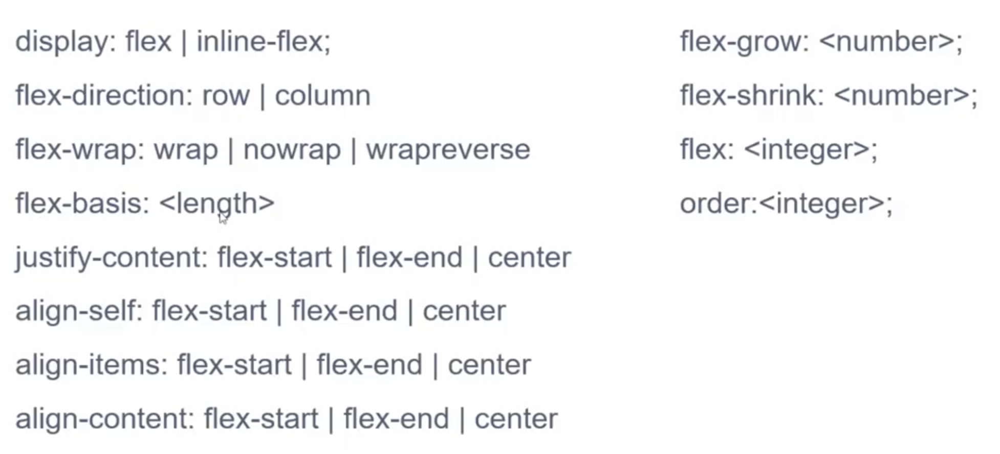

Dạo gần đây mình đi phỏng vấn, chỗ nào cũng hỏi về khái niệm **Flexbox** trong CSS để dựng layout. Sẵn tiện tìm hiểu nên mình viết lại tutorial luôn.

## Flexbox

Có một lời khuyên của người đi trước để lại rằng: **"Căn đều một bên thì xài Flexbox, còn hai bên thì xài Grid"**. Grid ở đây chính là Grid layout theo số cột, thường là 12 hoặc 16 cột.

Flexbox ở đây, có nghĩa là element cha có thuộc tính `display: flex`, các element con sẽ dựa vào đó mà sắp xếp bố cục linh động. Có thể **flex** ở đây mang nghĩa **flexible**. Vào năm 2013, tớ đã biết khái niệm này và dùng trong việc biến nội dung của thẻ `<ul>` từ chiều dọc thành chiều ngang trên Navbar. Thật ra, Flexbox còn nhiều công dụng nữa, chúng ta cùng tìm hiểu. Lưu ý là các bạn nhớ thường xuyên sử dụng chức năng **Inspect Element** của trình duyệt để tìm hiểu nhé.

## Hai chiều của Flexbox

Flexbox được căn chỉnh theo 2 chiều là dọc và ngang thông qua thuộc tính `flex-direction`.

## Các thuộc tính của Flex Items

Giờ ta sẽ đi chi tiết về thuôc tính của element được bọc bởi element cha có thuộc tính `display: flex`. Đầu tiên, ta sẽ thử thuộc tính `flex-grow`. Lưu ý, tổng của flex-grow là **10** nhé.

Giờ một thuộc tính tiếp theo là `order` để sắp xếp thứ tự của flex item.

## Các layout thú vị khác

Thuộc tính `align-items` để căn chỉnh theo chiều dọc của flex item.

Thuộc tính `justify-content` để căn chỉnh 2 bên tính từ biên của flex item.

## Chốt hạ

Nãy giờ là demo để mọi người hình dung được Flexbox là thế nào. Giờ mình sẽ note lại đầy đủ thuộc tính của em nó.

Mới được ông anh share cho cái clip cũng dễ hiểu, mọi người cùng xem (click vào hình bên dưới).

## Tham khảo

- Mozilla, [Basic concepts of flexbox](https://developer.mozilla.org/en-US/docs/Web/CSS/CSS_Flexible_Box_Layout/Basic_Concepts_of_Flexbox)
- CSS-Tricks, [A Complete Guide to Flexbox](https://css-tricks.com/snippets/css/a-guide-to-flexbox/)
- YouTube, [Flexbox CSS In 20 Minutes](https://www.youtube.com/watch?v=JJSoEo8JSnc)
