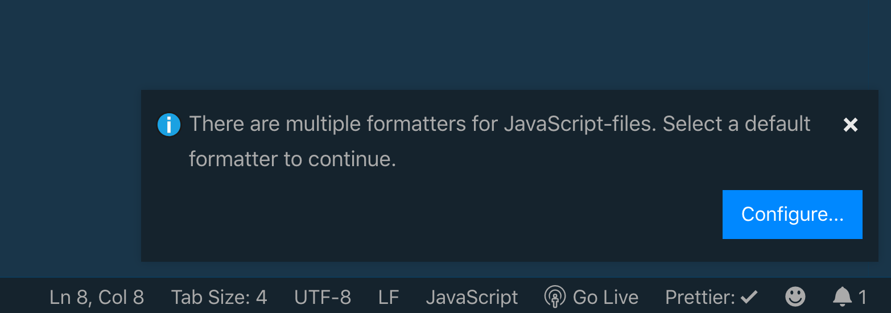

Chắc hẳn khi mọi người viết code đều dùng công cụ mặc định hoặc là dùng thư viện bên ngoài để format code. Trong đó có lẽ [Prettier](https://prettier.io) là các bạn dùng nhiều nhất. Bài viết hôm nay, mình sẽ chia sẻ với các bạn cách mình dùng Prettier.

## Code Formatter là gì?

Phần này dành cho những bạn chưa biết, bạn thấy đoạn code dưới đây là code gốc.

Và sau khi chạy, nó sẽ ngay hàng thẳng lối như thế này.

## Tích hợp với Visual Studio Code

Mình thường code bằng VSCode. Bình thường các bạn có thể dùng công cụ Format Document được tích hợp sẵn bằng cách bấm tổ hợp `Command + Shift + F` (MacOS) hoặc là `Shift + Alt + F` (thế giới còn lại).

Nếu bạn thích dùng Prettier thì bạn cứ vào phần **Extension**, gõ `Prettier` và chọn **Prettier - Code formatter**. Sau đó nhấn **Install**.

Trong quá trình sử dụng lần đâu, có thể sẽ xảy ra tranh chấp giữa Formatter mặc định và Prettier. Bạn sẽ được hỏi như hình sau đây.

Sau đó bạn chọn Prettier hay cái khác.

Nếu Visual Studio Code không có hỏi, bạn có thể vào **Settings**, gõ `Default Formatter` và chọn **Default Formatter** là `ebsenp.prettier-vscode`.

## Cấu hình cho từng project

Nếu bạn không thích dùng một cấu hình của Prettier cho tất cả project. Bạn có thể tạo file `.prettierrc` đặt ở thư mục root của Project. Ví dụ rule như vậy.

Với cách ở trên, bạn chỉ cấu hình cho 1 loại file nhưng sẽ ảnh hưởng loại khác. Như đoạn code cấu hình trên là dành cho JavaScript, nhưng HTML cũng bị ảnh hưởng theo. Bạn có thể tham khảo ở đây để cấu hình cho 2 loại file khác nhau.

## Cấu hình Pre-commit Hook

Nếu bạn lười thì có thể trước khi commit, sẽ chạy một lượt bằng cách cấu hình pre-commit hook. Bạn có thể tham khảo ở [đây](https://prettier.io/docs/en/precommit.html).

Mình thì theo trường phái xài `pretty-quick`. Đầu tiên, bạn cài package sau.

`yarn add pretty-quick husky --dev`

Sau đó, bạn config phần hook ở trong file `package.json` như sau.

## Bỏ qua một số file

Bạn cứ việc tạo file tên là `.prettierignore` đặt ở thư mục root của project là được. Về mặt cú pháp thì nó tương tự `.gitignore`

## Tham khảo

- James Quick, [How To Format Code with Prettier in Visual Studio Code](https://www.digitalocean.com/community/tutorials/how-to-format-code-with-prettier-in-visual-studio-code#:~:text=To%20open%20the%20command%20palette,and%20then%20choose%20Format%20Document.&text=Then%20choose%20Prettier%20%2D%20Code%20Formatter.)
