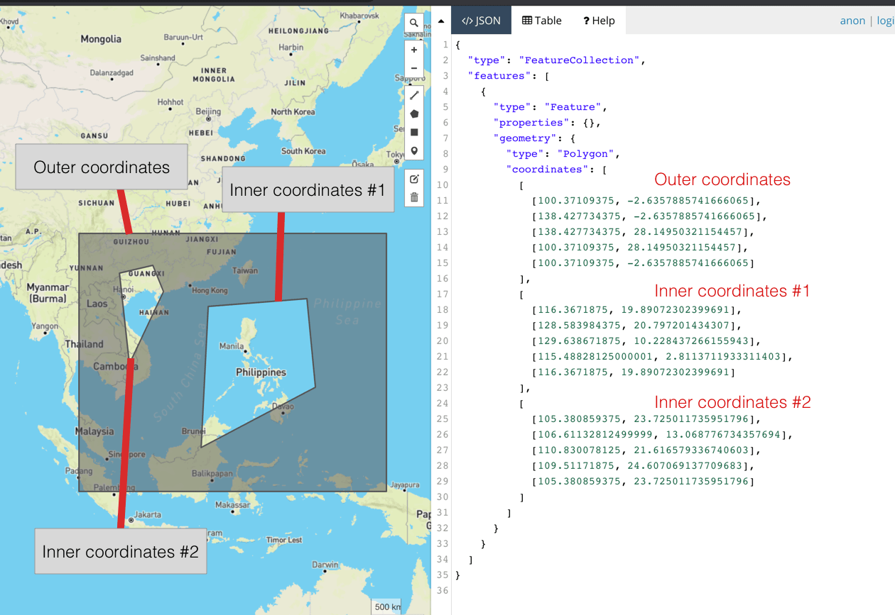

Sau khi rời khỏi công ty cũ, mình chả có dự án nào làm với bản đồ cả. Tính ra cũng đã gần 2 năm, từ thời đó tới giờ cũng chả có bài viết nào ra hồn. Thôi, cứu rỗi nhân loại để thế giới ngày càng tươi đẹp hơn.

Để nhập môn làm mấy dự án về bản đồ, các bạn phải biết cấu trúc dữ liệu của nó trước, không nắm rõ thì sau này làm việc với layer sẽ ngu người luôn. Vào những ngày đầu tiên khi tham gia vào team IT, các bạn sẽ được làm quen với GeoJSON, cấu trúc này sẽ ám các bạn dài dài.


## GeoJSON

Là một dạng cấu trúc dữ liệu địa lý, dựa trên **JavaScript Object Notation (JSON)**. Nó thể hiện chức năng địa lý, thuộc tính và dữ liệu hình học. GeoJSON sử dụng hệ toạ độ địa lý `World Geodetic System 1984 (WGS84)` và đơn vị độ thập phân.

```json
{
  "type": "Feature",
  "geometry": {
    "type": "Point",
    "coordinates": [125.6, 10.1]
  },
  "properties": {
    "name": "Dinagat Islands"
  }
}
```

## Cấu trúc

Về cấu trúc sẽ gồm 3 thuộc tính chính, đó là `type`, `geometry`, `properties`. Trong đó:

- **type**: kiểu dữ liệu của file GeoJSON này. Gồm các loại sau:
  - **Feature**: Chỉ 1 đối tượng địa lý.
  - **FeatureCollection**: Tập hợp nhiều đối tượng địa lý.
- **geometry**: toạ độ của đối tượng. Gồm các loại sau:
  - **Point**: Một điểm. Thường được dùng việc hiển thị marker.
  - **LineString**: Một đường thẳng.
  - **MultiLineString**: Tập hợp nhiều đường thẳng.
  - **Polygon**: Một đa giác.
  - **MultiPolygon**: Tập hợp nhiều đa giác.
  - **GeometryCollection**: Tập hợp nhiều loại hình học khác nhau.
- **properties**: danh sách thuộc tính của đối tượng.

Nếu bạn chưa hình dung được cấu trúc của nó là gì thì nhấn vào [đây](https://gist.githubusercontent.com/vhnam/398c5899a2f793b92ed42832c7075c55/raw/d1e52df6fd1cf7742250290434202a106e07864c/feature-collection.json).

## Các đối tượng hình học

Mình sẽ giải thích chi tiết cấu trúc của từng loại hình học. Mấy bạn nên biết để sau này có vẽ ra không đúng thì còn biết đường mà kiểm tra.

### Point

Cái này là điểm, thường dùng để vẽ các marker.

```json
{
  "type": "FeatureCollection",
  "features": [
    {
      "type": "Feature",
      "geometry": {
        "type": "Point",
        "coordinates": [106.61132812499999, 11.092165893502]
      }
    }
  ]
}
```


### LineString

Cái này là vẽ một đường, đường cong hay đường thẳng đều được. 1 đối tượng chỉ có 1 đường.

```json
{
  "type": "FeatureCollection",
  "features": [
    {
      "type": "Feature",
      "properties": {},
      "geometry": {
        "type": "LineString",
        "coordinates": [
          [106.8310546875, 13.004557745339769],
          [107.061767578125, 11.40464884161848],
          [105.93017578125, 10.17437402751379],
          [104.7216796875, 10.919617760254697],
          [105.501708984375, 12.340001834116316]
        ]
      }
    }
  ]
}
```


### MultiLineString

Cái này là vẽ tập hợp nhiều đường. Nên hiểu là 1 đối tượng là 1 tập hợp gồm nhiều đường nhé.

```json
{
  "type": "FeatureCollection",
  "features": [
    {
      "type": "Feature",
      "properties": {},
      "geometry": {
        "type": "MultiLineString",
        "coordinates": [
          [
            [105.8203125, 10.844096320683942],
            [107.611083984375, 11.92110315424958]
          ],
          [
            [105.787353515625, 13.93406718249833],
            [105.699462890625, 12.597454504832005],
            [103.95263671874999, 12.361465967347373],
            [102.9638671875, 14.093957177836224],
            [105.194091796875, 13.036669323115246]
          ]
        ]
      }
    }
  ]
}
```


### Polygon

Cái này là vẽ đa giác. Chúng ta sẽ có 2 loại đa giác cần lưu ý.

#### Không có lỗ

Loại này vẽ một hình đa giác duy nhất, bình thường. Lưu ý là toạ độ đầu tiên phải trùng khớp với toạ độ cuối cùng.

```json
{
  "type": "FeatureCollection",
  "features": [
    {
      "type": "Feature",
      "properties": {},
      "geometry": {
        "type": "Polygon",
        "coordinates": [
          [
            [98.7890625, 7.885147283424331],
            [108.984375, -0.7909904981540058],
            [89.736328125, 2.8113711933311403],
            [102.3046875, -7.362466865535738],
            [116.806640625, -6.489983332670651],
            [118.564453125, 3.2502085616531686],
            [108.544921875, 8.407168163601076],
            [98.7890625, 7.885147283424331]
          ]
        ]
      }
    }
  ]
}
```


#### Có lỗ

Loại này vẽ một hình đa giác có một hoặc nhiều khoảng trống bên trong. Chúng ta sẽ có khái niệm gọi là `outer coordinates` và `inner coordinates`. Dễ hiểu thì:

- **outer coordinates**: Chỉ đa giác phía ngoài cùng (đa giác lớn).
- **inner coordinates**: Chỉ đa giác tạo thành các lỗ bên trong đa giác lớn.

Khi thể hiện đa giác dạng này trên các thư viện vẽ bản đồ, nó sẽ tự tô màu vào phần còn lại của đa giác (không tính lỗ).

```json
{
  "type": "FeatureCollection",
  "features": [
    {
      "type": "Feature",
      "properties": {},
      "geometry": {
        "type": "Polygon",
        "coordinates": [
          [
            [100.37109375, -2.6357885741666065],
            [138.427734375, -2.6357885741666065],
            [138.427734375, 28.14950321154457],
            [100.37109375, 28.14950321154457],
            [100.37109375, -2.6357885741666065]
          ],
          [
            [116.3671875, 19.89072302399691],
            [128.583984375, 20.797201434307],
            [129.638671875, 10.228437266155943],
            [115.48828125000001, 2.8113711933311403],
            [116.3671875, 19.89072302399691]
          ],
          [
            [105.380859375, 23.725011735951796],
            [106.61132812499999, 13.068776734357694],
            [110.830078125, 21.616579336740603],
            [109.51171875, 24.607069137709683],
            [105.380859375, 23.725011735951796]
          ]
        ]
      }
    }
  ]
}
```



### MultiPolygon

Cái này là tập hợp nhiều đa giác.

```json
{
  "type": "FeatureCollection",
  "features": [
    {
      "type": "Feature",
      "properties": {},
      "geometry": {
        "type": "MultiPolygon",
        "coordinates": [
          [
            [
              [100.37109375, -2.6357885741666065],
              [138.427734375, -2.6357885741666065],
              [138.427734375, 28.14950321154457],
              [100.37109375, 28.14950321154457],
              [100.37109375, -2.6357885741666065]
            ],
            [
              [116.3671875, 19.89072302399691],
              [128.583984375, 20.797201434307],
              [129.638671875, 10.228437266155943],
              [115.48828125000001, 2.8113711933311403],
              [116.3671875, 19.89072302399691]
            ],
            [
              [105.380859375, 23.725011735951796],
              [109.51171875, 24.607069137709683],
              [110.830078125, 21.616579336740603],
              [106.61132812499999, 13.068776734357694],
              [105.380859375, 23.725011735951796]
            ]
          ],
          [
            [
              [119.35546875000001, 45.82879925192134],
              [98.0859375, 41.44272637767212],
              [110.21484375, 33.65120829920497],
              [119.35546875000001, 45.82879925192134]
            ]
          ]
        ]
      }
    }
  ]
}
```


### GeometryCollection

Cái này là tập hợp nhiều loại hình học trong cùng 1 đối tượng. `GeometryCollection` khác với ở chỗ `FeatureCollection` ở chỗ, nó là tập hợp nhiều loại hình học tạo nên 1 đối tượng duy nhất, bên trong mỗi loại hình học thì không có thuộc tính.

```json
{
  "type": "FeatureCollection",
  "features": [
    {
      "type": "Feature",
      "properties": {},
      "geometry": {
        "type": "GeometryCollection",
        "geometries": [
          {
            "type": "MultiPolygon",
            "coordinates": [
              [
                [
                  [100.37109375, -2.6357885741666065],
                  [138.427734375, -2.6357885741666065],
                  [138.427734375, 28.14950321154457],
                  [100.37109375, 28.14950321154457],
                  [100.37109375, -2.6357885741666065]
                ],
                [
                  [116.3671875, 19.89072302399691],
                  [128.583984375, 20.797201434307],
                  [129.638671875, 10.228437266155943],
                  [115.48828125000001, 2.8113711933311403],
                  [116.3671875, 19.89072302399691]
                ],
                [
                  [105.380859375, 23.725011735951796],
                  [109.51171875, 24.607069137709683],
                  [110.830078125, 21.616579336740603],
                  [106.61132812499999, 13.068776734357694],
                  [105.380859375, 23.725011735951796]
                ]
              ],
              [
                [
                  [119.35546875000001, 45.82879925192134],
                  [98.0859375, 41.44272637767212],
                  [110.21484375, 33.65120829920497],
                  [119.35546875000001, 45.82879925192134]
                ]
              ]
            ]
          },
          {
            "type": "LineString",
            "coordinates": [
              [78.92578124999999, 53.330872983017066],
              [16.5234375, -3.513421045640032]
            ]
          }
        ]
      }
    }
  ]
}
```


## Tại sao phải dùng Multi?

Bạn có thể vẽ nhiều `Line` hoặc nhiều `Polygon` trên 1 Feature rồi hiển thị trên web. Tuy nhiên, nếu dự án của bạn yêu cầu phải thể hiện nhiều Feature, mỗi Feature là tập hợp Polygon/LineString hoặc là tập hợp nhiều loại hình học vào 1 Feature thì phải nghĩ đến `GeometryCollection`.

Ví dụ công viên Tao Đàn (Q1, Saigon) ở dưới đây. Nghĩ thế này, bạn sẽ vẽ rất rất nhiều `MultiPolygon` để thể hiện các thửa đất trên bản đồ. Trong đó, bạn làm sao để bắt được sự kiện `click` vào 1 đối tượng (Feature)?


## Tham khảo

- [RFC 7946](https://tools.ietf.org/html/rfc7946)
