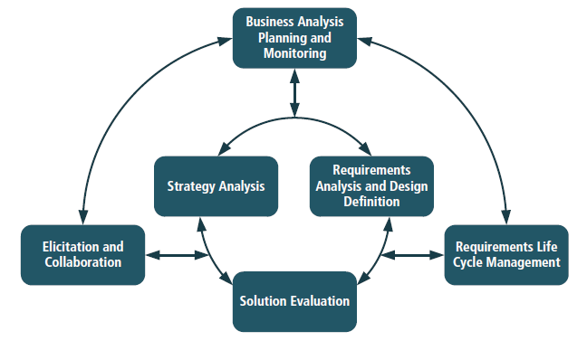
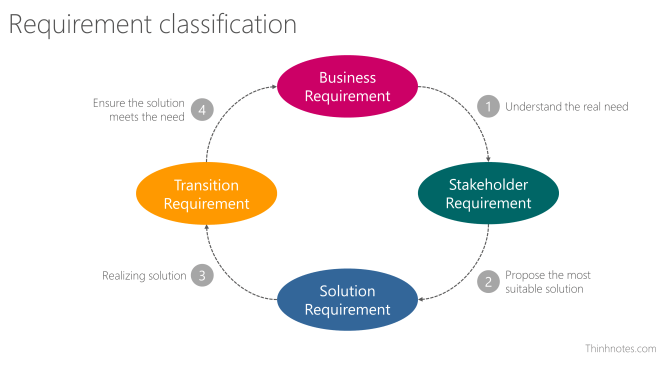

## Lời mở đầu

Chủ đề này đã muốn viết từ lâu. Thực sự là sau khi đọc qua cuốn **A Guide to the Business Analysis Body of Knowledge (version 3)** aka **BABOK v3**, mình cũng muốn viết liền ngay và luôn. Tuy nhiên, một thời gian sau đó mình bận giải quyết một số dự án và cảm thấy có một số chỗ cần làm rõ nên để đó. Và bây giờ, cũng nên viết một chút gì về nó để sau này xem lại sự thay đổi trong cách suy nghĩ của bản thân.

Trước đây, mình cũng đã viết một bài tóm tắt về việc **"Quản lý và Phân tích Yêu cầu"** tại [đây](https://www.slideshare.net/NamVoHoai1/qun-l-yu-cu-d-n). Tuy nhiên, nó có mang nặng hình thức lý thuyết và khá là tư duy của con nít.

> Viết ra không phải là việc khó; cái khó là phải có những câu chuyện gì đáng kể để kể, những tư tưởng gì đáng ghi để ghi.
>
> Jérôme và Jean Tharaud

## Giới thiệu về cuốn BABOK

**A Guide to the Business Analysis Body of Knowledge** hay còn được biết đến với cái tên ngắn gọn là **BABOK** là quyển kinh thánh dành cho Business Analyst. Cuốn sách này do tổ chức [International Institute of Business Analysis (IIBA)](https://www.iiba.org/) phát hành. IIBA tổ chức các kỳ thi và cung cấp các chứng chỉ trong lĩnh vực BA dựa trên cuốn BABOK và số năm kinh nghiệm BA của các thành viên. Phiên bản hiện tại của BABOK đang là version 3, được phát hành vào 04/2015. Các bạn có thể tìm hiểu thêm tại:

- [A Guide to the Business Analysis Body of Knowledge® (BABOK® Guide)](https://www.iiba.org/standards-and-resources/babok/)

Đại khái, BABOK mô tả các lĩnh vực kiến thức phân tích yêu cầu, nhiệm vụ, năng lực cơ bản, kỹ thuật và quan điểm về cách tiếp cận.

> Sách hay phải chăng là sách mà tác giả biết hạn chế vấn đề, biết tiết kiệm lời nói. Trái lại, quyển sách dở là quyển sách mà trong đó tác giả đã không còn để thiếu sót cái gì cả, không để cho độc giả cùng bàn góp thêm được phần nào ý kiến của mình.
>
> trích **"Tôi Tự Học"** - Thu Giang Nguyễn Duy Cần

## Tổng quan

### Business Analysis

Là **VIỆC** giải quyết các bài toán của doanh nghiệp đang gặp phải dựa vào yêu cầu đầu vào giữa các bên liên quan và giải pháp được đưa ra nhằm giải quyết các vấn đề đang gặp phải. Có thể là các giải pháp quy trình hoặc kỹ thuật mà giải pháp hiện tại đang sử dụng không đạt hiệu quả.

Hay ta nói một cách khác:

- Xác định nhu cầu và đề xuất giải pháp. Dựa trên:
  - Nhu cầu và lý do cần phải thay đổi
  - Thiết kế và mô tả các giải pháp đem lại giá trị
- Phạm vi trong **một dự án** hoặc trong suốt **quá trình phát triển doanh nghiệp** và **cải tiến liên tục**
- Mục tiêu để hiểu trạng thái hiện tại để xác định trạng thái trong tương lai để đưa ra những hoạt động cần thiết để chuyển từ trạng thái hiện tại hay trạng thái tương lai

### Business Analyst

Còn người thực hiện Business Analysis sẽ có tên là **Business Analyst**. Họ là:

- Người có trách nhiệm **khám phá**, **tổng hợp** và **phân tích thông tin** từ nhiều nguồn như doanh nghiệp, công cụ, quy trình, tài liệu và các bên liên quan.
- Người có trách nhiệm **khơi gợi các nhu cầu thực tế của các bên liên quan**. Thường là làm rõ mong muốn của các bên liên quan để xác định các vấn đề và nguyên nhân cơ bản.
- Người đóng vai trò **thiết kế** và **chuyển giao các giải pháp** với nhu cầu thực sự của các bên liên quan. Các hoạt động bao gồm:
  - Thấu hiểu vấn đề của doanh nghiệp và mục tiêu
  - Phân tích nhu cầu và giải pháp
  - Đề xuất chiến lược
  - Điều hướng sự thay đổi
  - Tạo điều kiện cho các bên liên quan hợp tác với nhau

Họ sẽ cần nhóm kiến thức và chúng sẽ bổ trợ nhau. Bạn có thể tìm hiểu kỹ từ chapter 3 đến chapter 8 trong cuốn BABOK.

- **Business Analysis Planning and Monitoring**  _(Kế hoạch Phân tích Nghiệp vụ và Giám sát)_
- **Eliciation and Collaboration**  _(Khơi gợi và Hợp tác để lấy được thông tin)_
- **Requirements Life Cycle Management**  _(Quản lý vòng đời của yêu cầu)_
- **Strategy Analysis**  _(Phân tích chiến lược)_
- **Requirement Analysis and Design Definition (RADD)**  _(Phân tích và thiết kế)_
- **Solution Evaluation** *(Đánh giá giải pháp)*

## Khái niệm

### Business Analysis Core Concept Model (BACCM)

BACCM là _một framework dành cho phân tích nghiệp vụ_. Gồm có 6 khái niệm cốt lõi. Trong đó, mỗi khái niệm cốt lõi được xác định bởi 5 khái niệm còn lại, không thể hiểu đầy đủ cho đến khi tất cả các khái niệm được hiểu.

- **Change** (sự thay đổi)
  - Các hoạt động chuyển đổi để đáp ứng yêu cầu
- **Need** (nhu cầu)
  - Vấn đề hoặc cơ hội được đưa ra
- **Solution** (giải pháp)
  - Cách thức/phương pháp nhằm đáp ứng một hoặc nhiều yêu cầu cụ thể trong ngữ cảnh nào đó
- **Stakeholder** (các bên liên quan)
  - Các tác nhân (actor) có liên quan đến sự thay đổi, nhu cầu hoặc giải pháp
- **Value** (giá trị)
  - Các giá trị, tầm quan trọng hoặc lợi ích của việc gì đó dành cho các bên liên quan trong ngữ cảnh cụ thể
- **Context** (ngữ cảnh)
  - Những tình huống ảnh hưởng hoặc bị ảnh hưởng và mạng lại thông tin để có thể hiểu được sự thay đổi

BACCM _được dùng trong_:

- Mô tả lĩnh vực nghề nghiệp trong phân tích nghiệp vụ
- Giao tiếp về phân tích nghiệp vụ với một ngôn ngữ chung
- Đánh giá mối quan hệ của các khái niệm chính _(core concept)_ trong phân tích nghiệp vụ
- Đánh giá tổng thể 6 khái niệm chính _(6 core concepts)_
- Đánh giá tác động giữa các khái niệm và mối quan hệ tại bất kỳ thời điểm để xây dựng nền tảng cho tương lai

Ta có thể hiểu đơn giản như sau:

- What are the kind of **changes** we are doing? _(loại thay đổi chúng ta đang làm là gì?)_
- What are the **needs** that we are trying to satisfy? _(các nhu cầu chúng ta đang nỗ lực đáp ứng là gì?)_
- What are the **solutions** that we are creating or changing? _(các giải pháp chúng ta đang tạo ra hoặc thay đổi là gì?)_
- Who are the **stakeholders** involved? _(các bên liên quan là ai?)_
- What do stakeholders consider of **value**? _(các bên liên quan cân nhắc điều gì?)_
- What are the **contexts** that we and the solution are in? _(các bối cảnh và giải pháp tương ứng)_

Với mỗi khi bắt đầu từng kiến thức trong `Nhóm kiến thức`, BABOK sẽ trình bày mô hình này để giải thích ý nghĩa và giá trị của kiến thức đó.

### Các loại yêu cầu

- **Business Requirement**
  - Những phát biểu về mục tiêu dài hạn, áp dụng cho toàn tổ chức.
  - VD: Tăng 10% tỉ lệ khách quay lại mua hàng trong vòng 6 tháng áp dụng giải pháp CRM
- **Stakeholder Requirements**
  - Yêu cầu cụ thể của từng bên liên quan
  - Business Requirements chỉ đạt được khi Stakeholder Requirements đạt được.
  - VD: Sales Director nói rằng: _Nhân viên kinh doanh phải dễ dàng kiểm tra được số tiền khách hàng đã chi ra trong tháng/quý hoặc trong khoảng thời gian nhất định._
- **Solution Requirements**
  - Kết quả sau khi hiểu được Business Requirements và Stakeholder Requirements
  - Những yêu cầu về **khả năng** (_capability_) và **tiêu chuẩn** (_quality_) mà giải pháp phải có để đạt được Business Requirements và Stakeholder Requirements
    - **Functional Requirements**  _(yêu cầu chức năng)_:
      - Nói về khả năng _(capability)_ mà giải pháp phải làm được
      - VD: Hệ thống có thể _xuất báo cáo_ ra _dạng Excel lẫn PDF_.
    - **Non-Functional Requirements**  _(yêu cầu phi chức năng)_:
      - Nói về các điều kiện giúp hệ thống chạy tốt và đảm bảo được chất lượng (_quality_) như yêu cầu
      - VD: Hệ thống phải xuất báo cáo dạng Excel lẫn PDF trong vòng _300ms_.
- **Transition Requirements**
  - Khả năng mà giải pháp phải có và điều kiện để **chuyển đổi** giải pháp dễ dàng từ **trạng thái hiện tại** sang **trạng thái mới** nhưng không cần phải hoàn thành một lần.
  - **Quan trọng trong lúc triển khai**, đưa ra sử dụng thực tế. Đến khi giai đoạn này hoàn tất thì Transition Requirements không còn quan trọng nữa.
  - Có thể là chuyển đổi dữ liệu, hướng dẫn cách sử dụng trong điều kiện nghiệp vụ vẫn được diễn ra liên tục
  - VD:
    - Ít nhất phải có 3 buổi đào tạo sử dụng hệ thống cho mỗi phòng ban
    - Nếu có thiên tai (động đất, sóng thần…) xảy ra, dự án sẽ tạm hoãn cho đến khi tổ chức hoạt động trở lại và không phải chịu bất cứ chi phí nào cho việc hoãn dự án.

### Stakeholder

Tuỳ vào mỗi công việc, các bên liên quan thường là cá nhân hoặc một nhóm có tác động đến công việc một cách trực tiếp hoặc gián tiếp.

Các bên liên quan thường gặp gồm có:

- Business Analyst, người phân tích và quản lý yêu cầu
- Customer, người dùng có liên quan đến hợp đồng hoặc quyền lợi mà doanh nghiệp phải đáp ứng
- Domain Subject Matter Expert, người có kiến thức chuyên môn về lĩnh vực có liên quan đến nhu cầu hoặc giải pháp
- End-User, người trực tiếp sử dụng giải pháp
- Implementation Subject Matter Expert, người có kiến thức chuyên môn về thực thi giải pháp
- Operational Support, đơn vị hỗ trợ vận hành và bảo trì
- Project Manager, quản lý dự án
- Regulator, cơ quan có trách nhiệm đề xuất và thực thi các tiêu chuẩn
- Sponsor
- Supplier
- Tester

Ở đây, bạn biết vị trí của bản thân và những người trong dự án dễ dễ dàng làm việc, động viên lẫn nhau. Tuy nhiên, ở đây có một chỗ khá là cấn ở đây, đó là nhóm **Key players** và **Defenders**. Trong quá trình phát triển dự án, nhóm _Key Players_ chỉ xuất hiện có mỗi PM. Dẫn đến nhóm _Defenders_ cần insights từ phía _Latents_ nhưng không có BA làm cầu nối. Và nhóm _Latents_ lại thường xuyên "khuất mặt", họ giao trách nhiệm định hướng phát triển lại cho nhóm _Monitor_. Và thường thì nhóm _Latents_ chỉ xuất hiện ở giai đoạn nghiệm thu hoặc phê duyệt tiến độ. Nguyên nhân dự án thất bại cũng có phần xuất phát từ đây.

Ngoài ra, đôi khi nhóm _Key Players_ chỉ có mỗi PM (project manager/product manager) kiêm luôn nhiệm vụ của những người còn lại. Cái này thì...

> Nhất nghệ tinh, nhất thân vinh  
> Bá nghệ tinh, bá láp sinh
>
> LeeHonSo aka Lee Hói

### Nhu cầu

Có phần này cũng thú vị nhưng trong BABOK không nhắc đó chính là **NHU CẦU**. Có thể chúng ta đã từng đặt niềm tin rất nhiều vào khách hàng vào những lần đi lấy yêu cầu ở dự án đầu tiên bạn tham gia. Chắc hạn các bạn **đã tin rằng** khách hàng sẽ cung cấp rõ ràng:

- Yêu cầu chức năng
- Cách họ muốn công việc được hoàn thành
- Phần mềm sẽ được sử dụng như thế nào
- Hiệu năng và Khả năng mở rộng
- Biên của hệ thống (Phạm vi)
- Môi trường hệ điều hành
- Các tiêu chuẩn để xác nhận

Nhưng thật ra thì...

- Một danh sách những điều họ muốn có
- Một giải pháp cho vấn đề mà không biết là nó sẽ được cài đặt ra sao
- Một mô tả mập mờ làm giới hạn việc cài đặt
- Một công nghệ họ đọc được từ báo
- Trong đầu họ thường xuyên thay đổi
- Ngân sách và lịch biểu hạn chế

Là vì nhiều mong đợi của khách hàng **KHÔNG dựa trên NHU CẦU** mà là `MONG MUỐN`.

Mình mới tìm được một bài viết về nhu cầu của khách hàng trong lĩnh vực bán hàng/marketing dựa trên ["Tháp nhu cầu Maslow"](https://en.wikipedia.org/wiki/Maslow%27s_hierarchy_of_needs) cũng khá thú vị.

1.  `Không có vấn đề`
    - Ở cấp độ này, khách hàng về cơ bản là không gặp phải vấn đề, nên họ cũng không phát sinh nhu cầu với sản phẩm, đừng giới thiệu sản phẩm với họ.
    - VD: Không có tóc nên không có nhu cầu mua lược.
2.  `Có vấn đề, không có nhu cầu`
    - Ở cấp độ này, khách hàng hoàn toàn là có vấn đề, nhưng vì một số lí do nên họ chưa phát sinh nhu cầu. Hãy thuyết phục họ phát sinh nhu cầu.
    - VD: Chưa nhìn ra lợi ích hoặc thấy không cần thiết. Ví dụ: bảo hiểm.
3.  `Có nhu cầu, đang tìm kiếm giải pháp`
    - Ở cấp độ này, khách hàng đang phân vân giữa các hệ thống giải pháp khác nhau. Hãy quảng cáo "tính năng, giá, khuyến mãi, thương hiệu" để họ chú ý.
    - VD: Cùng là cư trú thì thuê nhà và mua nhà là 2 hệ thống giải pháp khác nhau.
4.  `Đã biết đến thương hiệu, đang phân vân ra quyết định`
    - Ở cấp độ này, khách đã biết đến thương hiệu của chúng ta, nhưng còn đang phân vân điều gì đó nên chưa quyết định mua. Hãy cho họ biết về _Khuyến mãi_ và _Lí do để tin tưởng (giải thưởng, feedback, KOLs, ý kiến chuyên gia, nghiên cứu khoa học)_.
    - VD: Khách đã search từ khóa thương hiệu của chúng ta, khách đã vào đọc landing page/website của chúng ta nhưng chưa mua.
5.  `Đã mua sản phẩm, đang phân vân mua lại`
    - Ở cấp độ này, khách đã mua sản phẩm/dịch vụ của chúng ta, họ đang phân vân xem có nên tiếp tục mua sản phẩm của chúng ta hay không.

Dựa vào gợi ý trên, các bạn có thể tham khảo cấp độ 1, 2, 3 để tìm hiểu `MONG MUỐN` của khách hàng có thực sự là một `NHU CẦU` hay không.

### Rủi ro

Phần này BABOK cũng có đề cập khá rải rác, mình xin tập hợp lại đây theo cách hiểu của mình để mọi người tiện theo dõi.

Ngày xưa, mình có nói chuyện với một người bạn làm thiết kế Event, anh ấy nói sự hơn thua nhau của một người giỏi và không giỏi đó là khả năng nhận biết rủi ro. Càng nhìn được nhiều rủi ro thì bạn sẽ có chiến lược xử lý tình huống tốt nhất, sự kiên mới được diễn ra trọn vẹn. _Các bạn có biết show LIVE! của Wowy chứ?_

Quay lại với chủ đề chính, rủi ro xuất phát từ những nhóm nguyên nhân sau:

- Thời gian
- Chi phí
- Phạm vi
- Tính khả thi
- Chất lượng
- Kỳ vọng của Stakeholder
- Nhân lực
- Độ chính xác kỹ thuật

Và trong một quy trình làm phần mềm, chúng ta có thể xác định được rủi ro ở các nguồn sau:

- Phát hiện yêu cầu
- Phân tích yêu cầu
- Đặc tả yêu cầu
- Kiếm tra tính hiện thực hoá yêu cầu
- Quản lý yêu cầu

Và để đối mặt với các rủi ro, chúng ta sẽ phân ra làm các mức độ sau:

- Tránh
- Chống
- Giảm thiểu
- Chấp nhận

## Nhóm Kiến thức

### Kế hoạch Phân tích Nghiệp vụ và Giám sát

Dựa vào `Nhu cầu` và `Mục tiêu`, chúng ta sẽ làm một số công việc để đưa ra được hướng tiếp cận nhằm "hiểu" được khách hàng. Hướng tiếp cận ở đây chính là kế hoạch làm việc để lấy yêu cầu. Đã là kế hoạch thì không có sai hoặc đúng, mà chỉ là phù hợp hay không mà thôi. Phù hợp là đảm bảo được những resources hiện có và yêu cầu của dự án.

- **Phương pháp Tiếp cận Phân tích Kinh doanh Lập kế hoạch:** mô tả việc lập kế hoạch phân tích từ việc tạo ra hoặc lựa chọn một phương pháp đến lập kế hoạch cho các hoạt động, nhiệm vụ và phân phối.
- **Kế hoạch tham gia của các bên liên quan:** Mô tả việc hiểu các bên liên quan nào có liên quan đến sự thay đổi, business analyst cần gì ở họ, họ cần gì từ business analyst và cách tốt nhất để cộng tác. Nhằm thiết lập và duy trì mối quan hệ làm việc hiệu quả với các bên liên quan.
- **Kế hoạch Quản trị Phân tích Nghiệp vụ**: Xác định cách đưa ra quyết định về các yêu cầu và thiết kế, bao gồm đánh giá, kiểm soát thay đổi, phê duyệt và độ ưu tiên. Nó giúp đảm bảo rằng các quyết định được thực hiện đúng đắn, nhất quán, và tuân theo một quy trình nhằm đảm bảo những người ra quyết định có thông tin họ cần.
- **Kế hoạch Quản lý Thông tin Phân tích Nghiệp vụ:** Phát triển cách tiếp cận để biết thông tin phân tích nghiệp vụ được lưu trữ và truy cập như thế nào nhằm sử dụng lâu dài.
- **Xác định Cải thiện Hiệu suất Phân tích Nghiệp vụ:** Mô tả việc quản lý và giám sát cách thực hiện công việc phân tích nghiệp vụ nhằm đảm bảo rằng các cam kết được đáp ứng, các cơ hội học hỏi và cải tiến liên tục được thực hiện.

Khi triển khai kế hoạch, bạn cần giám sát để điều chỉnh kế hoạch sao cho phù hợp với từng giai đoạn, đừng biến nó thành kế hoạch chết.

### Khơi gợi và Hợp tác

Từ `Nhu cầu`, `Thông tin phân tích nghiệp vụ`, `Kế hoạch tham gia của các bên liên quan`, và `Hiệu suất Phân tích Nghiệp vụ`, BA cộng tác với các bên liên quan để đánh giá giá trị tương đối của thông tin được cung cấp thông qua việc khơi gợi, và áp dụng nhiều kỹ thuật khác nhau để xác nhận và truyền đạt giá trị đó.

- **Chuẩn bị:** Đảm bảo rằng các bên liên quan có thông tin cần cung cấp và họ hiểu bản chất của các hoạt động mà họ sẽ thực hiện. Nó cũng đặt ra một tập hợp các kỳ vọng chung về kết quả của hoạt động. Việc chuẩn bị cũng có thể bao gồm xác định các tài liệu nghiên cứu hoặc chuẩn bị tiến hành một thử nghiệm để xem liệu một sự thay đổi trong quy trình có thực sự cải tiến hay không.
- **Tiến hành:** Mô tả công việc được thực hiện để hiểu nhu cầu của các bên liên quan và xác định các giải pháp tiềm năng có thể đáp ứng những nhu cầu đó. Điều này có thể liên quan đến tương tác trực tiếp với các bên liên quan, thực hiện nghiên cứu hoặc chạy thử nghiệm.
- **Xác nhận kết quả:** Liên quan đến việc đảm bảo rằng các bên liên quan có sự hiểu biết chung về các kết quả của việc khơi gợi, thông tin được ghi lại một cách thích hợp. Nhiệm vụ này cũng liên quan đến việc so sánh thông tin nhận được với thông tin khác để phát hiện mâu thuẫn hoặc lỗ hổng.
- **Truyền đạt**: Cung cấp cho các bên liên quan thông tin khi họ cần. Thông tin được trình bày dưới định dạng thích hợp, sử dụng đúng thuật ngữ và khái niệm.
- **Quản lý sự hợp tác của các bên liên quan:** Mô tả công việc với các bên liên quan để thu hút họ tham gia vào quá trình phân tích nghiệp vụ tổng thể và để đảm bảo rằng BA có thể mang lại các kết quả cần thiết.

Ngoài ra, khi các bên liên quan xảy ra mâu thuẫn do nhiều nguyên nhân khác nhau. BA là người nắm nhiều thông tin nhất, sẽ can thiệp để giải quyết vấn đề cho mọi người nhằm để các bên hiểu được góc nhìn của nhau.

### Quản lý vòng đời của yêu cầu

Khi làm dự án, các yêu cầu từ phía các bên liên quan thay đổi liên túc, có thể là `THÊM MỚI` hoặc chỉ là `THAY ĐỔI`. Do đó, để tránh nhập nhằng và dễ quản lý. Nếu quản lý không tốt, nó sẽ là một mớ tạp nham giữa chức năng, lỗi,... rồi ảnh hưởng đến tiến độ, tiền bạc, thời gian. Và như phần **NHU CẦU** đã viết ở trên, bạn phải biết khi nào `CHẤP NHẬN` hay là `TỪ CHỐI` nó.

Do đó, thuật ngữ **"Quản lý vòng đời của yêu cầu"** xuất hiện. Đại khái là quản lý và duy trì các yêu cầu/thông tin từ lúc bắt đầu đến khi kết thúc. Công việc này mô tả việc thiết lập các mối quan hệ có giá trị giữa các yêu cầu có liên quan, đánh giá các thay đổi khi có yêu cầu được đề xuất. Đồng thời phân tích và tìm sự đồng thuận khi có thay đổi (đại loại là `CHỐT`, có thực hiện yêu cầu này không).

Các công việc của Quản lý Vòng đời Yêu cầu như sau:

- **Theo dõi:** Phân tích và duy trì mối quan hệ giữa các yêu cầu, thiết kế, thành phần giải pháp và các công việc khác để phân tích tác động, phạm vi và phân bổ.
- **Duy trì:** Đảm bảo rằng các yêu cầu và thiết kế là chính xác trong suốt vòng đời và tạo điều kiện sử dụng lại nếu thích hợp.
- **Sắp xếp Ưu tiên:** Đánh giá giá trị, mức độ khẩn cấp và rủi ro liên quan đến các yêu cầu và thiết kế cụ thể để đảm bảo rằng công việc phân tích và/hoặc phân phối được thực hiện trên những yêu cầu quan trọng nhất tại bất kỳ thời điểm nào.
- **Đánh giá Thay đổi:** Đánh giá các yêu cầu mới và đang thay đổi của các bên liên quan để xác định xem chúng có cần được thực hiện trong phạm vi thay đổi hay không.
- **Phê duyệt:** Làm việc với các bên liên quan tham gia vào quá trình quản trị để đạt được sự chấp thuận và thống nhất về các yêu cầu/thiết kế.

### Phân tích chiến lược

Phân tích chiến lược tập trung vào việc hoạch định tương lai và các trạng thái chuyển tiếp cần thiết để `giải quyết nhu cầu` trong nghiệp vụ và công việc cần thiết được xác định theo nhu cầu đó và phạm vi giải pháp. Nó bao gồm tư duy chiến lược , cũng như khám phá hoặc tưởng tượng các giải pháp khả thi sẽ cho phép tạo ra giá trị lớn hơn cho các bên liên quan và / hoặc thu được nhiều giá trị hơn cho chính nó.

Thông thường, các công việc trong lĩnh vực kiến ​​thức này xảy ra sớm trong vòng đời của dự án.

Khi thực hiện phân tích chiến lược, BA phải xem xét bối cảnh mà họ đang làm việc và phạm vi dự đoán mà các kết quả có thể xảy ra. Khi một thay đổi có kết quả **có thể đoán trước được**, trạng thái trong tương lai và các trạng thái chuyển đổi có thể có, thường có thể được xác định rõ ràng và có thể hoạch định một chiến lược rõ ràng. Nếu kết quả của một thay đổi **khó dự đoán**, chiến lược có thể cần tập trung nhiều hơn vào việc giảm thiểu rủi ro, thử nghiệm các giả định và thay đổi hướng đi cho đến khi xác định được chiến lược rõ ràng trong việc đạt được các mục tiêu.

- **Phân tích Trạng thái Hiện tại:** Hiểu nhu cầu của doanh nghiệp và mối quan hệ của nó với cách thức hoạt động của doanh nghiệp hiện tại. Đặt đường cơ sở (_baseline_) và bối cảnh cho sự thay đổi.
- **Xác định Trạng thái Tương lai:** Xác định các mục tiêu và mục tiêu chứng minh rằng nhu cầu kinh doanh đã được thỏa mãn và xác định những bộ phận nào của doanh nghiệp cần thay đổi để đạt được các mục tiêu và mục tiêu đó.
- **Đánh giá rủi ro:** Hiểu những bất ổn xung quanh sự thay đổi, xem xét ảnh hưởng có thể xảy ra, và đề xuất các hành động để giải quyết rủi ro thích hợp.
- **Xác định Chiến lược Thay đổi:** Thực hiện phân tích khoảng cách (_gap_) giữa trạng thái hiện tại và tương lai, đánh giá các lựa chọn để đạt được giá trị cao nhất trong tương lai, bao gồm bất kỳ trạng thái chuyển đổi nào có thể được yêu cầu dài hạn.

### Phân tích và thiết kế

Phân tích và Thiết kế là công việc từng bước xây dựng, tinh chỉnh, xem xét độ ưu tiên và sắp xếp yêu cầu theo cấu trúc. Về bản chất, từ các thông tin được khơi gợi, đưa ra nhu cầu thực sự và chuyển đổi chúng thành những giải pháp cụ thể.

`Yêu cầu` và `Thiết kế` đều là những công cụ quan trọng. Khác biệt ở đâ là cách chúng được sử dụng và được dùng bởi ai. Thiết kế của người này có thể là yêu cầu của người khác. Các yêu cầu và thiết kế có thể ở mức tổng quát hoặc rất chi tiết dựa trên mức độ phù hợp với người sử dụng thông tin.

- **Xác định và Mô hình Yêu cầu:** Mô tả một tập hợp các yêu cầu hoặc thiết kế chi tiết bằng cách sử dụng các kỹ thuật phân tích.
- **Xác minh Yêu cầu:** Đảm bảo rằng một tập hợp các yêu cầu hoặc thiết kế đã được phát triển đủ chi tiết để bên liên quan có thể sử dụng được, nhất quán.
- **Xác thực các yêu cầu:** Đảm bảo rằng một tập hợp các yêu cầu hoặc thiết kế mang lại giá trị kinh doanh và hỗ trợ các mục tiêu của tổ chức.
- **Định nghĩa Kiến trúc Yêu cầu:** Cấu trúc tất cả các yêu cầu và thiết kế để chúng hỗ trợ mục đích kinh doanh tổng thể.
- **Xác định giải pháp:** Xác định, tìm hiểu và mô tả các cách khác nhau có thể để đáp ứng nhu cầu.
- **Phân tích giá trị tiềm năng và đề xuất giải pháp:** Đánh giá giá trị kinh doanh liên quan đến một giải pháp tiềm năng và so sánh các lựa chọn khác nhau, bao gồm cả sự đánh đổi, để xác định và đề xuất lựa chọn giải pháp mang lại giá trị tổng thể lớn nhất.

### Đánh giá giải pháp

Đánh giá Giải pháp tập trung vào việc đánh giá hiệu quả của các giải pháp đã đề xuất, đang tiến hành và đã thực hiện trước, trong và sau vòng đời dự án. Bao gồm cả những ràng buộc có thể ảnh hưởng đến giá trị của dự án.

Việc đánh giá có thể được thực hiện ở các giai đoạn khác nhau trong quá trình phát triển:

- **Prototypes hoặc Proofs of Concept:** Một phiên bản giới hạn với quy mô nhỏ để kiểm tra tính khả thi, hiệu quả của giải pháp.
- **Bản phát hành thử nghiệm hoặc Beta:** Các phiên bản giới hạn của giải pháp được sử dụng nhằm hiểu nó thực sự mang lại giá trị như thế nào trước khi phát hành đầy đủ giải pháp.
- **Bản phát hành chính thức:** Các phiên bản đầy đủ của một giải pháp từng phần hoặc đã hoàn thiện được sử dụng để đạt được các mục tiêu kinh doanh, thực hiện một quy trình hoặc hoàn thành một kết quả mong muốn.

- **Đo lường Hiệu suất Giải pháp:** Xác định cách thích hợp nhất để đánh giá hiệu suất của một giải pháp, đảm báo cách đó phù hợp với các mục tiêu đã đề ra, mục tiêu của doanh nghiệp và thực hiện đánh giá.
- **Phân tích các biện pháp hiệu suất:** Kiểm tra thông tin liên quan đến hiệu suất của giải pháp để hiểu giá trị mà giải pháp đó mang lại cho doanh nghiệp và cho các bên liên quan. Đồng thời xác định xem nó có đáp ứng được nhu cầu kinh doanh hiện tại hay không.
- **Đánh giá Hạn chế của Giải pháp:** Tìm hiểu các vấn đề trong phạm vi của một giải pháp và có thể ngăn chặn được từ nhu cầu hiện tại.
- **Đánh giá Hạn chế của Doanh nghiệp:** Tìm hiểu các vấn đề nằm ngoài phạm vi của một giải pháp có thể ngăn cản doanh nghiệp nhận ra giá trị đầy đủ mà một giải pháp có thể cung cấp.
- **Đề xuất các hành động để tăng giá trị của giải pháp:** Tìm hiểu và xác định các hành động mà doanh nghiệp có thể thực hiện để tăng giá trị mà một giải pháp có thể mang lại.

## Năng lực

Bất kỳ ngành nghề nào cũng đều cần có `Kiến thức` và `Kỹ năng`. Và dưới dây là danh sách những kỹ năng cần có của Business Analyst. Đây là chương 9, từ trang 188 đến 215.

- **Analytical Thinking** *(tư duy phân tích)*
- **Visual Thinking** *(tư duy trực quan)* và **Concept Thinking** *(tư duy trừu tượng)*
  - Creative _(sáng tạo)_ và Innovation _(đột phá)_
  - Problem Solving _(giải quyết vấn đề)_
  - Decision Making _(đưa ra quyết định)_
  - System Thinking _(tư duy hệ thống)_
- **Communication**
  - Verbal _(lời nói)_
  - Listening _(lắng nghe)_
  - Body language _(ngôn ngữ hình thể)_
  - Writing _(viết)_
- **Business Knowledge** *(kỹ năng nghiệp vụ)*
- **Industry Knowledge / Domain Knowledge** _(kiến thức ngành)_
- **Learn Something New** *(hỏi học điều mới)*
- **Solution Knowledge** _(kiến thức về giải pháp)_
- **Behavioral Characteristics** *(đặc điểm hành vi)*
- **Trustworthiness** *(đáng tin cậy)*
  - Responsibility _(có trách nhiệm)_
  - Adaptability _(khả năng thích nghi)_
- **Interaction Skills** *(kỹ năng tương tác)*
- **Facilitation** _(tạo điều kiện hoặc làm cho mọi thứ đơn giản, dễ dàng hơn)_
  - Leadership & Influencing _(khả năng lãnh đạo)_
  - Teamwork _(làm việc nhóm)_
  - Negotiation _(đàm phán)_
  - Teaching _(sư phạm)_
- **Tools** *(công cụ)*
  - Office Productivity
  - Business Analysis

## Kỹ thuật

Khi đọc đến phần này, BABOK sẽ giới thiệu cho bạn 50 kỹ thuật để moi móc thông tin ở chương 10, kéo dài từ trang 217 đến 368. Tuy có vẻ nhiều, nhưng nó được gom thành 9 nhóm như sau:

- **Brainstorming**
  - Cả đám cùng tụm lại, mạnh dạn đề xuất ý tưởng. Có hơi ngu ngu cũng được và mọi người cùng thảo luận và xây dựng. Kết quả cần là thật nhiều ý tưởng càng tốt.
  - Các bạn có thể tìm hiểu cách "rang tôm" của dân Copywrite ở Agency qua cuốn [Ý tưởng này là của chúng mình](https://www.goodreads.com/book/show/18487419-t-ng-n-y-l-c-a-ch-ng-m-nh) của Huỳnh Vĩnh Sơn.
- **Document Analysis**
  - Bạn sẽ tìm hiểu nhu cầu và kỳ vọng của họ thông qua các tài liệu mà họ đang làm việc như là: _khách hàng, đơn hàng, loại đơn hàng, sản phẩm, nhóm sản phẩm, dịch vụ, hợp đồng, nhân viên bán hàng,..._
- **Focus Groups**
  - Là một hình thức phỏng vấn, nhưng tập trung vào một nhóm đối tượng hoặc một nhóm các vấn đề.
- **Interface Analysis**
  - Phân tích cách tương tác giữa người và máy, giữa các thành phần trong hệ thống với nhau, giữa các hệ thống với nhau.
- **Interviews**
  - Là một cuộc phỏng vấn, nói bình dân là một cuộc nói chuyện, trao đổi công việc giữa 1-1 hoặc theo nhóm để nhờ đối tượng giải đáp thắc mắc.
  - Trước khi phỏng vấn nên có một kịch bản rõ ràng để tránh hỏi lan man. Có thể phỏng vấn trực tiếp hoặc qua email, Skype, gọi điện,...
- **Observation**
  Quan sát công việc thường ngày của end-user. Tuy nhiên, nó sẽ tốn thời gian, sức lực. Và trong quá trình quan sát, nếu bạn không khéo sẽ làm cho end-user mất tập trung, dẫn đến họ sẽ tạo dữ liệu ra và làm khác đi.
- **Prototyping**
  - Cách chốt vấn đề nhanh nhất đó là cho người dùng nhìn thấy những gì họ kỳ vọng.
  - Bạn có thể vẽ nó ra dưới dạng phác thảo _(sketching)_, khung sườn _(wireframe)_ hay chi tiết _(mockup)_. Nếu có thêm sự liên kết giữa các màn hình, như ở màn hình Đăng nhập, nhấn nút "Login" sẽ chuyển sang màn hình Homepage. Các bạn có thể dùng [Balsamiq](https://balsamiq.com/), [Sketch](https://www.sketch.com/), [Figma](https://www.figma.com/), [XD](https://www.adobe.com/sea/products/xd.html), [Axure](https://www.axure.com/) hoặc giấy đều được.
  - Với phương pháp này sẽ tốn khá nhiều thời gian, nên bạn phải cân nhắc để từ vai trò của Business Analyst sang Designer. Có thể tìm hiểu thêm ở series bài viết [Wireframe trong thiết kế sản phẩm](https://vhnam.github.io/tutorials/wireframe-trong-thiet-ke-san-pham-phan-1/) của mình.
- **Requirements Workshops**
  - Buổi workshop sẽ cần có sự tham gia của các stakeholders. Do đó, trước khi ngày diễn ra nên gửi tài liệu để stakeholders nắm được ý chính để đến ngày chỉ tập trung vào mổ xẻ vấn đề.
- **Survey/Questionnaire**
  Khi bạn cần khai thác thông tin trên diện rộng thì khảo sát là một ý tưởng không tệ. Nhưng bạn sẽ phải tốn thời gian để lọc lại những câu trả lời có giá trị.

Dù bạn dùng kỹ thuật nào đi chẳng nữa thì bạn vẫn phải lặp lại 4 bước sau đây _(3, 4, 5, 6)_:

- `(3) Organized:` Sắp xếp và tổ chức lại dữ liệu một cách có cấu trúc.
- `(4) Specified:` Trả lời câu hỏi các dữ liệu này được xác định và phân loại dùng để làm gì, dùng như thế nào và dùng cho đối tượng nào?
- `(5) Verified:` Bước này nhằm mục đích _đảm bảo các tài liệu mình hệ thống được_ đã **ĐÚNG** hay chưa.
- `(6) Validated:` Bước này thì lại nhằm mục đích _confirm các thông tin trao đổi với khách hàng đã chính xác_, có sự **ĐỒNG THUẬN**  _giữa cả team phần mềm và phía khách hàng_.

## Kage Bunshin no Jutsu

**Kage Bunshin no Jutsu** hay **Ảnh thân phân chi thuật** là tên chiêu thức của dân chơi "cấm thuật" Tobirama Senju aka Cụ Nhị để nói về các vai trò của Business Analyst và danh xưng của họ trong công việc.

> Với nhẫn thuật này, người dùng sẽ tạo ra một hoặc nhiều phân thân của chính mình. Tuy nhiều điều khác biệt lớn nhất ở đây là trong khi phân thân bình thường (không tác động được lên các thực thể) thì Ảnh phân thân hoàn toàn có thể tác động đến các vật, người khác, tựa như 1 cơ thể sống thực sự.

**Danh xưng (job title)** của vị trí Business Analyst cũng tương tự như vậy. Vè yêu cầu công việc và kiến thức cốt lõi đều đã thể hiện ở phần trên. Nhưng ở môi trường làm việc, thì Business Analysis là một công việc được thực hiện bởi nhiều người với vị trí khác nhau.

Các bạn nên tham khảo series **Muôn nẻo đường BA** của tác giả Thịnh Notes để hiểu rõ hơn về tấm hình ở trên. Anh ấy sẽ dùng một câu chuyện để dẫn dắt và giải thích từng vị trí trong từng loại hình công ty khác nhau.

- [Muôn nẻo đường BA (P1)](https://thinhnotes.com/chuyen-nghe-ba/muon-neo-duong-ba-p1)
- [Muôn nẻo đường BA (P2)](https://thinhnotes.com/chuyen-nghe-ba/muon-neo-duong-ba-p2)

## Kết thúc

Cuốn sách BABOK là một tài liệu hướng dẫn và ghi chú cô động lượng kiến thức bạn cần tìm hiểu. Do đó, bạn nên tham gia các buổi workshop có liên quan đến IIBA để hiểu rõ hơn.

Mình gợi ý cho các bạn một góc nhìn khác của công việc BA thông qua cuốn sách [Small Data: The Tiny Clues that Uncover Huge Trends](https://www.goodreads.com/book/show/25663776-small-data) của Martin Lindstrom. Nếu có thời gian thì tìm hiểu nhé.

Dù sao thì, đây là những gì cảm thấy cần đọc ở cuốn BABOK tại góc nhìn của mình hiện tại. Nếu bạn kỳ vọng cái gì đó khác thì mình rất tiếc.

`MY SOLUTION IS NOT YOUR PROBLEM`

## Tham khảo

- [A Guide to the Business Analysis Body of Knowledge® (BABOK® Guide)](https://www.iiba.org/standards-and-resources/babok/)
- BACS, [BUSINESS ANALYSIS VÀ BUSINESS ANALYTICS](https://www.bacs.vn/vi/blog/kien-thuc/business-analysis-va-business-analytics-4918.html)
- Học viện Haravan, [6 cấp độ nhu cầu của khách hàng - Hiểu để làm đúng](https://hocvien.haravan.com/blogs/chia-se-thong-tin/6-cap-do-nhu-cau-cua-khach-hang-hieu-de-lam-dung)
- Thịnh Notes, [Chuyện nghề BA](https://thinhnotes.com/category/chuyen-nghe-ba/)
- BACS, So sánh BABOK v2 và v3
  - [So sánh BABOK v2 và v3 (phần 1)](https://www.bacs.vn/vi/blog/nghe-nghiep/p1-so-sanh-babok-v2-va-v3-phien-ban-moi-them-nhieu-kien-thuc-moi-1597.html)
  - [So sánh BABOK v2 và v3 (phần 2)](https://www.bacs.vn/vi/blog/nghe-nghiep/phan-2-so-sanh-babok-v2-va-v3-phien-ban-moi-them-nhieu-kien-thuc-moi-1598.html)
  - [So sánh BABOK v2 và v3 (phần 3)](https://www.bacs.vn/vi/blog/nghe-nghiep/phan-3-so-sanh-babok-v2-va-v3-phien-ban-moi-them-nhieu-kien-thuc-moi-1599.html)
- TechCanvass, [Business Analysis Core Concepts Model (BACCM)](https://www.slideshare.net/abhish45/business-analysis-core-concepts-model-baccm)
- Suraj Panicker, [Business Analysis Core Concept Model (BACCM)](https://www.modernanalyst.com/Resources/Articles/tabid/115/ID/3341/Business-Analysis-Core-Concept-Model-BACCM.aspx)
- CIToolkit, [Stakeholder Analysis](https://citoolkit.com/articles/stakeholder-analysis/)
- Business Analyst Learnings, [Stakeholder Matrix: A Practical Guide](https://businessanalystlearnings.com/ba-techniques/2013/1/23/how-to-draw-a-stakeholder-matrix)
- Erivan Ramos, [The Correlation Between Requirement and Design in Business Analysis](https://medium.com/swlh/the-correlation-between-requirement-and-design-in-business-analysis-6ea7dc08f7af)
- VNHCM - ĐH Khoa Học Tự Nhiên, giáo trình môn Quản lý Yêu Cầu, **"Phân tích và Quản lý yêu cầu - Định nghĩa & Vấn đề"**
- Institute i4, [Exploring the Business Analysis Knowledge Areas](https://institutei4.com/exploring-the-business-analysis-knowledge-areas/)
- Bridging The Gap, [Elicitation Techniques Used By Business Analysts (BABOK 3.2)](https://www.bridging-the-gap.com/elicitation-techniques-business-analysts/)
- SaoStar.vn, [Điểm danh các loại thuật phân thân trong Naruto](https://saostar.vn/dien-anh/diem-danh-cac-loai-thuat-phan-than-trong-naruto-7614603.html)
