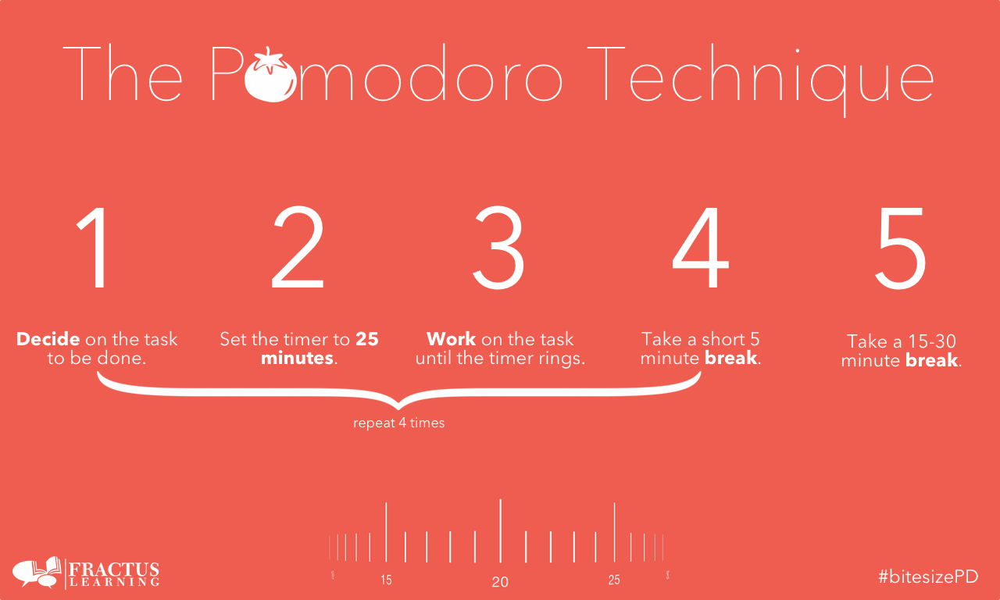

Hôm qua, mình được anh [Kaiwei Chen](https://sg.linkedin.com/pub/kaiwei-chen/1a/474/a3b), CEO của 2359 Media tại Việt Nam giới thiệu một kỹ thuật quản lý thời gian có vẻ thú vị tên là Pomodoro.

## Kỹ thuật Pomodoro là gì?

Kỹ thuật Pomodoro (gọi tắt là Pomodoro) là một phương pháp quản lý thời gian được phát triển vào khoảng thập niên 1980 bởi một ông người Italia tên là [Francesco Cirillo](http://francescocirillo.com/bio/). Tên gọi **"Pomodoro"** xuất phát từ việc ông xài cái đồng hồ đêm ngược hình trái cả chua khi còn đi học Đại học. Vì trong tiếng Italia, "podomoro" có nghĩa là trái cà chua.

## Tại sao sử dụng Pomodoro?

1.  Dễ dàng áp dụng.
2.  Cải thiện năng suất làm việc.
3.  Vui vẻ khi đang làm.

## Lợi ích mà Pomodoro đem lại.

1.  Lên được kế hoạch của bạn cần phải làm.
2.  Sự tập trung trong công việc. Do đang làm việc, bạn không có sự tương tác với bên ngoài như mạng xã hội, đồ ăn, điện thoại, email... Sự tập trung sẽ bị ảnh hưởng bởi những công việc không liên quan, bởi sự mệt mỏi vì làm việc dài nhiều giờ, bởi kỷ luật bản thân...
3.  Luyện được khả năng ước lượng thời gian làm việc. Vì trước khi bắt tay vào làm một công việc, bạn phải ước lượng rằng nó sẽ mất khoảng Pomodoro? Kỹ năng này rất quan trọng với các Developer, vì phải ước chừng được bạn cần bao nhiêu thời gian để hoàn thành task.
4.  Giúp ta cân bằng được thời gian và cuộc sống tốt hơn. Với thái độ nghiêm túc hoàn thành công việc như trên, bạn sẽ giải quyết nhanh chóng công việc và sẽ có thời gian để làm việc khác.

## Phương pháp thực hiện

Tư tưởng của Pomodoro là một "pomodoro" thường kéo dài khoảng 25 phút. Khi hết 25 phút thì bạn sẽ có một khoảng thời gian nghỉ ngắn là 5 phút. Kết thúc một khoảng thời gian ngắn đó thì bạn sẽ tiếp tục một pomodoro mới. Sau khoảng 4 pomodoro thì bạn sẽ có một khoảng thời gian nghỉ dài là khoảng 15 đến 30 phút.

Tóm tắt 5 bước để thực hiện kỹ thuật Pomodoro.

1.  Quyết định công việc sẽ làm.
2.  Thiết lập bộ đếm thời gian cho phiên làm việc Pomodoro (truyền thống là 25 phút cho 1 Pomodoro).
3.  Tập trung làm 1 việc duy nhất đã định cho đến khi đồng hồ báo hết Pomodoro.
4.  Khi kết thúc một Pomodoro, bạn nên check nó lại.
5.  Nghỉ ngắn từ 3 – 5 phút giữa các Pomodoro.
6.  Sau 4 phiên Pomodoro thì nghỉ dài hơn từ 15 – 30 phút.

## Một số nguyên tắc

1.  Trong 1 Pomodoro, nếu bạn buộc phải gián đoạn thì Pomodoro sẽ được tính lại từ đầu. Không có 1/2 hay 2/3 Pomodoro.
2.  Chỉ tập trung làm 1 việc duy nhất với 100% thời gian.
3.  Nếu công việc xong trước khi Pomodoro kết thúc, bạn cần dùng thời gian còn lại để kiểm tra và tối ưu hóa công việc cho đến hết Pomodoro đó.

## Phần mềm Pomodoro

Có rất nhiều phần mềm để thực hiện việc theo dõi Pomodoro. Bạn có thể tải các phần mềm bằng cách tìm kiếm với từ khóa **"pomodoro app"**.

Hoặc tải phần mềm TeamViz. TeamViz tương thích với hầu hết các nền tảng phổ biến như Windows, Mac, Android, iOS, Ubuntu và có khả năng đồng bộ dữ liệu giữa các thiết bị với nhau. Hãy tải theo link sau: [http://www.teamviz.com/downloads/](http://www.teamviz.com/downloads/).

Hướng dẫn chi tiết sử dụng TeamViz, các bạn có thể tham khảo ở đây [http://anhthienad.com/blog/quan-ly-thoi-gian-tuyet-doi-voi-teamviz-pomodoro-timer.html](http://anhthienad.com/blog/quan-ly-thoi-gian-tuyet-doi-voi-teamviz-pomodoro-timer.html).

## Chuyện bên lề

Kỹ thuật Pomodoro đã được nhiều nơi viết bài review. Mình viết bài này chỉ với ý nghĩ là bổ sung thêm những phần mình cảm thấy chưa hài lòng. Theo quan điểm của mình, kỹ thuật Pomodoro giúp chúng ta làm quen dần với khái niệm **"Estimate"**, tức là ước lượng.

Chẳng hạn, có người hỏi bạn làm Instant Search mất khoảng bao lâu? Người ta hỏi bạn như vậy để biết sắp xếp thời gian cho các công việc khác trong dự án. Nếu bạn ước lượng dư thời gian thì tốt. Còn giả sử, bạn nói người ta chức năng đó làm 10 giờ mà thực tế thì mất 30 giờ. Như vậy, bạn sẽ kéo theo một loạt các tiến trình bị chậm lại.

Rõ ràng hơn nhé, bạn nhận tiền khách hàng là 5 triệu cho một dự án làm trong vòng 1 tuần. Nhưng thực tế thì bạn làm mất 2 tuần. Và theo luật "lâm nghiệp", khách hàng họ chỉ trả đúng 5 triệu. Thời gian 1 tuần trễ thì bạn không được một xu nào, và bị lỗ do chi phí phát sinh, bạn phải tự lấy tiền túi ra trả. Mình lấy ví dụ trên để minh họa cho việc ước lượng thời gian quan trọng như thế nào. Bạn chưa có kinh nghiệm, có thể ước lượng công việc đó mất khoảng bao nhiêu pomodoro và chiến. Ban đầu có thể sai, nhưng dần dần sẽ có kinh nghiệm. Giống như mình ban đầu, ước chừng mất khoảng 1 pomodoro để hoàn thành bài viết này, nhưng thực tế là mất đến 3 pomodoro. Dù sao thì chúng ta cũng nên thử sai và cải thiện.

## Tham khảo

- [The Pomodoro Technique](http://pomodorotechnique.com)
- [Wikipedia Pomodoro Technique](https://en.wikipedia.org/wiki/Pomodoro_Technique)
- [Pomodoro là gì?](http://vinhcuong.net/pomodoro-la-gi.html)
