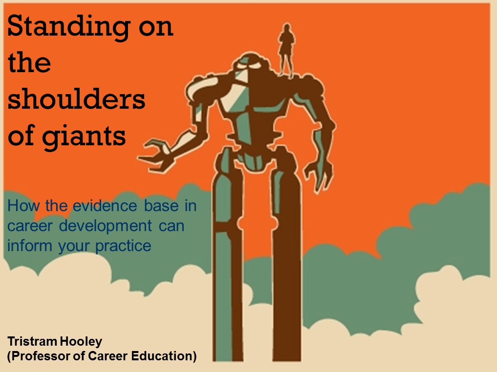

Ngày 12 tháng 10, trên group của CKIT-HCMUS có một bạn hỏi vấn đề: **"Phương pháp học ở nhà mà không cần đến lớp"**. Sẵn tiện ngồi chờ bạn nên viết vài dòng tâm sự.

## Tại sao bạn lại chán tới trường?

Mình học trường Đại học Khoa Học Tự Nhiên TP.HCM, bậc Cao Đẳng (học ở cơ sở Nguyễn Văn Cừ, Q.5). Lúc mình còn đi học, thiệt tình là nhiều khi cũng chả muốn vác xác lên lớp tí nào. Có rất nhiều nguyên nhân, chẳng hạn phải dậy sớm đi học (6h40 bắt đầu tiết 1), leo lên tầng 4 (không có thang máy), phòng nóng dã man, giáo viên đạt chuẩn "Tiến sĩ gây mê",... Còn tụi bạn mình thì lại thêm một số nguyên nhân như đi làm thêm, phải chạy chương trình Đoàn - Hội,... và lười.

Trong số các lý do, bệnh **"Lười"** thì có nhiều biến thể. Dạng đầu là do lười thiệt. Dạng tiếp theo là do nhà xa nên lười đi học (có mấy đứa ở Hóc Môn, Củ Chi). Còn một dạng nữa là ở nhà tự đọc slide được rồi, vô lớp giáo viên dạy chán lắm (có thiệt).

Khóa của mình, có vài Thánh đầu gấu lắm, cả năm chỉ xuất hiện khi có bài kiểm tra hoặc thi cử. Còn lại là tụi nó ở nhà cày dữ dội. Chắc hẳn bạn thắc mắc tại sao nó ở nhà mà mình biết nó đầu gấu? Đơn giản là tới kì vấn đáp đồ án, đi hóng hớt từ trong ra ngoài lớp là biết. Tại sao tụi nó ở nhà mà cày dữ dội vậy? Câu trả lời rất đơn giản: **"Có khả năng tự học"**.

## Phương pháp học của mình

Đầu tiên, mình xin nói là mình là thằng đi học đầy đủ, chỉ cúp học đúng 1 bữa vì ngủ quên, còn lại là đi trễ. Thường thì tới lớp mình cũng ít ghi chép lắm, có chăng là ghi lại một số cái không hiểu và keyword. Nhưng mấy môn không phải chuyên ngành phải chép bài đầy đủ để còn xài phao trong lúc thi nữa chứ.

Nói thẳng ra là, ở trường mình, giáo viên thường đưa slide để cho sinh viên coi, bạn có quyền ở nhà đọc slide và làm bài tập. Do trong slide đều ghi những cái căn bản để làm bài tập rồi. Có gì không hiểu thì hỏi Google. Nếu vậy tại sao mình không ở nhà cho rồi? À, do lười đọc slide. Mình lên lớp coi giáo viên chiếu slide và nói về nó, như vậy thì đỡ tốn thời gian. Sau khi nghe giảng thì mình về nhà bắt đầu Google để hiểu rõ hơn về nó. Ít ra như vậy thì mình đỡ mất 1 khoảng thời gian để tìm hướng đi và keyword liên quan.

Học lý thuyết thôi thì cũng chưa đủ, thời gian rảnh thì mình làm một số demo về những thứ đã học. Nếu có cơ hội thì áp dụng vào đồ án luôn như là [Twitter Bootstrap](getbootstrap.com), [Google AngularJS](https://angularjs.org),... Năm nay mấy bé được giới thiệu, GATO quá đi à.

## Đến lớp được lợi ích gì?

Hồi đó, cái vụ [lập trình Hướng đối tượng (Object Oriented Programming - OOP)](https://en.wikipedia.org/wiki/Object-oriented_programming), sau khi đi học quân sự (hè năm 1 mới học), mình bỏ hết thời gian cho tới khi vào năm 2 ra luyện. Nói thiệt là mình mất khoảng gần 1 tháng để hiểu ra được Đối tượng (Object) là cái gì nhưng vẫn mập mờ. Vô năm 2, học môn đó, thầy giảng có 2 buổi là hiểu được nó là gì. Hic hic... Ví dụ có vẻ hơi ngộ, nhưng mà đó là sự thật.

Có một việc này, được [bạn](https://vn.linkedin.com/pub/tin-nguyen-truong-trung/96/8a4/801/en) mình chia sẻ. Lúc nó làm thực tập cho [VNG Corporation (VNG)](https://www.vng.com.vn). Vào đó, nó được các sếp giao cho các công nghệ để nghiên cứu rồi làm demo, sau đó báo cáo lại. Ý nghĩa của việc báo cáo đó là các sếp đỡ tốn thời gian nghiên cứu, chỉ có kinh nghiệm là họ sẽ biết công nghệ đó ổn hay không? Còn việc họ xác nhận thế nào mình không biết. Với vụ này, mình cũng áp dụng khi đi học hoặc đọc tài liệu. Vì người truyền tải kiến thức là người đã làm qua vấn đề đó, họ sẽ biết nên giải thích như thế nào. Cứ tới làm và hưởng thụ thành quả của họ. Với lại, bạn đi học cũng phải bỏ tiền và thời gian chứ nhỉ? Không lẽ bạn quăng 25 triệu tiền học và 3 năm (chương trình Cao đẳng trường ĐH KHTN TP.HCM) vào sọt rác, chưa kể chi phí sinh hoạt hằng ngày? Bạn mua hàng cũng phải đắn đo là mua về có xài được hay không chứ nè? Vậy sao bạn lại phí như thế?

## Nếu không đến trường thì ở nhà làm gì?

Như đã nói, mình là đứa đi học đầy đủ. Nhưng quãng thời gian từ hồi kết thúc năm 3 tới giờ, mình rút ra được một số thứ và cũng xin chia sẻ.

Mỗi sáng khi thức dậy, bạn đề ra hôm nay cần phải làm được cái gì? Ví dụ: hôm nay phải hoàn thành xong demo về Directive trong AngularJS. Sau đó, bạn dành nhiều thời gian cho nó. Nhưng tốt nhất là làm gì thì làm miễn là trước 10 giờ tối bạn phải xong mục tiêu đề ra. Sau 10 giờ tối, bạn bắt đầu nghiên cứu và tìm hiểu những thứ mới như là công nghệ, văn hóa, nghệ thuật,...

Quan điểm của mình về ngành CNTT như thế này: Ngành CNTT là ngành hỗ trợ cho các ngành khác. Nên ngoài kỹ năng chuyên môn, biết thêm về mọi thứ sẽ giúp bạn có ý tưởng làm ra những sản phẩm tốt hơn. Ví dụ: Bạn làm một trang bán quần áo ở thị trường Nhật Bản. Giao diện người dùng ở Nhật thường là chi chít chữ. Nếu bạn thiết kế theo phong cách phương Tây thì có rất nhiều chỗ trống. Ngoài ra, trải nghiệm người dùng ở phương Đông khác phương Tây nên bạn cần để ý. Mình thất bại trong việc nhận dự án freelance đầu tiên cũng vì vụ này.

Nếu trong quá trình nghiên cứu tài liệu có chỗ nào thắc mắc, ngoài tìm kiếm trên Google thì [YouTube](https://www.youtube.com) cũng là một nguồn đáng giá để kiếm. Vì không phải clip trên YouTube nào cũng được suggest trên Google. Thường thì việc tìm hiểu, nghiên cứu chiếm rất nhiều thời gian. Có thể có bạn giống mình là làm việc về đêm thường hiệu quả hơn nên thức khuya là chuyện thường. Do đó, sáng dậy trễ và chả muốn tới lớp tí nào. Chưa kể có một số giáo viên khả năng sư phạm chưa ổn nữa chứ.

## Tóm lại

Nói lan man nãy giờ, mình chia sẻ quan điểm về việc có nên đến lớp hay không? Tùy với việc bạn thích làm việc như thế nào. Cũng có đứa bạn mình ở nhà suốt mà điểm tốt nghiệp được 8.25 và kỹ năng chuyên môn rất vững. Dù sao thì hãy cố gắng làm tốt những mục tiêu đã đề ra. Người nước ngoài rất thích người có khả năng tự học. Dù ở nhà hay tới trường, nếu khả năng tự học của bạn tốt thì họ sẵn sàng dùng mọi cách để giữ bạn lại.

