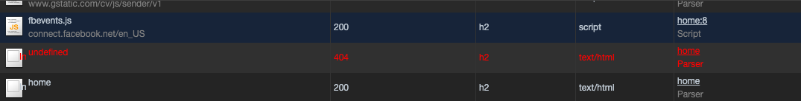
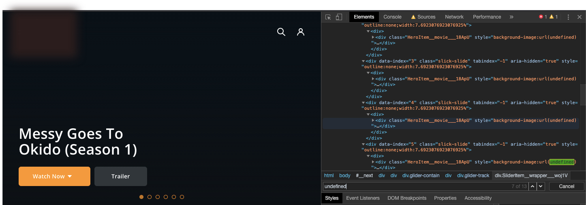

Có một request lúc nào cũng gửi đến `https://<DOMAIN>/undefined`. Ban đầu, cứ nghĩ là lỗi do `next/router` của Next.js. Hôm nay nhờ anh leader mà mình đã biết được lỗi nó từ đâu ra. Hôm nay học được cách debug này nên viết bài luôn.

## Cách debug

Đầu tiên, ta quan sát icon của request có dấu hiệu bất thường. Hiện mình đang dùng Chrome 81.

Bình tĩnh nào, thấy phần **Initiator** có chữ `Parser`. Đoán là nó bị lỗi lúc nhận thông tin từ server để chuyển đổi thành một dạng gì đó. Mò mò tiếp coi chỗ nào parse bị sai nè.

Vì đây đang dùng server-side rendering, có thể sau khi JavaScript được tải xuống thì nó render cái gì đó dẫn đến lỗi. Thử tắt JavaScript coi có gì xảy ra không. Vào **Chrome Settings** -> **Debugger** -> **Disable JavaScript**. Và tải lại trang.

Oh, lần này ở phần `Name`, icon của hình ảnh bị lỗi hiện lên. Ta khoanh vùng lại chỉ còn chỗ lấy hình của Carousel và danh sách trong slide bị sai. Vậy thử search cây DOM trong phần `Elements` coi sao.

Cuối cùng nguyên nhân của mọi tội ác là nằm ở phần render cái Carousel. Do mình dùng server-side rendering nên thấy được layout trước. Còn phần hình ảnh thì sau khi lấy được data sẽ điền source vào chỗ trống rồi render sau. Nên ở bước này, ở carousel không nhận được link hình ở trong `background-image` nên báo lỗi.

## Lưu ý

Có thể mặc định, trình duyệt của các bạn không thấy được chữ `Parser` trong phần `Initiator`. Để bật lên thì bạn vào Settings của DevTools, chọn `Use large request rows`.

## Tổng kết

Ở đây mình muốn rút ra là... khi có lỗi liên quan đến việc request bị tạch thì bình tĩnh mà để ý cái icon của request là gì và Initiator. Nếu không ra thì thử tắt JavaScript đi coi sao.

Cảm ơn anh Vũ Nguyễn đã hỗ trợ debug để có được bài viết này.
