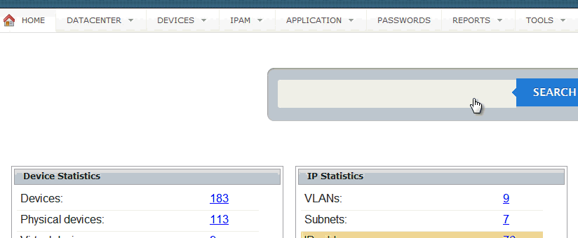
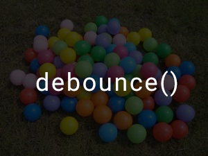

Trong một bài test của mình, có một câu là hãy thực hiện [Instant Search](https://en.wikipedia.org/wiki/Google_Search#Instant_Search) giống của [Twitter](https://twitter.com/search-home). Cách sử dụng là khi bạn nhập một ký tự thì sẽ gởi một request lên Server để lấy dữ liệu.

## Vấn đề đặt ra

Bạn viết đoạn code như trên. Khi bạn nhập **"abc"** thì sẽ có 3 request được gởi đi lần lượt cho **"a"**, **"ab"** và **"abc"**. Giả sử, thứ tự dữ liệu được trả về lần lượt là **"a"**, **"abc"** và **"ab"**. Có gì đó sai sai ở đây?

Trong khi đó, kết quả bạn cần là **"abc"** chứ không phải là **"ab"**. Như vậy, lỗi này sẽ ảnh hưởng tới [UX (User Experience)](https://en.wikipedia.org/wiki/User_experience). Để giải quyết vấn đề đó sẽ có rất nhiều cách. Mình tin là có bác sẽ nghĩ tới chuyện chờ người dùng nhập xong khoảng độ 1 giây, rồi lấy kết quả cuối cùng đem đi gởi. Vậy làm sao để biết nó khi nào nhập xong ta? Lúc đó thì ta sẽ sử dụng một kỹ thuật có tên là `Debounce`.

## Demo

Ở demo này, mình sẽ sử dụng một hàm `getRandomNumber()` để phát sinh thời gian delay để giả lập việc gởi request đến server có độ trễ (delay). Do đó, với ví dụ không sử dụng hàm `debounce()` thì sẽ chờ một khoảng thời gian mới hiện kết quả. TƯơng tự với ví dụ có sử dụng hàm `debounce()`, nhưng nó sẽ hiện thị kết quả khác.

### Không có sử dụng hàm `debounce`

TODO

### Có sử dụng hàm `debounce`

TODO

## Debounce Function

Đầu tiên, bạn sẽ muốn gọi hàm `debounce(func, wait)`, truyền vào hàm cần thực thi và thời gian delay. Do đó, bạn sẽ viết hàm `debounce` sẽ trả về một hàm anonymous.

Sau đó, bạn sẽ cần lấy giá trị của các tham số truyền vào.

Tiếp theo là bạn tạo một hàm tên là `executeFunction` để khi gọi hàm này, thì hàm được truyền vào sẽ thực thi.

Bây giờ, ta gọi hàm `setTimeout` để delay việc thực thi mỗi khi gọi hàm `debounce` tương ứng với `wait` giây.

Quay lại với giải pháp đã đưa ra, đoạn code tới đây đã giải quyết được vấn đề mỗi khi người dùng nhập thì delay một khoảng thời gian mới thực thi hàm. Nhưng có gì đó sai sai! Hình như là nó chưa lấy được giá trị cuối cùng của người dùng sau khi nhập rồi mới gởi request. Ta chỉ cần xóa đi các lần gọi hàm trước đó là được chứ gì, dùng hàm `clearTimeout`.

Như vậy là đã viết xong hàm `debounce`. Để sử dụng thì ta viết như sau.

## Chuyện bên lề

Trên blog của [YinYangIT](https://yinyangit.wordpress.com/2015/06/24/javascript-gioi-thieu-ve-debounce-function/) có đề cập tới một chiêu thức khác đó là [requestAnimationFrame()](https://yinyangit.wordpress.com/2012/03/15/javascript-tao-chuyen-dong-voi-windowanimationtiming-api/) thay thế cho `setTimeout()`. Bạn thậm chí có thể không cần đến tham số **wait** khi sử dụng phương pháp này. Nếu bạn nào có thời gian nghiên cứu thì tìm hiểu thêm.

Hàm `debounce` đã được một số thư viện hỗ trợ như là [Underscore.js](http://underscorejs.org/#debounce), [Lodash](https://lodash.com/docs#debounce). Thực ra, đoạn code được dùng demo là của Underscore phiên bản cũ. Cá nhân thì thấy nếu bạn có nhu cầu tìm hiểu các kỹ thuật khi làm việc với JavaScript, nên đọc mã nguồn của [Underscore.js](https://github.com/jashkenas/underscore) và nên đọc toàn bộ mã nguồn đã release để hiểu được rõ ràng vấn đề hơn.

## Tham khảo

*   [Javascript – Giới thiệu về Debounce Function](https://yinyangit.wordpress.com/2015/06/24/javascript-gioi-thieu-ve-debounce-function/)
*   [Debounce and Throttle: a visual explanation](http://drupalmotion.com/article/debounce-and-throttle-visual-explanation)