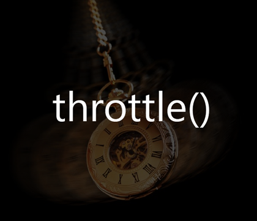

Lần trước, mình đã viết bài giới thiệu về kỹ thuật dùng hàm [Debounce](http://vhnam.github.io/blog/javascript-debounce-function-la-gi/). Nếu bạn có đọc các link trong phần tham khảo, hẵn sẽ thấy có nhắc đến hàm `throttle`. Hôm nay, mình sẽ giới thiệu về hàm này.

## Bài toán đặt ra

Mình xin dùng một ví dụ đơn giản, khi bạn rê chuột trong vùng màu xanh dưới đây, sẽ hiện thị số lần gọi sự kiện `hover()` được gọi.

TODO

Bạn có thấy số lần gọi sự kiện `hover()` rất lớn không? Giả sử, bạn khi gọi hàm `resize()` để resize kích thước trình duyệt khi đang sử dụng trên mobile (có một số trường hợp thẻ [@media](http://www.w3.org/TR/css3-mediaqueries/) trong CSS3 không khả thi). Bạn nên nhớ rằng, để render giao diện thì cần trải qua 2 bước là xây dựng thông số và xử lý. Nếu bạn gọi hàm `resize()` với số lần như bạn đã làm ở ví dụ trên. Tự hỏi điện thoại nào chịu cho nổi?

Lúc này, bạn nên sử dụng hàm `throttle()` để giải quyết vấn đề này.

## Throttle Function

Cách sử dụng hàm `throttle()` cũng tương tự như hàm `debounce()` gồm có 2 tham số là hàm cần thực thi và thời gian delay. Và hàm này cũng cần trả về một hàm.

Nếu hàm này không có đang chờ đợi gì thì cho nó chạy.

Hình như có gì đó không ổn. Nó chỉ chạy được có mỗi một lần đầu thì phải? Ta phải chờ trong một khoảng thời gian **time** thôi. Chờ xong, nó sẽ thực thi tiếp. Ta phải sửa lại.

Bây giờ, bạn thử rê chuột trong vùng màu xanh dưới đây. Phần xử lý đã sử dụng hàm `throttle()`.

TODO

## Lời kết

Để hiểu rõ về hàm này hơn, bạn có thể đọc mã nguồn của [Underscore.js](http://underscorejs.org/#debounce), [Lodash](https://lodash.com/docs#debounce). Bạn có thể tham khảo bài viết [Debounce and Throttle: a visual explanation](http://drupalmotion.com/article/debounce-and-throttle-visual-explanation) để hiểu rõ hơn. Vì họ có so sánh rõ ràng chức năng của hàm `debounce` và `throttle()`.

## Tham khảo

*   [Simple Throttle Function](http://sampsonblog.com/749/simple-throttle-function)
*   [Throttling function calls](https://remysharp.com/2010/07/21/throttling-function-calls)
*   [Debounce and Throttle: a visual explanation](http://drupalmotion.com/article/debounce-and-throttle-visual-explanation)