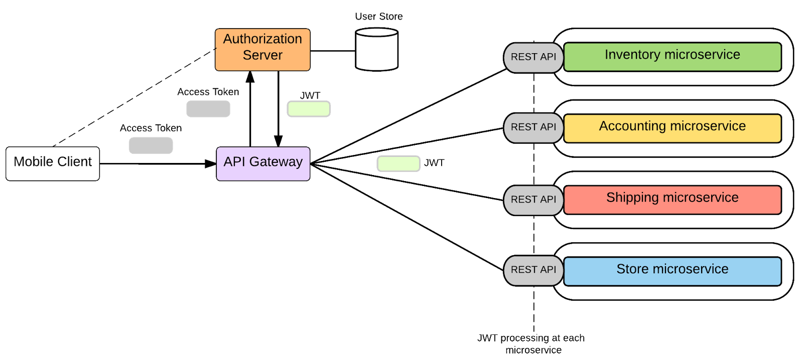

Dự án mình đang làm trên công ty có liên quan đến microservices, tức là thay vì kiến trúc một khối như MVC thì tách ra mỗi service là một REST APIs để xử lý một đối tượng. Trong đó, việc xác thực thông tin người dùng là một việc quan trọng để đảm bảo tính bảo mật cho các service.

## Tổng quan

Có 2 điều bảo mật cơ bản của một dịch vụ web đó là:

- **Authentication** - Who are you? Bạn là ai?
- **Authorization** - What is your permission? Bạn được phép làm gì?

**Authentication** thì chắc hẳn các bạn đều biết. Để giải quyết vấn đề này thì bạn bắt buộc người dùng phải đăng nhập. Thế là xong. Còn **Authorization** có khá nhiều cách để triển khai. Có thể các bạn đã từng đùng kỹ thuật **role-based access control**, tức là với mỗi `role` (vai trò) sẽ có `permission` (quyền hạn) nhất định.

Theo tài liệu của OWASP, để đảm báo tính bảo mật liên quan đến Authorization, cụ thể là **Access Control**.

> - Use only trusted system objects, e.g. server side session objects, for making access authorization decisions
> - Enforce authorization controls on every request, including those made by server side scripts, "includes" and requests from rich client-side technologies like AJAX and Flash
> - If long authenticated sessions are allowed, periodically re-validate a user’s authorization to ensure that their privileges have not changed and if they have, log the user out and force them to re-authenticate
> - The application must support disabling of accounts and terminating sessions when authorization ceases (e.g., Changes to role, employment status, business process, etc.)

Theo cách thông thường, các bạn có thể lưu permission vào `session` và có thể tái sử dụng và nó có vẻ chỉ xài được trong ứng dụng một khối (monolothic). Mình dùng cách khác, đó là sử dụng [JSON Web Token (JWT)](https://tools.ietf.org/html/rfc7519) để làm điều này.

## Sơ lược về JWT

Nội dung của JWT gồm 3 thành phần chính như sau:

- **Header** - Mô tả thuật toán được sử dụng để mã hoá phần signature.
- **Payload** - Nội dung của Token. Các bạn có thể lưu thông tin của user tại đây dưới dạng JSON.
- **Signature** - Phần nhận diện cho biết đây có phải là token của bản hay không.

Các bạn có thể đọc chi tiết về JWT tại [RFC 7519](https://tools.ietf.org/html/rfc7519).

## Ứng dụng JWT vào Microservice

Công dụng JWT trong microservice có thể hiểu như giấy thông hành, chìa khoá, dấu hiệu nhận biết,... để biết đây là request có nguồn gốc xuất xử hợp lệ. Thế nào là hợp lệ? Hợp lệ ở đây là phải đảm bảo một số tính chất sau. À mà thể hiện của JWT cho trường hợp này, ta có thể gọi tắt là Token.

- Token này phải còn thời hạn sử dụng. Thường thì mọi người sẽ gán thuộc tính `expire` là một khoảng thời gian trong phần `payload`.
- Xác thực đây là token hợp lệ đến cho hệ thống của bạn. Các bạn để ý phần `signature` trong 3 thành phần của token. Bạn phải nhập **Secret Key** vào trong đó và mã hoá lại, ta được chữ kí bảo mật của hệ thống. Nếu token gửi lên, phần này không khớp coi như token không hợp lệ.

Và mỗi khi bạn muốn gửi request đến service nào trong hệ thống đều phải đính kèm token để xác thực bạn có quyền đối với service đó hay không và bạn có được phép thao tác với tài nguyên hay không.

## Mọi người nói về JWT như thế nào?

- Easier to (horizontally) scale
- Easier to use
- More flexible
- More secure
- Built-in expiration functionality
- No need to ask users for 'cookie consent'
- Prevents CSRF
- Works better on mobile
- Works for users that block cookies

Thực sự thì mình thấy mọi người đánh giá cao JWT ở 2 điểm chính đó là **"more secure"** và **"stateless"**.

- **More secure** - Chắc là có yếu tố mã hoã, so sánh ở phần `signature`
- **Stateless** - Ngược với Stateful. Từ này hiểu theo nghĩa không có bất cứ dữ liệu nào được lưu trên Server. Đúng mà, chỉ cần so khớp `signature`, kiểm tra thời hạn sử dụng, không cần đụng gì cơ sở dữ liệu hết. Mọi permission đều nằm trong `payload`.

## JWT trong mắt tui

Có người cho rằng dùng JWT có thể thay thế được `session` và tiết kiệm được việc truy vấn để xác thực. Cũng hợp lý theo chiều hướng tích cực. Về mặt tiêu cực thì việc `decode` phần **payload** của JWT thì sẽ thấy hết toàn bộ nội dung. Lấy một token mới ráp với phần `signature`, chỉnh sửa tiếp thời hạn sử dụng coi như đã qua mặt được hệ thống bảo mật.

Như nãy giờ các bạn đều thấy JWT có một thời hạn nhất định. Vậy để gia hạn thì ta làm thế nào? Đó là dùng một `Refresh Token` đính kèm chung lên server để gia hạn. Câu chuyện bắt đầu rối ren từ đây.

Thường thì `Refresh Token` được gán thời hạn lâu hơn token kia để dễ dàng gia hạn. Tuy nhiên về mặt triển khai, ta phải giấu nó ở đâu đó để khi user gửi lên để còn xác định `Refresh Token` có hợp lệ hay không. Trường hợp này khá thú vị, do lâu lâu mới xài nên chúng ta phải lưu trữ lại. Và lưu ở đâu? Cookie, cơ sở dữ liệu (RDBMS, Redis),...? Stateless nơi đâu?

Tiếp theo, khi chúng ta đăng xuất hệ thống thì phải phi tang 2 cái token này chứ nhỉ? Nhưng không may, một tên nào đó đã chộp được cặp token này trước khi bạn đăng xuất rồi. Vậy hắn tha hồ gia hạn token để truy cập tài nguyên của bạn. Do đó một số tài liệu sẽ khuyên các bạn cho token đó vào `blacklist`. Nhưng khoan, không xài nữa thì cho vào blacklist. Như thế chả khác nào bạn đang tạo một đống dữ liệu không có khả năng tái sử dụng và vô nghĩa? Theo ngu ý của mình thì bạn nên tạo `whitelist`. Tức là các token của bạn còn trong thời gian sử dụng thì làm ơn hãy lưu chúng lại đâu đó, khi nào đăng xuất thì xoá chúng theo luôn. Giải pháp này có thể dùng `Redis` do hắn có thể gắn thời hạn cho từng cặp key-value.

## Một số lời khuyên lượm lặt

JWT có một số khuyết điểm như mình vừa nói nhưng không hẳn là không xài được. Nếu không thì nó đã không ai xài rồi. Có một ý trong định nghĩa của JWT thế này.

> JSON Web Token (JWT) is a compact, URL-safe means of representing claims to be transferred between two parties. \[...\] enabling the claims to be digitally signed or integrity protected with a Message Authentication Code (MAC) and/or encrypted.

Như mô tả trên, các bạn có thể dùng trong trường hợp giao tiếp server-server. Vì có một ông anh của mình bảo rằng, có một số ứng dụng lớn cần bảo mật đến mức giao tiếp giữa các service cũng phải cần đến token.

Ngoài ra, khi dùng JWT, bạn nên tham khảo ý này. Mình thấy nó cũng khá hợp lý.

- Đặt thời gian sử dụng ngắn
- Token chỉ được dùng một lần

## Triển khai như thế nào?

Để tìm hiểu những điểm chưa được ở JWT, mình có làm một demo, các bạn có thể tham khảo ở [đây](https://github.com/vhnam/research-jwt-restapi). Ở Tiki, họ có cách triển khai khác nữa, các bạn có thể tham khảo bài [Xác thực và phân quyền trong Microservices](https://engineering.tiki.vn/x%C3%A1c-th%E1%BB%B1c-v%C3%A0-ph%C3%A2n-quy%E1%BB%81n-trong-microservices-37689e53c082).

## Chốt

Trong tiếng Anh có câu "[No Silver Bullet](https://en.wikipedia.org/wiki/No_Silver_Bullet)" để ám chỉ rằng không có giải pháp nào là tối ưu nhất cho mọi trường hợp. Nó chỉ thích hợp với một số trường hợp nào đó. Các bạn cứ cân nhắc kỹ trước khi triển khai.

## Tham khảo

- OWASP, [OWASP Secure Coding Practices Quick Reference Guide](https://www.owasp.org//assets/tutorials/jwt-va-microservices/0/08/OWASP_SCP_Quick_Reference_Guide_v2.pdf)
- joepie91, [Stop using JWT for sessions](http://cryto.net/~joepie91/blog/2016/06/13/stop-using-jwt-for-sessions/)
- Dzone, [Stateless Authentication With JSON Web Tokens](https://dzone.com/articles/stateless-authentication-with-json-web-tokens)
- Dzone, [Stateless Sessions for Stateful Minds: JWTs Explained and How You Can Make the Switch](https://dzone.com/articles/stateless-sessions-for-stateful-minds-jwts-explain)
- Sebastián Peyrott, [JWT Handbook](https://auth0.com/resources/ebooks/jwt-handbook?utm_source=jwtio&utm_medium=sc&utm_campaign=rotating_banner)
- Tiki Engineering, [Xác thực và phân quyền trong Microservices](https://engineering.tiki.vn/x%C3%A1c-th%E1%BB%B1c-v%C3%A0-ph%C3%A2n-quy%E1%BB%81n-trong-microservices-37689e53c082)
- Scotch, [Why JWTs Suck as Session Tokens](https://scotch.io/bar-talk/why-jwts-suck-as-session-tokens)
- Viblo, [JSON Web Tokens (JWT) vs Sessions](https://viblo.asia/p/json-web-tokens-jwt-vs-sessions-4dbZN0Mg5YM)
