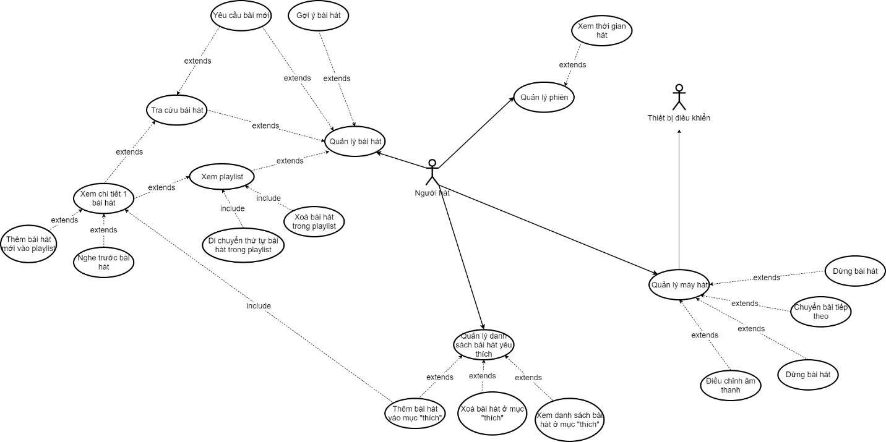

Phần này sẽ tập trung vào phân tích người dùng (User Analysis) và nghiệp vụ (Task Analysis) phục vụ việc thiết kế giao diện cho ứng dụng Karayolo.

- [Phần 1: Karayolo là gì?](https://vhnam.github.io/tutorials/karayolo-phan-1/)
- Phần 2: Phân tích
- [Phần 3: Thực hiện](https://vhnam.github.io/tutorials/karayolo-phan-3/)

## Tầm nhìn

Ngày nay các quán karaoke mọc lên như nấm nhằm phục vụ như cầu giải trí của mọi người cũng như karaoke tại nhà. Nhưng dù là ở đâu thì thiết bị karaoke cũng không đáp ứng được nhu cầu khách hàng theo như nhóm nhận thấy.

Thường thấy nhất là sử dụng sổ tra bài hát. Nhiều nơi tiên tiến hơn thì sử dung các ứng dụng hỗ trợ trên tablet nhưng vẫn còn nhiều thiếu sót do vẫn còn trong giai đoạn phát triển.

Mục tiêu của dự án là nhắm đến việc làm ra một ứng dụng hỗ trợ các chức năng đã có và cải thiện thiếu sót khác thông qua giao diện.

Ứng dụng này hướng đến end-user là người đi hát karaoke. Tuy nhiên, vì lý do bản quyền của bài hát nên nhóm sẽ bán/tư vấn cho đơn vị cung cấp thiết bị karaoke như Sơn Ca, Arirang, California,... để có thể truy cập danh sách bài hát. Nhằm mục đích đưa những bài nhạc mới nhất, đang là xu hướng đến end-user mà không phải chờ quán karaoke cập nhật bằng tay và hạn chế vi phạm bản quyền.

### Vấn đề hiện hữu

| Phát biểu                      | Nội dung                                                                                                                                |
| ------------------------------ | --------------------------------------------------------------------------------------------------------------------------------------- |
| The problem of                 | Tra cứu bằng sách hoặc chương trình hỗ trợ tra cứu chỉ giúp tra cứu theo tên bài hát                                                    |
| affects                        | Người dùng dịch vụ karaoke                                                                                                              |
| the impact of which is         | Gây khó cho người dùng khi phải tra cứu hay tra cứu mà khi họ muốn tra cứu theo nhiều cách thức khác.                                   |
| a successful solution would be | Tra cứu theo tên bài hát (đã có), các chữ cái đầu của bài hát (đã có), tác giả/ thể loại nhạc, lời nhạc, giai điệu (nếu được) và ca sĩ. |

| Phát biểu                      | Nội dung                                                                                                                                                                                                                                         |
| ------------------------------ | ------------------------------------------------------------------------------------------------------------------------------------------------------------------------------------------------------------------------------------------------ |
| The problem of                 | Không hề có quản lý các bài nhạc đã chọn                                                                                                                                                                                                         |
| affects                        | Người dùng dịch vụ karaoke                                                                                                                                                                                                                       |
| the impact of which is         | Khi một đám đông nhấn chọn bài liên tục và bạn chả thế biết được đã có bao nhiu bài đã được chọn, chèn một bài nhạc bất kỳ trong danh sách, hay xóa một hoặc nhiều bài hát khi lỡ nhấn quá nhiều và cứ phải bấm Pause/Play liên tục để Next bài. |
| a successful solution would be | Một chức năng quản lý đầy đủ các bài hát đã được chọn, thêm/xóa/chèn giữa danh sách bài hoặc xóa nhanh một dãy các bài nhạc.                                                                                                                     |

| Phát biểu                      | Nội dung                                                                                                                                         |
| ------------------------------ | ------------------------------------------------------------------------------------------------------------------------------------------------ |
| The problem of                 | Không hề có quản lý phiên hát                                                                                                                    |
| affects                        | Người dùng dịch vụ karaoke                                                                                                                       |
| the impact of which is         | Người dùng chả biết đã hát bao lâu, số tiền bao nhiêu, hầu như khi đi hát là phải đem 1 số tiền kha khá và vô thả ga.                            |
| a successful solution would be | Một chức năng quản lý phiên hát của người dùng dịch vụ karaoke, cho biết thời gian hát, số tiền cần thanh toán, hay thậm chí là hẹn thêm giờ,... |

### Định nghĩa sản phẩm

| Phát biểu      | Nội dung                                                                                                                                                                                                      |
| -------------- | ------------------------------------------------------------------------------------------------------------------------------------------------------------------------------------------------------------- |
| For            | Người đi hát karaoke có nhu cầu sử dụng app                                                                                                                                                                   |
| Who            | Những người có nhu cầu tra cứu bài hát, quản lý phiên trực quan và tiện dụng trên điện thoại                                                                                                                  |
| The (Karayolo) | Là một ứng dụng hỗ trợ điều khiển cũng như quản lý karaoke nâng cao.                                                                                                                                          |
| That           | Nó sẽ thay thế cách quản lý những buổi đi karaoke truyền thống thông qua cách dùng remote hoặc tập trung tại tablet                                                                                           |
| Unlike         | Nó không giống với các ứng dụng trước đây như Arirang List, Arirang Remote Control, Mã số Karaoke Việt Nam, Kara 360.                                                                                         |
| Our product    | Ứng dụng của chúng tôi thân thiện hơn và giúp hỗ trợ khách hàng, những người đi hát cảm thấy thuận tiện trong việc tra cứu, chọn bài, xem thông tin về phiên hát mà không ảnh hưởng đến những người đi chung. |

> **Đối với** người đi hát karaoke có nhu cầu sử dụng app, **dành cho** những người có nhu cầu tra cứu bài hát, quản lý phiên trực quan và tiện dụng trên điện thoại. **Ứng dụng Karayolo** là một ứng dụng hỗ trợ điều khiển cũng như quản lý karaoke nâng cao, rằng nó sẽ thay thế cách quản lý những buổi đi karaoke truyền thống thông qua cách dùng remote hoặc tập trung tại tablet. Karayolo **không giống** với các ứng dụng trước đây như Arirang List, Arirang Remote Control, Mã số Karaoke Việt Nam, Kara 360. **Ứng dụng của chúng tôi** thân thiện hơn và giúp hỗ trợ khách hàng, những người đi hát cảm thấy thuận tiện trong việc tra cứu, chọn bài, xem thông tin về phiên hát mà không ảnh hưởng đến những người đi chung.
>
> **Tui**

## Phân tích người dùng

### Thông tin người dùng

Sau quá trình tìm hiểu người dùng, tụi mình rút ra được như sau:

- **Tên/loại người dùng:** Người đi hát karaoke.
- **Vai trò:** Người sử dụng ứng dụng.
- **Kinh nghiệm sử dụng:** Hướng tới người dùng biết sử dụng smartphone.
- **Tần suất sử dụng:** Người sử dụng có thể sử dụng trong suốt buổi karaoke của mình.
- **Đối tượng:** Ứng dụng hướng đến những bạn tuổi teen, năng động, sử dụng smartphone thường xuyên.
- **Mục tiêu:** Giúp mỗi người trong nhóm khi đi hát, có thể tự thao tác không cần phải tranh giành/chờ remote/tablet.

### Nghiệp vụ

1.  **Quản lý danh sách bài hát**
    - Tác vụ thực hiện bởi người sử dụng app, trong phòng hát karaoke.
    - Khi họ muốn biết các bài hát đã được chọn để thêm/xóa bài hát/sắp xếp thứ tự ưu tiên trong danh sách.
    - Yêu cầu phải kết nối với thiết bị quản lý trung tâm của quán karaoke.
2.  **Quản lý phiên**
    - Tác vụ thực hiện bởi người dùng app, trong phòng karaoke.
    - Khi họ muốn biết đã hát được bao nhiêu bài, thời gian và số tiền sẽ phải trả.
    - Yêu cầu phải kết nối với thiết bị quản lý trung tâm của quán karaoke và đã kết nối vào phòng.
3.  **Quản lý Player**
    - Tác vụ thực hiện bởi người dùng app, trong phòng karaoke.
    - Khi họ muốn Play/Pause/Next và chỉnh tone bài hát cho phù hợp với giọng (auto-tune).
    - Yêu cầu phải kết nối với thiết bị quản lý trung tâm của quán karaoke và đã kết nối vào phòng.
4.  **Quản lý danh sách bài hát cá nhân**
    - Tác vụ thực hiện bởi người dùng app, trong phòng karaoke.
    - Khi họ muốn xem/ thêm mới/ xóa bài hát trong danh sách bài hát yêu thích và chọn để cho vào Playlist trong hàng đợi.
    - Yêu cầu phải kết nối với thiết bị quản lý trung tâm của quán karaoke và đã kết nối vào phòng.

### So sánh với các sản phẩm hiện có trên thị trường

#### Arirang Remote Control

Link: [http://arirang.com.vn/ung-dung/ung-dung-remote-arirang.html](http://arirang.com.vn/ung-dung/ung-dung-remote-arirang.html)

- Không thể lưu lại danh sách bài hát yêu thích
- Phụ thuộc vào từng loại đầu mà sử dụng phiên bản tương ứng như AK-36HDD, AR- 36MB, AR-3600WTK PAD,...
- Tính tương thích không cao. VD: AR-3600WTK PAD thì bắt buộc phải dùng máy tính bảng nhãn hiệu Arirang.
- Cách thiết kế màu sắc chưa khó nhìn trong môi trường ánh sáng tại phòng karaoke.

#### Kara 360

Link: [http://kara360.vn/](http://kara360.vn/)

- Giao diện khi hát karaoke chưa tiện dụng khi nhìn lời bài hát
- Không có hỗ trợ các tiêu chí tìm kiếm như lời bài hát, viết tắt tên bài hát (VNT – Vợ Người Ta)
- Điểm mạnh là thể hiện được nhạc đang hot như thế nào thông qua lượt hát của bài đó.

#### Mã số Karaoke Việt Nam

Link: [https://play.google.com/store/apps/details?id=quang.pham.masokaraoke&hl=en](https://play.google.com/store/apps/details?id=quang.pham.masokaraoke&hl=en)

- Cho phép tìm kiếm theo loại đầu và vol.
- Giao diện tìm kiếm dễ hiểu đối với người dùng phổ thông mặc dù còn một số thao tác thừa.
- Không hỗ trợ quản lý phiên bản.

## Chức năng đề xuất của sản phẩm

Để tóm tất chức năng của sản phẩm. Mình xin dùng sơ đồ Use Cases để thể hiện.

**Lưu ý:** _Nhớ mở hình bằng tab mới để coi cho rõ_
