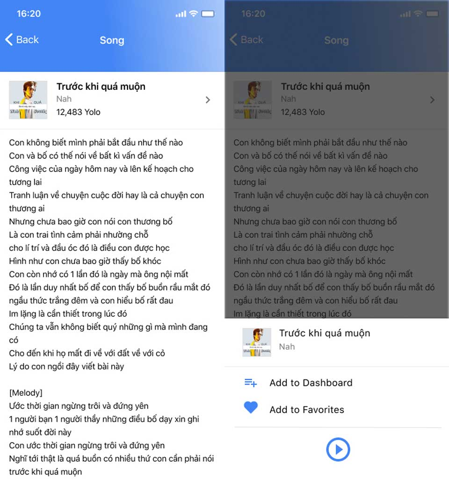
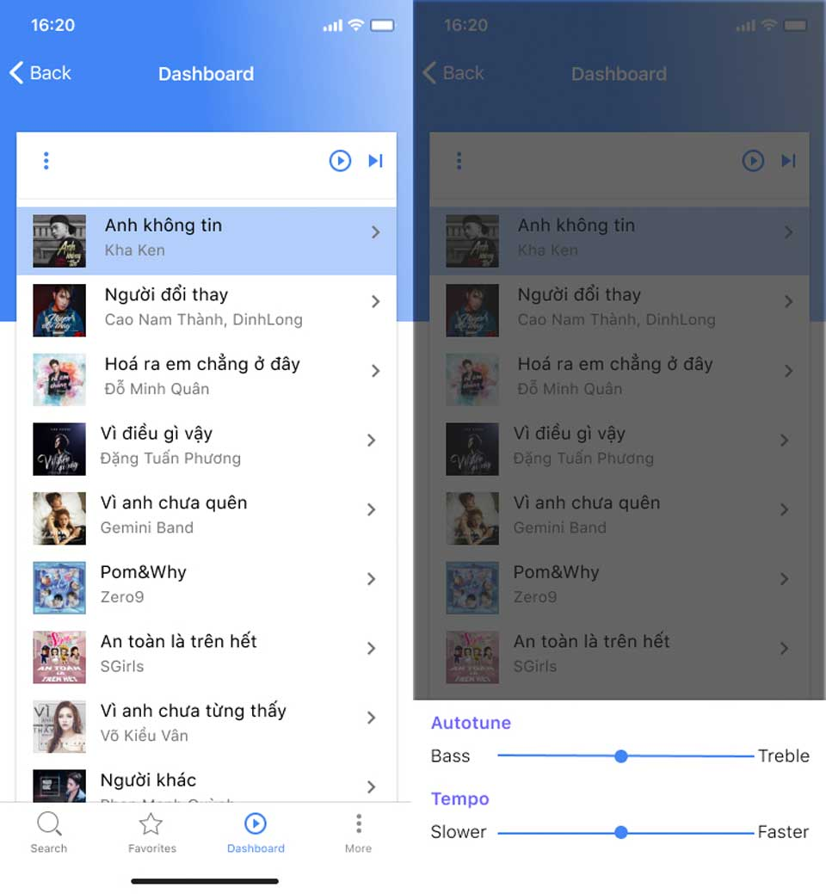
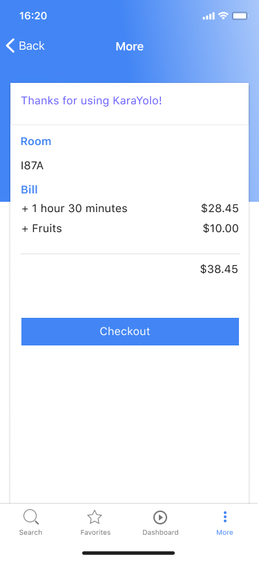

Sau khi các bạn đã coi qua quá trình phân tích của nhóm tụi mình. Hy vọng nó giúp các bạn định hình được tư duy khi thiết kế. Tuy nhiên vẫn còn một vài thiếu sót. Mình xin đính kèm sản phẩm trong bài viết này.

- [Phần 1: Karayolo là gì?](https://vhnam.github.io/tutorials/karayolo-phan-1/)
- [Phần 2: Phân tích](https://vhnam.github.io/tutorials/karayolo-phan-2/)
- Phần 3: Thực hiện

## Mockup

Đây là những màn hình chính của sản phẩm tại thời điểm nộp đồ án. Được vẽ bằng Sketch.

https://www.pinterest.com/vhnam2504/karayolo/

## Tài liệu môn học

https://drive.google.com/embeddedfolderview?id=1tHJI_pAlB9oknFEd7K9_1FJqE333bTle#list

## Báo cáo đồ án

https://drive.google.com/embeddedfolderview?id=1YTyu6zXGUMIC98omDuknkeD6U9995Sse#list

## Source code

https://github.com/HCB2-NPT/KaraYolo

## Redesign

Do mình thấy giao diện vẫn chưa ưng lắm và bài viết có một thiếu sót lớn đó là tại sao tớ thiết kế như vậy. Phần này tớ sẽ nói về nó.

Tóm tắt sơ lược về ứng dụng KaraYolo. Ứng dụng KaraYolo cho phép bạn chọn và quản lý các bài hát khi hát karaoke với giao diện tương tự như các app nghe nhạc hiện tại như Mp3 Zing, Spotify.

Mình lấy cảm hứng từ Spotify, Mp3 Zing, YouTube và chế lại một phần từ bản thiết kế cũ. Vấn sử dụng TabBar của iOS để phân nhóm chức năng.

- **Search** - Tìm kiếm bài hát, ca sĩ theo tên hoặc thể loại được phân sẵn.
- **Favorites** - Danh sách các bài hát yêu thích để mỗi khi đi hát, bạn dễ dàng thêm vào hàng đợi.
- **Dashboard** - Quản lý các bài hát đang trong hàng đợi lẫn đang phát. Có thể thay thể chiếc remote ở bước này.
- **More** - Quản lý phiên, như biết giá tiền và thông báo với chi nhánh thanh toán tiền.

### Màn hình chính

Ở giao diện cũ, sẽ có một TabBar chia làm 2 danh sách là Hot và New. Tuy nhiên, như vậy sẽ phát sinh thêm thao tác thừa khi tìm kiếm theo thể loại. Do đó, mình thấy 2 loại trên có thể coi như là thể loại bài hát như cách phân loại trong Spotify.

### Màn hình tìm kiếm

Ở màn hình này, mình học hỏi từ Mp3 Zing và Spotify. Cá nhân mình thích flow của Spotify hơn do nó đơn giản. Tuy nhiên, để hỗ trợ người dùng tốt hơn thì nên có tìm kiếm theo giọng nói của YouTube, Mp3 Zing sẽ tiện dụng hơn.

### Màn hình chi tiết thể loại bài hát

Đây là chi tiết của một thể loại bài hát. Cụ thể ở đây là những bài nhạc mới phát hành. Khi nhấn vào một bài hát, bạn sẽ có 3 lựa chọn:

- Thêm bài hát vào hàng đợi.
- Thêm bài hát vào danh sách yêu thích.
- Nghe thử nhạc mẫu để xác định có phải bản phối mình cần, giai điệu quen quen dễ hát hay không.

### Màn hình danh sách bài hát yêu thích

Cũng không khác gì lắm màn hình thể loại. Khi nhấn chi tiết, bạn có thể thêm hoặc xoá khỏi danh sách bài hát.

### Màn hình chi tiết bài hát

Màn hình này gồm số lượt người hát thông qua chỉ số _Yolo_ (dụ dụ khách hàng á mà).

### Màn hình Dashboard

Màn hình này tương tự như remote. Bạn có thể Play/Pause rồi Next. Có thêm phần mở rộng là chỉnh cao độ và tempo để cho dễ hát. Do mình để ý, remote của mấy đầu karaoke thường khó để ý thấy nút chỉnh cao độ. Sử dụng slider để tiện thao tác.

### Màn hình More

Màn hình này để biết thời gian cũng như số tiền cần thanh toán. Đúng ra nên đặt tên khác và mình chả nghĩ được tên gì.

### Màn hình Lauching

Một ứng dụng mobile cần có màn hình chờ để tải resources ban đầu. Mình thích hình này nên mình để thôi. Mặc dầu nó chả liên quan gì đến màu tổng thể =))

## Cấu hình project

Sau đây tớ sẽ chia sẻ với các bạn một số cấu hình của project.

- **Công cụ:** [Figma](https://www.figma.com/)
- **Mã màu:**
  - - #4285F4
  - - #6C63FF
  - - #757575
- **Demo:** [https://www.figma.com/file/NaiEAwCplJLGfVQUfuto0Ge3/KaraYolo](https://www.figma.com/file/NaiEAwCplJLGfVQUfuto0Ge3/KaraYolo)
