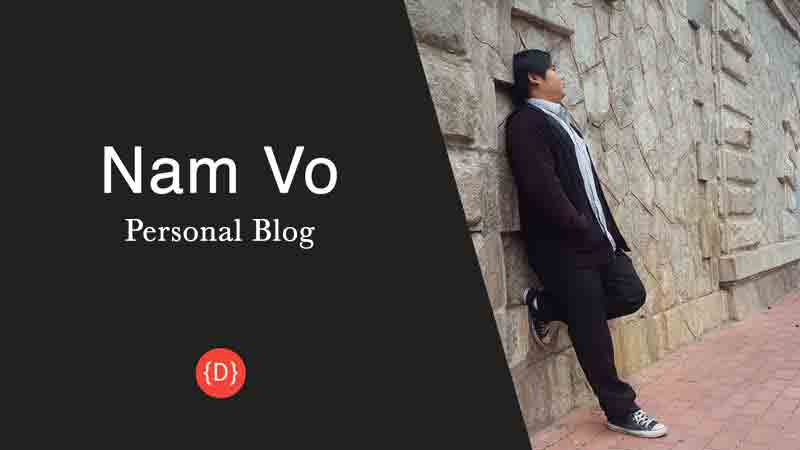
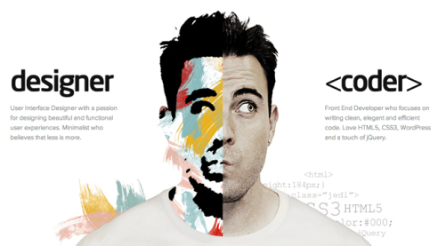
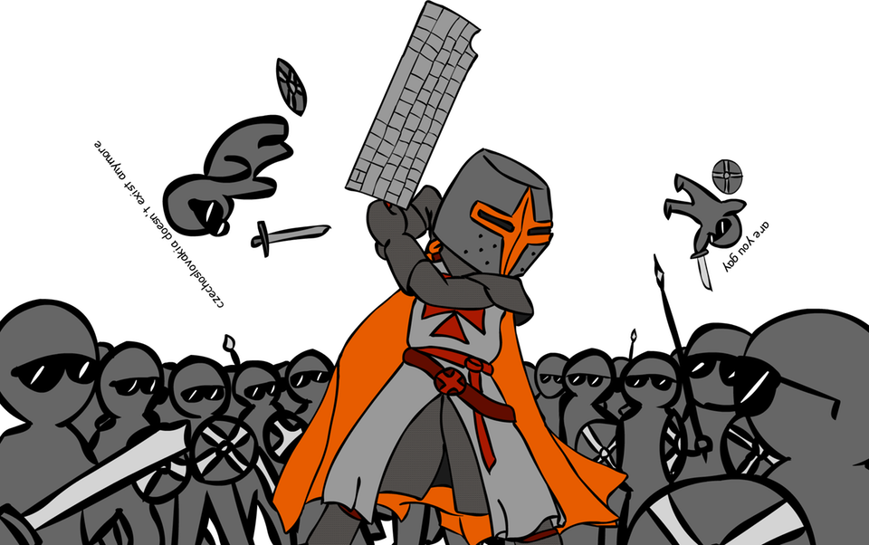
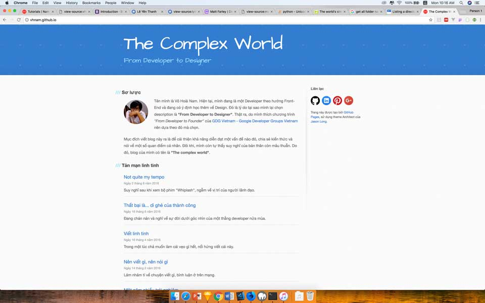

Một hôm mình muốn đổi gió cho blog, nên quyết định làm lại giao diện. Sẵn tiện, mình chia sẻ quá trình cho mọi người để tham khảo cách làm một website từ đầu như thế nào.

- Phần 1: Khởi động
- [Phần 2: Thiết kế giao diện](https://vhnam.github.io/tutorials/lam-lai-blog-ca-nhan-2/)
- [Phần 3: Quản lý cấu hình](https://vhnam.github.io/tutorials/lam-lai-blog-ca-nhan-3/)
- [Phần 4: Bắt đầu với giao diện](https://vhnam.github.io/tutorials/lam-lai-blog-ca-nhan-4/)
- [Phần 5: Schema.org du hý](https://vhnam.github.io/tutorials/lam-lai-blog-ca-nhan-5/)
- [Phần 6: Metadata và các công cụ theo dõi hoạt động người dùng](https://vhnam.github.io/tutorials/lam-lai-blog-ca-nhan-6/)
- [Phần 7: Template Engine](https://vhnam.github.io/tutorials/lam-lai-blog-ca-nhan-7/)
- [Phần 8: Deployment](https://vhnam.github.io/tutorials/lam-lai-blog-ca-nhan-8/)

## Trước khi bắt đầu

### Tại sao tớ muốn đổi gió?

Đầu tiên là rảnh quá không có gì làm. Thứ hai là giao diện cũng được mấy năm rồi nên cập nhật theo xu hướng một chút. Nguyên nhân cuối cùng là tớ không đồng tình với quan điểm này của đồng chí Hoàng Code Dạo.

> **Cậu là lập trình viên, viết blog “dạy” người khác mà ko code đc 1 cái blog ra hồn à, sao lại phải dùng wordpress thế?**
>
> Tại sao phải [code lại từ đầu](https://toidicodedao.com/2016/01/20/su-that-dang-long-doi-khi-cam-dau-ngoi-code-la-cach-ngu-nhat-de-giai-quyet-van-de/) 1 blog engine, sau đó tìm host, deploy lên mạng, …. trong khi ta có thể tạo 1 blog đơn giản, theme có sẵn, plug-in chỉ với 3 bước? Sử dụng wordpress, tôi có thể tập trung vào việc viết blog, thay vì cố gắng code 1 engine mới lại từ đầu, rồi bỏ dở giữa chừng.

Thực ra thì tớ cũng có hơi sân si với lão. Kệ đi, làm từ đầu để những người mới bắt đầu hình dung được công việc viết một trang web từ tay trắng (from scratch) như thế nào.

### Giới thiệu về Blog

Tớ đã tạo blog này vào 28/12/2014. Ban đầu dùng để chia sẻ lại một số cách cấu hình trong đồ án môn học. Sau này, tớ phát triển để chia sẻ những gì đã nghiên cứu được và một tí về cá nhân.

## Công cụ

Để chuẩn bị cho công cuộc cách mạng thì tớ dùng các công cụ dưới đây và luyện cách dùng nó quen tay trước khi bắt đầu sự nghiệp.

- [Sketch](https://www.sketchapp.com/) - Thiết kế giao diện (chỉ chạy trên Mac OS)
- [Chrome](https://www.google.com/chrome/), [Firefox Developer Edition](https://www.mozilla.org/en-US/firefox/developer/) - Trình duyệt web
- [Visual Studio Code](https://code.visualstudio.com/) - Công cụ lập trình
- [Photoshop](https://www.photoshop.com/) - Chỉnh sửa ảnh
- [MAMP](https://www.mamp.info/en/) - Công cụ tạo localhost tại máy tính cá nhân (dành cho Mac OS)

## Phân tích nghiệp vụ

Nói cho hoành tráng chứ phần này xem xét lại tớ cần gì ở blog mới. Như đã nói ở phần trên, tớ muốn tạo một nơi để chia sẻ kiến thức và cảm xúc cá nhân. À mà thêm mục giới thiệu bản thân để dành đi xin việc cũng hay hay. Vậy chốt là blog mới sẽ có 3 mục đích sau:

- Chia sẻ kiến thức
- Nhật ký
- Giới thiệu bản thân

Xem xét lại giao diện cũ để xem mình có thoả mãn yêu cầu chưa nhỉ?

Có vẻ như phần giới thiệu bản thân sơ sài quá và cũng lâu rồi chua cập nhật CV. Sẵn tiện mình nên ghi lại cho đàng hoàng. Thế là mình ghi ra PowerPoint.

**[Nam Vo's Profile](//www.slideshare.net/secret/9340x7vCb4B2F8 "Nam Vo's Profile")** from **[Nam Vo](https://www.slideshare.net/NamVoHoai1)**

Như thế là mình đã chuẩn bị xong nội dung để bắt tay vào việc làm lại blog rồi. Phần tiếp theo sẽ là thiết kế giao diện.

## Tham khảo

- ToiDiCodeDao, [About Me](https://toidicodedao.com/about/)
- Medium, [Vietnamese Mobile Wallet Momo Redesign](https://medium.com/eggcademy/vietnamese-mobile-wallet-momo-redesign-b2e2be8cfded)
