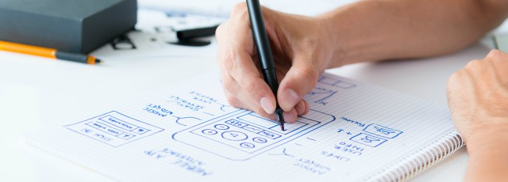
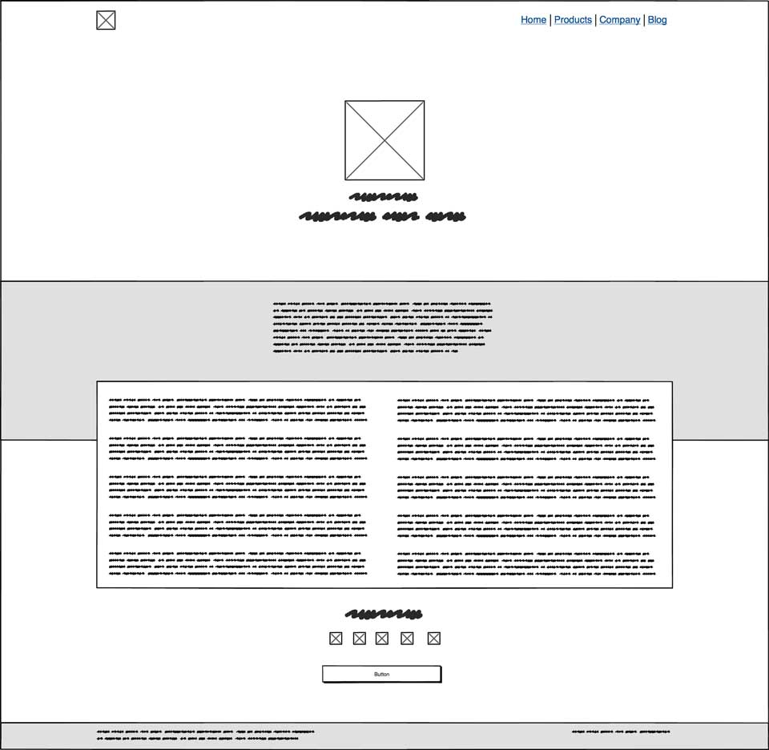
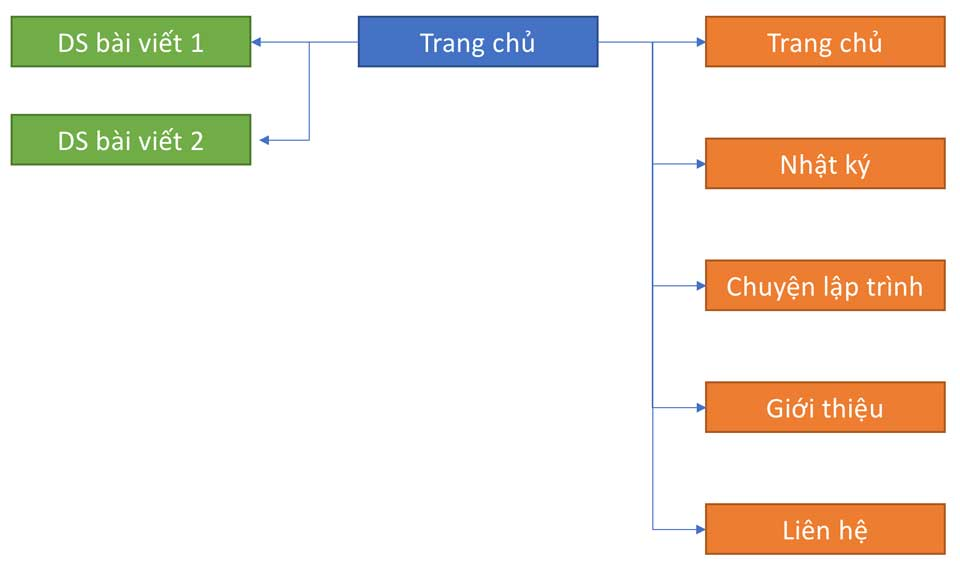
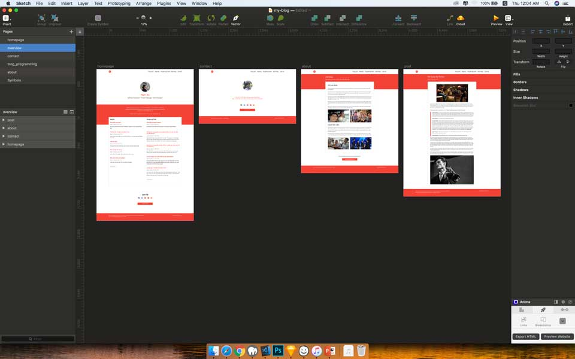

Sau khi đã lên phần nội dung cho website, tớ bắt đầu công việc thiết kế giao diện.

- [Phần 1: Khởi động](https://vhnam.github.io/tutorials/lam-lai-blog-ca-nhan-1/)
- Phần 2: Thiết kế giao diện
- [Phần 3: Quản lý cấu hình](https://vhnam.github.io/tutorials/lam-lai-blog-ca-nhan-3/)
- [Phần 4: Bắt đầu với giao diện](https://vhnam.github.io/tutorials/lam-lai-blog-ca-nhan-4/)
- [Phần 5: Schema.org du hý](https://vhnam.github.io/tutorials/lam-lai-blog-ca-nhan-5/)
- [Phần 6: Metadata và các công cụ theo dõi hoạt động người dùng](https://vhnam.github.io/tutorials/lam-lai-blog-ca-nhan-6/)
- [Phần 7: Template Engine](https://vhnam.github.io/tutorials/lam-lai-blog-ca-nhan-7/)
- [Phần 8: Deployment](https://vhnam.github.io/tutorials/lam-lai-blog-ca-nhan-8/)

## Lên ý tưởng

**"Steal like an artist"** - Đây là câu châm ngôn khi mình bắt đầu công việc đi tìm ý tưởng. Đầu tiên mình lượn các trang dưới đây với các từ khoá lần lượt là **personal blog**, **blog**, **portfolio**, **designer blog**, **developer blog**:

- [https://www.behance.net](https://www.behance.net)
- [https://dribbble.com](https://dribbble.com)
- [https://www.pinterest.com](https://www.pinterest.com)
- [https://www.google.com](https://www.google.com)

Đây là kết quả sau khi mình lượm lặt được từ các trang tìm trên mạng. Mình dùng [Balsamiq Mockup 3](https://balsamiq.com) để vẽ wireframe.

## Thiết kế sitemap

Tiếp theo mình sẽ lên cấu trúc trang web để định hình việc điều hướng. Phần màu cam là các trang bắt đầu từ thanh điều hướng (navigation bar). Phần màu xanh lá là các trang bắt đầu từ màn hình trang chủ.

## Vẽ mockup

Dựa vào sitemap, ta sẽ thiết 4 màn hình chính và sau đó sẽ tái sử dụng layout cho các màn hình còn lại.

- Trang chủ
- Giới thiệu
- Liên hệ
- Một bài viết

Bạn vào Pinterest của tớ để xem chi tiết các màn hình.

## Tổng kết

Quá trình thiết kế giao diện đến đây là kết thúc. Chúng ta sẽ tiếp tục phần kế tiếp là quản lý cấu hình của project này.
