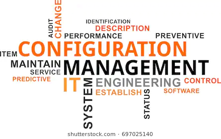
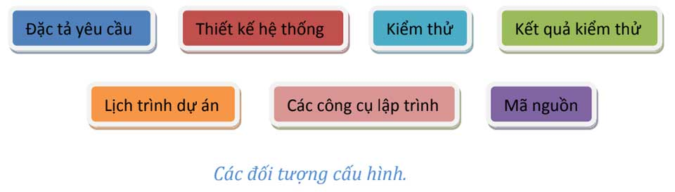

Phần này tớ sẽ giới thiệu các bạn phần quản lý cấu hình của dự án.

- [Phần 1: Khởi động](https://vhnam.github.io/tutorials/lam-lai-blog-ca-nhan-1/)
- [Phần 2: Thiết kế giao diện](https://vhnam.github.io/tutorials/lam-lai-blog-ca-nhan-2/)
- Phần 3: Quản lý cấu hình
- [Phần 4: Bắt đầu với giao diện](https://vhnam.github.io/tutorials/lam-lai-blog-ca-nhan-4/)
- [Phần 5: Schema.org du hý](https://vhnam.github.io/tutorials/lam-lai-blog-ca-nhan-5/)
- [Phần 6: Metadata và các công cụ theo dõi hoạt động người dùng](https://vhnam.github.io/tutorials/lam-lai-blog-ca-nhan-6/)
- [Phần 7: Template Engine](https://vhnam.github.io/tutorials/lam-lai-blog-ca-nhan-7/)
- [Phần 8: Deployment](https://vhnam.github.io/tutorials/lam-lai-blog-ca-nhan-8/)



## Quản lý cấu hình là gì?

> "Quản lý cấu hình là bộ khung tổ chức cho phép chúng ta quản lý sự phát triển của tất cá các sản phẩm trên toàn bộ hệ thống thông qua các giai đoạn phát triển phần mềm."
>
> \- Thầy Ngô Huy Biên



Ở trong bài viết này, tớ sẽ giới thiệu cách tớ quản lý cấu hình blog như thế nào. Và phần lý thuyết, bạn có thể xem thêm tại các link phía dưới.

- Wikipedia, [Configuration management](https://en.wikipedia.org/wiki/Configuration_management)
- CMPIC, [What is Configuration Management?](https://www.cmpic.com/configuration-management-definition.htm)
- Association for Project Management, [Configuration management](https://www.apm.org.uk/body-of-knowledge/delivery/scope-management/configuration-management/)

## Đối tượng quản lý cấu hình

Để xem nào, blog của tớ cũng không phải là dự án gì to tát cả. Do đó, tài liệu cũng vừa đủ để biết công việc sẽ làm và sau này mở ra coi lại để bảo trì cho dễ. Tớ có một số đối tượng cần quản lý sau.

- Tài liệu thiết kế gồm wireframe và mockup
- Mã nguồn (Source Code)

Và một cái quan trọng nữa là Log - nhật ký làm việc (tức là seri bài viết các bạn đang xem).

## Quản lý tài liệu thiết kế

Tớ tạo một folder trên Google Drive để lưu trữ file Sketch và Balsamiq. Còn folder **Resources** để lưu hình dùng cho blog.


## Quản lý mã nguồn

Tớ đã tạo một repository từ năm 2014 đến giờ trên GitHub. Và định dùng GitHub Pages để tạo một website thay vì thuê host. Bạn chỉ cần làm theo hướng dẫn dưới đây là được.

Link: [https://pages.github.com](https://pages.github.com)


## Cấu trúc mã nguồn


Như các bạn đã thấy, code của tớ được phân cấp theo dạng một trang web tĩnh (static web). Do GitHub Pages chỉ hỗ trợ static web nên mình mượn cấu trúc thư mục để làm đường dẫn cho bài viết.

```
blog/               | các bài viết thuộc mục Nhật Ký
node_modules/       | các packages hỗ trợ trong việc code
public/             | resources gồm hình ảnh, CSS, JS được public
src/                | mã nguồn chính của blog
|__ content/        | nội dung các bài viết
|__ indexes/        | mục lục của blog và tutorial
|__ js/             | code JavaScript
|__ scripts/        | code Template Engine
|__ scss/           | code SASS
|__ template/       | giao diện mẫu để chạy Template Engine
tutorials/          | các bài viết thuộc mục Chuyện Lập Trình
.gitignore          | đánh dấu các file, thư mục không cần thêm vào Git
about.html          | trang giới thiệu
contact.html        | trang liên hệ
index.html          | trang chủ
mix-manifest.json   | file cấu hình của Laravel-Mix
package-lock.json   | file cấu hình của Npm
package.json        | file cấu hình các package sử dụng cho blog
privacy-policy.html | trang chính sách bảo mật
README.md           | file giới thiệu repository
robots.txt          | file cấu hình cho bot
sitemap.xml         | file đánh chỉ mục hỗ trợ SEO
webpack.mix.js      | file cấu hình của Laravel-Mix
```

## Quản lý packages với NPM

Thay vì dùng Bower, Yarn thì mình muốn dùng NPM để đơn giản quản lý package và đơn giản công việc. Các packages mình dùng cho blog gồm:

- [Bootstrap](https://getbootstrap.com/) - Front-End Framework
- [Axios](https://github.com/axios/axios) - Thư viện giao tiếp HTTP tại client bằng Node.js, sử dụng promise. Mình thay thế Ajax của jQuery
- [PopperJS](https://popper.js.org/) - Thư viện hỗ trợ popup, một dependency của Bootstrap
- [jQuery](https://jquery.com/) - Thư viện JavaScript cơ bản, một dependency của Bootstrap
- [Laravel-Mix](https://github.com/JeffreyWay/laravel-mix) - Thư viện để quản lý và build resources của Laravel, có thể sử dụng độc lập

## Lịch trình dự án

Để có động lực hoàn thành công việc, tớ chia ra từng giai đoạn nhỏ.

- **Giai đoạn 1:** Viết khung sườn của blog. Kết quả mong muốn: tóm tắt CV, sitemap.
- **Giai đoạn 2:** Thiết kế giao diện. Kết quả mong muốn: wireframe và mockup.
- **Giai đoạn 3:** Cấu hình project. Kết quả mong muốn: thư mục source code đã cài đặt các package cần thiết, 3 màn hình cơ bản là trang chủ, trang giới thiệu, trang liên hệ.
- **Giai đoạn 4:** Gắn Schema.org. Kết quả mong muốn: các trang HTML đều đã được tối ưu Schema.org.
- **Giai đoạn 5:** Hoàn thiện Template Engine. Kết quả mong muốn: Template Engine có thể tạo một bài viết với giao diện có sẵn nhanh chóng.
- **Giai đoạn 6:** Liên kết với các mạng xã hội. Kết quả mong muốn: Gắn [Google Analytics](https://marketingplatform.google.com/about/) và [Facebook Analytics](https://analytics.facebook.com/).

## Localhost

Có một phần quan trọng không thể thiếu là cấu hình localhost. Tớ cần localhost để gửi request lấy danh sách bài viết theo từng mục như **Nhật ký**, **Chuyện lập trình**.

Như đã giới thiệu, tớ sử dụng **MAMP** để tạo môi trường localhost. Dù bạn sử dụng MAMP, XAMPP, LAMP, LEMP gì đi nữa thì chỉ cần nhớ trỏ đến nơi chứa source code là thư mục root của domain là được. Domain ở localhost chính là **localhost** hoặc địa chỉ IP **127.0.0.1**. Các bạn chọn **Document Root** là thư mục chứa source code để chỉ cần gõ [http://localhost](http://localhost) là nó tới thẳng trang chủ, nếu bạn dùng port 80.

Ở localhost, thường bạn phải sử dụng port khác do port 80 đôi khi bị phần mềm khác trưng dụng rồi. Port 80 là port dùng cho giao thức **HTTP**. Thường là bạn dùng các port như **8080**, **8888**, **8000**. Nhưng ở MAMP thì khác, nó cho phép ta sử dụng Web Server là Apache hoặc Nginx. Với Apache là **8888** còn Nginx là **7888**.

Tớ dùng Nginx và điều chỉnh lại Document Root. Bạn vào phần **Preferences** để chỉnh nhé.


## Tổng kết

Tớ đã xong công việc chuẩn bị. Giờ bắt đầu vào công việc lập trình.


## Tham khảo

- Ngô Huy Biên, Giáo trình Quản lý dự án (Bản nháp)
