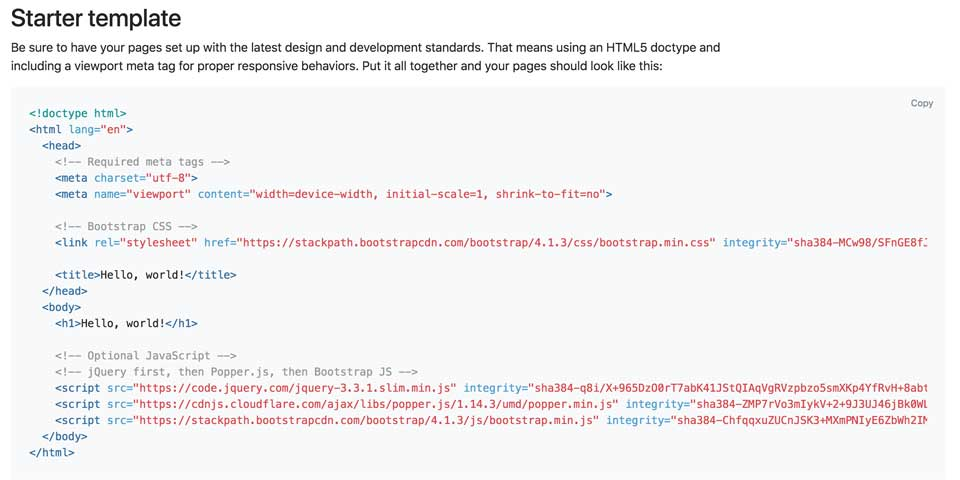
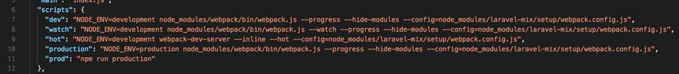
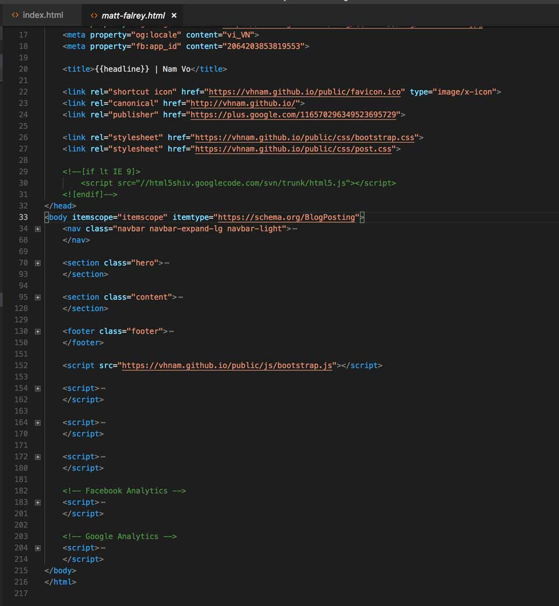

Phần này, tớ sẽ chia sẻ với các bạn cách tớ làm layout của blog.

- [Phần 1: Khởi động](https://vhnam.github.io/tutorials/lam-lai-blog-ca-nhan-1/)
- [Phần 2: Thiết kế giao diện](https://vhnam.github.io/tutorials/lam-lai-blog-ca-nhan-2/)
- [Phần 3: Quản lý cấu hình](https://vhnam.github.io/tutorials/lam-lai-blog-ca-nhan-3/)
- Phần 4: Bắt đầu với giao diện
- [Phần 5: Schema.org du hý](https://vhnam.github.io/tutorials/lam-lai-blog-ca-nhan-5/)
- [Phần 6: Metadata và các công cụ theo dõi hoạt động người dùng](https://vhnam.github.io/tutorials/lam-lai-blog-ca-nhan-6/)
- [Phần 7: Template Engine](https://vhnam.github.io/tutorials/lam-lai-blog-ca-nhan-7/)
- [Phần 8: Deployment](https://vhnam.github.io/tutorials/lam-lai-blog-ca-nhan-8/)

## Bắt đầu với khung sườn

Đầu tiên, tớ sẽ vào trang của Bootstrap để lấy phần khung sườn của website. Bạn vào địa chỉ [https://getbootstrap.com/docs/4.1/getting-started/introduction/](https://getbootstrap.com/docs/4.1/getting-started/introduction/), kéo tới mục **Starter Template** và chép vào công cụ soạn thảo. Ở đây, tớ dùng [Visual Studio Code](https://code.visualstudio.com/) để lập trình do nó có tích hợp terminal thay vì phải mở một cửa sổ terminal riêng.

Sau đó, tớ xoá đi các thẻ `link` và `script`. Do tớ không muốn gửi nhiều request để lấy resources nên sẽ nén resources vào một file CSS và JS. Mặc đầu biết load resources từ CDN vẫn nhanh.

Tiếp theo, tớ cầu hình scripts trong file **package.json** để chạy Laravel-Mix.

Tớ dùng [Laravel-Mix](https://github.com/JeffreyWay/laravel-mix) để build resources. Do đó, tớ cấu hình các file như sau.

- **bootstrap.css** - Nơi lưu trữ code CSS của Bootstrap và template.
- **bootstrap.js** - Nơi lưu trữ code JS của Bootstrap, jQuery, Axios và template.
- Các file CSS, JS còn lại lưu theo màn hình.

Để build resources, bạn chỉ cần nhớ 2 lệnh sau đây.

- `npm run watch` - build code ở chế độ development, tự động re-build khi có thay đổi ở file gốc.
- `npm run prod` - build code ở chế độ production, có minify code.

Sau khi có file `bootstrap.css` và `bootstrap.js`. Bạn đặt lần lượt code CSS ở cuối thẻ `head` và JavaScript ở cuối thẻ `body`.

## Tiếp tục với Navigation Bar

Phần trên cùng của blog, tớ dùng để điều hướng đến tất cả các màn hình khác. Tớ vào vào trang chủ **Bootstrap**, chọn **Components**, chọn **Navbar** và copy code vào file HTML. Bạn có thể vào trực tiếp tại [https://getbootstrap.com/docs/4.1/components/navbar/](https://getbootstrap.com/docs/4.1/components/navbar/).

Tớ muốn Navbar màu trắng nên chọn thuộc tính là `navbar-light`, thay thế icon mặc định và thêm link đến các màn hình khác.

Tuy nhiên, để hiển thị tốt trên mobile và tablet, tớ có chỉnh lại một số chỗ. Bạn để ý class `navbar-expand-lg`, khi chiều ngang của thiết bị nhỏ hơn 768px thì tự động sẽ ẩn thanh điều hướng, chuỵển sang một nút vuông. Khi nhấn vào nút vuông sẽ ra một danh sách đường dẫn. Danh sách ấy được định nghĩa tại thẻ `ul` kết hợp với class `navbar-collapse`. Tuy nhiên, để biết sự kiện nhấn vào nút thì ẩn hiện danh sách, ta cần định nghĩa **id** cho danh sách và thuộc tính `data-taget`, `aria-controls` tại nút phải cùng tên với nhau. Bạn xem dòng 6 và 9 tại snippet phía trên.

Để ra được phần popup giống như của tớ, các bạn cần phải chỉnh CSS một tí nhé. Lúc này sẽ cần một chút kiến thức về [Media Query](https://www.w3.org/TR/css3-mediaqueries/).

## Vài lời nhắn gửi

Tớ đã làm xong phần khó của giao diện rồi. Đến đây, các bạn có thể nhìn hình và code theo. Nếu không bắt chước được cũng không sao. Các bạn có thể tham khảo code tại [https://github.com/vhnam/vhnam.github.io/blame/master/src/template/matt-falrey.html](https://github.com/vhnam/vhnam.github.io/blame/master/src/template/matt-falrey.html).
