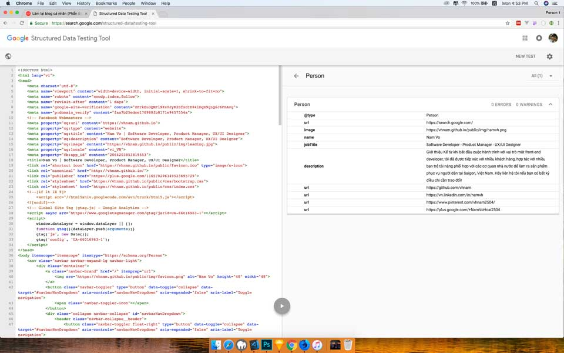
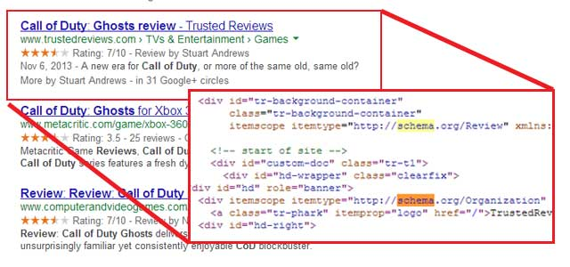

Phần này tớ sẽ gắn Schema.org để hỗ trợ cho bot của các công cụ tìm kiếm.

- [Phần 1: Khởi động](https://vhnam.github.io/tutorials/lam-lai-blog-ca-nhan-1/)
- [Phần 2: Thiết kế giao diện](https://vhnam.github.io/tutorials/lam-lai-blog-ca-nhan-2/)
- [Phần 3: Quản lý cấu hình](https://vhnam.github.io/tutorials/lam-lai-blog-ca-nhan-3/)
- [Phần 4: Bắt đầu với giao diện](https://vhnam.github.io/tutorials/lam-lai-blog-ca-nhan-4/)
- Phần 5: Schema.org du hý
- [Phần 6: Metadata và các công cụ theo dõi hoạt động người dùng](https://vhnam.github.io/tutorials/lam-lai-blog-ca-nhan-6/)
- [Phần 7: Template Engine](https://vhnam.github.io/tutorials/lam-lai-blog-ca-nhan-7/)
- [Phần 8: Deployment](https://vhnam.github.io/tutorials/lam-lai-blog-ca-nhan-8/)


## Schema.org là gì

Schema.org là một trang đánh dấu cho dữ liệu có cấu trúc do Google, Microsoft, Yahoo và Yandex phát triển. Mục đích chính là tạo ra một trang đánh dấu dữ liệu có cấu trúc để tất cả các công cụ tìm kiếm đều có thể hiểu được.

Dưới đây là minh hoạ về dữ liệu cấu trúc của Schema.org. Ta có một đoạn code HTML để giới thiệu bộ phim.

<div>
  <h1>Avatar</h1>
  <span>Director: James Cameron (born August 16, 1954)</span>
  <span>Science fiction</span>
  <a href="../movies/avatar-theatrical-trailer.html">Trailer</a>
</div>

Sau khi thêm Schema.org sẽ trở thành như sau.

```html
<div itemscope itemtype="http://schema.org/Movie">
  <h1 itemprop="name">Avatar</h1>
  <div **itemprop="director" itemscope itemtype="http://schema.org/Person" **\>
    Director: <span itemprop="name">James Cameron</span> (born
    <span **itemprop="birthDate" **\>August 16, 1954</span>)
  </div>
  <span itemprop="genre">Science fiction</span>
  <a href="../movies/avatar-theatrical-trailer.html" itemprop="trailer"
    >Trailer</a
  >
</div>
```

Schema.org cung cấp một kho từ vựng để mọi người tra cứu sử dụng theo từng chủ đề. Bạn có thể tham khảo kho từ vựng đó tại [https://schema.org/docs/full.html](https://schema.org/docs/full.html).

## Lợi ích của Schema.org

Như đã nói, Schema.org là một cấu trúc để các công cụ tìm kiếm như Google, Bing có thể hiểu được. Tớ sẽ cho các bạn xem trang chủ sau khi áp dụng cấu trúc Schema.org vào. Tớ dùng **Structured Data Testing Tool** tại địa chỉ [https://search.google.com/structured-data/testing-tool](https://search.google.com/structured-data/testing-tool).



## Cách sử dụng

Tớ sẽ ví dụ với schema là **Person**. Đầu tiên, ta vào địa chỉ [https://schema.org/Person](https://schema.org/Person). Mỗi một bộ từ vựng sẽ có 3 phần chính là.

- Danh sách thuộc tính của đối tượng, kiểu dữ liệu và định nghĩa để biết khi nào sử dụng.
- Danh sách thuộc tính là thể hiện của đối tượng ở đối tượng khác. VD: `actor`, `author`, `composer` là thể hiện của Person.
- Ví dụ mẫu khi chưa sử dụng, đã sử dụng dưới dạng microdata, RFDa và JSON-LD.

Tớ sử dụng Schema.org dưới dạng microdata để dễ kiểm soát.



## Tổng kết

Sử dụng Schema.org kết hợp với một số semantic tag của HTML5 sẽ giúp các công cụ tìm kiếm hiểu được nội dung trang web của bạn. Nhằm tăng thứ hạng trên công cụ tìm kiếm. Đây là một cách SEO bằng code. Ngoài ra, còn một cách SEO nữa là sử dụng **metadata** sẽ được trình bày ở một bài viết khác.

## Tham khảo

- JPWEB, [Dữ Liệu có cấu trúc Schema.org](https://www.jpwebseo.com/du-lieu-co-cau-truc-schema)
