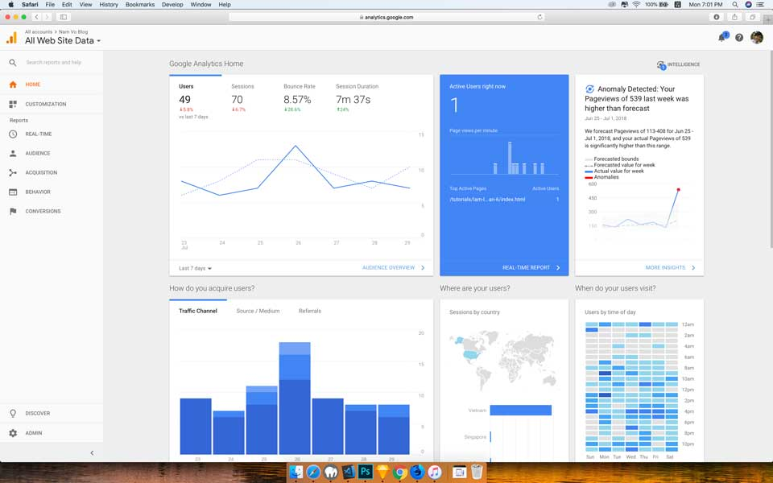
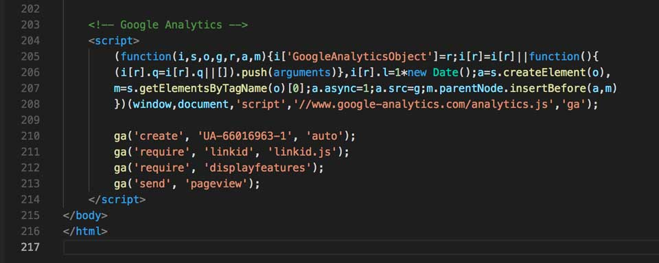
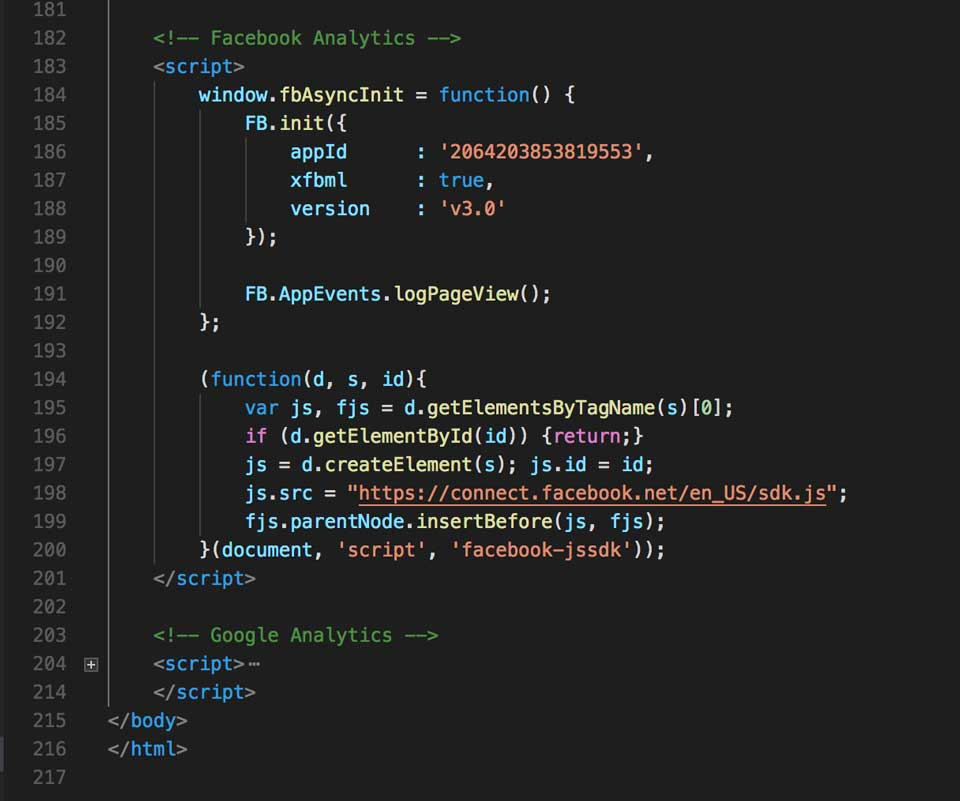
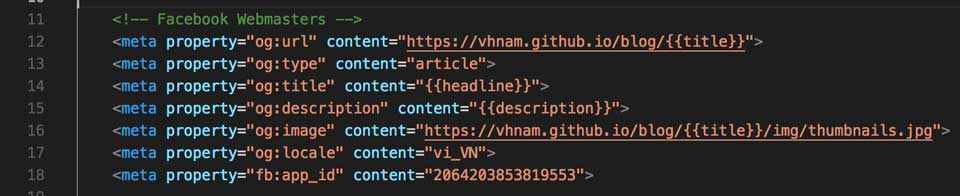

Các bạn có bao giờ muốn biết trang web của mình có bao nhiêu lượt truy cập theo thời gian không? Có muốn biến người dùng đến từ đâu, độ tuổi, giới tính chứ nè? Tớ cũng vậy. Để làm được điều đó, tớ sử dụng [Google Analytics](https://marketingplatform.google.com/about/analytics/). Gần đây mới biết [Facebook Webmaster](https://developers.facebook.com/docs/sharing/webmasters/), [Facebook Analytics](https://analytics.facebook.com/) nên xài thử như thế nào.

- [Phần 1: Khởi động](https://vhnam.github.io/tutorials/lam-lai-blog-ca-nhan-1/)
- [Phần 2: Thiết kế giao diện](https://vhnam.github.io/tutorials/lam-lai-blog-ca-nhan-2/)
- [Phần 3: Quản lý cấu hình](https://vhnam.github.io/tutorials/lam-lai-blog-ca-nhan-3/)
- [Phần 4: Bắt đầu với giao diện](https://vhnam.github.io/tutorials/lam-lai-blog-ca-nhan-4/)
- [Phần 5: Schema.org du hý](https://vhnam.github.io/tutorials/lam-lai-blog-ca-nhan-5/)
- \>Phần 6: Metadata và các công cụ theo dõi hoạt động người dùng
- [Phần 7: Template Engine](https://vhnam.github.io/tutorials/lam-lai-blog-ca-nhan-7/)
- [Phần 8: Deployment](https://vhnam.github.io/tutorials/lam-lai-blog-ca-nhan-8/)

## Tại sao metadata lại xuất hiện ở đây?

**Metadata** là một phần của tiêu chuẩn HTML do WHATWG đề xuất và được sử dụng để lồng siêu dữ liệu trong nội dung hiện có của các trang web. Search Engine, Web Crawler và trình duyệt có thể trích xuất, xử lý dữ liệu nhằm đem lại trải nghiệm phong phú, thông tin hữu ích hơn cho người dùng.

Metadata của một trang web xuất hiện ở 2 dạng.

- Một nhóm các cặp **key-value** được định nghĩa trong một **itemscope**. Có thể được nhúng trực tiếp trong code HTML như ở phần 5 tớ đã trình bày hoặc RDFa, JSON-LD.
- Metadata được khai báo trong thẻ `<meta>` được khai báo trong cặp thẻ `<head>`.

Ở phần này, tớ sẽ nói về loại thứ 2. Để kích hoạt Google Analytics và Facebook Webmaster đều dùng thông tin metadata trong thẻ `<meta>`.

## Google Analytics

Hiện nay, Google Analytics được tích hợp vào [Google Markerting Platform](https://marketingplatform.google.com/about/) thay vì **Google Analytics 360 Suite**. Đây là công cụ theo dõi hoạt động của người dùng phổ biến, đơn giản và trực quan.

Google Analytics cho phép chúng ta biết được một số thông tin cơ bản như:

- Lượng người dùng theo thời gian thực, theo khoảng thời gian
- Thông tin người dùng như giởi tính, độ tuổi, hệ điều hành, thiết bị, nơi ở, thời gian sử dụng trung bình,...
- Hành vi của người dùng như sự kiện, luồng tương tác,...

Trước tiên, bạn đăng ký sử dụng Google Analytics và cấu hình như hướng dẫn tại [https://support.google.com/analytics/answer/1008015](https://support.google.com/analytics/answer/1008015). Đoạn code cấu hình trên web, tớ đặt ở trước khi đóng thẻ `<body>`.

## Facebook Analytics

Facebook Analytics cũng tương tự Google Analytics, cho phép chúng ta biết được lượng người dùng, hành vi của họ trên trang web của ta. Theo như quảng cáo thì Facebook Analytics tập trung vào theo dõi hành vi người dung hơn là các thông số về thiết bị mà người dùng sử dụng. Bạn có thể biết thêm chi tiết ở một link sau.

- Adstage, [5 Ways Facebook Analytics Beats Google Analytics](https://blog.adstage.io/2018/03/01/facebook-analytics-beats-google-analytics)
- Smartly, [Facebook vs. Google Analytics - Conversion Tracking and Attribution Models](https://www.smartly.io/blog/facebook-vs-google-analytics-deep-dive-into-conversion-tracking-and-attribution-models)

Để sử dụng, bạn làm theo hướng dẫn tại [https://adespresso.com/blog/facebook-analytics/](https://adespresso.com/blog/facebook-analytics/). Đoạn code cấu hình, tớ đặt ở trước khi đóng thẻ `<body>`.

Có lưu ý cho các bạn một tí, để kích hoạt được dashboard của Facebook Analytics. Các bạn phải có trang **Chính Sách Bảo Mật** thì Facebook mới cho phép cho chúng ta sử dụng. Do đó, nếu bạn bạn xem trong thiết kế ban đầu của tớ, sẽ không thấy thanh màu đen ở phía dưới foooter.

## Facebook Webmaster

Khi tở chia sẻ link bài viết lên Facebook, tớ muốn ẩn link, chỉ hiện mô tả và hình đại diện đã cấu hình cho bài viết như hình phía dưới. Để làm được như vậy, bạn chỉ cần cấu hình Facebook Webmaster là được.

Phần cấu hình của Facebook Webmaster nằm ở phần metadata trong phần thể `<head>`.Bạn có thể làm theo hướng dẫn tại [https://developers.facebook.com/docs/sharing/webmasters/](https://developers.facebook.com/docs/sharing/webmasters/).

## Tổng kết

Tớ đã giới thiệu đến các bạn những công cụ theo dõi đang được gắn tại blog. Còn việc khai thác chúng như thế nào, tớ xin hẹn một chủ đề khác nhé. Phần tiếp theo sẽ là phần hay ho nhất trong công việc làm lại blog lần này của tớ.

## Tham khảo

- Mozilla, [Microdata](https://developer.mozilla.org/en-US/docs/Web/HTML/Microdata)
- Google Analytics Solutions, [New brand, new home: Where to find Google Marketing Platform online](https://analytics.googleblog.com/2018/07/new-brand-new-home-mktg.html)
- Facebook Developer, [A Guide to Sharing for Webmasters](https://developers.facebook.com/docs/sharing/webmasters/)
