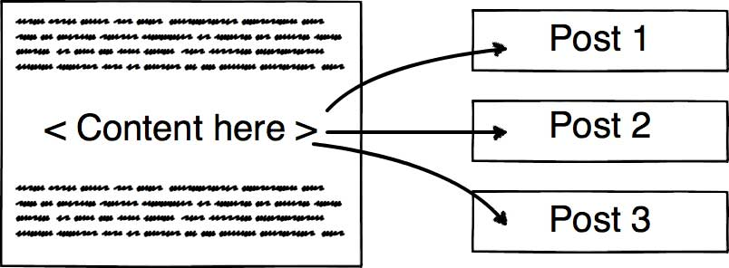

Phần này sẽ nói về cách tớ viết một bài mới như thế nào.

- [Phần 1: Khởi động](https://vhnam.github.io/tutorials/lam-lai-blog-ca-nhan-1/)
- [Phần 2: Thiết kế giao diện](https://vhnam.github.io/tutorials/lam-lai-blog-ca-nhan-2/)
- [Phần 3: Quản lý cấu hình](https://vhnam.github.io/tutorials/lam-lai-blog-ca-nhan-3/)
- [Phần 4: Bắt đầu với giao diện](https://vhnam.github.io/tutorials/lam-lai-blog-ca-nhan-4/)
- [Phần 5: Schema.org du hý](https://vhnam.github.io/tutorials/lam-lai-blog-ca-nhan-5/)
- [Phần 6: Metadata và các công cụ theo dõi hoạt động người dùng](https://vhnam.github.io/tutorials/lam-lai-blog-ca-nhan-6/)
- Phần 7: Template Engine
- [Phần 8: Deployment](https://vhnam.github.io/tutorials/lam-lai-blog-ca-nhan-8/)

## Cách truyền thống

Tớ viết bài trực tiếp bằng mã nguồn HTML luôn, không sử dụng bất cứ công cụ soạn thảo nào để sinh ra code cả. Bạn không tin thì có thể vào link [này](https://github.com/vhnam/vhnam.github.io/commit/3deac8547dfb264e8a1e9fe468f8e17dd9c20bd2) để xem.

Lúc đó có khá nhiều thứ phải làm thủ công cấu hình như `<metadata>`, thời gian và viết bài. Lúc đó tớ nghĩ static web nên hổng có công cụ phát sinh code tự động. Hic, nghĩ lại thấy đúng là gà thiệt.

Thực ra là nào giờ, GitHub Pages có dùng công cụ tên là [Jekyll](https://jekyllrb.com) được viết bằng Ruby để tạo ra một trang web tĩnh. Thời điểm tạo blog là còn đi học nên cũng ngại học cái mới (do chạy đồ án hơi nhiều). Sau này, khi blog lên version 2.0 tức là bản xài template cũ màu xanh dương (bạn xem lại [phần 1](https://vhnam.github.io/tutorials/lam-lai-blog-ca-nhan-1/)) thì vẫn còn thích tự viết code.

## Đổi mới suy nghĩ

Sau này đi làm công ty, sếp thích xài Python để xử lý công việc và cũng nhớ lại ông anh hồi xưa nói Python mạnh về xử lý văn bản nên nảy sinh ý tưởng viết template engine. **Template Engine** cũng chả có gì to tát cả, hiểu đơn giản là có một template, điền vào chỗ trống theo cấu trúc đã được khai báo sẵn, cách sử dụng giống như bạn dùng [Blade](https://laravel.com/docs/5.6/blade), [Pug](https://github.com/pugjs/pug), [Handlebar](https://github.com/ericf/express-handlebars). Tư tưởng được thể hiện như hình dưới đây.

## Cơ chế hoạt động

Sơ đồ hoạt động được tóm gọn trong Activity Diagram dưới đây.

Bạn xem qua mã nguồn file template của tớ. Có những chỗ đặt trong cặp ngoặc nhọn `{{ }}` chính là nơi sẽ điền nội dung. Mỗi bài viết của tớ đều có 1 file `config.json` để lưu thông tin như tiêu đề, mô tả và file `index.html` sẽ lưu nội dung bài viết rồi đổ vào file template. Đơn giản chứ nè. Cuối cùng thì gõ lệnh để build ra file hoàn chỉnh. Tớ có quay video lại để mọi người theo dõi.

## Tính mở rộng

> Your talent is limited by your imagination
>
> \- Unknown

Để mở rộng template engine này, tớ dự định sẽ học hỏi Jekyll ở chỗ tạo một web application tại localhost, có Text Editor để soạn thảo văn bản trực tiếp trên web, không cần phải mở Visual Studio Code hay Sublime Text gì cả. Khi viết xong, điền phần mô tả, nhấn nút **Publish** sẽ tự động phát sinh file HTML theo đường dẫn đã cấu hình trước.
