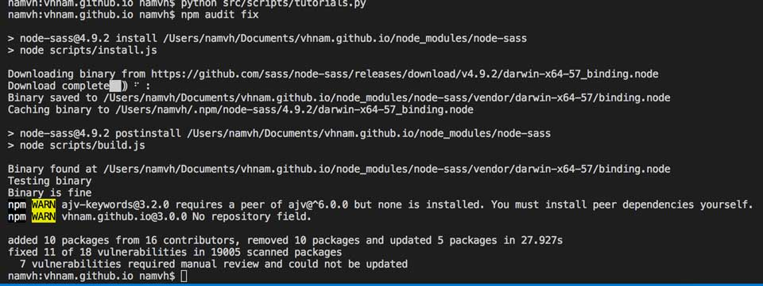

Sẽ có nhiều cách để bạn đẩy code lên server. Trong phạm vi bài viết này, tớ sẽ chia sẻ cách làm trên blog của mình.

- [Phần 1: Khởi động](https://vhnam.github.io/tutorials/lam-lai-blog-ca-nhan-1/)
- [Phần 2: Thiết kế giao diện](https://vhnam.github.io/tutorials/lam-lai-blog-ca-nhan-2/)
- [Phần 3: Quản lý cấu hình](https://vhnam.github.io/tutorials/lam-lai-blog-ca-nhan-3/)
- [Phần 4: Bắt đầu với giao diện](https://vhnam.github.io/tutorials/lam-lai-blog-ca-nhan-4/)
- [Phần 5: Schema.org du hý](https://vhnam.github.io/tutorials/lam-lai-blog-ca-nhan-5/)
- [Phần 6: Metadata và các công cụ theo dõi hoạt động người dùng](https://vhnam.github.io/tutorials/lam-lai-blog-ca-nhan-6/)
- [Phần 7: Template Engine](https://vhnam.github.io/tutorials/lam-lai-blog-ca-nhan-7/)
- Phần 8: Deployment

## Chọn nơi để làm server

Hiện tại có nhiều dịch vụ để bạn lưu trữ code và host static web của mình.

- **Host trả tiền**. Trả tiền để có server riêng, nhưng thường là một phần vùng được quản lý bằng CPanel.
- **Free host**. Cách này cũng kinh tế, nhưng khổ nỗi domain khá xấu xí và có thời hạn sử dụng. Phải mua thêm tên miền trỏ vào.
- **Thuê VPS**. Cách này hơi tốn kém nhưng ngoài static web, bạn tha hồ vọc.

Cách của mình thì dùng GitHub Pages. Chỉ tạo repository trên GitHub với tên repo tương ứng với cấu trúc `<tên tài khoản>.github.io` là được.

## Cách publish mã nguồn

Nếu bạn dùng VPS, host thuê thì phải giao tiếp với server bằng giao thức FTP (port 21). Nếu muốn bảo mật hơn thì dùng giao thức SSH/SFTP (port 22). Tớ gợi ý là bạn dùng [FileZilla](https://filezilla-project.org/).

Còn một cách khác, cũng là cách tớ đang làm là dùng **Git** để chuyển file lên server. Bạn có thể xem chi tiết tại [Git 101 With Emma Jane Westby (ADO24)](https://www.arresteddevops.com/git-101/).

## Potential security vulnerability defined in package-lock.json

Ở blog của tớ phát sinh một lỗi phiên bản cũ với dependency của một số package.

Để sửa lỗi này, bạn chỉ cần gõ lệnh `npm audit fix` là xong.

## Tổng kết

Seri **"Làm lại blog cá nhân"** của tớ đến đây là kết thúc. Nội dung là để tóm tắt lại quá trình tớ đã làm blog như thế nào để mọi người hình dung được công việc. Để đi sâu vào chi tiết, các bạn có thể dựa vào từng đầu mục, tìm trên Internet thông tin chi tiết để làm từng bước. Nếu cảm thấy khó quá, các bạn có thể tải mã nguồn tại [https://github.com/vhnam/vhnam.github.io](https://github.com/vhnam/vhnam.github.io) để tham khảo nhé. Chúc các bạn thành công.

## Tham khảo

- StackOverflow, [Proper way to fix potential security vulnerability in a dependency defined in package-lock.json](https://stackoverflow.com/questions/49582891/proper-way-to-fix-potential-security-vulnerability-in-a-dependency-defined-in-pa)
