Sau một thời gian dài loay hoay với template engine nhà trồng bằng Python, mình mới biết là mấy thư viện xài [Python 2](https://www.python.org/doc/sunset-python-2/) bị ngưng hỗ trợ và không thể cài lên laptop mới được. Nó yêu cầu Python 3 và cũng thay đổi rất nhiều. Sau khi ngẫm nghĩ thì mình cũng nên tìm đồ có sẵn hỗ trợ định dạng Markdown để có thể thay đổi sau này.

## Những thứ mình cần

- Hỗ trợ Markdown
- Giữ lại các đường dẫn cũ để tiếp tục SEO (`/tutorials/:slug`, `/blog/:slug`)
- Hỗ trợ Static Site Generation (SSG)
- Cho phép tùy chỉnh UI dễ dàng theo ý muốn

### Markdown

Hồi 2018, lúc đó mình không muốn xài [Jekyll](https://jekyllrb.com) nữa vì phải cài [Ruby](https://www.ruby-lang.org/) rồi vài thứ khác cũng hơi phiền. Các bạn có thể coi lại series ["Làm lại blog cá nhân"](/tutorials/lam-lai-blog-ca-nhan-1/) của mình.
Khoảng 2019 thì [Gatsby](https://www.gatsbyjs.com) có vẻ nổi và nó kéo theo việc dùng Markdown để viết blog.

Trước đây, [Markdown](https://www.markdownguide.org/) rất tiện để viết document, cụ thể là mấy file [README.md](https://docs.github.com/en/repositories/managing-your-repositorys-settings-and-features/customizing-your-repository/about-readmes) trên GitHub. Nhờ Gatsby thì Markdown có thể nhúng code [JSX](https://react.dev/learn/writing-markup-with-jsx) vào trong với định dạng [MDX](https://mdxjs.com/) trở nên phổ biến hơn (hoặc ngược lại).

Nói chung thì đổi qua Markdown là một sự cần thiết lúc này với mình.

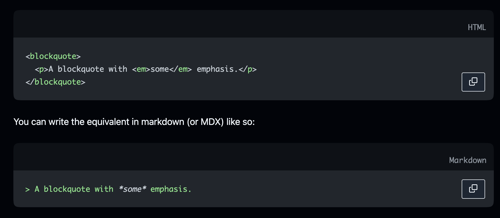

### Giữ lại URL

Blog này mình tạo hồi 2014 rồi, cũng có traffic lèo tèo và mình muốn quan sát nó giống thoi thóp từng ngày như thế nào nên việc giữ URL khá quan trọng. Nhằm để biết được mọi người quan tâm gì ở blog của mình.

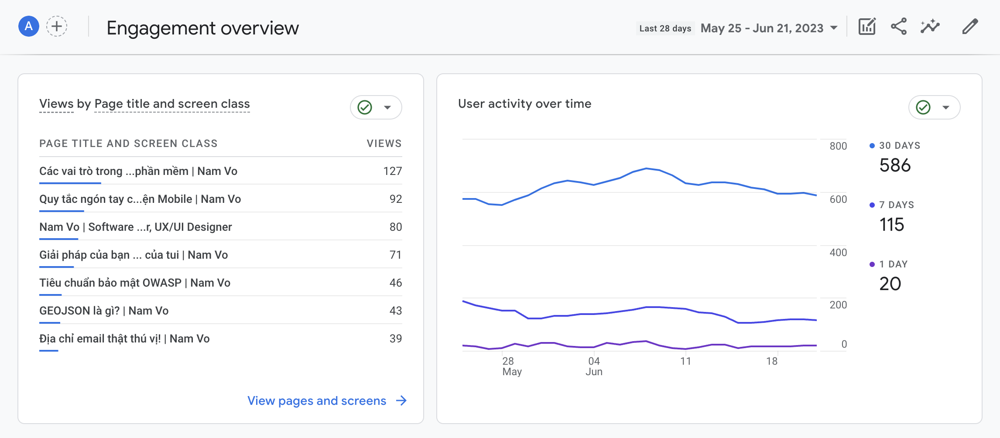

### Static Site Generation (SSG)

Từ ngày chuyển từ full-stack PHP ([Laravel](https://laravel.com/)) sang hẳn front-end với [ReactJS](https://react.dev/) thì mình quen với [Client Side Rendering](https://web.dev/rendering-on-the-web/#client-side-rendering) để làm [Single Page Application](https://developer.mozilla.org/en-US/docs/Glossary/SPA). Như vậy thì mình không thể nào SEO được trang web.

Trong các giải pháp hiện có thì [Server Side Rendering](https://web.dev/rendering-on-the-web/#server-side-rendering) cần server để chạy. Như vậy chỉ còn mỗi [Static Site Generation](https://web.dev/rendering-on-the-web/#static-rendering) là phù hợp. Vì mình muốn viết ở local rồi push HTML/JavaScript/CSS thẳng lên GitHub Pages.

À, giải pháp lai giữa SSR và SSG cũng bỏ luôn nhé, cơ bản thì nó cũng cần server.

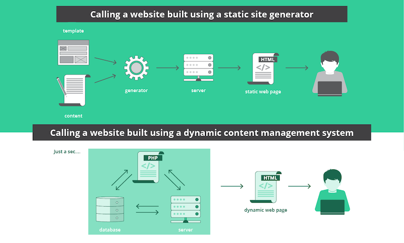

### Tùy chỉnh UI dễ dàng

Ban đầu có thể sử dụng template mặc định, và mình sẽ chỉnh sửa lại để phù hợp với nội dung cần truyền tải. Có một số giải pháp đã thử qua, nó không cho can thiệp vào component UI mặc định. Nên việc này cũng khá là quan trọng.

## Các giải pháp đã thử

### Nextra

[Nextra](https://nextra.site/) là một thư viện hỗ trợ SSG xây dựng dựa trên [NextJS](https://nextjs.org/). Nhìn thì giao diện cũng khá là ngầu lòi và hỗ trợ giữ lại URL, để thử.

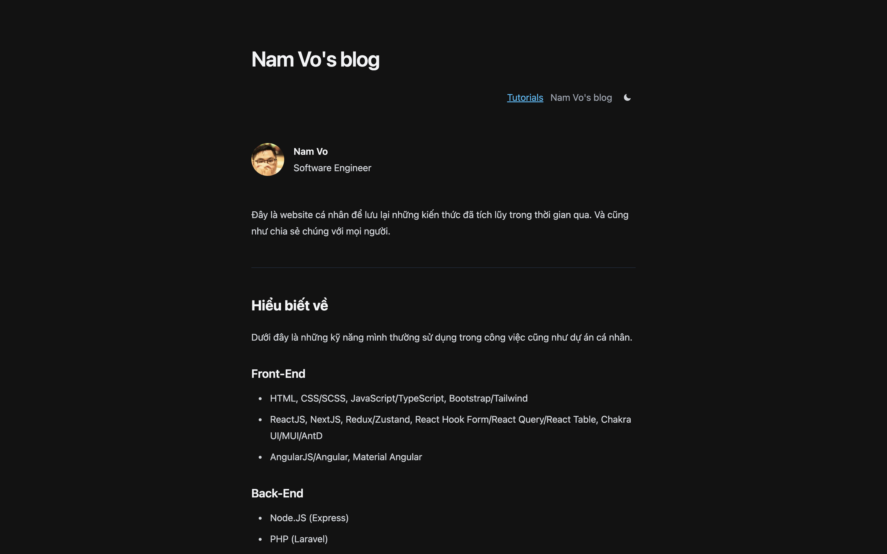

Nextra có hỗ trợ 2 template là [Docs Theme](https://nextra.site/docs/docs-theme/start) và [Blog Theme](https://nextra.site/docs/blog-theme/start). Tuy nhiên, mình cần Blog Theme hỗ trợ Mục lục (Table of Contents/TOC) và Navigate ở cuối mỗi bài viết thì chỉ mỗi Docs Theme có thôi. Ngoài ra, phần Navigation ở header không thể thay đổi label, không hỗ trợ nút Back ở từng bài viết. Nếu làm theo hướng dẫn để hiện nút Back thì danh sách bài viết không hiện custom UI được o_0.

Mình có thử làm theo hướng dẫn custom rồi lấy code của Nextra chế cháo lại thử. Kết quả là nó dùng [tsup](https://github.com/egoist/tsup) để compile TypeScript và có cấu hình tào lao gì đó, mình xài `Context.Provider` của React không được.

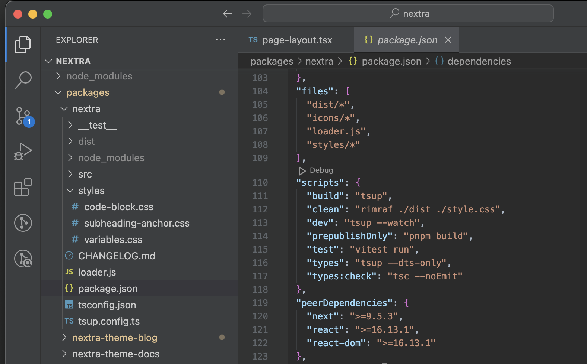

Thôi, chia tay Nextra.

### Gatsby

[Gatsby](https://www.gatsbyjs.com) là một lựa chọn khác. Mình thấy [Dan Abramov](https://overreacted.io/) dùng cho blog của ổng thấy cũng khá ổn và đơn giản nên đu theo.

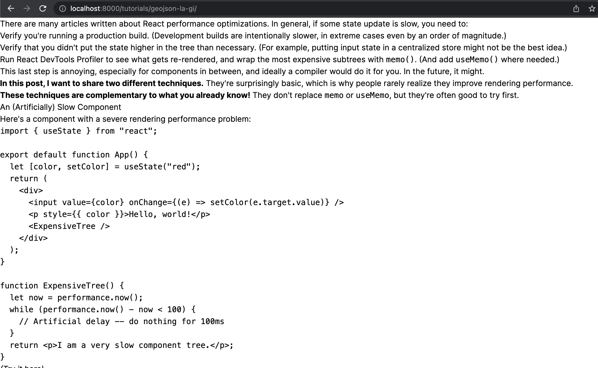

Với cách viết bình thường nhất có thể thì `/tutorials/:slug` không nhận `PostLayout`. Để làm được thì phải viết code ở `gatsby-node.js` khá lằng nhằng mới hiểu. Nên thôi, bỏ. Bạn có thể tham khảo ở [đây](https://github.com/gndplayground/blog/blob/main/gatsby-node.js).

Ngoài ra, Gatsby làm gì đó để [GraphQL](https://www.gatsbyjs.com/docs/graphql/) đọc hiểu danh sách và nội dung bài viết. Rườm rà quá, dẹp luôn.

## Tại sao lại là Astro?

Không nhớ luôn. Chỉ nhớ là sửa lỗi của Nextra hoài không được nên lướt diễn đàn nào đó. Sau đó thấy có vài comment gợi ý [Astro](https://astro.build/) nên thử thôi.

Làm thử theo hướng dẫn thì phần [Development Experience](https://www.getclockwise.com/blog/what-is-developer-experience) cũng khá là ổn áp. Không phải tự code phần back-end quá nhiều như Gatsby, thoải mái chỉnh giao diện hơn nhiều.

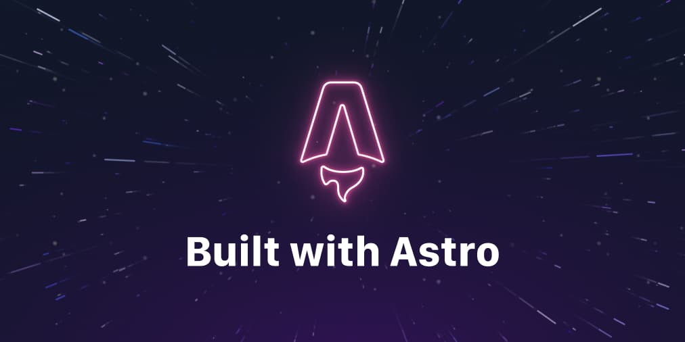

## Các bước đã làm

### Học cú pháp Astro

Các trang ở folder `pages` sẽ viết với đuôi `.astro`. Do đó các bạn tham khảo link [này](https://docs.astro.build/en/core-concepts/astro-syntax/) để biết cú pháp.

Về cơ bản, file `*.astro` chỉ là quy định viết code như thế nào, phần nào sẽ viết code JSX, phần nào viết code HTML/CSS/JavaScript. Nếu bạn có đọc qua file `*.vue` thì sẽ dễ làm quen.

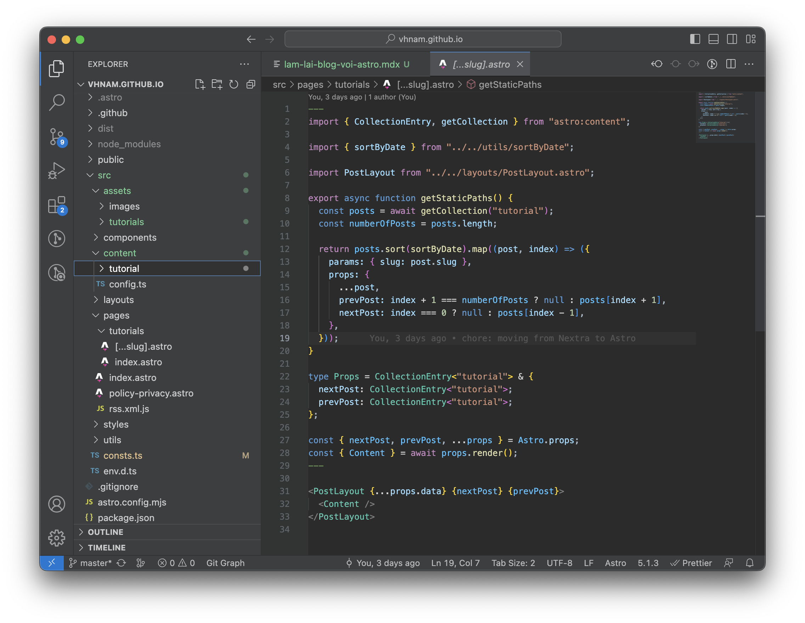

### Component cơ bản

Tiếp đến, các bạn coi cách viết component của Astro tại [đây](https://docs.astro.build/en/core-concepts/astro-components).

Lưu ý là nên coi kỹ cách sử dụng `<slot />` vì nó giống như `children` trong [React](https://react.dev/learn/passing-props-to-a-component#passing-jsx-as-children), `<Outlet/>` trong [React Router](https://reactrouter.com/en/main/components/outlet) hoặc là `<router-outlet />` của [Angular](https://angular.io/api/router/RouterOutlet). Mục đích là để làm layout.

```jsx
---
import Header from './Header.astro';
import Logo from './Logo.astro';
import Footer from './Footer.astro';

const { title } = Astro.props
---

<div id="content-wrapper">
  <Header />
  <Logo />
  <h1>{title}</h1>
  <slot />  <!-- children will go here -->
  <Footer />
</div>
```

### Layout

Bạn đọc cách tạo một Layout component tại [đây](https://docs.astro.build/en/core-concepts/layouts/). Đọc để biết cách nhận `Props` giữa layout và bài viết.

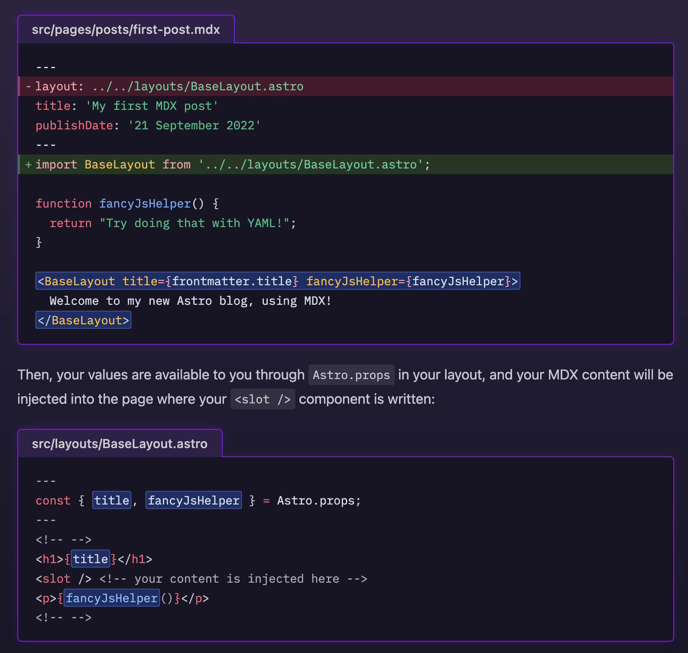

### Cách sử dụng hình ảnh

Làm mấy vụ SSG phải tính kỹ `assets` để ở đâu để dễ dàng chèn hình khi code, chạy được trên Production, vừa dễ dàng quản lý để tăng DX.

Mặc định thì bạn sẽ lưu hình ở trong thư mục `/public` theo [hướng dẫn](https://docs.astro.build/en/guides/images/). Tuy nhiên, mình sử dụng chức năng [Assets](https://docs.astro.build/en/guides/assets/) và nó vẫn còn đang thử nghiệm. Cứ dùng trước để lỡ có chốt kèo thì đỡ phải đổi.

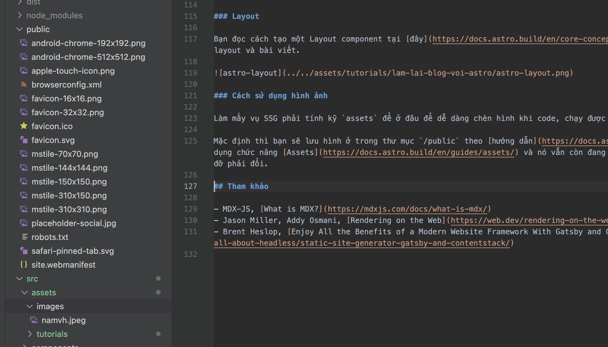

### UI Framework

Nếu các bạn muốn viết code [React](https://react.dev/), [Preact](https://preactjs.com/), [Svelte](https://svelte.dev/), [Vue](https://vuejs.org/), [SolidJS](https://www.solidjs.com/), [AlpineJS](https://alpinejs.dev/) hoặc [Lit](https://lit.dev/) thì có thể tham khảo hướng dẫn tại [đây](https://docs.astro.build/en/core-concepts/framework-components/).

Theo hướng dẫn thì bạn chỉ việc cài plugin và xài bao nhiêu thứ cũng được. Mình thì không xài.

```jsx
---
// Example: hydrating framework components in the browser.
import InteractiveButton from '../components/InteractiveButton.jsx';
import InteractiveCounter from '../components/InteractiveCounter.jsx';
import InteractiveModal from "../components/InteractiveModal.svelte"
---
<!-- This component's JS will begin importing when the page loads -->
<InteractiveButton client:load />

<!-- This component's JS will not be sent to the client until
the user scrolls down and the component is visible on the page -->
<InteractiveCounter client:visible />

<!-- This component won't render on the server, but will render on the client when the page loads -->
<InteractiveModal client:only="svelte" />
```

## Một số plugin hỗ trợ

Các bạn có thể vào https://astro.build/integrations/ để khám phá các plugin của Astro. Ở đây, mình chỉ giới thiệu một số plugin mình xài cho blog.

### @astrojs/partytown

[PartyTown](https://partytown.builder.io/) là plugin để lazy load các script và giúp nó chạy trong [Web Worker](https://developer.mozilla.org/en-US/docs/Web/API/Web_Workers_API) nhằm tách khỏi main thread, giúp cho website chạy nhanh hơn.

Mình dùng PartyTown theo [hướng dẫn](https://docs.astro.build/en/guides/integrations-guide/partytown/) để load script của Google Analytics.

```js
<script
  async
  type="text/partytown"
  src={`https://www.googletagmanager.com/gtag/js?id=${GA_MEASUREMENT_ID}`}
></script>

<script type="text/partytown" define:vars={{ GA_MEASUREMENT_ID }}>
  window.dataLayer = window.dataLayer || [];

  function gtag() {
    window.dataLayer.push(arguments);
  }
  gtag("js", new Date());
  gtag("config", GA_MEASUREMENT_ID);
</script>
```

**<ins>Lưu ý:</ins> Bạn phải tắt các chương trình chặn quảng cáo thì nó mới chạy nhé.**

### @astrojs/rss

Plugin này được cài mặc định khi bạn chọn template Blog, tham khảo hướng dẫn tại [đây](https://docs.astro.build/en/guides/rss/).

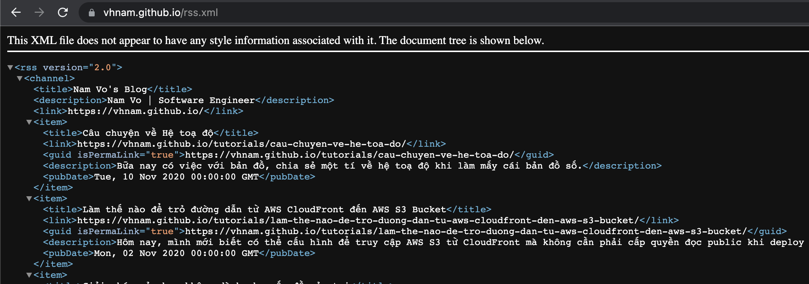

### @astrojs/sitemap

Plugin này cũng được cài mặc định, tham khảo hướng dẫn tại [đây](https://docs.astro.build/en/guides/integrations-guide/sitemap/).

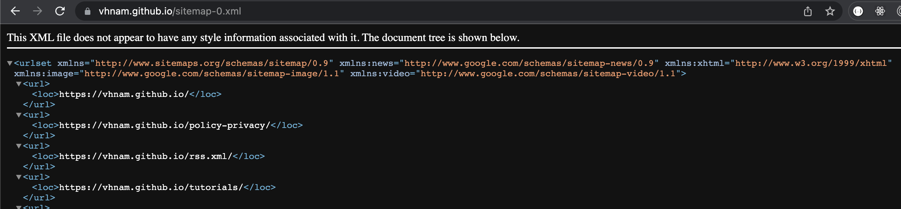

## Chốt

Astro cũng khá ổn để mình xài. Hy vọng nó không có quá nhiều breaking changes trong tương lai.

## Tham khảo

- MDX-JS, [What is MDX?](https://mdxjs.com/docs/what-is-mdx/)
- Jason Miller, Addy Osmani, [Rendering on the Web](https://web.dev/rendering-on-the-web)
- Brent Heslop, [Enjoy All the Benefits of a Modern Website Framework With Gatsby and Contentstack](https://www.contentstack.com/blog/all-about-headless/static-site-generator-gatsby-and-contentstack/)
