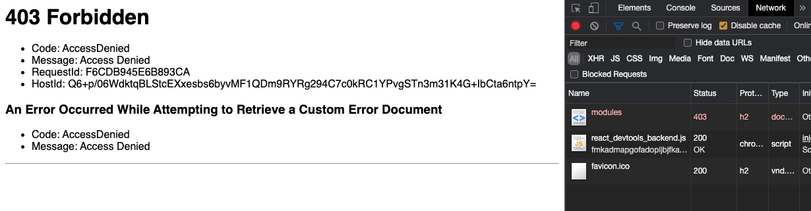

Hôm nay, sau buổi Knowledge Transfer, khách hàng yêu cầu chuyển từ [GitHub Actions](https://docs.github.com/en/free-pro-team@latest/actions) sang [AWS CodePipeline](https://aws.amazon.com/codepipeline/). Bữa nay có một thứ hay ho, mình mới học được nên viết lại đây.

## Vậy bình thường deploy thế nào?

Vẫn như mọi khi, các bước vẫn chỉ là các thao tác như hình bên dưới.

Và cho nên khi chuyển sang AWS CodePipeline, mình viết `BuildSpec` như sau.

Sau đó, mình phải vào AWS S3 tự tay chỉnh quyền **public** như hình.

Tiếp theo, mình có nhờ bạn BE chỉnh lại `BuildSpec` giúp ở dòng `aws s3 sync build/ s3://$BUCKET --acl public-read --delete` để public S3 ra ngoài.

Tuy nhiên bạn ấy hỏi sao phải public S3 ra. Có thể chỉnh CloudFront truy cập vào S3 private được mà. Và thế là cái tutorial này ra đời.

## Cách cấu hình

Đầu tiên, kiểm tra lại tình hình và ta có...

Hơi sai trái nhỉ? Giờ mình vào CloudFront, kiểm tra lại **Origin** của trang này như thế nào.

**Origin Type** đang là `Custom Origin`. Có lẽ chúng ta nên điều chỉnh nó lại một tí.

Chúng ta sẽ lần lượt điều chỉnh như sau

- **Restrict Bucket Access** chọn `Yes`.
- **Origin Access Identity** chọn `Create a New Identity`. Ta có thể chọn `Use an Existing Identity` vẫn được, nếu bạn đã có sẵn.
- **Grant Read Permissions on Bucket** chọn `Yes, Update Bucket Policy`.

Sau khi chọn **Yes, Edit** ở phần trên, bạn quay trở lại mục **General** để chờ trạng thái của **Distribution Status** từ `InProgress` chuyển sang `Deployed`.

Chúng ta nên quay lại trang web để kiểm tra tình hình.

Trời đụ! Vẫn bị `403`... nhưng mà nó khác lỗi ở trên rồi.

## Thử sai tiếp hay Từ bỏ?

## Và người có kinh nghiệm đã đến

Và anh ấy đã đến... đặt một giả thiết là truy cập được `/index.html` nhưng không được các đường dẫn khác của **react-router** đúng không?

Ơ_Ơ... đúng thiệt!

Vậy giờ ta chỉnh lại **Error Pages** của Origin lại một xíu.

Ta chọn **Create Custom Error Response**. Sau đó điền thông số như sau

- **HTTP Error Code** chọn `403: Forbidden`
- **Customize Error Response** chọn `Yes`
- **Response Page Path** nhập `/index.html`
- **HTTP Response Code** chọn `200: OK`

Sau đó, nhấn **Yes, Edit** và chờ cho trạng thái của **Distribution Status** từ `InProgress` chuyển sang `Deployed`.

Bingo!

## Tại sao vậy?

Ở đây, chúng ta sẽ có 2 vấn đề cần được giải thích

1.  Cấu hình làm sao chỉ có mỗi CloudFront truy cập được S3
2.  Tại sao phải cấu hình **Error Pages**?

### Cấu hình chỉ mỗi CloudFront truy cập được S3

Theo như document chính thức của Amazon Web Services S3, tại mục [Granting Permission to an Amazon CloudFront OAI](https://docs.aws.amazon.com/AmazonS3/latest/dev/example-bucket-policies.html#example-bucket-policies-cloudfront) . Để CloudFront truy cập được S3 thì ta phải dùng `Origin Access Identity` (OAI).

Chúng ta sẽ vào S3, chọn **Bucket** đã setup ở phía trên, vào mục **Permissions**, kéo xuống mục **Bucket Policy**, ta sẽ thấy được đoạn config như hình.

- **Màu đỏ:** ID của Origin Access Identity
- **Màu xanh:** tên của Bucket (`Amazon resource name (ARN)`)

**Lưu ý:** Nội dung ở đây sẽ được tự tạo nếu bạn chọn **Grant Read Permissions on Bucket** là `Yes, Update Bucket Policy` ở mục **Edit Origin**.

#### Origin Access Identity

Để xem được ID của OAI, bạn phải vào AWS CloudFront, ở sidebar bên trái, ở dưới mục **Security**, chọn **Origin access identity**.

Sau đó, ta sẽ copy giá trị của cột ID tương ứng và paste nó vào phần màu đỏ ở trên.

**Lưu ý:** Giá trị này sẽ được tự động tạo ra nếu bạn chọn `Create a New Identity` ở mục **Origin Access Identity** ở phần **Edit Origin**. Hoặc bạn tự tạo ở đây.

#### Amazon resource name (ARN)

Phần này bạn kéo lên phía trên của S3 Bucket sẽ thấy thôi.

### Tại sao phải cấu hình Error Pages?

Vì bạn đang vào một đường dẫn không hề tồn tại hoặc là không có quyền truy cập. Do đó, bạn phải trỏ nó về đường dẫn của `/index.html` để **react-router** hoạt động.

Điều này cũng tương tự như bạn phải tự cấu hình phần **Error** trong **Static website hosting** của AWS S3.

## Chốt

Cảm ơn Roy Chiu, anh Khoa Cù, anh Vũ Nguyễn đã hỗ trợ để có được bài viết này.
