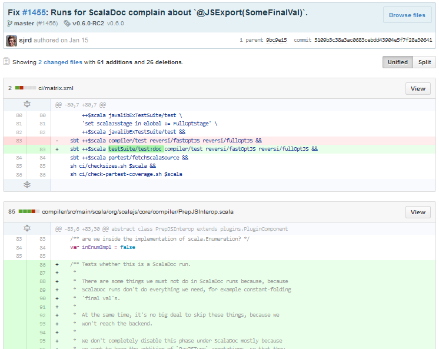

## Quản lý source code dễ dàng

Khi bạn tạo một repo, toàn bộ source code của repo đó được lưu trên GitHub. Tại đây, bạn có thể coi lại quá trình mình đã làm việc thông qua các comment sau mỗi lần commit. Và cái hay ở đây, là nhiều người có thể cùng làm một repo.

Lợi ích đầu tiên, chính là bạn biết được ai đã commit và commit cái gì. Chẳng hạn như hình dưới, **sjrd** đã thay đổi 2 file vào ngày 15 tháng 1, trên nhánh **master**, tại phiên bản release **v0.6.0-RC2** với comment là **"Fix #1455: Runs for ScalaDoc complain about \`@JSExport(SomeFinalVal)\`"**. Bạn kéo xuống, sẽ biết được anh chàng **sjrd** này đã thay đổi dòng nào, xóa dòng nào. Phần này liên quan tới cách làm việc với **Git**. Mình xin hẹn ở một bài viết khác.

Tiếp theo, source của bạn có thể phát triển theo nhiều nhánh. Ở hình dưới, ta thấy repo **scala-js** có 3 nhánh là **master**, **opt-tree-cmp** và **support-0.5**. Nguyên tắc làm việc với các nhánh như thế này: **Bạn có thể rẽ nhiều nhánh để phát triển project. Nhưng cuối cùng, bạn phải merge lại vào nhánh MASTER để ra được project hoàn chỉnh**.

## Đưa một project có giá trị đến cộng đồng

### Thông tin

Dựa vào thông tin trên, bạn có thể biết được project này đã được release bao nhiêu phiên bản, bao nhiêu người cùng phát triển. Nhìn vào số lần **commit**, bạn sẽ biết được thái độ làm việc của họ đối với project như thế nào?

Bạn có thấy góc trên phía bên phải chứ? **Star** thể hiện số rating mà cộng đồng đánh giá chất lượng project của bạn. Star càng nhiều, cộng đồng càng đánh giá cao. Và nếu project này có giá trị thì sẽ được nhiều người phát triển thêm, nhìn số lượng **Fork** sẽ thấy rõ điều này.

Và còn có thể biết được project này được viết bằng ngôn ngữ gì bằng cách nhấn vào thanh progress bar phía dưới thông tin commit/branches/releases/contributors sẽ thấy.

### README.md

Ngoài ra, một project có giá trị còn được thể hiện qua documentary đi kèm. Mình không đánh giá cao cách viết file **README.md** của **sjrd** (người viết ra scala-js). Mình mượn **README.md** của project **Angular.js** làm ví dụ.

File **README.md** giống như là phần giới thiệu bộ mặt của project. Bạn không gây ấn tượng tốt với người khác thì người khác sẽ không có thiện cảm với bạn, với project của bạn. Cách viết README thì tùy vào mỗi người, nhưng thường thì mình thấy mọi người đều viết cách cấu hình project, project có gì, giấy phép mã nguồn mở là gì.

Bạn có thấy dòng chữ **Build: Passing** ở README.md của Angular không? Khi bạn viết code, bạn phải test kỹ càng coi project có bị dính bug chỗ nào hay không. Ngoài Unit Test, cộng đồng trên GitHub còn sử dụng **Continuous Integration**. Trong các bước của Continuous Integration, có một bước là đưa lên server để test. Trên GitHub, họ thường dùng [https://travis-ci.com/](https://travis-ci.com/) để chạy test. Kết quả trên **Travis-ci** sẽ được trả về kết quả là **Passing**, **Error** hoặc **Failed** và hiển thị trên README.md. Nếu project của bạn được test trên travis-ci với trạng thái là PASSING, cộng đồng sẽ đánh giá rất cao.

### Wiki

Wiki chính là nơi bạn mô tả chi tiết về project của mình một cách rõ ràng.

## Đón nhận phản hồi từ cộng đồng

### Issue

Mỗi lần bạn có thắc mắc, ý kiến, báo lỗi bug,... thì bạn cứ vào phần **Issue**. Mọi người sẽ cùng nhau giải quyết vấn đề. Và mỗi issue nào đã được giải quyết, sẽ được close, còn không sẽ còn ở trên hàng chờ. Hình vào hình, ta thấy có tổng cộng 766 issues, trong đó còn 35 vấn đề chưa được giải quyết và 750 vấn đề đã giải quyết xong.

### Pull request

Giả sử bạn **Fork** repo của người khác về. Sau đó, bạn phát triển tiếp và nhận thấy phần mà bạn viết quá hay, cần phải có trên repo gốc. Bạn tạo một **Pull Request** để thảo luận với người/tổ chức quản lý repo gốc. Nếu họ đồng ý sẽ **merge** phiên bản của bạn vào repo gốc.

Minh họa tại chỗ, giả sử mình có sửa đồi code trong repo **JAVMarket** của thằng bạn mình là **kamikeksu** (nó người Diệc Lam). Mình muốn thảo luận với nó về vấn đề **"remove comments"**. Lúc này đang chờ nó duyệt để merge hoặc từ chối lời đề nghị của mình.

Lý do tại sao lại phát sinh vấn đề **Fork** và **Pull Request**. Theo mặc định, bạn có thể **Clone** repo của cá nhân/tố chức khác, nhưng bạn không có quyền sửa đổi mã nguồn của người ta. Vì thế, bạn có vụ **Fork** để bạn lấy repo của người ta để phát triển theo ý mình. Nếu bạn ngoan cố **Push** thì sẽ bị báo lỗi.

### Pulse

Phần này thống kê cho bạn biết số **Issues** và **Pull Requests** trong vòng 7 ngày gần nhất.

## Chuyện bên lề

Trong quá trình quan sát tụi bạn mình sử dụng GitHub, họ thường rất không coi trọng phần viết **comments** mỗi khi commit. Một người bạn mình đã từng chia sẻ rằng, khi bạn đưa trang GitHub cho nhà tuyển dụng. Họ sẽ quan sát các bạn code có tốt không, viết đúng chuẩn không và có chịu viết **comments** đàng hoàng hay không. Vì bạn khi nhà tuyển dụng tuyển bạn, có nghĩa là họ sẽ trả một số tiền để mua code của bạn viết ra. Và code của bạn sẽ còn cho nhóm bảo trì đọc nữa. Nếu bạn viết comment ẩu thì họ sẽ cân nhắc lại bạn.

## Tham khảo

- [Using pull requests](https://help.github.com/articles/using-pull-requests/)
